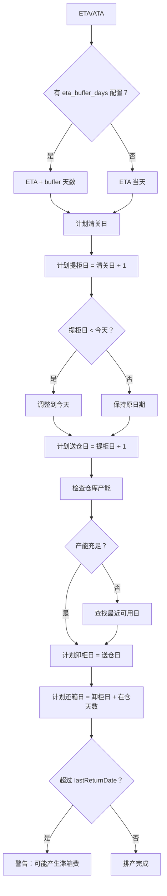

# 智能排柜日期计算规范

## 核心原则

**以卸柜日 (plannedUnloadDate) 为核心锚点**，先确定它，再向前向后推导其他日期。

## 五个计划日期

| 日期字段 | 方向 | 计算逻辑 | 说明 |
|---------|------|---------|------|
| `plannedCustomsDate` | 向前 | ETA + buffer 天数 | 清关需要预留时间 |
| `plannedPickupDate` | 向前 | 清关日 + 1 天 | 清关完成后提柜 |
| `plannedDeliveryDate` | 向前 | 提柜日 + 运输天数 | 运输到仓库 |
| `plannedUnloadDate` | 锚点 | 基于仓库可用性 | 核心锚点 |
| `plannedReturnDate` | 向后 | 卸柜日 + 在仓天数 | 完成还箱 |

## 日期计算详细逻辑

### 1. 计划清关日 (plannedCustomsDate)

**计算公式**：
```
plannedCustomsDate = ETA + eta_buffer_days
```

**业务说明**：
- ETA：预计到港日期（Expected Time of Arrival）
- buffer：清关预留时间（默认 2 天）
- 目的：给清关流程留出足够时间

**配置项**：
- `eta_buffer_days`：ETA 顺延天数（从 `dict_scheduling_config` 读取）
- 默认值：`2` 天
- 可配置范围：`0-7` 天

**代码位置**：
```typescript
// backend/src/services/intelligentScheduling.service.ts L306-323
const clearanceDate = destPo.eta || destPo.ata;
const plannedCustomsDate = new Date(clearanceDate);

// 应用 ETA buffer
const etaBufferDays = await this.getEtaBufferDays();
if (etaBufferDays > 0) {
  plannedCustomsDate.setDate(plannedCustomsDate.getDate() + etaBufferDays);
}
```

### 2. 计划提柜日 (plannedPickupDate)

**计算公式**：
```
plannedPickupDate = plannedCustomsDate + 1 天
```

**约束条件**：
1. ≤ last_free_date（最后免费提柜日）
2. ≥ today（今天）
3. 跳过周末（如果 `skip_weekends = true`）

**代码位置**：
```typescript
// backend/src/services/intelligentScheduling.service.ts L528-544
private async calculatePlannedPickupDate(
  customsDate: Date,
  lastFreeDate?: Date
): Promise<Date> {
  const pickupDate = new Date(customsDate);
  pickupDate.setDate(pickupDate.getDate() + 1); // 清关后次日提柜

  if (lastFreeDate) {
    const lastFree = new Date(lastFreeDate);
    lastFree.setHours(0, 0, 0, 0);
    if (pickupDate > lastFree) {
      pickupDate.setTime(lastFree.getTime());
    }
  }

  // 跳过周末（如果配置了 skip_weekends = true）
  await this.skipWeekendsIfNeeded(pickupDate);

  return pickupDate;
}
```

**兜底逻辑**：
```typescript
// backend/src/services/intelligentScheduling.service.ts L314-318
const today = new Date();
today.setHours(0, 0, 0, 0);
if (plannedPickupDate < today) {
  plannedPickupDate = new Date(today);
  plannedCustomsDate.setTime(today.getTime());
  plannedCustomsDate.setDate(plannedCustomsDate.getDate() - 1); // 保持 提=清关 +1
}
```

### 3. 计划送仓日 (plannedDeliveryDate)

**计算公式**：
```
plannedDeliveryDate = plannedPickupDate + 运输天数
```

**运输天数**：
- Live load：1 天（提柜当天送仓）
- Drop off：1 天（提柜当天送仓）

**代码位置**：
```typescript
// backend/src/services/intelligentScheduling.service.ts L574-586
private async calculatePlannedDeliveryDate(
  pickupDate: Date,
  unloadMode: string,
  unloadDate: Date
): Promise<Date> {
  const deliveryDate = new Date(pickupDate);
  
  if (unloadMode === 'Live load') {
    // Live load：提柜当天送仓
    deliveryDate.setTime(pickupDate.getTime());
  } else {
    // Drop off：提柜后 1 天送仓
    deliveryDate.setDate(deliveryDate.getDate() + 1);
  }

  return deliveryDate;
}
```

### 4. 计划卸柜日 (plannedUnloadDate) - **核心锚点**

**计算逻辑**：
1. 从提柜日开始，查找仓库最早可用日期
2. 考虑仓库日产能限制
3. 考虑周末配置（`skip_weekends`）

**代码位置**：
```typescript
// backend/src/services/intelligentScheduling.service.ts L360-395
// 7. 计算卸柜日（提柜日 + 1 天，且仓库有产能）
let unloadDate = new Date(plannedPickupDate);
unloadDate.setDate(unloadDate.getDate() + 1);

// 检查仓库产能
const availableDate = await this.findEarliestAvailableDay(
  warehouse.warehouseCode,
  unloadDate
);

if (availableDate) {
  unloadDate = availableDate;
} else {
  // 如果提柜日当天仓库已满，尝试往后找最近可用日
  const futureDate = await this.findEarliestAvailableDay(
    warehouse.warehouseCode,
    new Date(plannedPickupDate)
  );
  if (futureDate) {
    unloadDate = futureDate;
    // 同时调整提柜日以匹配卸柜日（保持 Live load）
    plannedPickupDate = new Date(futureDate);
  }
}
```

### 5. 计划还箱日 (plannedReturnDate)

**计算公式**：
```
plannedReturnDate = plannedUnloadDate + 在仓天数
```

**在仓天数**：
- Live load：1 天（卸柜当天还箱）
- Drop off：2 天（卸柜后 1 天还箱）

**兜底逻辑**：
```typescript
// backend/src/services/intelligentScheduling.service.ts L403-420
let lastReturnDate: Date | undefined;
const emptyReturn = await this.emptyReturnRepo.findOne({
  where: { containerNumber: container.containerNumber }
});
if (emptyReturn?.lastReturnDate) {
  lastReturnDate = new Date(emptyReturn.lastReturnDate);
} else if (destPo.lastFreeDate) {
  // fallback: 从 lastFreeDate + 免费用箱天数计算（默认 7 天）
  lastReturnDate = new Date(destPo.lastFreeDate);
  lastReturnDate.setDate(lastReturnDate.getDate() + 7);
}
const plannedReturnDate = this.calculatePlannedReturnDate(
  unloadDate,
  unloadMode,
  lastReturnDate
);
```

## 配置项管理

### 智能排柜配置表

**表名**：`dict_scheduling_config`

**结构**：
```sql
CREATE TABLE dict_scheduling_config (
  id SERIAL PRIMARY KEY,
  config_key VARCHAR(50) UNIQUE NOT NULL,
  config_value VARCHAR(20) NOT NULL,
  description TEXT,
  created_at TIMESTAMP DEFAULT CURRENT_TIMESTAMP,
  updated_at TIMESTAMP DEFAULT CURRENT_TIMESTAMP
);
```

### 配置项列表

| config_key | 默认值 | 说明 | 取值范围 |
|-----------|-------|------|---------|
| `eta_buffer_days` | 2 | ETA 顺延天数 | 0-7 |
| `skip_weekends` | true | 是否跳过周末 | true/false |
| `expedited_handling_fee` | 50 | 加急操作费（USD） | 0-9999 |
| `transport_dropoff_multiplier` | 2.0 | Drop off 运输费倍数 | 1.0-5.0 |

## 日期计算流程图



## 关键约束

### 1. 日期先后顺序

```
plannedCustomsDate < plannedPickupDate ≤ plannedDeliveryDate ≤ plannedUnloadDate < plannedReturnDate
```

### 2. 与 today 的关系

所有计划日期必须 ≥ today（今天）

### 3. 与 last_free_date 的关系

- plannedPickupDate ≤ last_free_date（避免滞港费）
- plannedReturnDate ≤ lastReturnDate（避免滞箱费）

### 4. 周末处理

如果 `skip_weekends = true`：
- 提柜日、送仓日、卸柜日不能是周六/周日
- 如果计算结果是周末，顺延到下周一

## 异常处理

### 1. ETA 缺失

**处理**：使用 ATA（实际到港日）作为备选

```typescript
const clearanceDate = destPo.eta || destPo.ata;
if (!clearanceDate) {
  return {
    success: false,
    message: '无到港日期（ATA/ETA），无法排产'
  };
}
```

### 2. 仓库无产能

**处理**：查找最近可用日期，最多向后查找 30 天

```typescript
for (let i = 0; i < 30; i++) {
  const date = new Date(earliestDate);
  date.setDate(date.getDate() + i);
  
  // 检查当日产能
  const occupancy = await this.warehouseOccupancyRepo.findOne({
    where: { warehouseCode, date }
  });
  
  if (!occupancy || occupancy.remaining > 0) {
    return date; // 找到可用日期
  }
}
return null; // 30 天内都无产能
```

### 3. 提柜日超过 last_free_date

**处理**：强制调整为 last_free_date

```typescript
if (lastFreeDate) {
  const lastFree = new Date(lastFreeDate);
  lastFree.setHours(0, 0, 0, 0);
  if (pickupDate > lastFree) {
    pickupDate.setTime(lastFree.getTime());
  }
}
```

## 日志记录

### 关键日志

```typescript
// 1. ETA buffer 应用
logger.debug(`[IntelligentScheduling] ETA buffer applied: +${etaBufferDays} days for ${container.containerNumber}`);

// 2. 费用计算详情
logger.info(`[IntelligentScheduling] Cost breakdown for ${containerNumber}:`, {
  demurrageCost: totalCostResult.demurrageCost,
  detentionCost: totalCostResult.detentionCost,
  storageCost: totalCostResult.storageCost,
  ddCombinedCost: totalCostResult.ddCombinedCost,
  transportationCost: totalCostResult.transportationCost,
  totalCost: totalCostResult.totalCost,
  currency: totalCostResult.currency
});

// 3. 仓库产能扣减
logger.info(`[IntelligentScheduling] Decremented warehouse occupancy: ${warehouseCode} on ${unloadDate.toISOString()}`);
```

## 相关 SKILL

- [智能排柜日期计算正向推导逻辑](./智能排柜日期计算正向推导逻辑.md)
- [智能排柜成本优化决策逻辑](./智能排柜成本优化决策逻辑.md)
- [费用模块前后端数据契约一致性](./费用模块前后端数据契约一致性.md)

## 维护说明

### 修改配置值

```sql
-- 修改 ETA buffer 天数
UPDATE dict_scheduling_config 
SET config_value = '3', updated_at = NOW() 
WHERE config_key = 'eta_buffer_days';

-- 修改周末跳过配置
UPDATE dict_scheduling_config 
SET config_value = 'false', updated_at = NOW() 
WHERE config_key = 'skip_weekends';
```

### 查看配置历史

```sql
SELECT config_key, config_value, description, created_at, updated_at 
FROM dict_scheduling_config 
ORDER BY updated_at DESC;
```

## 版本历史

| 版本 | 日期 | 变更说明 |
|-----|------|---------|
| v1.0 | 2026-03-25 | 初始版本，定义五个计划日期计算逻辑 |
| v1.1 | 2026-03-25 | 新增 eta_buffer_days 配置，支持 ETA 顺延 |
