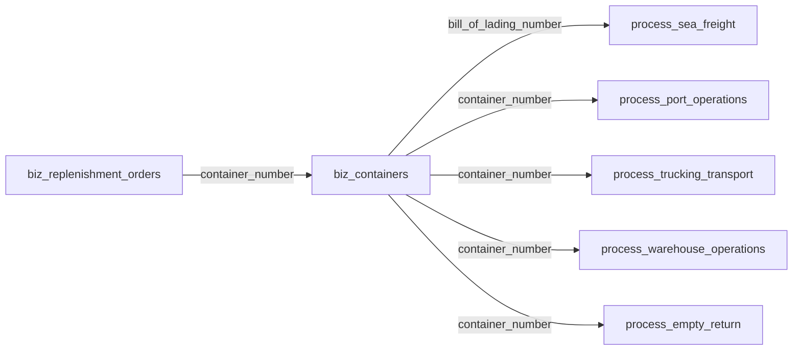

# LogiX 项目开发技能

> 📚 **Skills 索引**: 本技能是 LogiX 项目的核心开发技能，其他专用技能请参考 [Skills 索引](../README.md)
>
> - 🔗 **database-query** - 数据库查询专用技能
> - 🔗 **document-processing** - Excel/PDF 文档处理技能
> - 🔗 **excel-import-requirements** - Excel 导入规范（映射、类型转换、主键、模板）
> - 🔗 **code-review** - 代码质量审查技能
> - 🔗 **commit-message** - Git 提交信息生成技能

## 🎯 核心原则（必须遵守）

### 1. 数据库优先原则

```
✅ 唯一基准：数据库表结构是唯一基准
✅ 开发顺序：SQL → 实体 → API → 前端 → 联调
✅ 禁止反向：代码对齐数据库，不反向改库补数据
```

### 2. 数据完整性

```
❌ 禁止临时补丁：不用 UPDATE/INSERT 修补导入错误
✅ 正确流程：删除错误数据 → 修复映射/逻辑 → 重新导入
```

### 3. 日期口径统一

```
✅ 全项目统一：所有数据展示使用顶部日期范围筛选
✅ 后端口径：actual_ship_date（备货单）→ shipment_date（海运）
✅ 页面规范：必须有日期选择器，卡片/表格/图表共用同一套日期
```

### 4. 颜色变量使用规范

```
✅ 必须使用：frontend/src/assets/styles/variables.scss 中定义的 SCSS 变量
✅ 优先使用：$primary-color、$success-color、$warning-color、$danger-color
✅ 业务色：$status-shipped、$status-at-port、$status-picked-up
✅ 优先级色：$priority-critical、$priority-high、$priority-medium、$priority-low

❌ 禁止：直接使用 #409EFF、#67C23A 等十六进制色值
❌ 禁止：在 Vue 文件的 style 标签中使用硬编码颜色
```

**颜色迁移策略**（大规模改动，分批进行）：

```bash
# 1. 分析当前硬编码颜色
node scripts/analyze-colors.cjs

# 2. 迁移优先级
# - P0: 高频组件（Shipments、Dashboard、ContainerDetail）
# - P1: 中频组件（甘特图、统计面板）
# - P2: 低频组件（系统设置、帮助文档）

# 3. 顺带迁移原则
# 每次功能开发时，顺带迁移相关文件的硬编码颜色
# 不需要专门安排时间大规模迁移

# 4. 检测工具
npm run lint  # 可配合 ESLint 规则检测未使用 SCSS 变量的代码
```

**常用 SCSS 变量速查**：

| 变量 | 用途 |
|------|------|
| `$primary-color` | 主色调（蓝色） |
| `$success-color` | 成功色（绿色） |
| `$warning-color` | 警告色（橙色） |
| `$danger-color` | 危险色（红色） |
| `$text-primary` | 主要文字 |
| `$text-regular` | 常规文字 |
| `$bg-page` | 页面背景 |
| `$border-base` | 边框色 |

---

## 📐 命名与映射规则

### 完整对照表

| 层级           | 规则                  | 示例                                    | 位置                           |
:| -------------- | --------------------- | --------------------------------------- | ------------------------------ |
| **数据库表名** | 前缀 + snake_case     | `biz_containers`, `process_sea_freight` | `backend/03_create_tables.sql` |
| **数据库字段** | snake_case            | `container_number`, `eta_dest_port`     | 同上                           |
| **实体属性**    | camelCase + `@Column`| `containerNumber`                       | `backend/src/entities/`        |
| **API 映射**    | 与数据库一致          | `table: 'process_port_operations'`      | `ExcelImport.vue`              |
| **API 请求体**  | snake_case            | `{ container_number: '...' }`           | Controller 层                  |
| **前端组件**    | PascalCase.vue        | `ContainerDetails.vue`                  | `frontend/src/components/`     |
| **组合式函数**  | use+PascalCase        | `useContainerData`                      | `frontend/src/composables/`    |
| **CSS 类名**    | kebab-case            | `.container-card`                       | `.vue` 文件中                  |

### 表前缀含义

```typescript
dict_; // 字典表：ports, countries, container_types
biz_; // 业务表：containers, replenishment_orders
process_; // 流程表：sea_freight, port_operations
ext_; // 扩展表：status_events, loading_records
```

---

## 🗂️ 项目结构速查

### 数据库表关联链



### 核心实体映射

```typescript
// backend/src/entities/
Container.ts              → biz_containers
ReplenishmentOrder.ts     → biz_replenishment_orders
SeaFreight.ts             → process_sea_freight
PortOperation.ts          → process_port_operations
TruckingTransport.ts      → process_trucking_transport
WarehouseOperation.ts     → process_warehouse_operations
EmptyReturn.ts            → process_empty_return
```

### API 路由（前缀 `/api/v1`）

```typescript
// 集装箱管理
GET    /containers                      // 列表（分页+筛选）
GET    /containers/:id                  // 详情
POST   /containers                      // 创建
PATCH  /containers/:id                  // 更新
DELETE /containers/:id                  // 删除

// 统计相关
GET    /containers/statistics/arrival    // 按到港统计
GET    /containers/statistics/eta        // 按ETA统计
GET    /containers/statistics/planned    // 按计划提柜统计

// 备货单
GET    /replenishment-orders
GET    /replenishment-orders/:id
POST   /replenishment-orders
PATCH  /replenishment-orders/:id
DELETE /replenishment-orders/:id

// 字典表
GET    /dict-manage/types                // 所有字典类型
GET    /dict-manage/:type                // 字典数据列表
GET    /dict-manage/:type/fields        // 字段配置
POST   /dict-manage/:type               // 新增
PUT    /dict-manage/:type/:id           // 更新
DELETE /dict-manage/:type/:id           // 删除
```

---

## 🔧 开发流程

### 1. 新增功能

1. **数据库**：在 `03_create_tables.sql` 添加表/字段
2. **实体**：`backend/src/entities/` 创建或更新 Entity
3. **Controller**：在 `controllers/` 添加 API 方法
4. **前端**：组件开发、API 调用、状态管理

### 2. 修改已有功能

1. **数据库变更**：创建 migration 脚本
2. **实体同步**：更新 Entity 字段
3. **API 调整**：修改 Controller 逻辑
4. **前端适配**：更新组件和调用

### 3. Bug 修复

1. **复现问题**：确认 bug 表现
2. **定位根因**：分析数据流和代码逻辑
3. **修复代码**：从数据源到展示的完整链路
4. **验证修复**：测试确认问题解决

---

## 📋 常见任务速查

### 货柜状态流转

```
not_shipped → shipped → in_transit → at_port → picked_up → unloaded → returned_empty
```

### 滞港费计算条件

- 匹配字段：进口国、目的港、船公司、货代
- 免费天数基准：按到港 / 按卸船
- 多行费用项合计

### 甘特图数据来源

- **按到港**：ATA（实际到港日）> ETA（预计到港日）
- **按计划提柜**：plannedPickupDate
- **按最晚提柜**：lastFreeDate
- **按最晚还箱**：lastReturnDate

### 智能排柜（核心锚点：卸柜日）

**核心原则**：以卸柜日(plannedUnloadDate)为核心锚点，先确定它，再向前向后推导其他日期

**锚点确定**：通过仓库可用性和日产能，从提柜日开始向后查找最早可卸柜的日期

**5个计划日期**：

| 日期字段 | 方向 | 计算逻辑 |
|---------|------|---------|
| `plannedCustomsDate` | 向前 | 提柜日 - 1天 |
| `plannedPickupDate` | 向前 | 清关日 + 1天（若已过期则至少为今天） |
| `plannedDeliveryDate` | 向前 | 提柜日 + 运输天数 |
| `plannedUnloadDate` | 锚点 | 基于仓库可用性和日产能计算 |
| `plannedReturnDate` | 向后 | 卸柜日 + 在仓天数 |

**关键约束**：
- 卸柜方式：提柜日当天有产能 → Live load；否则 → Drop off
- 还箱日 fallback：优先用 lastReturnDate，无则用 lastFreeDate + 7天

**代码位置**：`backend/src/services/intelligentScheduling.service.ts`

---

## 📦 数据库迁移脚本规范

### 目录位置（唯一）

**正式迁移脚本**: `migrations/`（项目根目录）

- 仅包含数据库结构变更（DDL）
- 按版本顺序执行
- 可重复执行（幂等性：使用 IF EXISTS / IF NOT EXISTS）

**诊断修复脚本**: `scripts/`

- 一次性数据修复
- 问题排查分析
- 数据验证检查

### 命名规范

**格式**: `动作_目标_说明.sql`

| 动作 | 含义 |
|------|------|
| `add` | 添加字段/表/约束 |
| `create` | 创建新表 |
| `drop` | 删除字段/表 |
| `modify` | 修改字段属性 |
| `backfill` | 填充/更新数据 |
| `fix` | 修复数据问题 |
| `normalize` | 数据标准化 |
| `convert` | 数据类型转换 |
| `insert` | 插入数据 |
| `update` | 更新数据 |
| `delete` | 删除数据 |

### 示例

```sql
-- ✅ 正确
add_schedule_status_to_containers.sql    -- 添加排产状态字段
create_resource_occupancy_tables.sql      -- 创建资源占用表
backfill_last_free_date.sql               -- 回填最后免费日
normalize_country_uk_to_gb.sql            -- 标准化国家代码
fix_port_field_length.sql                 -- 修复端口字段长度

-- ❌ 错误
add_column.sql                           -- 缺少目标
schedule.sql                             -- 缺少动作
add_new_field_2024.sql                   -- 包含日期
```

### 内容要求

```sql
-- 脚本名称: add_schedule_status_to_containers.sql
-- 用途: 为货柜表添加排产状态字段
-- 影响范围: biz_containers 表

BEGIN;

ALTER TABLE biz_containers 
ADD COLUMN IF NOT EXISTS schedule_status VARCHAR(20) DEFAULT 'initial';

CREATE INDEX IF NOT EXISTS idx_containers_schedule_status 
ON biz_containers(schedule_status);

COMMIT;
```

---

## ⚠️ 注意事项

1. **所有日期字段必须使用统一的日期筛选器**
2. **修改表结构前先创建 migration 脚本**
3. **导入功能遵循 excel-import-requirements 规范**
4. **前端组件使用 TypeScript 类型定义**
5. **API 响应格式统一：`{ success, data, message? }`**

---

## 📖 参考文档

- 数据库表结构：`backend/03_create_tables.sql`
- 实体定义：`backend/src/entities/`
- API 路由：`backend/src/routes/`
- 前端组件：`frontend/src/views/`
- 项目规范：`.cursor/skills/` 中的各专业技能
