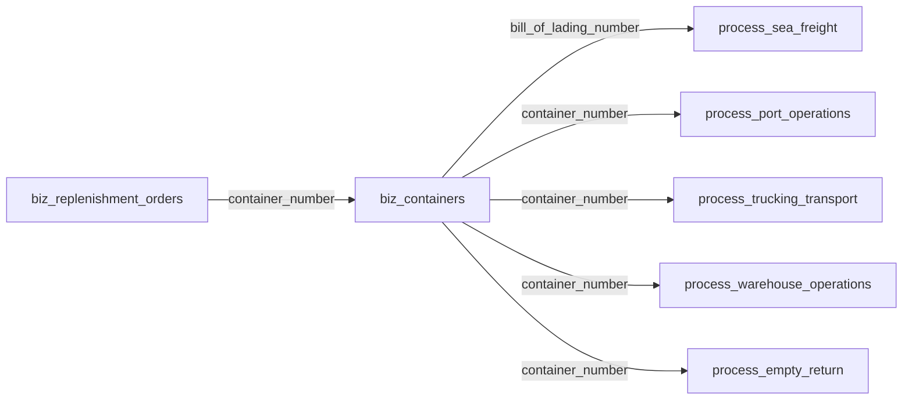

# LogiX 项目开发技能

> 📚 **Skills 索引**: 本技能是 LogiX 项目的核心开发技能，其他专用技能请参考 [Skills 索引](../README.md)
>
> - 🔗 **database-query** - 数据库查询专用技能
> - 🔗 **document-processing** - Excel/PDF 文档处理技能
> - 🔗 **excel-import-requirements** - Excel 导入规范（映射、类型转换、主键、模板）
> - 🔗 **code-review** - 代码质量审查技能
> - 🔗 **commit-message** - Git 提交信息生成技能
> - 🔗 **gantt-drag-drop** - 甘特图拖拽实现要点（落点识别、确认弹窗）
> - 🔗 **gantt-hierarchy** - 甘特图一、二、三级层级（目的港→节点→供应商）
> - 🔗 **intelligent-scheduling-mapping** - 智能排柜仓库/车队映射与选择逻辑
> - 🔗 **container-intelligent-processing** - 货柜智能处理系统（预警、时间预测、风险评分）
> - 🔗 **ai-collaboration-methodology** - 需求理解、错误排查、SOP 流程
> - 🔗 **fix-verification** - 修复验证（防幻觉、数据库字段准确性）

## 🎯 核心原则（必须遵守）

### 1. 数据库优先原则

```
✅ 唯一基准：数据库表结构是唯一基准
✅ 开发顺序：SQL → 实体 → API → 前端 → 联调
✅ 禁止反向：代码对齐数据库，不反向改库补数据
```

### 2. 数据完整性

```
❌ 禁止临时补丁：不用 UPDATE/INSERT 修补导入错误
✅ 正确流程：删除错误数据 → 修映射/逻辑 → 重新导入
```

### 3. 日期口径统一

```
✅ 全项目统一：所有数据展示使用顶部日期范围筛选
✅ 后端口径：actual_ship_date（备货单）→ shipment_date（海运）
✅ 页面规范：必须有日期选择器，卡片/表格/图表共用同一套日期
```

### 4. 颜色变量使用规范

```
✅ 必须使用：frontend/src/assets/styles/variables.scss 中定义的 SCSS 变量
✅ 优先使用：$primary-color、$success-color、$warning-color、$danger-color
✅ 业务色：$status-shipped、$status-at-port、$status-picked-up
✅ 优先级色：$priority-critical、$priority-high、$priority-medium、$priority-low

❌ 禁止：直接使用 #409EFF、#67C23A 等十六进制色值
❌ 禁止：在 Vue 文件的 style 标签中使用硬编码颜色
```

**颜色迁移策略**（大规模改动，分批进行）：

```bash
# 1. 分析当前硬编码颜色
node scripts/analyze-colors.cjs

# 2. 迁移优先级
# - P0: 高频组件（Shipments、Dashboard、ContainerDetail）
# - P1: 中频组件（甘特图、统计面板）
# - P2: 低频组件（系统设置、帮助文档）

# 3. 顺带迁移原则
# 每次功能开发时，顺带迁移相关文件的硬编码颜色
# 不需要专门安排时间大规模迁移

# 4. 检测工具
npm run lint  # 可配合 ESLint 规则检测未使用 SCSS 变量的代码
```

**常用 SCSS 变量速查**：

| 变量 | 用途 |
|------|------|
| `$primary-color` | 主色调（蓝色） |
| `$success-color` | 成功色（绿色） |
| `$warning-color` | 警告色（橙色） |
| `$danger-color` | 危险色（红色） |
| `$text-primary` | 主要文字 |
| `$text-regular` | 常规文字 |
| `$bg-page` | 页面背景 |
| `$border-base` | 边框色 |

---

## 📐 命名与映射规则

### 完整对照表

| 层级           | 规则                  | 示例                                    | 位置                           |
| -------------- | --------------------- | --------------------------------------- | ------------------------------ |
| **数据库表名** | 前缀 + snake_case     | `biz_containers`, `process_sea_freight` | `backend/03_create_tables.sql` |
| **数据库字段** | snake_case            | `container_number`, `eta_dest_port`     | 同上                           |
| **实体属性**   | camelCase + `@Column` | `containerNumber`                       | `backend/src/entities/`        |
| **API 映射**   | 与数据库一致          | `table: 'process_port_operations'`      | `ExcelImport.vue`              |
| **API 请求体** | snake_case            | `{ container_number: '...' }`           | Controller 层                  |
| **前端组件**   | PascalCase.vue        | `ContainerDetails.vue`                  | `frontend/src/components/`     |
| **组合式函数** | use+PascalCase        | `useContainerData`                      | `frontend/src/composables/`    |
| **CSS 类名**   | kebab-case            | `.container-card`                       | `.vue` 文件中                  |

### 前端展示规则（新增，必须遵守）

```typescript
// ✅ 统一要求：前端界面向用户展示“名称（name/text/label）”，禁止直接展示 CODE
// 适用范围：表格单元格、筛选项、详情页字段、Tooltip、导出文案、弹窗文案

// 显示优先级（必须按顺序）：
// 1) 后端返回的名称字段（nameCn/nameEn/text/label）
// 2) 字典映射后的名称（code -> text）
// 3) 明确的“未知/未配置”兜底文案
// ❌ 不允许把原始 code 直接展示给用户（例如 US、CA、DEMURRAGE、PENDING）

// 示例（正确）：
// chargeType=DEMURRAGE -> "滞港费"
// country=US -> "美国"

// 示例（错误）：
// 页面直接显示 "DEMURRAGE"、"US"、"IN_PROGRESS"
```

### 表前缀含义

```typescript
dict_; // 字典表：ports, countries, container_types
biz_; // 业务表：containers, replenishment_orders
process_; // 流程表：sea_freight, port_operations
ext_; // 扩展表：status_events, loading_records
```

---

## 🧮 免费日计算与写回规则（2026-03 新增）

### 规则矩阵（单条/批量统一，必须遵守）

```typescript
// Strict 节点型
// LFD（最晚提柜日）:
//   标准选择 = min(Storage.free_days > 0, Demurrage.free_days > 0)
//   若二者都不存在，再回退 Combined(D&D)
//
// LRD（最晚还箱日）:
//   标准选择 = min(Combined(D&D).free_days > 0, Detention.free_days > 0)
//
// 起算口径：
// - LFD: 到港侧起算（按标准 calculation_basis + actual/forecast 模式）
// - LRD:
//   - 命中 Combined(D&D): 到港→还箱整段起算（不按提柜拆段）
//   - 命中 Detention: 提柜起算（actual=pickup_date, forecast=planned_pickup_date）
```

### 手工 LFD 与免费日更新（必须区分）

```typescript
// 1) 手工维护 LFD（人工录入）
// PATCH /api/v1/containers/:containerNumber/manual-lfd
// - 写入 process_port_operations.last_free_date
// - 标记 last_free_date_source='manual'
// - 自动计算写回不得覆盖 manual
//
// 2) 免费日更新（系统计算写回）
// - 批量: POST /api/v1/demurrage/batch-write-back
// - 单条: POST /api/v1/demurrage/write-back/:containerNumber
// - 写回 computed，且必须尊重 manual 保护
```

### 防回归检查清单

```markdown
- [ ] 单条与批量使用同一套免费日计算口径（禁止分叉）
- [ ] LFD 选型不被 Combined 直接“篡位”（仅在 Storage/Demurrage 都缺失时回退）
- [ ] LRD 命中 Combined 时，起算日为到港侧，不是提柜侧
- [ ] last_free_date_source='manual' 的记录不会被自动写回覆盖
- [ ] return_time 已有时，若 last_return_date 为空可补写；已有值不覆盖
```

---

## 🗂️ 项目结构速查

### 数据库表关联链



### 核心实体映射

```typescript
// backend/src/entities/
Container.ts              → biz_containers
ReplenishmentOrder.ts     → biz_replenishment_orders
SeaFreight.ts             → process_sea_freight
PortOperation.ts          → process_port_operations
TruckingTransport.ts      → process_trucking_transport
WarehouseOperation.ts     → process_warehouse_operations
EmptyReturn.ts            → process_empty_return
```

### API 路由（前缀 `/api/v1`）

```typescript
// 集装箱管理
GET    /containers                      // 列表
GET    /containers/:id                  // 详情
POST   /containers                      // 新增
PUT    /containers/:containerNumber     // 更新
DELETE /containers/:containerNumber     // 删除
GET    /containers/statistics           // 统计
GET    /containers/statistics-detailed  // 详细统计
POST   /containers/:containerNumber/update-status  // 更新状态

// 数据导入
POST   /import/excel                    // Excel导入
POST   /import/excel/batch              // 批量导入

// 外部数据同步
POST   /external/sync/:containerNumber  // 同步单个
GET    /external/events/:containerNumber // 获取事件

// 物流路径
GET    /logistics-path/container/:number    // 按箱号
GET    /logistics-path/bl/:number           // 按提单号
POST   /logistics-path/sync                 // 同步数据

// 适配器管理
GET    /adapters/status                     // 适配器状态
GET    /adapters/container/:number/status-events
POST   /adapters/container/:number/sync
```

---

## 🛠️ 开发任务检查清单

### 新增功能开发

```markdown
#### 第一步：数据库设计

- [ ] 在 `backend/03_create_tables.sql` 中添加表结构
- [ ] 确保表名、字段名符合 snake_case 规范
- [ ] 添加必要的外键约束和索引
- [ ] 运行 SQL 脚本创建表

#### 第二步：TypeORM 实体

- [ ] 在 `backend/src/entities/` 创建实体类
- [ ] 使用 `@Entity('table_name')` 指定表名
- [ ] 使用 `@Column({ name: 'column_name' })` 指定字段
- [ ] 在 `backend/src/entities/index.ts` 导出实体
- [ ] 将实体添加到 TypeORM 配置

#### 第三步：后端 API

- [ ] 在 `backend/src/controllers/` 创建控制器
- [ ] 在 `backend/src/services/` 创建服务层
- [ ] 在 `backend/src/routes/` 注册路由
- [ ] 参数校验（使用 Joi 或 class-validator）
- [ ] 错误处理和日志记录
- [ ] 单元测试

#### 第四步：前端对接

- [ ] 在 `frontend/src/services/` 创建 API 服务
- [ ] 在 `frontend/src/views/` 创建页面组件
- [ ] 在 `frontend/src/components/` 创建子组件
- [ ] 添加国际化文案（locales/\*.ts）
- [ ] 使用 SCSS 变量（禁止硬编码色值）- 参考上方「颜色变量使用规范」
- [ ] 添加类型定义（types/\*.ts）

#### 第五步：联调测试

- [ ] 本地启动后端和前端
- [ ] 测试 API 接口（Postman/curl）
- [ ] 测试前端功能
- [ ] 检查控制台无错误
- [ ] 运行 Lint 检查：`npm run lint`
- [ ] 运行类型检查：`npm run type-check`
```

### 修改现有功能

```markdown
#### 第一步：影响分析

- [ ] 确认修改范围（数据库/实体/API/前端）
- [ ] 检查是否有其他模块依赖
- [ ] 评估是否需要数据迁移
- [ ] 通知相关团队成员

#### 第二步：执行修改

- [ ] 遵循开发顺序：数据库 → 实体 → API → 前端
- [ ] 保持向后兼容性（如可能）
- [ ] 更新相关文档
- [ ] 添加/更新单元测试

#### 第三步：验证

- [ ] 运行现有测试确保无回归
- [ ] 手动测试修改的功能
- [ ] 检查性能影响
- [ ] 更新文档索引
```

---

## 🎓 常见场景最佳实践

### 场景 1：添加新字段

```typescript
// ✅ 正确做法
// 1. SQL: ALTER TABLE biz_containers ADD COLUMN inspection_required BOOLEAN DEFAULT FALSE;
// 2. Entity:
@Column({ name: 'inspection_required', type: 'boolean', default: false })
inspectionRequired: boolean;
// 3. API: 更新 DTO 和 Controller
// 4. Frontend: 添加表单字段和显示逻辑

// ❌ 错误做法
// 直接在实体中添加字段，不修改数据库表结构
```

### 场景 2：Excel 导入映射

```vue
<!-- ✅ 正确做法：table/field 与数据库完全一致 -->
<template>
  <excel-import
    :mappings="[
      {
        table: 'process_port_operations',
        field: 'container_number',
        excelColumn: '集装箱号',
      },
      {
        table: 'process_port_operations',
        field: 'ata_dest_port',
        excelColumn: '实际到港日期',
        transform: (val) => parseDate(val),
      },
    ]"
  />
</template>

<!-- ❌ 错误做法：使用 camelCase 或不一致的表名 -->
```

> 📖 完整 Excel 导入要求见 **excel-import-requirements** 技能

### 场景 3：日期筛选

```typescript
// ✅ 正确做法：使用 DateFilterBuilder
const query = this.createQueryBuilder('container')
  .innerJoin('biz_replenishment_orders', 'ro', 'ro.container_number = container.container_number')
  .leftJoin('process_sea_freight', 'sf', 'sf.bill_of_lading_number = ro.bill_of_lading_number')
  .where('(ro.actual_ship_date BETWEEN :startDate AND :endDate OR (ro.actual_ship_date IS NULL AND sf.shipment_date BETWEEN :startDate AND :endDate))', {
    startDate,
    endDate
  });

// ❌ 错误做法：不使用统一的日期口径
.where('container.created_at BETWEEN :startDate AND :endDate')
```

### 场景 4：状态机更新

```typescript
// ✅ 正确做法：使用 ContainerStatusService
await ContainerStatusService.updateSingleContainerStatus(containerNumber);

// 或批量更新
await ContainerStatusService.batchUpdateContainerStatuses(containerNumbers);

// ❌ 错误做法：直接 UPDATE 数据库
// UPDATE biz_containers SET logistics_status = 'at_port' WHERE ...
```

---

## 🔍 代码审查要点

### 🔴 Critical（必须修复）

- [ ] 违反数据库优先原则
- [ ] 命名不符合规范（snake_case/camelCase 混用）
- [ ] 硬编码中文文案（未使用 i18n）
- [ ] 硬编码色值（未使用 SCSS 变量）
- [ ] 使用临时 SQL 修补数据
- [ ] 日期口径不一致

### 🟡 Suggestion（建议改进）

- [ ] 文件过长（Vue > 300 行，TS > 200 行）
- [ ] 缺乏注释和文档
- [ ] 缺少错误处理
- [ ] 性能问题（无防抖、无分页）
- [ ] 命名不能体现职责

### 🟢 Nice to have（可选优化）

- [ ] 添加更多单元测试
- [ ] 优化代码结构
- [ ] 添加性能监控
- [ ] 改进用户体验细节

---

## 📚 参考文档

### Skills（本系列）

- **database-query** - 数据库查询规范
- **document-processing** - Excel/PDF 文档处理
- **excel-import-requirements** - Excel 导入完整规范
- **code-review** - 代码审查清单
- **commit-message** - Git 提交规范

### 必读文档（⭐⭐⭐）

- [开发准则](../rules/logix-development-standards.mdc) - 核心原则
- [项目地图](../rules/logix-project-map.mdc) - 结构速查
- [命名规范](../../frontend/public/docs/01-standards/03-命名规范.md) - 详细规则
- [项目行动指南](../../frontend/public/docs/11-project/00-项目行动指南.md) - 总体指导
- [LogiX 项目全面解读](../../frontend/public/docs/11-project/16-LogiX项目全面解读.md) - 完整架构

### 常用文档

- [物流流程完整说明](../../frontend/public/docs/02-architecture/02-物流流程完整说明.md)
- [数据库主表关系](../../frontend/public/docs/03-database/01-数据库主表关系.md)
- [状态机文档](../../frontend/public/docs/05-state-machine/)
- [甘特图调度机制](../../frontend/public/docs/11-project/07-甘特图调度与货柜资源关联机制.md)

### 快速参考

- [命名快速参考](../../frontend/public/docs/01-standards/04-命名快速参考.md)
- [TimescaleDB 快速参考](../../frontend/public/docs/08-deployment/02-TimescaleDB快速参考.md)
- [后端快速参考](../../frontend/public/docs/10-guides/01-后端快速参考.md)

---

## 🆘 遇到问题怎么办

### 1. 不确定命名规范

```bash
# 查看命名规范文档
cat frontend/public/docs/01-standards/03-命名规范.md

# 或使用快速参考
cat frontend/public/docs/01-standards/04-命名快速参考.md
```

### 2. 查找表结构

```bash
# 查看数据库建表 SQL
cat backend/03_create_tables.sql

# 或查看项目地图
cat .cursor/rules/logix-project-map.mdc
```

### 3. 了解业务逻辑

```bash
# 查看物流流程
cat frontend/public/docs/02-architecture/02-物流流程完整说明.md

# 查看状态机
cat frontend/public/docs/05-state-machine/02-物流状态机.md
```

### 4. 验证代码规范

```bash
# 运行 Lint 检查
npm run lint

# 运行类型检查
npm run type-check

# 完整验证
npm run validate
```

---

## 📅 最后更新

| 版本 | 日期       | 更新内容                                                                 |
| ---- | ---------- | ------------------------------------------------------------------------ |
| 1.1  | 2026-03-23 | 新增免费日统一规则：Strict 节点型矩阵、单条/批量统一口径、手工LFD保护机制 |
| 1.0  | 2026-03-12 | 初始版本，基于 LogiX 开发准则和项目地图，整合项目全面解读文档            |

---

**记住**：好的代码是写出来的，更是遵循规范维护出来的！💪✨
