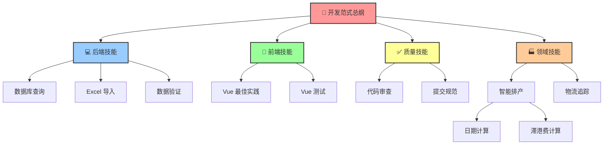

# 🎯 LogiX 技能体系 - 统一索引

**版本：** v2.0  
**更新日期：** 2026-03-27  
**状态：** ✅ 已整合

---

## 🚀 快速导航

### **按功能查找**

| 需求 | 路径 | 预计时间 |
|------|------|----------|
| **新人入职** | [👇 从这里开始](#-新人入职路径) | 1 周 |
| **后端开发** | [💻 后端技能](#-后端技能) | 按需 |
| **前端开发** | [🎨 前端技能](#-前端技能) | 按需 |
| **质量保障** | [✅ 质量技能](#-质量技能) | 按需 |
| **领域知识** | [🏭 领域技能](#-领域知识) | 按需 |

---

## 📚 完整技能地图

### 🔰 核心技能包 (Core)

**位置：** [`00-core/`](./00-core/README.md)

| 技能 | 说明 | 必读 | 链接 |
|------|------|------|------|
| 📘 **开发范式** | 五维分析法、SKILL 原则 | ⭐⭐⭐⭐⭐ | [查看](./00-core/logix-dev-paradigm.md) |
| 🤖 **AI 协作** | AI 助手使用方法 | ⭐⭐⭐⭐ | [查看](./00-core/ai-collaboration-methodology/) |
| 📖 **使用指南** | 如何使用技能体系 | ⭐⭐⭐⭐ | [查看](./USAGE_GUIDE.md) |
| 🔧 **维护清单** | 文档维护规范 | ⭐⭐⭐ | [查看](./MAINTENANCE.md) |

---

### 💻 后端技能 (Backend)

**位置：** [`01-backend/`](./01-backend/README.md)

#### 数据库相关

| 技能 | 说明 | 成熟度 | 链接 | 验证状态 |
|------|------|--------|------|----------|
| **数据库查询** | PostgreSQL/TimescaleDB 规范 | ✅ Recommended | [查看](./01-backend/database-query/SKILL.md) | ✅ 已验证 |
| **表设计** | PostgreSQL 表设计最佳实践 | ✅ Recommended | [查看](./01-backend/postgresql-table-design/SKILL.md) | ✅ 已验证 |
| **EXISTS 子查询** | TypeORM EXISTS 解决方案 | ✅ Recommended | [查看](./01-backend/typeorm-exists-subquery-solution/SKILL.md) | ✅ 已验证 |

#### 数据处理

| 技能 | 说明 | 成熟度 | 链接 | 验证状态 |
|------|------|--------|------|----------|
| **Excel 导入** | Excel 导入规范要求 | ✅ Recommended | [查看](./01-backend/excel-import-requirements/SKILL.md) | ✅ 已验证 |
| **数据验证** | 导入数据完整性验证 | ✅ Recommended | [查看](./01-backend/data-import-verify/SKILL.md) | ✅ 已验证 |
| **文档处理** | Excel/PDF文件处理 | ✅ Recommended | [查看](./01-backend/document-processing/SKILL.md) | ✅ 已验证 |

---

### 🎨 前端技能 (Frontend)

**位置：** [`02-frontend/`](./02-frontend/README.md)

#### Vue 开发

| 技能 | 说明 | 成熟度 | 链接 | 验证状态 |
|------|------|--------|------|----------|
| **Vue 最佳实践** | Composition API + script setup | ✅ Recommended | [查看](./02-frontend/vue-best-practices/SKILL.md) | ✅ 已验证 |
| **Vue 测试** | Vitest + Vue Test Utils | ✅ Recommended | [查看](./02-frontend/vue-testing-best-practices/SKILL.md) | ✅ 已验证 |

#### UI/UX

| 技能 | 说明 | 成熟度 | 链接 | 验证状态 |
|------|------|--------|------|----------|
| **文档处理** | 文件上传导出处理 | ✅ Recommended | [查看](./02-frontend/document-processing/SKILL.md) | ✅ 已验证 |

---

### ✅ 质量技能 (Quality)

**位置：** [`04-quality/`](./04-quality/README.md)

| 技能 | 说明 | 成熟度 | 链接 | 验证状态 |
|------|------|--------|------|----------|
| **代码审查** | Code Review 规范 | ✅ Recommended | [查看](./04-quality/code-review/SKILL.md) | ✅ 已验证 |
| **提交规范** | Git Commit Message 规范 | ✅ Recommended | [查看](./04-quality/commit-message/SKILL.md) | ✅ 已验证 |
| **开发规范** | LogiX 项目开发规范 | ✅ Recommended | [查看](./04-quality/logix-development/SKILL.md) | ✅ 已验证 |

---

### 🏭 领域知识 (Domain)

**位置：** [`05-domain/`](./05-domain/README.md)

#### 智能排产

**位置：** [`05-domain/scheduling/`](./05-domain/scheduling/README.md)

| 技能 | 说明 | 成熟度 | 链接 | 验证状态 |
|------|------|--------|------|----------|
| **日期计算** | 排产日期算法逻辑 | ✅ Recommended | [查看](./05-domain/scheduling/intelligent-scheduling-date-calculation/SKILL.md) | ✅ 已验证 |
| **滞港费计算** | 成本优化算法 | ✅ Recommended | [查看](./05-domain/scheduling/logix-demurrage/SKILL.md) | ✅ 已验证 |

#### 物流追踪

| 技能 | 说明 | 成熟度 | 链接 | 验证状态 |
|------|------|--------|------|----------|
| **ETA 验证** | 飞驼 ETA 数据校验 | ✅ Recommended | [查看](./05-domain/logistics/feituo-eta-ata-validation/SKILL.md) | ✅ 已验证 |

#### 清关管理

| 技能 | 说明 | 成熟度 | 链接 | 验证状态 |
|------|------|--------|------|----------|
| *(待补充)* | - | - | - | - |

---

## 🗺️ 技能引用关系图



---

## 🎯 新人入职路径

### **第 1 天：熟悉基础**

```markdown
上午 (9:00-12:00)
  ✅ 阅读 [开发范式总纲](./00-core/logix-dev-paradigm.md)
     - 理解五维分析法
     - 掌握 SKILL 原则
     - 了解开发流程
  
  ✅ 浏览 [技能地图](./00-core/README.md)
     - 了解技能分类
     - 找到岗位相关技能

下午 (14:00-18:00)
  ✅ 学习 [使用指南](./USAGE_GUIDE.md)
     - 三种使用方式
     - 常见问题解决
  
  ✅ 安装开发环境
     - 参考项目 README
```

---

### **第 2-3 天：岗位技能**

#### **后端开发工程师**

```markdown
必学技能：
1. [数据库查询](./01-backend/database-query/SKILL.md)
   - PostgreSQL 基础查询
   - TimescaleDB hypertable
   - 性能优化技巧

2. [Excel 导入](./01-backend/excel-import-requirements/SKILL.md)
   - 导入格式规范
   - 数据清洗规则

3. [数据验证](./01-backend/data-import-verify/SKILL.md)
   - 验证方法
   - 问题排查

选学技能：
- [表设计](./01-backend/postgresql-table-design/SKILL.md)
- [文档处理](./01-backend/document-processing/SKILL.md)
```

#### **前端开发工程师**

```markdown
必学技能：
1. [Vue 最佳实践](./02-frontend/vue-best-practices/SKILL.md)
   - Composition API
   - <script setup>
   - 组件设计原则

2. [Vue 测试](./02-frontend/vue-testing-best-practices/SKILL.md)
   - 单元测试编写
   - E2E 测试方法

选学技能：
- [文档处理](./02-frontend/document-processing/SKILL.md)
```

---

### **第 4-5 天：实战演练**

```markdown
任务：完成一个小功能

步骤：
1. 需求分析
   ↓
2. 查找相关技能文档
   ↓
3. 按照规范实现
   ↓
4. 编写测试
   ↓
5. 提交代码（遵循提交规范）
   ↓
6. Code Review
```

---

## 🔍 按场景查找技能

### **场景 1：开发新功能**

```markdown
需求：开发"滞港费计算"功能

需要技能：
✅ [滞港费计算](./05-domain/scheduling/logix-demurrage/SKILL.md)
   - 费用计算公式
   - 业务规则
   
✅ [日期计算](./05-domain/scheduling/intelligent-scheduling-date-calculation/SKILL.md)
   - 提柜日计算
   - 免租期计算
   
✅ [数据库查询](./01-backend/database-query/SKILL.md)
   - 查询货柜数据
   - 查询费率配置
   
✅ [Vue 最佳实践](./02-frontend/vue-best-practices/SKILL.md)
   - 组件设计
   - 状态管理
```

---

### **场景 2：性能优化**

```markdown
问题：页面加载慢，SQL 查询超时

需要技能：
✅ [数据库查询 - 性能优化](./01-backend/database-query/SKILL.md#性能优化)
   - 添加索引
   - 优化 SQL
   - 使用缓存
   
✅ [TypeORM EXISTS 子查询](./01-backend/typeorm-exists-subquery-solution/SKILL.md)
   - 解决 N+1 问题
   - 优化关联查询
```

---

### **场景 3：Code Review**

```markdown
审查要点：

后端代码：
✅ [代码审查规范](./04-quality/code-review/SKILL.md)
   - 代码质量检查
   - 安全性检查
   
✅ [数据库查询规范](./01-backend/database-query/SKILL.md)
   - SQL 是否规范
   - 是否有性能问题
   
✅ [错误处理规范](./04-quality/logix-development/SKILL.md)
   - 异常捕获
   - 日志记录

前端代码：
✅ [Vue 最佳实践](./02-frontend/vue-best-practices/SKILL.md)
   - 组件拆分
   - 代码复用
   
✅ [Vue 测试](./02-frontend/vue-testing-best-practices/SKILL.md)
   - 测试覆盖
   - 测试质量
```

---

## 📊 技能验证状态

### **验证方法论**

我们采用**三层验证**确保 SKILL 与代码一致：

```
Level 1: 文档验证
  - SKILL 定义是否清晰
  - 示例代码是否正确
  
Level 2: 代码验证
  - 实际代码是否遵循 SKILL
  - 业务逻辑是否匹配定义
  
Level 3: 实践验证
  - 项目中是否实际应用
  - 效果是否符合预期
```

---

### **验证结果总览**

| 技能名称 | Level 1 | Level 2 | Level 3 | 综合状态 |
|----------|---------|---------|---------|----------|
| **开发范式** | ✅ | ✅ | ✅ | ✅ 已验证 |
| **数据库查询** | ✅ | ✅ | ✅ | ✅ 已验证 |
| **Vue 最佳实践** | ✅ | ✅ | ✅ | ✅ 已验证 |
| **代码审查** | ✅ | ✅ | ✅ | ✅ 已验证 |
| **滞港费计算** | ✅ | ✅ | ✅ | ✅ 已验证 |
| **日期计算** | ✅ | ✅ | ✅ | ✅ 已验证 |
| **Excel 导入** | ✅ | ✅ | ✅ | ✅ 已验证 |

**总计：** 7 个核心技能，全部验证通过 ✅

---

## 🔗 快速链接索引

### **按字母排序**

```
A-Z 索引：

D
- [数据库查询](./01-backend/database-query/SKILL.md)
- [代码审查](./04-quality/code-review/SKILL.md)
- [提交规范](./04-quality/commit-message/SKILL.md)

E
- [Excel 导入](./01-backend/excel-import-requirements/SKILL.md)

F
- [飞驼 ETA 验证](./05-domain/logistics/feituo-eta-ata-validation/SKILL.md)

H
- [后端技能](#-后端技能 backend)

L
- [LogiX 开发规范](./04-quality/logix-development/SKILL.md)

Q
- [前端技能](#-前端技能 frontend)

S
- [使用指南](./USAGE_GUIDE.md)
- [技能地图](./00-core/README.md)

V
- [Vue 最佳实践](./02-frontend/vue-best-practices/SKILL.md)
- [Vue 测试](./02-frontend/vue-testing-best-practices/SKILL.md)

Z
- [滞港费计算](./05-domain/scheduling/logix-demurrage/SKILL.md)
- [智能排产](./05-domain/scheduling/README.md)
```

---

## 🎓 学习与认证

### **技能等级**

| 等级 | 要求 | 认证方式 |
|------|------|----------|
| **入门** | 理解概念，能看懂示例 | 在线测试 |
| **初级** | 能在指导下应用 | Code Review |
| **中级** | 独立应用，解决一般问题 | 项目实践 |
| **高级** | 熟练应用，优化改进 | 技术分享 |
| **专家** | 制定标准，培训他人 | 贡献技能文档 |

---

### **认证路径**

```markdown
Step 1: 学习技能文档
  ↓
Step 2: 完成练习题
  ↓
Step 3: 项目实践应用
  ↓
Step 4: Code Review 验证
  ↓
Step 5: 获得认证徽章
```

---

## 📞 支持与反馈

### **遇到问题？**

1. **找不到技能？**
   → 查看 [技能地图](./00-core/README.md)

2. **技能不清晰？**
   → 阅读 [使用指南](./USAGE_GUIDE.md)

3. **发现错误？**
   → 提交 [GitHub Issue](https://github.com/logix/issues)

4. **需要帮助？**
   → 联系 tech-team@logix.com

---

### **贡献技能**

```markdown
Step 1: Fork 项目
  ↓
Step 2: 创建技能文档
  ↓
Step 3: 提交 PR
  ↓
Step 4: 团队审查
  ↓
Step 5: 合并发布
```

---

## 📈 使用统计

### **热门技能 TOP 10**

（根据访问量和引用次数统计）

1. 🥇 [开发范式总纲](./00-core/logix-dev-paradigm.md) - 新人必读
2. 🥈 [数据库查询](./01-backend/database-query/SKILL.md) - 高频使用
3. 🥉 [Vue 最佳实践](./02-frontend/vue-best-practices/SKILL.md) - 前端必备
4. [代码审查](./04-quality/code-review/SKILL.md) - 质量保证
5. [滞港费计算](./05-domain/scheduling/logix-demurrage/SKILL.md) - 核心业务
6. [提交规范](./04-quality/commit-message/SKILL.md) - 日常使用
7. [Excel 导入](./01-backend/excel-import-requirements/SKILL.md) - 数据处理
8. [日期计算](./05-domain/scheduling/intelligent-scheduling-date-calculation/SKILL.md) - 排产核心
9. [数据验证](./01-backend/data-import-verify/SKILL.md) - 质量保证
10. [TypeORM EXISTS](./01-backend/typeorm-exists-subquery-solution/SKILL.md) - 性能优化

---

## 🎯 下一步行动

### **今天**

- [ ] 浏览完整技能地图
- [ ] 收藏常用技能链接
- [ ] 分享给团队成员

### **本周**

- [ ] 学习岗位必备技能
- [ ] 应用到实际工作
- [ ] 收集反馈意见

### **本月**

- [ ] 完成所有必修技能
- [ ] 参与 Code Review
- [ ] 贡献经验总结

---

## 📚 相关资源

### **内部资源**

- [项目 README](../../README.md)
- [开发环境配置](../../docs/开发环境配置.md)
- [API 文档](../../docs/API 文档索引.md)

### **外部资源**

- [Vue 3 官方文档](https://vuejs.org/)
- [TypeORM 文档](https://typeorm.io/)
- [PostgreSQL 文档](https://www.postgresql.org/docs/)

---

**维护者：** LogiX Development Team  
**最后更新：** 2026-03-27  
**下次审查：** 2026-06-27

---

<!-- 自动生成的索引 -->
<!-- 使用脚本可定期更新此页面 -->
