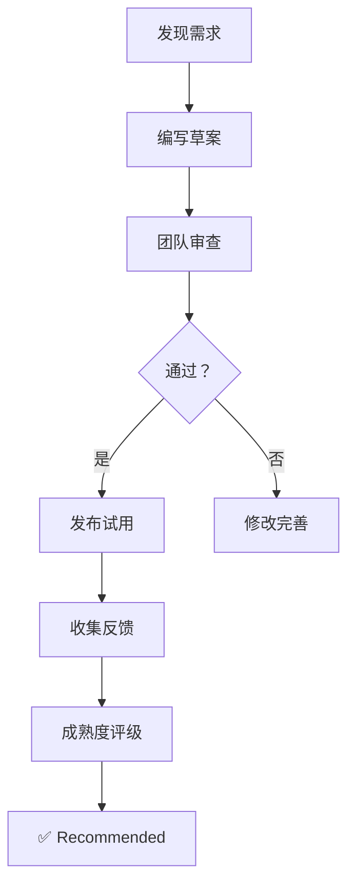

# 🔧 SKILL 文件维护清单

**版本：** v1.0  
**更新日期：** 2026-03-27  
**状态：** ✅ 已建立

---

## 📅 定期审查计划

### 季度审查（每季度末）

**时间安排：**
- Q1: 3 月最后一周
- Q2: 6 月最后一周
- Q3: 9 月最后一周
- Q4: 12 月最后一周

**审查内容：**

#### **1. 技能适用性检查**

```markdown
检查清单：
- [ ] 技能是否仍然适用于当前技术栈
- [ ] 是否有新的最佳实践出现
- [ ] 示例代码是否仍然有效
- [ ] 引用链接是否全部有效
```

**负责人：** 技术委员会轮值委员

**输出：** 《季度技能审查报告》

---

### 月度检查（每月最后一周）

**自动化检查项目：**

#### **1. 新增技能审核**

```bash
# 查找本月新增的技能文件
git log --since="last month" -- .lingma/skills/ --name-only

# 检查新增文件是否符合规范
# - 标题清晰
# - 包含示例
# - 有版本号
```

**检查项：**
- [ ] 新技能是否必要
- [ ] 是否与现有技能重复
- [ ] 质量是否达标（参考质量标准）

---

#### **2. 废弃技能归档**

```bash
# 标记为 Deprecated 的技能
grep -r "Deprecated" .lingma/skills/ --include="*.md"

# 移动到 archive 目录
mv .lingma/skills/01-backend/old-skill/ .lingma/skills/archive/old-skills/
```

**操作：**
- [ ] 识别已过时的技能
- [ ] 移动到 `archive/` 目录
- [ ] 更新索引指向新技能
- [ ] 通知团队成员

---

#### **3. 重复内容合并**

```bash
# 查找相似内容
grep -r "数据库查询" .lingma/skills/ --include="*.md" | wc -l

# 如果某个主题出现 > 3 次，考虑合并
```

**判断标准：**
- 同一主题在多个文件中出现
- 内容有 80% 以上重复
- 示例代码完全相同

**处理：**
- [ ] 保留最完整的版本
- [ ] 删除重复内容或添加引用
- [ ] 更新索引

---

#### **4. 格式规范化检查**

```bash
# 检查 markdown 格式
npx markdownlint-cli2 ".lingma/skills/**/*.md"

# 检查死链
npx markdown-link-check .lingma/skills/**/*.md
```

**修复：**
- [ ] 修正 markdown 语法错误
- [ ] 修复失效的链接
- [ ] 统一标题格式
- [ ] 补充缺失的版本信息

---

## 📝 文档质量标准

### 优秀技能文档特征 ✅

| 特征 | 说明 | 检查方法 |
|------|------|----------|
| **单一职责** | 只解决一个问题 | 标题是否聚焦 |
| **示例丰富** | 至少 3 个代码示例 | 数 ``` 代码块数量 |
| **步骤清晰** | 分步说明，编号清晰 | 是否有 1. 2. 3. |
| **引用准确** | 所有引用都有来源 | 检查链接有效性 |
| **版本控制** | 有版本号和更新记录 | 查看版本字段 |

**评分标准：**
```
5/5 - 完美符合所有特征
4/5 - 符合大部分特征
3/5 - 基本符合，有小问题
2/5 - 多处不符合
1/5 - 完全不符合
```

---

### 避免的问题 ❌

| 问题 | 影响 | 检测方法 |
|------|------|----------|
| **内容冗长** | 超过 500 行未拆分 | 统计行数 |
| **职责混杂** | 一个文档解决多个问题 | 检查标题范围 |
| **缺少示例** | 只有理论没有实践 | 数代码块数量 |
| **链接失效** | 引用不存在的资源 | 运行 link check |
| **版本缺失** | 没有版本标识 | 检查版本字段 |

**自动检测脚本：**

```bash
#!/bin/bash
# check-quality.sh

echo "检查技能文档质量..."

for file in $(find .lingma/skills -name "*.md"); do
  # 检查文件大小
  lines=$(wc -l < "$file")
  if [ $lines -gt 500 ]; then
    echo "⚠️  $file 超过 500 行，建议拆分"
  fi
  
  # 检查是否有版本号
  if ! grep -q "版本:" "$file"; then
    echo "❌ $file 缺少版本号"
  fi
  
  # 检查是否有代码示例
  code_blocks=$(grep -c '```' "$file")
  if [ $code_blocks -lt 3 ]; then
    echo "⚠️  $file 代码示例不足（至少需要 3 个）"
  fi
done

echo "检查完成！"
```

---

## 🎯 质量检查清单

每次更新技能文件时，请逐项检查：

### 基础检查

- [ ] **标题清晰** - 能准确反映文档内容
- [ ] **概述完整** - 有简短的描述段落（1-2 句话）
- [ ] **结构合理** - 使用 H1/H2/H3 分级标题

---

### 内容检查

- [ ] **包含示例** - 至少 3 个实际代码示例
- [ ] **场景明确** - 说明了使用场景
- [ ] **注意事项** - 列出了需要注意的点
- [ ] **相关链接** - 提供了相关技能链接

---

### 格式检查

- [ ] **Markdown 规范** - 无语法错误
- [ ] **链接有效** - 所有链接都可访问
- [ ] **版本信息** - 标注了版本号和日期
- [ ] **拼写正确** - 无错别字和语法错误

---

### 可维护性检查

- [ ] **职责单一** - 只解决一个问题
- [ ] **易于理解** - 新人也能看懂
- [ ] **便于更新** - 结构清晰，易于修改
- [ ] **可测试** - 示例代码可以运行

---

### 审查流程

```markdown
1. 作者自检
   ↓
2. 同事互审（Peer Review）
   ↓
3. 技术委员会抽查
   ↓
4. 合并到主分支
   ↓
5. 定期复查（季度审查）
```

---

## 📈 使用统计（可选功能）

### 追踪指标

#### 1. 访问量统计

如果使用 Git 平台（GitHub/GitLab）：

```bash
# 查看文件被引用的次数
git log --all --oneline -- .lingma/skills/01-backend/database-query/SKILL.md | wc -l

# 查看最近谁修改过
git log --all --pretty=format:"%h %an %ad %s" -- .lingma/skills/
```

---

#### 2. 搜索关键词统计

如果有内部搜索引擎：

```
热门搜索词 TOP 10（月度）：
1. "数据库查询"     - 120 次
2. "Vue 组件"       - 95 次
3. "滞港费计算"     - 80 次
4. "代码审查"       - 75 次
5. "提交规范"       - 60 次
...
```

**分析：**
- 高频搜索词 → 说明该技能重要
- 低频搜索词 → 可能需要推广或优化

---

#### 3. 反馈收集

**方式一：问卷调查**

```markdown
季度调查问卷：

1. 你最常用的技能是？
   ○ 数据库查询
   ○ Vue 最佳实践
   ○ 代码审查
   ○ 其他 _____

2. 哪个技能对你帮助最大？
   ○ _____

3. 你希望增加哪些技能？
   ○ _____

4. 现有技能有什么问题？
   ○ _____
```

**方式二：团队会议收集**

```
每周技术分享会：
- 5 分钟技能分享
- 收集使用反馈
- 讨论改进建议
```

---

## 🔄 技能生命周期管理

### 新增技能



**阶段说明：**

1. **草案阶段** (🧪 Experimental)
   - 初步编写
   - 小范围试用
   
2. **审查阶段**
   - 团队审查
   - 修改完善
   
3. **试用阶段** (⚠️ Use with care)
   - 发布试用
   - 收集反馈
   
4. **推荐阶段** (✅ Recommended)
   - 充分验证
   - 强烈推荐

---

### 技能废弃


**废弃流程：**

1. **标记为 Deprecated**
   ```markdown
   > ⚠️ **已废弃** - 请使用 [新技能](./new-skill/)
   ```

2. **提供迁移指南**
   ```markdown
   ## 迁移到新版本
   
   旧代码：
   ```typescript
   const old = doSomething();
   ```
   
   新代码：
   ```typescript
   const neu = doSomethingNew();
   ```
   ```

3. **移动到归档**
   ```bash
   mv .lingma/skills/01-backend/old-skill/ \
      .lingma/skills/archive/old-skills/
   ```

4. **通知团队**
   ```
   邮件通知：
   主题：【技能废弃】XXX 技能已废弃，请使用 YYY 替代
   ```

---

## 📊 质量度量指标

### 定量指标

| 指标 | 目标值 | 检测方法 |
|------|--------|----------|
| 文档平均长度 | 200-500 行 | `wc -l` |
| 代码示例数量 | ≥ 3 个/文档 | `grep -c '```'` |
| 链接有效率 | 100% | `markdown-link-check` |
| 版本覆盖率 | 100% | `grep "版本:"` |
| 审查通过率 | ≥ 90% | PR 统计 |

---

### 定性指标

| 指标 | 评估方法 |
|------|----------|
| 可读性 | 新人理解难度评分（1-5） |
| 实用性 | 团队投票（有用/无用） |
| 完整性 | 检查清单得分 |
| 时效性 | 最后更新时间 |

---

## 🎯 持续改进计划

### PDCA 循环

```
Plan（计划）
  ↓
Do（执行）
  ↓
Check（检查）
  ↓
Act（处理）
  ↓
下一轮改进
```

**具体实施：**

#### Plan（每月初）

```markdown
本月改进目标：
- 修复所有失效链接
- 补充缺失的代码示例
- 统一文档格式
```

#### Do（整月执行）

```bash
# 每周投入 2 小时
- Week 1: 链接检查
- Week 2: 示例补充
- Week 3: 格式统一
- Week 4: 审查验收
```

#### Check（月末）

```markdown
检查结果：
✅ 修复失效链接 15 个
✅ 补充示例代码 30 处
⚠️ 格式统一完成 80%
```

#### Act（下月初）

```markdown
标准化成果：
- 建立链接检查脚本
- 制定示例编写规范
- 形成格式模板

遗留问题转入下月 Plan
```

---

## 📞 联系与协作

### 角色分工

| 角色 | 职责 | 人员 |
|------|------|------|
| **维护负责人** | 统筹规划、最终审批 | 技术总监 |
| **内容审核员** | 审查新技能、检查质量 | 高级工程师（轮值） |
| **文档贡献者** | 编写技能、更新内容 | 全体开发 |
| **AI 助手** | 自动检查、统计分析 | AI Assistant |

---

### 沟通渠道

**常规沟通：**
- GitHub Issues - 问题反馈
- Pull Requests - 内容修改
- Team Chat - 日常讨论

**定期会议：**
- 每周技术分享会 - 技能交流
- 每月质量审查会 - 文档审查
- 每季度总结会 - 体系优化

---

## 🎉 激励措施

### 贡献排行榜（季度）

```markdown
Q1 2026 贡献榜：
🥇 张三 - 新增技能 5 个
🥈 李四 - 修订技能 8 个
🥉 王五 - 审查技能 15 个
```

### 奖励机制

- **最佳贡献奖** - 季度贡献最多者
- **质量之星** - 文档质量最高者
- **火眼金睛** - 发现问题最多者

**奖励：**
- 公开表彰
- 小礼品
- 培训机会

---

**维护者：** LogiX Development Team  
**审查周期：** 季度审查 + 月度检查  
**下次审查：** 2026-06-27  
**联系方式：** tech-team@logix.com
