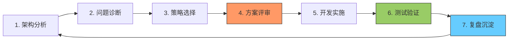

# 🏆 LOGIX 开发范式 (LogiX Development Framework)

**简称**: `LDF` 或 `logix-dev-paradigm`  
**版本**: v2.0  
**最后更新**: 2026-03-27  
**适用范围**: 全栈开发、架构设计、代码审查、问题优化

---

## 🎯 核心理念

> **"架构驱动、知识复用、渐进迭代、学习沉淀"**

### 四项基本原则

1. **先理解，后修改** - 深度分析优于盲目行动
2. **先复用，后创新** - 站在巨人肩膀上
3. **小步快跑，快速迭代** - 渐进式改进
4. **每次都要更好** - 童子军规则

---

## 📋 完整流程（七步法）



---

## 🔍 第一步：架构分析（五维分析法）

### 1.1 业务架构

**分析清单**:
```typescript
interface BusinessArchitecture {
  // 参与者
  actors: string[]           // 谁在使用？
  
  // 流程
  workflow: {
    steps: string[]          // 步骤序列
    triggers: string[]       // 触发条件
    outputs: string[]        // 产出物
  }
  
  // 规则
  rules: {
    constraints: string[]    // 约束条件
    validations: string[]    // 验证逻辑
    calculations: string[]   // 计算规则
  }
  
  // 状态
  states: {
    lifecycle: string[]      // 生命周期
    transitions: string[]    // 状态转换
    guards: string[]         // 守卫条件
  }
}
```

**实例：排产系统**
```markdown
- actors: ['计划员', '仓库管理员', '车队调度']
- workflow:
  - steps: ['筛选货柜', '预览方案', '确认保存', '扣减档期']
  - triggers: ['点击预览', '点击确认']
  - outputs: ['排产计划', '档期占用']
- rules:
  - constraints: ['提柜日 >= 清关日 +1']
  - validations: ['档期占用率 < 100%']
  - calculations: ['滞港费 = max(0, 超期天数) × 费率']
- states:
  - lifecycle: ['initial', 'issued', 'adjusted', 'dispatched']
  - transitions: ['initial→issued (确认)', 'issued→adjusted (调整)']
  - guards: ['只有 initial 可确认']
```

---

### 1.2 数据模型架构（五层分析法）

**分析清单**:
```typescript
interface DataModelAnalysis {
  // Layer 1: 实体定义
  entity: {
    tableName: string        // 表名
    columns: Column[]        // 字段
    primaryKeys: string[]    // 主键
    indexes: Index[]         // 索引
  }
  
  // Layer 2: 关系映射
  relations: {
    oneToOne: Relation[]
    oneToMany: Relation[]
    manyToMany: Relation[]
  }
  
  // Layer 3: 数据约束
  constraints: {
    notNull: string[]
    unique: string[]
    foreignKey: FK[]
    check: Check[]
  }
  
  // Layer 4: 数据流转
  dataFlow: {
    create: string[]         // 创建来源
    update: string[]         // 更新场景
    delete: string[]         // 删除条件
    query: string[]          // 查询场景
  }
  
  // Layer 5: 历史版本
  versioning: {
    hasHistory: boolean
    trackingFields: string[]
  }
}
```

**关键检查点**:
- ✅ 字段名与数据库一致（不要臆想）
- ✅ 主键/外键关系正确
- ✅ 索引覆盖查询场景
- ✅ 约束完整（非空、唯一、检查）

---

### 1.3 服务层架构

**分析清单**:
```typescript
interface ServiceAnalysis {
  capabilities: {
    methods: Method[]        // 方法列表
    inputs: any[]            // 输入参数
    outputs: any[]           // 输出结果
    sideEffects: string[]    // 副作用
  }
  
  dependencies: {
    services: string[]       // 依赖的服务
    repositories: string[]   // 依赖的 Repository
    utils: string[]          // 依赖的工具类
  }
  
  transactions: {
    requiresNew: string[]    // 新事务
    required: string[]       // 加入现有事务
    readOnly: string[]       // 只读事务
  }
  
  exceptions: {
    throws: string[]         // 抛出的异常
    catches: string[]        // 捕获的异常
    fallbacks: string[]      // 降级策略
  }
}
```

**关键问题**:
- 这个方法的核心职责是什么？
- 它依赖哪些外部服务？
- 事务边界在哪里？
- 异常情况如何处理？

---

### 1.4 前端架构（六边形模型）

**分析清单**:
```typescript
interface FrontendArchitecture {
  components: {
    pages: string[]          // 页面组件
    containers: string[]     // 容器组件
    presents: string[]       // 展示组件
    hooks: string[]          // 自定义 Hook
  }
  
  state: {
    local: string[]          // 本地状态
    shared: string[]         // 共享状态
    persisted: string[]      // 持久化状态
  }
  
  dataFlow: {
    fetch: string[]          // 数据获取
    mutate: string[]         // 数据变更
    cache: string[]          // 缓存策略
  }
  
  events: {
    userActions: string[]    // 用户操作
    systemEvents: string[]   // 系统事件
    callbacks: string[]      // 回调函数
  }
  
  uiLogic: {
    validations: string[]    // 表单验证
    computations: string[]   // 计算属性
    effects: string[]        // 副作用
  }
  
  styles: {
    global: string[]         // 全局样式
    scoped: string[]         // 作用域样式
    dynamic: string[]        // 动态样式
  }
}
```

---

### 1.5 数据流架构（全链路追踪）

**分析清单**:
```typescript
interface DataFlowAnalysis {
  sources: {
    external: string[]       // 外部系统
    internal: string[]       // 内部系统
    manual: string[]         // 人工录入
  }
  
  processing: {
    validate: string[]       // 验证
    transform: string[]      // 转换
    enrich: string[]         // 丰富
    aggregate: string[]      // 聚合
  }
  
  storage: {
    database: string[]       // 数据库存储
    cache: string[]          // 缓存存储
    session: string[]        // 会话存储
  }
  
  consumption: {
    display: string[]        // 显示
    export: string[]         // 导出
    report: string[]         // 报表
    integration: string[]    // 集成
  }
  
  lifecycle: {
    create: string[]         // 创建
    read: string[]           // 读取
    update: string[]         // 更新
    delete: string[]         // 删除
    archive: string[]        // 归档
  }
}
```

---

## 🔬 第二步：问题诊断（五步法）

### Step 1: 现象描述

```markdown
- What: 发生了什么？
- When: 何时发生？（时间/频率）
- Where: 在哪里发生？（环境/模块）
- Who: 谁发现的？影响谁？
- Impact: 影响范围多大？
```

### Step 2: 根因分析

```typescript
interface RootCause {
  direct: string             // 直接原因
  indirect: string[]         // 间接原因
  systemic: string[]         // 系统性原因
}
```

**5 Why 分析法**:
```
问题：卸柜日期不显示
Why 1? → plannedData.unloadDate 是 undefined
Why 2? → 后端返回的是 plannedData.plannedUnloadDate
Why 3? → 字段名不一致
Why 4? → 前端没有对齐后端接口定义
根本原因：缺少接口契约验证
```

### Step 3: 影响评估

```typescript
interface ImpactAssessment {
  users: number              // 影响用户数
  data: string[]             // 影响数据
  features: string[]         // 影响功能
  performance: string        // 性能影响
}
```

### Step 4: 紧急程度

```typescript
interface Urgency {
  severity: 1 | 2 | 3        // 严重程度 (1=致命，2=严重，3=一般)
  priority: 1 | 2 | 3        // 优先级
  sla: string                // SLA 要求
}
```

### Step 5: 修复策略

```typescript
interface FixStrategy {
  immediate: string          // 临时修复（止血）
  permanent: string          // 永久修复（治本）
  preventive: string[]       // 预防措施（避免复发）
}
```

---

## 🎲 第三步：策略选择（三选一）

### 方案选择矩阵

| 维度 | 方案 A：最小改动 | 方案 B：适度扩展 | 方案 C：重构重写 |
|------|----------------|----------------|----------------|
| **工作量** | 低 (1-2h) | 中 (4-8h) | 高 (1-3d) |
| **风险** | 低 | 中 | 高 |
| **适用场景** | Bug 修复、小优化 | 功能增强、技术债务 | 架构升级、历史包袱 |
| **推荐指数** | ⭐⭐⭐⭐⭐ | ⭐⭐⭐⭐ | ⭐⭐ |

### 决策树

```
Q1: 是否需要修改代码？
├─ No → 配置/文档/流程优化
└─ Yes → Q2

Q2: 是否有现有代码可复用？
├─ Yes → 方案 A：复用 + 扩展（强烈推荐）
└─ No → Q3

Q3: 是否可以小步迭代？
├─ Yes → 方案 B：渐进式重构（推荐）
└─ No → 方案 C：一次性重构（需谨慎评审）
```

### 选择理由评估模型

```typescript
function evaluateOption(option: Option): string {
  const score = 
    option.pros.length * 3 -      // 优点加分
    option.cons.length * 2 +      // 缺点减分
    (1 - option.effort / 100) * 20 -  // 工作量因子
    option.risk * 10              // 风险因子
  
  if (score >= 25) return '强烈推荐 ✅'
  if (score >= 15) return '推荐 👍'
  if (score >= 5) return '可接受 👌'
  return '不推荐 ❌'
}
```

---

## ✅ 第四步：方案评审（检查清单）

### 评审前准备

```markdown
- [ ] 技术方案文档已准备
- [ ] 接口设计已完成
- [ ] 风险评估已完成
- [ ] 工作量估算已明确
- [ ] 干系人已邀请
```

### 技术评审要点

```markdown
## 架构合理性
- [ ] 是否符合分层架构？
- [ ] 职责分离是否清晰？
- [ ] 依赖方向是否正确？

## 代码质量
- [ ] 是否遵循编码规范？
- [ ] 是否有代码异味？
- [ ] 是否过度设计？

## 性能考虑
- [ ] 是否有性能瓶颈？
- [ ] 是否需要缓存？
- [ ] 是否需要异步？

## 安全考虑
- [ ] 是否有 SQL 注入风险？
- [ ] 是否有 XSS/CSRF 风险？
- [ ] 敏感数据是否加密？

## 可维护性
- [ ] 代码是否易读？
- [ ] 注释是否充分？
- [ ] 测试是否覆盖？
```

### 评审输出

```markdown
- [ ] 评审意见清单
- [ ] 修改计划
- [ ] 复评安排
- [ ] 最终批准
```

---

## 🛠️ 第五步：开发实施（SKILL 原则）

### SKILL 原则检查清单

#### S - Specific（明确具体）

```markdown
- [ ] 业务场景是否清晰？
- [ ] 用户需求是否明确？
- [ ] 技术问题是否准确？
- [ ] 验收标准是否可衡量？
```

#### K - Knowledge（知识驱动）

```markdown
- [ ] 是否搜索了现有代码？
- [ ] 是否查阅了文档？
- [ ] 是否咨询了专家？
- [ ] 是否参考了最佳实践？
```

#### I - Incremental（渐进迭代）

```markdown
- [ ] 是否可以分阶段实施？
- [ ] 每阶段是否可验证？
- [ ] 失败是否可以回滚？
- [ ] 是否可以灰度发布？
```

#### L - Leverage（杠杆复用）

```markdown
- [ ] 是否有现成组件？
- [ ] 是否有工具库？
- [ ] 是否有服务可用？
- [ ] 是否有设计模式？
```

#### L - Learning（学习沉淀）⭐

```markdown
- [ ] 是否需要更新文档？
- [ ] 是否需要补充测试？
- [ ] 是否需要收集指标？
- [ ] 是否需要分享经验？
```

### 开发中检查

```markdown
## 代码质量
- [ ] 是否遵循编码规范？
- [ ] 是否有代码异味？
- [ ] 是否过度设计？
- [ ] 是否充分注释？

## 测试覆盖
- [ ] 是否编写单元测试？
- [ ] 是否编写集成测试？
- [ ] 测试覆盖率是否达标？

## 性能考虑
- [ ] 是否有性能瓶颈？
- [ ] 是否需要缓存？
- [ ] 是否需要异步？
- [ ] 是否需要限流？

## 安全考虑
- [ ] 是否有 SQL 注入？
- [ ] 是否有 XSS 攻击？
- [ ] 是否有 CSRF 攻击？
- [ ] 是否敏感数据加密？
```

---

## 🧪 第六步：测试验证（金字塔模型）

### 测试策略

```typescript
interface TestingPyramid {
  // Level 1: 单元测试（70%）
  unitTests: {
    coverage: number           // 覆盖率目标 (>80%)
    tools: string[]            // Jest/Vitest
    examples: string[]         // 测试用例
  }
  
  // Level 2: 集成测试（20%）
  integrationTests: {
    scenarios: string[]        // 集成场景
    mocks: string[]            // Mock 对象
    fixtures: string[]         // 测试数据
  }
  
  // Level 3: E2E 测试（10%）
  e2eTests: {
    workflows: string[]        // 端到端流程
    browsers: string[]         // 浏览器矩阵
    devices: string[]          // 设备矩阵
  }
}
```

### 测试清单

```markdown
## 功能测试
- [ ] 正常路径测试
- [ ] 异常路径测试
- [ ] 边界条件测试
- [ ] 兼容性测试

## 性能测试
- [ ] 负载测试
- [ ] 压力测试
- [ ] 并发测试
- [ ] 耐久性测试

## 安全测试
- [ ] 注入攻击测试
- [ ] 认证授权测试
- [ ] 数据加密测试
- [ ] 日志审计测试

## 回归测试
- [ ] 核心功能回归
- [ ] 历史 Bug 回归
- [ ] 接口兼容性回归
```

---

## 📊 第七步：复盘沉淀（PDCA 循环）

### 复盘会议

```markdown
## 回顾目标
- [ ] 原始目标是什么？
- [ ] 实际结果如何？
- [ ] 差距在哪里？

## 分析原因
- [ ] 成功因素是什么？
- [ ] 失败原因是什么？
- [ ] 意外发现是什么？

## 总结经验
- [ ] 学到了什么？
- [ ] 下次可以做什么改进？
- [ ] 有哪些最佳实践？

## 行动计划
- [ ] 需要停止什么？
- [ ] 需要开始什么？
- [ ] 需要继续什么？
```

### 知识沉淀

```markdown
## 文档更新
- [ ] API 文档
- [ ] 用户手册
- [ ] 运维手册
- [ ] 知识库文章

## 代码资产
- [ ] 通用组件
- [ ] 工具函数
- [ ] 测试用例
- [ ] 代码模板

## 经验分享
- [ ] 团队内部分享
- [ ] 技术博客
- [ ] 案例研究
```

---

## 🎯 快速参考卡片

### 五维分析法速记

```
业务架构 → 谁在什么场景做什么
数据模型 → 表结构、字段、关系
服务架构 → 职责、依赖、事务
前端架构 → 组件、状态、事件
数据流向 → 来源、处理、存储、消费
```

### SKILL 原则速记

```
S - 明确具体（Scenario）
K - 知识驱动（Knowledge）
I - 渐进迭代（Incremental）
L - 杠杆复用（Leverage）
L - 学习沉淀（Learning）
```

### 三项基本原则

```
1. 先理解，后修改
2. 先复用，后创新
3. 小步快跑，快速迭代
```

### 七步法流程

```
1. 架构分析 → 2. 问题诊断 → 3. 策略选择
→ 4. 方案评审 → 5. 开发实施 → 6. 测试验证
→ 7. 复盘沉淀
```

---

## 📚 附录：常用模板

### 技术方案模板

```markdown
# 技术方案：[方案名称]

## 背景
- 问题描述
- 业务价值
- 技术驱动力

## 目标
- 功能目标
- 性能目标
- 质量目标

## 方案设计
- 架构图
- 核心流程
- 接口设计

## 方案对比
- 方案 A：优缺点
- 方案 B：优缺点
- 方案 C：优缺点
- 推荐方案及理由

## 实施计划
- 阶段划分
- 时间安排
- 资源需求

## 风险评估
- 技术风险
- 业务风险
- 应对措施

## 验收标准
- 功能验收
- 性能验收
- 质量验收
```

### Code Review 清单

```markdown
## 代码质量
- [ ] 命名是否清晰？
- [ ] 函数是否单一职责？
- [ ] 是否有重复代码？
- [ ] 是否有魔法数字？

## 测试覆盖
- [ ] 是否有单元测试？
- [ ] 测试用例是否充分？
- [ ] 是否覆盖边界条件？

## 性能考虑
- [ ] 是否有 N+1 查询？
- [ ] 是否需要缓存？
- [ ] 是否有内存泄漏？

## 安全考虑
- [ ] 输入是否验证？
- [ ] 输出是否转义？
- [ ] 权限是否检查？
```

---

## 🔗 相关资源

- [Google Engineering Practices](https://google.github.io/eng-practices/)
- [Microsoft Engineering Excellence](https://aka.ms/engineering)
- [Clean Code](https://www.amazon.com/Clean-Code-Handbook-Software-Craftsmanship/dp/0132350882)
- [The Pragmatic Programmer](https://pragprog.com/titles/tpp20/the-pragmatic-programmer-20th-anniversary-edition/)

---

**版本历史**:
- v2.0 (2026-03-27): 完善版，增加测试/复盘环节
- v1.0 (2026-03-26): 初始版本

**维护者**: LogiX 技术委员会  
**联系方式**: tech-committee@logix.com
