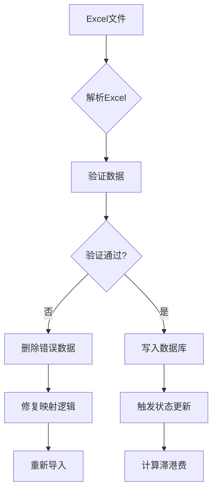
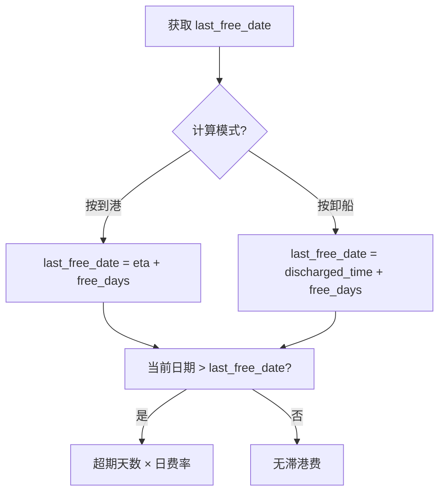
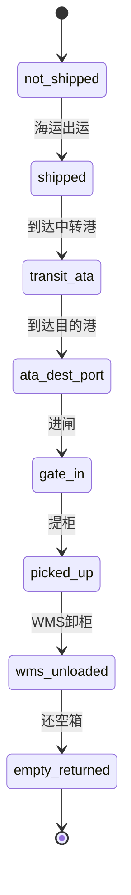

# LogiX 业务知识手册

## 业务概述

LogiX 是智能集装箱物流管理系统，核心业务流程：

```
备货单 → 海运 → 目的港 → 拖卡运输 → 仓库卸柜 → 还空箱
         ↓
      智能排柜（成本优化）
         ↓
      滞港费预警
```

---

## 数据库结构（28张表）

### 一、字典表（11张）- 基础数据

#### 1. dict_countries - 国家字典
```sql
code (PK)        -- 国家代码，如 'US', 'CA'
name_cn          -- 中文名称
name_en          -- 英文名称
region           -- 区域，如 'North America'
continent        -- 大洲
```

**业务规则**：
- `country` 字段实质指该国分公司（子公司类型客户）
- 统一存 `dict_countries.code`
- `sell_to_country` 特例存子公司名称

#### 2. dict_ports - 港口字典
```sql
port_code (PK)   -- 港口代码，如 'LAX', 'SHA'
port_name        -- 港口名称
country          -- 所属国家
support_export   -- 是否支持出口
support_import   -- 是否支持进口
```

#### 3. dict_container_types - 柜型字典
```sql
type_code (PK)   -- 柜型代码，如 '40HQ', '20GP'
size_ft          -- 尺寸（英尺）
max_weight_kg    -- 最大载重
max_cbm          -- 最大体积
teu              -- 标准箱单位
```

#### 4. dict_warehouses - 仓库字典
```sql
warehouse_code (PK)
property_type    -- 物业类型：SELF/3PL
daily_unload_capacity  -- 每日卸柜容量（默认10）
country          -- 所属国家
company_code     -- 关联海外公司
```

#### 5. dict_trucking_companies - 车队字典
```sql
company_code (PK)
daily_capacity         -- 每日可提柜数量
daily_return_capacity  -- 每日可还箱数量（NULL=共用 daily_capacity）
has_yard               -- 是否有堆场（true=支持 Drop 模式）
yard_daily_capacity    -- 堆场每日容量
```

**关键业务逻辑**：
- `has_yard = true` → 支持 Drop off 模式（提柜日 ≠ 送仓日）
- `has_yard = false` → 必须 Live 模式（提=送=卸同日）

#### 其他字典表
- `dict_customer_types` - 客户类型
- `dict_shipping_companies` - 船公司
- `dict_freight_forwarders` - 货代公司
- `dict_customs_brokers` - 清关公司
- `dict_overseas_companies` - 海外公司

---

### 二、业务表（4张）- 核心业务数据

#### 1. biz_replenishment_orders - 备货单
```sql
order_number (PK)       -- 备货单号
main_order_number       -- 主备货单号
container_number (FK)   -- 关联货柜
sell_to_country         -- 销往国家（存子公司名称）
customer_code (FK)      -- 客户代码
actual_ship_date        -- 实际出运日期（统计口径）
total_boxes             -- 总箱数
total_cbm               -- 总体积
shipment_total_value    -- 出运总价
```

**业务规则**：
- 一个备货单对应一个货柜
- `actual_ship_date` 为空时用 `shipment_date`（海运接货时间）

#### 2. biz_containers - 货柜（核心实体）
```sql
container_number (PK)   -- 集装箱号
bill_of_lading_number (FK)  -- 提单号
container_type_code (FK)    -- 柜型
logistics_status            -- 物流状态（7层简化）
gantt_derived (JSONB)       -- 甘特图派生数据
inspection_required         -- 是否查验
is_unboxing                 -- 是否开箱
requires_pallet             -- 是否含打托产品
```

**物流状态机（7层简化）**：
```
优先级从高到低：
1. 还空箱 (empty_returned)
2. WMS卸柜 (wms_unloaded)
3. 提柜 (picked_up)
4. 目的港 ATA (ata_dest_port)
5. 中转港 ATA/进闸 (transit_ata / gate_in)
6. 海运出运 (shipped)
7. 未出运 (not_shipped)
```

**计算函数**：`calculateLogisticsStatus()` in `ContainerStatusService`

#### 3. biz_customers - 客户
```sql
customer_code (PK)
customer_type_code (FK)
country (FK)              -- 所属国家
overseas_company_code (FK)
customer_category         -- 客户分类
```

#### 4. biz_container_skus - SKU明细
```sql
id (PK, SERIAL)
container_number (FK)
order_number (FK)
sku_code
quantity
total_boxes
total_gross_weight
total_cbm
```

---

### 三、流程表（7张）- 7层流转

#### 1. process_sea_freight - 海运信息
```sql
bill_of_lading_number (PK)  -- 提单号
vessel_name                 -- 船名
voyage_number               -- 航次
port_of_loading             -- 起运港
port_of_discharge           -- 目的港
eta (TIMESTAMPTZ)           -- 预计到港时间
ata (TIMESTAMPTZ)           -- 实际到港时间
revised_eta_dest_port       -- 修正ETA（滞港费计算用，优先级高于 eta）
shipment_date               -- 接货地实际离开时间
```

**关键字段**：
- `revised_eta_dest_port` > `eta` （滞港费计算优先级）
- 所有时间字段使用 `TIMESTAMPTZ`（支持时区）

#### 2. process_port_operations - 港口操作
```sql
id (PK, VARCHAR)
container_number (FK)
port_type          -- origin/transit/destination
port_sequence      -- 港口序号（支持多港经停）
eta (TIMESTAMPTZ)  -- 统一命名（原 eta_dest_port）
ata (TIMESTAMPTZ)  -- 统一命名（原 ata_dest_port）
last_free_date (DATE)  -- 最后免费日（滞港费计算基准）
gate_in_time       -- 进闸时间
discharged_time    -- 卸船时间
customs_status     -- 清关状态
```

**业务规则**：
- 支持多港经停场景（通过 `port_type` + `port_sequence` 区分）
- `last_free_date` 按到港或卸船计算（`last_free_date_mode`）

#### 3. process_trucking_transport - 拖卡运输
```sql
container_number (PK)
trucking_company_id (FK)
pickup_date (TIMESTAMP)    -- 提柜日期
delivery_date (TIMESTAMP)  -- 送仓日期
unload_mode_plan           -- 卸柜模式：Live/Drop
schedule_status            -- 调度状态：initial/scheduled/confirmed
last_pickup_date           -- 最晚提柜日期（预警用）
```

**卸柜模式**：
- **Live**: 提柜 = 送仓 = 卸柜（同日完成）
- **Drop**: 提柜 → 堆场暂存 → 送仓（分多日）

#### 4. process_warehouse_operations - 仓库操作
```sql
container_number (PK)
warehouse_id (FK)
planned_unload_date   -- 计划卸柜日期
unload_date           -- 实际卸柜日期
last_unload_date      -- 最晚卸柜日期（预警用）
wms_status            -- WMS状态
ebs_status            -- EBS状态
```

#### 5. process_empty_return - 还空箱
```sql
container_number (PK)
last_return_date      -- 最晚还箱日期
return_time           -- 实际还箱时间
return_terminal_code  -- 还箱堆场代码
```

#### 6. ext_container_status_events - 状态事件（飞驼）
```sql
id (PK, SERIAL)
container_number (FK)
status_code           -- 飞驼状态码
occurred_at           -- 发生时间
location              -- 位置
data_source           -- 数据来源
raw_data (JSONB)      -- 原始数据
```

#### 7. ext_container_charges - 费用记录
```sql
id (PK, SERIAL)
container_number (FK)
charge_type           -- 费用类型
charge_amount         -- 金额
charge_date           -- 费用日期
```

---

### 四、映射表（3张）- 智能排柜引擎

#### 1. dict_port_warehouse_mapping - 港口→仓库
```sql
port_code (FK)
warehouse_code (FK)
is_default            -- 是否默认映射
is_active             -- 是否启用
```

**用途**：根据目的港自动推荐仓库

#### 2. dict_warehouse_trucking_mapping - 仓库→车队
```sql
country (FK)
warehouse_code (FK)
trucking_company_id (FK)
is_default
```

**用途**：根据仓库自动推荐车队

#### 3. dict_trucking_port_mapping - 车队→港口
```sql
country (FK)
trucking_company_id (FK)
port_code (FK)
yard_capacity         -- 堆场容量
standard_rate         -- 标准费率
yard_operation_fee    -- 堆场操作费
```

**用途**：计算拖车费用，判断是否支持 Drop 模式

---

## 核心业务流程

### 流程一：数据导入



**关键原则**：
- 禁止用 SQL UPDATE 修补导入错误
- 发现错误 → 删除 → 修复代码 → 重新导入

### 流程二：智能排柜


**成本计算要素**：
1. 基础运费（车队-港口映射表）
2. 堆场操作费（有堆场时）
3. 堆存费（超过免费天数）
4. 仓库卸柜费
5. 滞港费（如果超期）

**算法位置**：`SchedulingCostOptimizerService`

### 流程三：滞港费计算



**关键表**：
- `process_port_operations.last_free_date`
- `ext_demurrage_standards`（待创建）
- `ext_demurrage_records`（待创建）

**计算服务**：`DemurrageService`

### 流程四：状态机流转



**状态计算函数**：
```typescript
// ContainerStatusService.calculateLogisticsStatus()
function calculateLogisticsStatus(container: Container): string {
  // 按优先级检查
  if (hasEmptyReturn()) return 'empty_returned';
  if (hasWmsUnload()) return 'wms_unloaded';
  if (hasPickup()) return 'picked_up';
  // ... 依次检查
  return 'not_shipped';
}
```

---

## 智能排柜引擎详解

### 输入参数

```typescript
interface SchedulingInput {
  containerNumber: string;
  pickupDate: Date;        // 预计提柜日期
  countryCode: string;     // 销往国家
  portCode: string;        // 目的港
  requiresPallet: boolean; // 是否打托
  requiresAssembly: boolean; // 是否需要组装
}
```

### 输出结果

```typescript
interface SchedulingOption {
  warehouseCode: string;
  truckingCompanyId: string;
  unloadDate: Date;
  strategy: 'Live' | 'Drop';
  totalCost: number;
  costBreakdown: {
    baseFreight: number;
    yardOperationFee: number;
    yardStorageCost: number;
    warehouseUnloadFee: number;
    demurrageCost: number;
  };
}
```

### 约束条件

1. **车队能力约束**
   - 每日提柜数量 ≤ `daily_capacity`
   - 每日还箱数量 ≤ `daily_return_capacity`

2. **仓库能力约束**
   - 每日卸柜数量 ≤ `daily_unload_capacity`

3. **时间约束**
   - 提柜日期 ≥ ETA + 清关时间
   - 卸柜日期 ≤ 最晚卸柜日期

4. **模式约束**
   - `has_yard = false` → 必须 Live 模式
   - `has_yard = true` → 可选 Live 或 Drop

---

## 常见业务陷阱

### 陷阱1：国家概念混淆

**问题**：`country` 字段有时指国家代码，有时指子公司名称

**解决方案**：
- `biz_customers.country` → 存 `dict_countries.code`
- `biz_replenishment_orders.sell_to_country` → 存子公司名称
- 统一通过 `countryCode` 关联资源

### 陷阱2：日期口径不一致

**问题**：统计数据用不同日期字段导致结果不一致

**解决方案**：
- 统一使用 `actual_ship_date`（备货单）
- 为空时使用 `shipment_date`（海运）
- 见 `DateFilterBuilder` 类

### 陷阱3：last_free_date 为空

**问题**：部分货柜缺少 `last_free_date`，导致滞港费无法计算

**解决方案**：
- 从 `revised_eta_dest_port` 或 `eta` 推算
- 加上免费天数（从船公司配置读取）

### 陷阱4：车队/仓库缺省

**问题**：某些国家没有配置车队或仓库

**解决方案**：
- 使用默认值：「XX清关行」「XX车队」「XX仓库」
- XX = 国家中文名（从 `dict_countries.name_cn` 获取）

---

## 关键统计指标

### 1. 最晚提柜统计（Last Pickup Statistics）

**五类划分**：
- `expired`: 已超过最晚提柜日期
- `urgent`: 距离最晚提柜日期 ≤ 3天
- `warning`: 距离最晚提柜日期 ≤ 7天
- `normal`: 距离最晚提柜日期 > 7天
- `noLastFreeDate`: 缺少最晚提柜日期

**计算依据**：`process_port_operations.last_free_date`

### 2. 月度货量统计（Monthly Volume）

**统计维度**：
- 按月分组
- 按国家分组
- 按柜型分组

**数据源**：`biz_replenishment_orders.actual_ship_date`

### 3. ETA 准确性统计

**计算公式**：
```
准确率 = (实际ATA在预测ETA ±3天内的货柜数) / 总货柜数
```

**数据源**：
- `process_sea_freight.eta`
- `process_sea_freight.ata`

---

## 🔧 开发检查清单

### 新增功能前必查

- [ ] 是否已有相关字典表？
- [ ] 是否需要新建业务表？
- [ ] 是否需要映射表支持智能推荐？
- [ ] 是否影响现有状态机流转？
- [ ] 是否需要更新统计指标？

### 修改数据库前必查

- [ ] 是否更新了 SQL 脚本？
- [ ] 是否更新了 TypeORM Entity？
- [ ] 是否编写了迁移脚本？
- [ ] 是否测试了回滚方案？
- [ ] 是否更新了 Excel 导入映射？

### 实现智能排柜前必查

- [ ] 是否配置了港口-仓库映射？
- [ ] 是否配置了仓库-车队映射？
- [ ] 是否配置了车队-港口映射（含费用）？
- [ ] 是否设置了车队/仓库的每日容量？
- [ ] 是否考虑了周末和节假日？

---

**版本**: v1.0  
**最后更新**: 2026-06-23  
**维护者**: LogiX Team  
**参考文档**: backend/sql/schema/03_create_tables.sql
