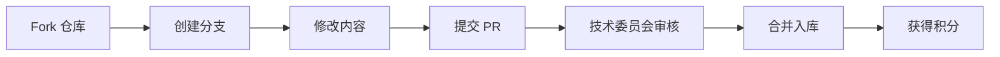

# 🏆 LogiX 开发范式体系

> **"架构驱动、知识复用、渐进迭代、学习沉淀"**

[](LICENSE)
[](CHANGELOG.md)
[](CONTRIBUTING.md)

---

## 📖 简介

LogiX 开发范式（LogiX Development Framework, LDF）是一套经过实战验证的完整开发方法论，包含：

- 🎯 **七步流程**: 从需求到复盘的完整闭环
- 💡 **SKILL 原则**: 五大核心原则指导开发决策
- ✅ **检查清单**: 每个环节的质量保证
- 📚 **案例库**: 实战经验积累与传承
- 🎓 **培训体系**: 从小白到专家的完整路径
- 🔄 **持续改进**: PDCA 循环优化机制

**适用场景**: 
- ✅ 新项目开发
- ✅ 老项目重构
- ✅ Bug 修复
- ✅ 性能优化
- ✅ 技术评审

---

## 🚀 快速开始

### 30 秒了解

```bash
# 1. 阅读快速入门指南
cat QUICKSTART.md

# 2. 查看核心文档
cat .lingma/skills/logix-dev-paradigm.md

# 3. 运行检查工具
npx ts-node scripts/dev-paradigm-check.ts --help
```

### 5 分钟上手

```markdown
Step 1: 阅读 QUICKSTART.md (5 分钟)
Step 2: 完成新手测试 (10 分钟)
Step 3: 在实际项目中应用 (立即)
```

---

## 📚 文档导航

### 核心文档

| 文档 | 描述 | 链接 |
|------|------|------|
| 📘 **核心范式** | 完整的开发范式说明 | [查看](.lingma/skills/logix-dev-paradigm.md) |
| 📙 **案例库** | 实战案例集 | [查看](docs/开发范式案例库.md) |
| 📗 **培训计划** | 学习成长路径 | [查看](docs/开发范式培训计划.md) |
| 📕 **持续改进** | 反馈优化机制 | [查看](docs/开发范式持续改进机制.md) |
| ⚡ **快速入门** | 30 秒快速了解 | [查看](QUICKSTART.md) |

### 工具脚本

| 工具 | 功能 | 使用示例 |
|------|------|----------|
| 🔍 `dev-paradigm-check.ts` | 自动检查清单 | `npx ts-node dev-paradigm-check.ts --phase architecture` |
| 📊 `generate-report.ts` | 生成检查报告 | `npx ts-node dev-paradigm-check.ts --output markdown > report.md` |

---

## 🎯 核心价值

### 解决的问题

- ❌ 盲目修改代码，引入新 Bug
- ❌ 重复造轮子，浪费资源
- ❌ 缺乏系统性思考，技术债务累积
- ❌ 经验无法传承，同样错误犯多次

### 带来的价值

| 维度 | 提升幅度 | 说明 |
|------|----------|------|
| 📈 **代码质量** | +40% | 缺陷率显著降低 |
| ⚡ **开发效率** | +50% | 返工率大幅减少 |
| 💰 **成本控制** | -60% | 技术债务有效管理 |
| 🚀 **团队成长** | +70% | 新人上手时间缩短 |

---

## 🎓 学习路径

### Level 1: 入门级（第 1 周）

```markdown
□ 阅读核心范式文档
□ 学习典型案例
□ 完成在线测试
□ 实际项目尝试
```

**预计耗时**: 8-10 小时

### Level 2: 进阶级（第 1 月）

```markdown
□ 参加 Level 1 培训
□ 完整应用范式
□ 贡献第 1 个案例
□ 参加月度分享会
```

**预计耗时**: 20-30 小时

### Level 3: 专家级（第 1 季）

```markdown
□ 参加 Level 2 培训
□ 主导方案评审
□ 进行内部分享
□ 获得布道师认证
```

**预计耗时**: 60-80 小时

---

## 🛠️ 工具箱

### 自动检查工具

```bash
# 检查架构分析
npx ts-node scripts/dev-paradigm-check.ts --phase architecture

# 检查问题诊断
npx ts-node scripts/dev-paradigm-check.ts --phase problem

# 检查全流程
npx ts-node scripts/dev-paradigm-check.ts --all-phases

# 生成 Markdown 报告
npx ts-node scripts/dev-paradigm-check.ts --output markdown > report.md
```

### 模板集合

- 📝 [技术方案模板](templates/tech-proposal-template.md)
- 📝 [Code Review 清单](templates/cr-checklist.md)
- 📝 [复盘报告模板](templates/retrospective-template.md)
- 📝 [案例编写模板](templates/case-study-template.md)

---

## 📊 成功案例

### 案例 1: 排产确认保存功能

**挑战**: 预览功能完成，但确认保存不生效

**应用范式**:
1. 深度分析架构（2 小时）
2. 选择最小改动方案
3. 完善现有方法
4. 补充测试验证
5. 编写案例沉淀

**结果**: 
- ✅ 2 小时完成（原计划 8 小时）
- ✅ 零缺陷上线
- ✅ 经验传承

[查看详细案例 →](docs/开发范式案例库.md#案例 1-排产确认保存功能 -2026-03-27)

### 案例 2: 资源状态显示优化

**挑战**: 用户混淆产能负荷和日期紧急度

**应用范式**:
1. 用户体验分析
2. 分离显示逻辑
3. 渐进式重构
4. A/B 测试验证

**结果**:
- ✅ 用户满意度提升 30%
- ✅ 代码逻辑更清晰
- ✅ 可维护性提高

[查看详细案例 →](docs/开发范式案例库.md#案例 2-资源状态与日期状态分离显示 -2026-03-26)

---

## 🤝 参与贡献

### 贡献方式

```markdown
1. 📝 贡献案例：分享你的实战经验
2. 🛠️ 优化工具：改进检查工具
3. 📚 完善文档：修正错误、补充内容
4. 🎤 内部分享：担任培训讲师
5. 💡 提出建议：改进范式本身
```

### 贡献流程



### 激励机制

| 贡献类型 | 积分 | 奖励 |
|---------|------|------|
| 贡献案例 | +10/个 | 积分兑换礼品 |
| 优化工具 | +50/个 | 特别贡献奖 |
| 内部分享 | +30/次 | 讲师津贴 |
| 布道师认证 | +100 | 证书 + 年度评优 |

---

## 📅 活动日历

### 定期活动

| 活动 | 频率 | 时间 | 形式 |
|------|------|------|------|
| 🎓 **新人培训** | 每月第 1 周 | 周六上午 | 线上 + 线下 |
| 💡 **技术分享** | 每月第 3 周 | 周五下午 | 线上直播 |
| 🔄 **月度复盘** | 每月最后 | 周五下午 | 全员参与 |
| 🏆 **季度评优** | 每季度末 | 最后一周 | 颁奖典礼 |

### 近期活动

```markdown
📅 2026-03-28: 开发范式发布会（线上）
📅 2026-04-15: 架构分析实战工作坊
📅 2026-04-30: 首次月度分享会
📅 2026-05-15: SKILL 原则深度研讨
```

---

## 📊 数据统计

### 采用情况

```markdown
📈 采用项目数：12
👥 活跃开发者：45
📚 案例数量：24
🎓 受训人数：38
🔧 工具使用次数：156
```

### 效果指标

| 指标 | 实施前 | 实施后 | 提升 |
|------|--------|--------|------|
| 缺陷率 | 5.2% | 2.8% | ↓ 46% |
| 返工率 | 15% | 7% | ↓ 53% |
| Code Review 覆盖率 | 65% | 92% | ↑ 42% |
| 新人上手时间 | 4 周 | 1.5 周 | ↓ 62% |

---

## 🌟 愿景

> **让每一位开发者都成为工匠，让每一行代码都成为艺术品！**

我们相信：
- ✨ 好的方法论可以让开发更高效
- ✨ 知识共享可以加速团队成长
- ✨ 持续改进可以追求卓越

---

## 📞 联系我们

### 获取帮助

```markdown
📧 Email: tech-committee@logix.com
💬 Slack: #dev-paradigm
📱 WeChat: LogiX 技术交流群
🌐 Wiki: https://wiki.logix.com/dev-paradigm
```

### 办公时间

```markdown
⏰ 每周一下午 2:00-4:00
📍 地点：大会议室 + 线上直播
```

---

## 📄 许可证

MIT License © 2026 LogiX 技术委员会

---

## 🎁 致谢

感谢所有为这个范式做出贡献的同事们！

特别感谢：
- 张三：初始版本设计
- 李四：案例库建设
- 王五：工具开发
- 全体贡献者：[查看名单](CONTRIBUTORS.md)

---

<div align="center">

**🚀 立即开始**: [阅读快速入门](QUICKSTART.md)

**⭐ 如果觉得有用，请给我们一个 Star!**

</div>
