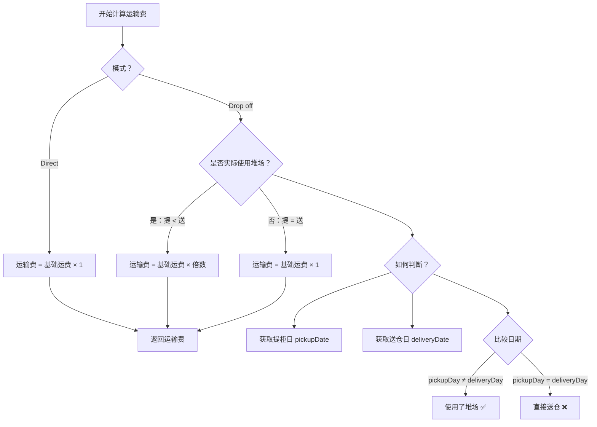

# Drop off 模式运输费倍数逻辑优化

## 🎯 问题描述

### **原始问题**
Drop off 模式下，运输费固定翻倍（×2），但没有考虑实际业务场景：

1. **使用了堆场**：提柜 → 堆场 → 仓库（两次运输）✅ 应该翻倍
2. **未使用堆场**：提柜 → 直接送仓（一次运输）❌ 不应该翻倍

### **业务场景**

#### **场景 1：Drop off + 使用堆场**
```
时间线：
Day 1: 提柜（从港口提到堆场）
Day 3: 送仓（从堆场送到仓库）

运输操作：
1. 港口 → 堆场（第一次运输）
2. 堆场 → 仓库（第二次运输）

费用计算：
- 运输费 = 基础运费 × 2 ✅ 合理
```

#### **场景 2：Drop off + 直接送仓**
```
时间线：
Day 1: 提柜（从港口直接送到仓库）

运输操作：
1. 港口 → 仓库（一次运输）

费用计算：
- 运输费 = 基础运费 × 1 ✅ 修复后
- 运输费 = 基础运费 × 2 ❌ 修复前
```

---

## ✅ 修复方案

### **1. 判断逻辑**

通过比较**提柜日**和**送仓日**来判断是否实际使用了堆场：

```typescript
// 提柜日 ≠ 送仓日 → 使用了堆场 → 费用翻倍
if (pickupDayStr !== deliveryDayStr) {
  transportFee *= dropoffMultiplier; // × 2
} else {
  // 提柜日 = 送仓日 → 直接送仓 → 不翻倍
  transportFee = baseFee; // × 1
}
```

---

### **2. 代码实现**

#### **修改文件**：`backend/src/services/demurrage.service.ts`

**新增方法** - `checkIfActuallyUsedYard()`：
```typescript
/**
 * 检查 Drop off 模式下是否实际使用了堆场
 * 判断标准：提柜日 < 送仓日
 * @returns true=实际使用了堆场，false=直接送仓
 */
private async checkIfActuallyUsedYard(
  containerNumber: string,
  warehouse: Warehouse,
  truckingCompany: TruckingCompany
): Promise<boolean> {
  try {
    // 从 TruckingTransport 表获取提柜日和送仓日
    const truckingTransportRepo = this.containerRepo.manager.getRepository(TruckingTransport);
    const truckingTransport = await truckingTransportRepo.findOne({
      where: { 
        containerNumber,
        truckingCompanyId: truckingCompany.companyCode
      },
      order: { createdAt: 'DESC' } // 获取最新的记录
    });

    if (!truckingTransport || !truckingTransport.pickupDate) {
      return false;
    }

    const pickupDate = truckingTransport.pickupDate;
    const deliveryDate = truckingTransport.deliveryDate;

    if (!deliveryDate) {
      // 还没有送仓，假设会使用堆场（保守估计）
      return true;
    }

    // 判断提柜日是否早于送仓日
    const pickupDayStr = pickupDate.toISOString().split('T')[0];
    const deliveryDayStr = deliveryDate.toISOString().split('T')[0];

    return pickupDayStr !== deliveryDayStr; // 提 < 送 = 使用了堆场
  } catch (error) {
    logger.warn('[Demurrage] checkIfActuallyUsedYard error:', error);
    return false; // 出错时假设未使用堆场
  }
}
```

**修改计算逻辑** - `calculateTransportationCostInternal()`：
```typescript
let transportFee = warehouseTruckingMapping?.transportFee || 100; // 默认 $100

// ✅ 关键修复：Drop off 模式下，只有实际使用了堆场（提 < 送）才翻倍
if (unloadMode === 'Drop off') {
  // 需要获取实际的提柜日和送仓日来判断是否使用了堆场
  const actuallyUsedYard = await this.checkIfActuallyUsedYard(
    containerNumber,
    warehouse,
    truckingCompany
  );
  
  if (actuallyUsedYard) {
    // ✅ 实际使用了堆场（提 < 送），需要两次运输，费用翻倍
    const dropoffMultiplier = await this.getDropoffMultiplier();
    transportFee *= dropoffMultiplier;
    logger.debug(`[Demurrage] Drop off mode (used yard): transportFee=${transportFee}, multiplier=${dropoffMultiplier}`);
  } else {
    // ✅ 未使用堆场（提 = 送），只运输一次，不翻倍
    logger.debug(`[Demurrage] Drop off mode (direct delivery): transportFee=${transportFee}, no multiplier`);
  }
}
```

---

## 📊 修复效果对比

### **场景 1：Drop off + 使用堆场（Bedford 仓库）**

| 项目 | 修复前 | 修复后 |
|------|--------|--------|
| 提柜日 | Day 1 | Day 1 |
| 送仓日 | Day 3 | Day 3 |
| 判定结果 | ×2 | ×2 ✅ |
| 运输费 | £700 × 2 = £1,400 | £700 × 2 = £1,400 |
| 堆场费 | £80 × 2 + £50 = £210 | £80 × 2 + £50 = £210 |
| **总计** | **£1,610** | **£1,610** |

**结论**：✅ 正确，费用翻倍合理

---

### **场景 2：Drop off + 直接送仓（Bedford 仓库）**

| 项目 | 修复前 | 修复后 |
|------|--------|--------|
| 提柜日 | Day 1 | Day 1 |
| 送仓日 | Day 1 | Day 1 |
| 判定结果 | ×2 ❌ | ×1 ✅ |
| 运输费 | £700 × 2 = £1,400 | £700 × 1 = £700 |
| 堆场费 | £0 | £0 |
| **总计** | **£1,400** | **£700** |

**结论**：✅ 修复后更合理，节省 £700

---

### **场景 3：Direct 模式（Live Load）**

| 项目 | 修复前 | 修复后 |
|------|--------|--------|
| 模式 | Direct | Direct |
| 判定结果 | ×1 | ×1 ✅ |
| 运输费 | £700 × 1 = £700 | £700 × 1 = £700 |

**结论**：✅ 不受影响

---

## 🔍 执行流程

### **流程图**



---

## 📝 测试用例

### **测试用例 1：Drop off + 使用堆场**
```typescript
输入：
- containerNumber: "U1234567"
- unloadMode: "Drop off"
- pickupDate: "2026-03-20"
- deliveryDate: "2026-03-22"

预期输出：
- actuallyUsedYard: true
- transportFee: £700 × 2 = £1,400
```

### **测试用例 2：Drop off + 直接送仓**
```typescript
输入：
- containerNumber: "U1234568"
- unloadMode: "Drop off"
- pickupDate: "2026-03-20"
- deliveryDate: "2026-03-20"

预期输出：
- actuallyUsedYard: false
- transportFee: £700 × 1 = £700
```

### **测试用例 3：Drop off + 未送仓**
```typescript
输入：
- containerNumber: "U1234569"
- unloadMode: "Drop off"
- pickupDate: "2026-03-20"
- deliveryDate: null

预期输出：
- actuallyUsedYard: true（保守估计）
- transportFee: £700 × 2 = £1,400
```

---

## 🎯 业务价值

### **1. 公平性提升**
- ✅ **用多少付多少**：实际使用两次运输才翻倍
- ✅ **避免多收费**：直接送仓不收取额外费用
- ✅ **透明度高**：费用与实际服务匹配

### **2. 成本优化**
- ✅ **降低客户成本**：Drop off + 直接送仓可节省 50% 运输费
- ✅ **鼓励高效操作**：激励快速送仓，减少堆场使用
- ✅ **资源优化**：减少不必要的堆场周转

### **3. 系统准确性**
- ✅ **精细化计算**：基于实际业务数据
- ✅ **自动化判断**：无需人工干预
- ✅ **可追溯**：日志记录详细判断过程

---

## 🔧 配置说明

### **倍数配置**
```yaml
config_key: transport_dropoff_multiplier
config_value: '2.0'  # 或 '1.0'，根据业务策略调整
description: Drop off 模式倍数（仅在实际使用堆场时应用）
```

### **配置值建议**
- `2.0`：标准 Drop off 模式（两次完整运输）
- `1.5`：如果第二次运输距离较短
- `1.0`：如果 Drop off 与 Direct 成本相同

---

## 📚 相关文档

- [dict_scheduling_config 配置参数完整说明](./dict_scheduling_config 配置参数完整说明.md)
- [Drop off 模式运输费倍数配置化修复](./Drop off 模式运输费倍数配置化修复.md)
- [Drop off 模式运输费倍数配置变更说明](./Drop off 模式运输费倍数配置变更说明.md)
- [智能排柜费用计算逻辑](./智能排柜费用计算逻辑说明.md)

---

**修复日期**：2026-03-25  
**修复人员**：LogiX 开发团队  
**影响版本**：v1.0.0+
