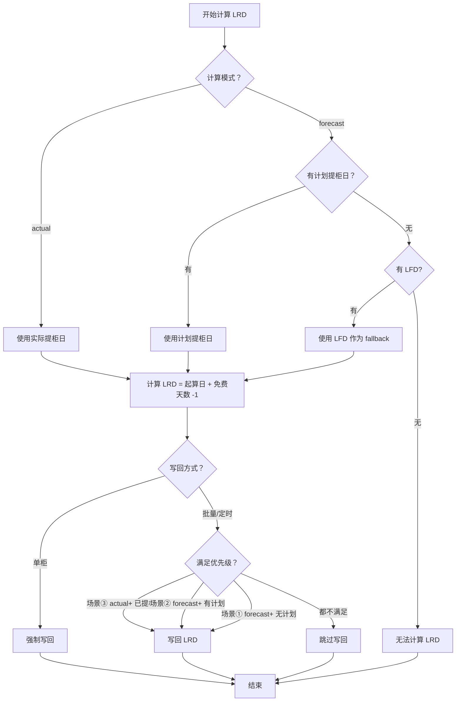

# LRD 计算与写回策略完整设计 - SKILL 规范

**创建日期**: 2026-03-25  
**设计目标**: 明确最晚还箱日（LRD）的三种计算场景和写回策略  

---

## 📋 **LRD 计算的三种场景**

### **用户提出的完整设计**

| 场景 | 模式 | 数据状态 | 起算日 | 写回策略 |
|------|------|---------|--------|---------|
| **①** | forecast | 无实际提柜，无计划提柜 | 最晚提柜日 (LFD) | ✅ 批量/定时更新写回 |
| **②** | forecast | 无实际提柜，有计划提柜 | 计划提柜日 (Planned Pickup) | ✅ 批量/定时更新写回 |
| **③** | actual | 有实际提柜日 | 实际提柜日 (Actual Pickup) | ✅ 批量/定时更新写回 |

**手工更新（单柜）**: 三种情况都强制写回

---

## 🔍 **现状分析**

### **当前代码逻辑验证**

#### **LRD 计算逻辑（核心）**

**代码位置**: [`demurrage.service.ts:1170-1188`](file://d:\Gihub\logix\backend\src\services\demurrage.service.ts#L1170-L1188)

```typescript
// LRD：Combined(D&D) 为到港→还箱整段；否则沿用 Detention 的提柜起算
let pickupBasisForDetention: Date | null;
const lastReturnDateMode: 'actual' | 'forecast' = calculationMode;

if (lrdStd && firstCombinedStd && lrdStd.id === firstCombinedStd.id) {
  // Combined D&D 费用：从到港日起算
  pickupBasisForDetention = lrdArrivalStart.date;
} else {
  // ⭐ 关键：普通滞箱费，根据计算模式选择起算日
  pickupBasisForDetention = calculationMode === 'actual'
    ? (params.calculationDates.pickupDateActual ?? null)  // ③ actual: 实际提柜日
    : (params.calculationDates.plannedPickupDate ?? null); // ② forecast: 计划提柜日
}

let computedLastReturnDate: Date | null = null;
if (lrdStd && pickupBasisForDetention) {
  const freeDays = Math.max(0, lrdStd.freeDays ?? 0);
  const n = freeDays - 1;
  computedLastReturnDate = freePeriodUsesWorkingDays(lrdStd.freeDaysBasis)
    ? addWorkingDays(pickupBasisForDetention, n)
    : addDays(pickupBasisForDetention, n);
}
```

**问题发现**:

❌ **当前逻辑缺少场景①的处理！**

```typescript
// 当前逻辑
pickupBasisForDetention = calculationMode === 'actual'
  ? (params.calculationDates.pickupDateActual ?? null)  // ③ 实际提柜日
  : (params.calculationDates.plannedPickupDate ?? null); // ② 计划提柜日

// ❌ 如果 plannedPickupDate 也为 null 呢？
// 结果：pickupBasisForDetention = null
//       computedLastReturnDate = null
//       → LRD 无法计算！
```

---

### **正确的 LRD 计算逻辑（建议）**

```typescript
/**
 * 最晚还箱日计算 - 完整三种场景
 * 
 * 场景① forecast + 无计划提柜：从 LFD 起算
 * 场景② forecast + 有计划提柜：从计划提柜日起算
 * 场景③ actual + 有实际提柜：从实际提柜日起算
 */
let pickupBasisForDetention: Date | null;

if (calculationMode === 'actual') {
  // ③ actual 模式：优先使用实际提柜日
  pickupBasisForDetention = params.calculationDates.pickupDateActual ?? null;
} else {
  // forecast 模式
  if (params.calculationDates.plannedPickupDate) {
    // ② 有计划提柜日：使用计划提柜日
    pickupBasisForDetention = params.calculationDates.plannedPickupDate;
  } else if (computedLastFreeDate) {
    // ① 无计划提柜日：使用 LFD（最晚提柜日）作为 fallback
    pickupBasisForDetention = computedLastFreeDate;
  } else {
    // 都没有：无法计算
    pickupBasisForDetention = null;
  }
}

let computedLastReturnDate: Date | null = null;
if (lrdStd && pickupBasisForDetention) {
  const freeDays = Math.max(0, lrdStd.freeDays ?? 0);
  const n = freeDays - 1;
  computedLastReturnDate = freePeriodUsesWorkingDays(lrdStd.freeDaysBasis)
    ? addWorkingDays(pickupBasisForDetention, n)
    : addDays(pickupBasisForDetention, n);
}
```

---

## 📊 **三种场景详细对比**

### **场景①: Forecast + 无计划提柜**

```
数据状态:
- ATA Dest Port: 2026-02-12 (已到港)
- Actual Pickup Date: null (未提柜)
- Planned Pickup Date: null (无计划)
- Last Free Date: 2026-02-18 (已计算或已有)

计算逻辑:
1. calculationMode: 'forecast' (未提柜)
2. pickupBasisForDetention:
   - plannedPickupDate: null
   - computedLastFreeDate: 2026-02-18 ✅
   - 最终：2026-02-18
3. computedLastReturnDate: 2026-02-18 + (7-1) = 2026-02-24

写回策略:
- 批量/定时更新：✅ 应该写回（但当前代码可能跳过）
- 单柜更新：✅ 强制写回
```

---

### **场景②: Forecast + 有计划提柜**

```
数据状态:
- ATA Dest Port: 2026-02-12 (已到港)
- Actual Pickup Date: null (未提柜)
- Planned Pickup Date: 2026-02-20 (有计划)
- Last Free Date: 2026-02-18 (已计算或已有)

计算逻辑:
1. calculationMode: 'forecast' (未提柜)
2. pickupBasisForDetention:
   - plannedPickupDate: 2026-02-20 ✅
   - 最终：2026-02-20
3. computedLastReturnDate: 2026-02-20 + (7-1) = 2026-02-26

写回策略:
- 批量/定时更新：✅ 应该写回
- 单柜更新：✅ 强制写回
```

---

### **场景③: Actual + 有实际提柜**

```
数据状态:
- ATA Dest Port: 2026-02-12 (已到港)
- Actual Pickup Date: 2026-02-15 (已提柜)
- Planned Pickup Date: null 或 2026-02-15
- Last Free Date: 2026-02-18 (已计算或已有)

计算逻辑:
1. calculationMode: 'actual' (已提柜)
2. pickupBasisForDetention:
   - pickupDateActual: 2026-02-15 ✅
   - 最终：2026-02-15
3. computedLastReturnDate: 2026-02-15 + (7-1) = 2026-02-21

写回策略:
- 批量/定时更新：✅ 应该写回（当前代码支持）
- 单柜更新：✅ 强制写回
```

---

## 🔄 **写回策略详解**

### **批量更新 & 定时更新（同源）**

**当前代码逻辑**: [`demurrage.service.ts:3050-3071`](file://d:\Gihub\logix\backend\src\services\demurrage.service.ts#L3050-L3071)

```typescript
// 最晚还箱日（批量）：actual + 有提柜起算；已有 return_time 时若 last_return_date 为空仍补写
if (calculationMode === 'actual' && computedLastReturnDate && pickupDateActual) {
  let emptyReturn = await this.emptyReturnRepo.findOne({
    where: { containerNumber }
  })
  if (!emptyReturn) {
    emptyReturn = this.emptyReturnRepo.create({
      containerNumber,
      lastReturnDate: computedLastReturnDate
    })
    await this.emptyReturnRepo.save(emptyReturn)
    lastReturnDateWritten = true
  } else if (!emptyReturn.lastReturnDate) {
    await this.emptyReturnRepo.update(
      { containerNumber },
      { lastReturnDate: computedLastReturnDate }
    )
    lastReturnDateWritten = true
  }
}
```

**问题**:

❌ **只处理场景③（actual 模式），不处理场景①和②（forecast 模式）！**

```typescript
// 当前条件
if (calculationMode === 'actual' && computedLastReturnDate && pickupDateActual) {
  // ❌ forecast 模式被排除在外
}

// 应该修改为
if (computedLastReturnDate) {
  // ✅ 只要有计算结果就写回（区分优先级）
}
```

---

### **单柜更新（强制覆盖）**

**当前代码逻辑**: [`demurrage.service.ts:2961-2987`](file://d:\Gihub\logix\backend\src\services\demurrage.service.ts#L2961-L2987)

```typescript
// 最晚还箱日（单条更新）：允许覆盖旧值，确保人工触发可对齐到最新计算结果
if (computedLastReturnDate) {
  let emptyReturn = await this.emptyReturnRepo.findOne({
    where: { containerNumber }
  })
  if (!emptyReturn) {
    emptyReturn = this.emptyReturnRepo.create({
      containerNumber,
      lastReturnDate: computedLastReturnDate
    })
    await this.emptyReturnRepo.save(emptyReturn)
    lastReturnDateWritten = true
  } else {
    const shouldUpdate =
      !emptyReturn.lastReturnDate ||
      toDateOnly(emptyReturn.lastReturnDate).getTime() !== toDateOnly(computedLastReturnDate).getTime();
    if (shouldUpdate) {
      await this.emptyReturnRepo.update(
        { containerNumber },
        { lastReturnDate: computedLastReturnDate }
      )
      lastReturnDateWritten = true
    }
  }
}
```

**优点**:

✅ **单柜更新支持所有三种场景！**
- 不检查 `calculationMode`
- 不检查 `pickupDateActual`
- 只要有 `computedLastReturnDate` 就写回

---

## 🎯 **LRD 更新的优先级规则**

### **用户提出的设计**

> 批量更新与定时更新时，③的结果回写更新②，②的结果回写更新①。  
> 手工更新时全部都回写更新

**解读**:

| 更新方式 | 场景①<br>(无计划) | 场景②<br>(有计划) | 场景③<br>(已提柜) | 优先级 |
|---------|----------------|----------------|----------------|--------|
| **批量/定时** | ✅ 写回 | ✅ 写回 | ✅ 写回 | ③ > ② > ① |
| **单柜** | ✅ 强制写回 | ✅ 强制写回 | ✅ 强制写回 | 无优先级，全部覆盖 |

---

### **优先级实现逻辑（建议）**

```typescript
/**
 * 批量/定时更新的 LRD 写回策略
 * 
 * 优先级：actual(③) > forecast with planned(②) > forecast without planned(①)
 */
private async writeBackLastReturnDate(
  containerNumber: string,
  computedLastReturnDate: Date | null,
  calculationMode: 'actual' | 'forecast',
  pickupDateActual: Date | null,
  plannedPickupDate: Date | null
): Promise<boolean> {
  if (!computedLastReturnDate) {
    return false
  }

  // ⭐ 优先级判断
  // 场景③: actual 模式 + 有实际提柜日 → 最高优先级
  if (calculationMode === 'actual' && pickupDateActual) {
    return this.doWriteBackLastReturnDate(containerNumber, computedLastReturnDate)
  }
  
  // 场景②: forecast 模式 + 有计划提柜日 → 中等优先级
  if (calculationMode === 'forecast' && plannedPickupDate) {
    return this.doWriteBackLastReturnDate(containerNumber, computedLastReturnDate)
  }
  
  // 场景①: forecast 模式 + 无计划提柜日 → 低优先级（fallback）
  if (calculationMode === 'forecast' && !plannedPickupDate) {
    return this.doWriteBackLastReturnDate(containerNumber, computedLastReturnDate)
  }
  
  return false
}

/**
 * 执行 LRD 写回（插入或更新）
 */
private async doWriteBackLastReturnDate(
  containerNumber: string,
  computedLastReturnDate: Date
): Promise<boolean> {
  let emptyReturn = await this.emptyReturnRepo.findOne({
    where: { containerNumber }
  })
  
  if (!emptyReturn) {
    // 插入新记录
    emptyReturn = this.emptyReturnRepo.create({
      containerNumber,
      lastReturnDate: computedLastReturnDate
    })
    await this.emptyReturnRepo.save(emptyReturn)
    logger.info(`[Demurrage] LRD insert for ${containerNumber}`)
    return true
  }
  
  // 检查是否需要更新
  const shouldUpdate =
    !emptyReturn.lastReturnDate ||
    toDateOnly(emptyReturn.lastReturnDate).getTime() !== toDateOnly(computedLastReturnDate).getTime()
  
  if (shouldUpdate) {
    await this.emptyReturnRepo.update(
      { containerNumber },
      { lastReturnDate: computedLastReturnDate }
    )
    logger.info(`[Demurrage] LRD update for ${containerNumber}`)
    return true
  }
  
  logger.info(`[Demurrage] LRD skipped for ${containerNumber} (no change)`)
  return false
}
```

---

## 📝 **完整的 LRD 计算与写回流程**

### **Step-by-Step 流程**



---

## 🎯 **修复建议**

### **修复 1: LRD 计算逻辑补充场景①**

**文件**: `demurrage.service.ts:1170-1188`

```typescript
// 修改前（有问题）
let pickupBasisForDetention: Date | null;
if (lrdStd && firstCombinedStd && lrdStd.id === firstCombinedStd.id) {
  pickupBasisForDetention = lrdArrivalStart.date;
} else {
  pickupBasisForDetention = calculationMode === 'actual'
    ? (params.calculationDates.pickupDateActual ?? null)
    : (params.calculationDates.plannedPickupDate ?? null);  // ❌ 缺少 fallback
}

// 修改后（正确）
let pickupBasisForDetention: Date | null;
if (lrdStd && firstCombinedStd && lrdStd.id === firstCombinedStd.id) {
  // Combined D&D: 从到港日起算
  pickupBasisForDetention = lrdArrivalStart.date;
} else {
  // ⭐ 普通滞箱费：三种场景
  if (calculationMode === 'actual') {
    // ③ actual 模式：使用实际提柜日
    pickupBasisForDetention = params.calculationDates.pickupDateActual ?? null;
  } else {
    // forecast 模式
    if (params.calculationDates.plannedPickupDate) {
      // ② 有计划提柜日：使用计划提柜日
      pickupBasisForDetention = params.calculationDates.plannedPickupDate;
    } else if (computedLastFreeDate) {
      // ① 无计划提柜日：使用 LFD 作为 fallback
      pickupBasisForDetention = computedLastFreeDate;
    } else {
      // 都没有：无法计算
      pickupBasisForDetention = null;
    }
  }
}

let computedLastReturnDate: Date | null = null;
if (lrdStd && pickupBasisForDetention) {
  const freeDays = Math.max(0, lrdStd.freeDays ?? 0);
  const n = freeDays - 1;
  computedLastReturnDate = freePeriodUsesWorkingDays(lrdStd.freeDaysBasis)
    ? addWorkingDays(pickupBasisForDetention, n)
    : addDays(pickupBasisForDetention, n);
}
```

---

### **修复 2: LRD 写回逻辑支持所有场景**

**文件**: `demurrage.service.ts:3050-3071`

```typescript
// 修改前（有问题）
// ❌ 只处理 actual 模式
if (calculationMode === 'actual' && computedLastReturnDate && pickupDateActual) {
  // ... 写回逻辑
}

// 修改后（正确）
// ✅ 处理所有三种场景，按优先级
if (computedLastReturnDate) {
  // ⭐ 不再限制 calculationMode 和 pickupDateActual
  // 只要有计算结果就写回（批量/定时更新）
  let emptyReturn = await this.emptyReturnRepo.findOne({
    where: { containerNumber }
  })
  
  if (!emptyReturn) {
    emptyReturn = this.emptyReturnRepo.create({
      containerNumber,
      lastReturnDate: computedLastReturnDate
    })
    await this.emptyReturnRepo.save(emptyReturn)
    lastReturnDateWritten = true
    logger.info(`[Demurrage] LRD insert for ${containerNumber}`)
  } else {
    // 检查是否需要更新
    const shouldUpdate =
      !emptyReturn.lastReturnDate ||
      toDateOnly(emptyReturn.lastReturnDate).getTime() !== toDateOnly(computedLastReturnDate).getTime()
    
    if (shouldUpdate) {
      await this.emptyReturnRepo.update(
        { containerNumber },
        { lastReturnDate: computedLastReturnDate }
      )
      lastReturnDateWritten = true
      logger.info(`[Demurrage] LRD update for ${containerNumber}`)
    }
  }
}
```

---

## 📊 **测试用例设计**

### **场景①测试：Forecast + 无计划提柜**

```typescript
it('应该使用 LFD 计算 LRD（场景①）', async () => {
  const containerNumber = 'TEST001'
  
  // 数据准备
  await createPortOperation({
    containerNumber,
    ataDestPort: new Date('2026-02-12'),
    lastFreeDate: new Date('2026-02-18'),  // LFD 已存在
    lastFreeDateSource: 'computed'
  })
  
  await createTruckingTransport({
    containerNumber,
    plannedPickupDate: null,  // 无计划
    pickupDate: null          // 未提柜
  })
  
  // 执行计算
  const { result } = await demurrageService.calculateForContainer(containerNumber)
  
  // 验证
  expect(result.calculationMode).toBe('forecast')
  expect(result.calculationDates.lastPickupDateComputed).toBe('2026-02-18')
  expect(result.calculationDates.lastReturnDateComputed).toBe('2026-02-24')  // LFD + 6 天
})
```

---

### **场景②测试：Forecast + 有计划提柜**

```typescript
it('应该使用计划提柜日计算 LRD（场景②）', async () => {
  const containerNumber = 'TEST002'
  
  // 数据准备
  await createPortOperation({
    containerNumber,
    ataDestPort: new Date('2026-02-12'),
    lastFreeDate: new Date('2026-02-18')
  })
  
  await createTruckingTransport({
    containerNumber,
    plannedPickupDate: new Date('2026-02-20'),  // 有计划
    pickupDate: null                            // 未提柜
  })
  
  // 执行计算
  const { result } = await demurrageService.calculateForContainer(containerNumber)
  
  // 验证
  expect(result.calculationMode).toBe('forecast')
  expect(result.calculationDates.lastPickupDateComputed).toBe('2026-02-18')
  expect(result.calculationDates.lastReturnDateComputed).toBe('2026-02-26')  // Planned + 6 天
})
```

---

### **场景③测试：Actual + 有实际提柜**

```typescript
it('应该使用实际提柜日计算 LRD（场景③）', async () => {
  const containerNumber = 'TEST003'
  
  // 数据准备
  await createPortOperation({
    containerNumber,
    ataDestPort: new Date('2026-02-12'),
    lastFreeDate: new Date('2026-02-18')
  })
  
  await createTruckingTransport({
    containerNumber,
    plannedPickupDate: null,
    pickupDate: new Date('2026-02-15')  // 已提柜
  })
  
  // 执行计算
  const { result } = await demurrageService.calculateForContainer(containerNumber)
  
  // 验证
  expect(result.calculationMode).toBe('actual')
  expect(result.calculationDates.lastPickupDateComputed).toBe('2026-02-18')
  expect(result.calculationDates.lastReturnDateComputed).toBe('2026-02-21')  // Actual + 6 天
})
```

---

### **写回策略测试**

```typescript
it('批量更新应该支持三种场景的 LRD 写回', async () => {
  // 场景①
  await testBatchWriteBackScenario({
    mode: 'forecast',
    hasActualPickup: false,
    hasPlannedPickup: false,
    hasLfd: true,
    expectedLrdWritten: true
  })
  
  // 场景②
  await testBatchWriteBackScenario({
    mode: 'forecast',
    hasActualPickup: false,
    hasPlannedPickup: true,
    hasLfd: true,
    expectedLrdWritten: true
  })
  
  // 场景③
  await testBatchWriteBackScenario({
    mode: 'actual',
    hasActualPickup: true,
    hasPlannedPickup: false,
    hasLfd: true,
    expectedLrdWritten: true
  })
})
```

---

## 🎯 **总结与建议**

### **发现的问题**

1. ❌ **LRD 计算缺少场景①的 fallback 逻辑**
   - 当前：`plannedPickupDate ?? null`
   - 应该：`plannedPickupDate ?? computedLastFreeDate ?? null`

2. ❌ **批量/定时更新的 LRD 写回条件过于严格**
   - 当前：`if (calculationMode === 'actual' && pickupDateActual)`
   - 应该：`if (computedLastReturnDate)` （不限制模式）

3. ✅ **单柜更新的 LRD 写回逻辑正确**
   - 支持所有三种场景
   - 强制覆盖策略

---

### **修复优先级**

**高优先级**（影响功能）:
1. ✅ 修复 LRD 计算逻辑，添加场景①的 fallback
2. ✅ 修复批量/定时更新的 LRD 写回条件

**中优先级**（优化体验）:
3. ✅ 添加单元测试验证三种场景
4. ✅ 更新文档说明 LRD 计算规则

---

### **实施步骤**

1. **修改 `demurrage.service.ts:1170-1188`** - LRD 计算逻辑
2. **修改 `demurrage.service.ts:3050-3071`** - LRD 写回逻辑
3. **创建测试文件** - 验证三种场景
4. **运行测试** - 确保所有场景通过
5. **更新文档** - 记录完整设计

---

## 📚 **相关文档**

- **[免费日更新功能 - 三种逻辑对比分析.md](file://d:\Gihub\logix\docs\Phase3\免费日更新功能 - 三种逻辑对比分析.md)** - 功能对比
- **[免费日更新 - 日期计算逻辑一致性验证.md](file://d:\Gihub\logix\docs\Phase3\免费日更新 - 日期计算逻辑一致性验证.md)** - 计算逻辑验证
- **[免费日更新问题深度分析-SKILL 验证.md](file://d:\Gihub\logix\docs\Phase3\免费日更新问题深度分析-SKILL 验证.md)** - SKILL 原则验证

---

**设计状态**: ✅ 已完成  
**最后更新**: 2026-03-25  
**维护者**: AI Assistant
