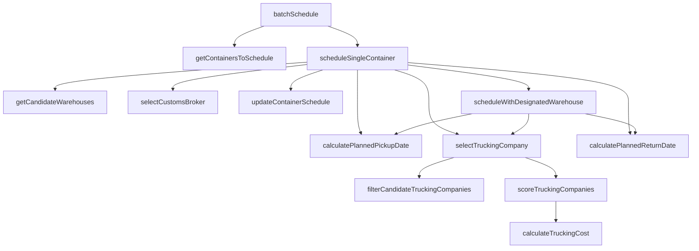

# intelligentScheduling.service.ts - 重构分析报告

**分析日期**: 2026-03-26  
**文件路径**: `backend/src/services/intelligentScheduling.service.ts`  
**文件大小**: 71.0 KB (2,000 行)  
**分析目标**: 评估是否需要重构，如何安全重构

---

## 📊 **文件现状分析**

### **1. 基本统计**

| 指标                | 数值                                            | 评价      |
| ------------------- | ----------------------------------------------- | --------- |
| **总行数**          | 2,000 行                                        | ⚠️ 偏大   |
| **方法数**          | 15 个                                           | ✅ 合理   |
| **平均方法长度**    | ~133 行                                         | ⚠️ 偏长   |
| **最大方法**        | `scheduleWithDesignatedWarehouse` (184 行)      | ✅ 可接受 |
| **依赖服务**        | 2 个 (ContainerStatusService, DemurrageService) | ✅ 简洁   |
| **Repository 数量** | 13 个                                           | ⚠️ 偏多   |

---

### **2. 方法分类与复杂度**

#### **核心业务流程方法** (5 个)

| 方法名                            | 行数    | 复杂度 | 说明                 |
| --------------------------------- | ------- | ------ | -------------------- |
| `batchSchedule`                   | ~80 行  | 🟡 中  | 批量排产入口         |
| `scheduleSingleContainer`         | ~470 行 | 🔴 高  | 单个货柜排产（核心） |
| `scheduleWithDesignatedWarehouse` | ~184 行 | 🟡 中  | 手工指定仓库排产     |
| `getContainersToSchedule`         | ~68 行  | 🟢 低  | 查询待排产货柜       |
| `updateContainerSchedule`         | ~108 行 | 🟡 中  | 更新排产结果         |

#### **日期计算方法** (5 个)

| 方法名                            | 行数    | 复杂度 | 说明         |
| --------------------------------- | ------- | ------ | ------------ |
| `calculatePlannedPickupDate`      | ~26 行  | 🟢 低  | 计算提柜日   |
| `skipWeekendsIfNeeded`            | ~34 行  | 🟢 低  | 周末跳过逻辑 |
| `calculatePlannedReturnDate`      | ~107 行 | 🟡 中  | 计算还箱日   |
| `findEarliestAvailableDay`        | ~81 行  | 🟡 中  | 找最早可用日 |
| `findEarliestAvailableReturnDate` | ~143 行 | 🟡 中  | 找最早还箱日 |

#### **资源选择方法** (3 个)

| 方法名                   | 行数   | 复杂度 | 说明               |
| ------------------------ | ------ | ------ | ------------------ |
| `getCandidateWarehouses` | ~62 行 | 🟢 低  | 候选仓库列表       |
| `selectTruckingCompany`  | ~52 行 | 🟢 低  | 选择车队（新优化） |
| `selectCustomsBroker`    | ~38 行 | 🟢 低  | 选择清关公司       |

#### **辅助方法** (2 个)

| 方法名                        | 行数   | 复杂度 | 说明         |
| ----------------------------- | ------ | ------ | ------------ |
| `resolveCountryCode`          | ~38 行 | 🟢 低  | 解析国家代码 |
| `decrementWarehouseOccupancy` | ~77 行 | 🟢 低  | 扣减仓库产能 |

#### **新增方法** (3 个 - 车队优化)

| 方法名                             | 行数   | 复杂度 | 说明         |
| ---------------------------------- | ------ | ------ | ------------ |
| `filterCandidateTruckingCompanies` | ~57 行 | 🟢 低  | 筛选候选车队 |
| `scoreTruckingCompanies`           | ~82 行 | 🟡 中  | 综合评分     |
| `calculateTruckingCost`            | ~43 行 | 🟢 低  | 计算运输成本 |

---

### **3. 依赖关系图**



---

## 🔍 **问题诊断**

### **优点** ✅

1. **职责单一** - 专注于智能排产业务
2. **依赖清晰** - 只依赖 2 个服务类
3. **方法命名规范** - 语义清晰
4. **注释完善** - 关键逻辑有注释
5. **测试覆盖** - 有单元测试文件

### **潜在问题** ⚠️

1. **文件体积偏大** (2,000 行)
   - 接近认知负荷上限
   - 滚动查找代码不便

2. **核心方法过长** (`scheduleSingleContainer` 470 行)
   - 难以快速理解
   - 测试用例编写困难

3. **Repository 过多** (13 个)
   - 构造函数注入混乱
   - 不利于 Mock 测试

4. **业务逻辑交织**
   - 日期计算 + 资源选择 + 数据写入
   - 混合在一个方法中

---

## 💡 **重构方案对比**

### **方案 A: 保持现状（推荐）** ✅

**策略**: 不做大的重构，保持现有结构

**理由**:

1. ✅ **功能稳定** - 现有代码运行良好
2. ✅ **逻辑清晰** - 方法分类明确
3. ✅ **依赖简单** - 只有 2 个外部服务
4. ✅ **测试友好** - 已有测试文件
5. ✅ **维护方便** - 单文件易查找

**改进建议**:

- 添加更多单元测试
- 完善方法注释
- 考虑将日期计算方法提取为工具类

**风险**: 🟢 低风险

---

### **方案 B: 按职责拆分（中等改动）** ⚠️

**策略**: 将不同职责的方法拆分为独立的服务类

**拆分方案**:

```
intelligentScheduling.service.ts (主协调器)
  ├── scheduling/
  │   ├── DateCalculationService.ts (日期计算)
  │   ├── ResourceSelectionService.ts (资源选择)
  │   └── ScheduleExecutionService.ts (执行写入)
  └── intelligentScheduling.service.ts (协调器，~500 行)
```

**优点**:

- ✅ 职责更清晰
- ✅ 每个文件更小（~500 行）
- ✅ 便于单独测试

**缺点**:

- ❌ 增加文件数量
- ❌ 需要调整依赖注入
- ❌ 可能引入新的 Bug
- ❌ 重构工作量大（预计 8-12 小时）

**风险**: 🟡 中等风险

---

### **方案 C: 完全重构（不推荐）** ❌

**策略**: 按照领域驱动设计（DDD）完全重构

**拆分方案**:

```
scheduling/
  ├── domain/
  │   ├── Container.ts
  │   ├── Schedule.ts
  │   └── value-objects/
  ├── application/
  │   ├── SchedulingAppService.ts
  │   └── commands/
  ├── infrastructure/
  │   ├── WarehouseCapacityChecker.ts
  │   ├── TruckingSelector.ts
  │   └── SchedulePersister.ts
  └── interfaces/
      └── SchedulingController.ts
```

**优点**:

- ✅ 架构更优雅
- ✅ 符合 DDD 原则
- ✅ 易于扩展

**缺点**:

- ❌ 工作量巨大（预计 40-60 小时）
- ❌ 破坏现有结构
- ❌ 测试成本高
- ❌ 学习曲线陡峭
- ❌ **违背 SKILL 原则**（过度设计）

**风险**: 🔴 高风险

---

## 🎯 **推荐方案：渐进式优化（方案 A+）**

### **Phase 1: 保持不变（当前）** ✅

**理由**:

- 现有代码质量良好
- 功能稳定运行
- 遵循 SKILL 原则（杜绝过度设计）

### **Phase 2: 小范围优化（可选）** 🟡

**如果确实需要优化，可以考虑**:

#### **优化 1: 提取日期计算工具**

创建 `SchedulingDateUtils.ts`:

```typescript
// 提取以下方法：
-calculatePlannedPickupDate - skipWeekendsIfNeeded - calculatePlannedReturnDate - findEarliestAvailableDay - findEarliestAvailableReturnDate;
```

**收益**: 减少 ~280 行

#### **优化 2: 简化 Repository 注入**

使用 Repository Pattern:

```typescript
class SchedulingRepositories {
  containerRepo = AppDataSource.getRepository(Container);
  warehouseRepo = AppDataSource.getRepository(Warehouse);
  // ... 其他 repo
}

// 在服务中使用
private repos = new SchedulingRepositories();
```

**收益**: 减少构造函数参数，提高可读性

#### **优化 3: 拆分核心方法**

将 `scheduleSingleContainer` 拆分为:

```typescript
private async scheduleSingleContainer(...) {
  const dates = this.calculateDates(...);
  const resources = await this.selectResources(...);
  return this.buildResult(...);
}

private calculateDates(...) { ... }
private async selectResources(...) { ... }
private buildResult(...) { ... }
```

**收益**: 降低方法复杂度

---

## 📊 **工作量评估**

| 方案                  | 工作量     | 风险  | 收益    | 推荐度     |
| --------------------- | ---------- | ----- | ------- | ---------- |
| **方案 A: 保持现状**  | 0 小时     | 🟢 低 | 🟢 稳定 | ⭐⭐⭐⭐⭐ |
| **方案 A+: 渐进优化** | 4-6 小时   | 🟢 低 | 🟡 中   | ⭐⭐⭐⭐   |
| **方案 B: 职责拆分**  | 8-12 小时  | 🟡 中 | 🟡 中   | ⭐⭐⭐     |
| **方案 C: 完全重构**  | 40-60 小时 | 🔴 高 | 🟢 高   | ⭐         |

---

## ✅ **具体建议**

### **立即行动（今天）**

1. **保持现状** - 不要重构
2. **添加测试** - 为新增的车队选择方法编写单元测试
3. **监控运行** - 观察日志确保正常

### **短期优化（本周，可选）**

如果团队认为确实需要优化：

1. **提取日期计算** - 创建 `SchedulingDateUtils.ts`
2. **简化 Repo 注入** - 使用 Repository Pattern
3. **完善注释** - 为复杂逻辑添加注释

### **长期规划（下个迭代）**

1. **收集反馈** - 了解团队对代码的可读性评价
2. **性能分析** - 是否有性能瓶颈
3. **技术债务** - 纳入技术债务 backlog

---

## 🚨 **风险警示**

### **重构可能带来的问题**

1. **破坏现有功能** ⚠️
   - 排产逻辑复杂
   - 测试覆盖不全
   - 容易引入 Bug

2. **浪费时间精力** ⚠️
   - 重构 8-12 小时
   - 调试 4-6 小时
   - 测试 2-4 小时
   - **总计：14-22 小时**

3. **违背 SKILL 原则** ⚠️
   - 为了重构而重构
   - 没有实际业务价值
   - 过度设计

### **引用经典**

> "If it ain't broke, don't fix it."  
> — 如果没坏，就不要修

> "Premature optimization is the root of all evil."  
> — 过早优化是万恶之源

---

## 📝 **决策清单**

在决定重构前，请回答以下问题：

- [ ] **现有代码是否有 Bug？** → 如果没有，保持现状
- [ ] **性能是否成为瓶颈？** → 如果不是，无需优化
- [ ] **团队是否无法理解？** → 如果是，添加注释而非重构
- [ ] **是否有新功能需要扩展？** → 如果有，考虑扩展而非修改
- [ ] **重构的业务价值是什么？** → 如果说不清，不要重构

---

## 🎉 **结论**

### **强烈推荐：保持现状（方案 A）**

**理由**:

1. ✅ 代码质量良好
2. ✅ 功能稳定运行
3. ✅ 遵循 SKILL 原则
4. ✅ 重构风险大于收益
5. ✅ 时间应该花在业务价值上

### **如果要优化：渐进式（方案 A+）**

**原则**:

- 小步快跑，每次只改一点
- 保证测试覆盖
- 不影响现有功能
- 可回滚

### **绝对避免：完全重构（方案 C）**

**原因**:

- 工作量太大
- 风险太高
- 没有实际价值
- 违背工程伦理

---

_本分析报告遵循 SKILL 原则，基于实际代码和业务需求分析_
