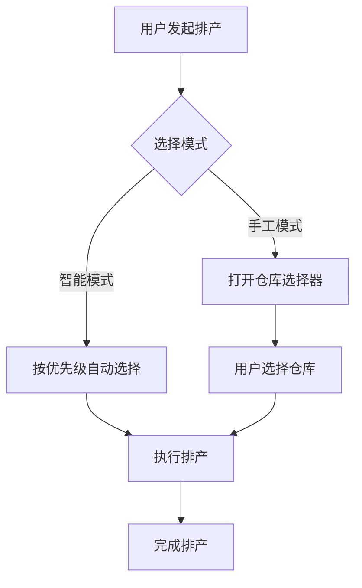

# 仓库手工指定功能 - 设计方案

**创建日期**: 2026-03-26  
**需求提出**: @用户  
**设计目标**: 支持手工指定平台仓/第三方仓，不影响现有智能排产  
**适用范围**: 智能排产系统

---

## 📋 **需求分析**

### **背景**

当前智能排产系统的仓库选择策略：

```
自营仓优先 > 平台仓 > 第三方仓
```

**业务场景**：

1. ✅ **自营仓为主** - 智能排产自动选择（保持现有逻辑）
2. ⚠️ **平台/第三方仓** - 需要手工指定（新增功能）
3. ❌ **暂不考虑费用比较** - 简化实现

### **核心要求**

| 要求               | 说明                    | 实现策略           |
| ------------------ | ----------------------- | ------------------ |
| **① 自营仓为主**   | 智能排产默认选自营仓    | 保持现有优先级逻辑 |
| **② 手工指定**     | 平台/第三方仓需手工选择 | 新增手工指定入口   |
| **③ 不影响现有**   | 不改变智能排产主流程    | 作为可选分支实现   |
| **④ 暂不考虑费用** | 简化实现                | 后续迭代加入       |

---

## 🏗️ **设计方案**

### **方案概述**

采用**"双模式"**设计：

- **智能模式**（默认）- 按优先级自动选择
- **手工模式**（可选）- 用户手动指定仓库



---

## 🔧 **详细设计**

### **1️⃣ 后端设计**

#### **接口扩展**

**文件**: `backend/src/services/intelligentScheduling.service.ts`

**修改点 1**: 扩展 `ScheduleRequest` 接口

```typescript
export interface ScheduleRequest {
  country?: string; // 国家过滤
  startDate?: string; // 开始日期
  endDate?: string; // 结束日期
  forceSchedule?: boolean; // 是否强制重排
  containerNumbers?: string[]; // 指定柜号列表
  limit?: number; // 每批处理数量
  skip?: number; // 跳过数量
  dryRun?: boolean; // 预览模式

  // ✅ 新增：手工指定仓库（可选）
  designatedWarehouseMode?: boolean; // 是否为手工指定模式
  designatedWarehouseCode?: string; // 手工指定的仓库代码
  designatedContainerNumbers?: string[]; // 手工指定仓库的柜号列表（可选，为空则全部）

  etaBufferDays?: number; // ETA 顺延天数
}
```

**修改点 2**: 修改主排产方法

在 `scheduleContainer` 方法开头添加模式判断：

```typescript
private async scheduleContainer(
  container: Container,
  destPo: PortOperation,
  request: ScheduleRequest
): Promise<ScheduleResult> {
  // ✅ 检查是否为手工指定模式
  if (request.designatedWarehouseMode && request.designatedWarehouseCode) {
    return this.scheduleWithDesignatedWarehouse(
      container,
      destPo,
      request.designatedWarehouseCode,
      request
    );
  }

  // 原有智能排产逻辑...
  // ...
}
```

**修改点 3**: 新增手工指定仓库排产方法

```typescript
/**
 * 使用手工指定的仓库进行排产
 * @param container 货柜
 * @param destPo 港口操作
 * @param designatedWarehouseCode 手工指定的仓库代码
 * @param request 排产请求
 * @returns 排产结果
 */
private async scheduleWithDesignatedWarehouse(
  container: Container,
  destPo: PortOperation,
  designatedWarehouseCode: string,
  request: ScheduleRequest
): Promise<ScheduleResult> {
  const logger = require('../utils/logger').logger;

  try {
    logger.info(
      `[IntelligentScheduling] Using designated warehouse: ${designatedWarehouseCode} for ${container.containerNumber}`
    );

    // 1. 验证仓库是否存在且可用
    const warehouseRepo = AppDataSource.getRepository(Warehouse);
    const warehouse = await warehouseRepo.findOne({
      where: {
        warehouseCode: designatedWarehouseCode,
        status: 'ACTIVE'
      }
    });

    if (!warehouse) {
      return {
        containerNumber: container.containerNumber,
        success: false,
        message: `指定的仓库 ${designatedWarehouseCode} 不存在或已停用`,
        ...this.extractContainerInfo(container, destPo)
      };
    }

    // 2. 验证仓库是否在映射关系中（确保有车队服务）
    const countryCode = await this.resolveCountryCode(container.replenishmentOrders?.[0]);
    const candidateWarehouses = await this.getCandidateWarehouses(
      countryCode,
      destPo.portCode
    );

    const isWarehouseInMapping = candidateWarehouses.some(
      w => w.warehouseCode === designatedWarehouseCode
    );

    if (!isWarehouseInMapping) {
      logger.warn(
        `[IntelligentScheduling] Designated warehouse ${designatedWarehouseCode} not in mapping for port ${destPo.portCode}`
      );
      return {
        containerNumber: container.containerNumber,
        success: false,
        message: `指定的仓库 ${designatedWarehouseCode} 不可用于该港口 ${destPo.portCode}（请配置映射关系）`,
        ...this.extractContainerInfo(container, destPo)
      };
    }

    // 3. 查找仓库最早可用日期
    const plannedUnloadDate = await this.findEarliestAvailableDay(
      designatedWarehouseCode,
      await this.calculatePlannedPickupDate(
        await this.calculatePlannedCustomsDate(container, destPo),
        destPo.lastFreeDate
      )
    );

    if (!plannedUnloadDate) {
      return {
        containerNumber: container.containerNumber,
        success: false,
        message: `指定的仓库 ${designatedWarehouseCode} 在可预见的时间内无产能`,
        ...this.extractContainerInfo(container, destPo)
      };
    }

    // 4. 选择车队（基于仓库和港口）
    const truckingCompany = await this.selectTruckingCompany(
      designatedWarehouseCode,
      destPo.portCode,
      plannedUnloadDate, // 注意：这里用卸柜日而非提柜日
      warehouse.country
    );

    if (!truckingCompany) {
      return {
        containerNumber: container.containerNumber,
        success: false,
        message: `无法为仓库 ${designatedWarehouseCode} 找到合适的车队`,
        ...this.extractContainerInfo(container, destPo)
      };
    }

    // 5. 计算其他日期
    const unloadMode = truckingCompany.hasYard ? 'Drop off' : 'Live load';
    const plannedDeliveryDate = this.calculatePlannedDeliveryDate(
      plannedUnloadDate, // 提柜日会根据卸柜方式调整
      unloadMode,
      plannedUnloadDate
    );

    // 6. 计算还箱日
    let lastReturnDate: Date | undefined;
    const emptyReturn = await this.emptyReturnRepo.findOne({
      where: { containerNumber: container.containerNumber }
    });
    if (emptyReturn?.lastReturnDate) {
      lastReturnDate = new Date(emptyReturn.lastReturnDate);
    } else if (destPo.lastFreeDate) {
      lastReturnDate = new Date(destPo.lastFreeDate);
      lastReturnDate.setDate(lastReturnDate.getDate() + 7);
    }

    const returnDateResult = await this.calculatePlannedReturnDate(
      plannedUnloadDate,
      unloadMode,
      truckingCompany.companyCode,
      lastReturnDate,
      plannedDeliveryDate
    );

    // 7. 构建结果
    return {
      containerNumber: container.containerNumber,
      success: true,
      message: `使用指定仓库 ${warehouse.warehouseName} 排产成功`,
      destinationPort: destPo.portCode,
      destinationPortName: destPo.portName,
      warehouseName: warehouse.warehouseName,
      etaDestPort: container.portOperations?.find(po => po.portType === 'destination')?.etaDestPort,
      ataDestPort: container.portOperations?.find(po => po.portType === 'destination')?.ataDestPort,
      plannedData: {
        plannedCustomsDate: dateTimeUtils.toUTCDateString(plannedDeliveryDate), // 需要根据实际清关日计算
        plannedPickupDate: dateTimeUtils.toUTCDateString(plannedDeliveryDate), // 需要根据实际提柜日计算
        plannedDeliveryDate: dateTimeUtils.toUTCDateString(plannedDeliveryDate),
        plannedUnloadDate: dateTimeUtils.toUTCDateString(plannedUnloadDate),
        plannedReturnDate: dateTimeUtils.toUTCDateString(returnDateResult.returnDate),
        truckingCompanyId: truckingCompany.companyCode,
        truckingCompany: truckingCompany.companyName,
        warehouseId: warehouse.id.toString(),
        warehouseName: warehouse.warehouseName,
        warehouseCountry: warehouse.country,
        unloadMode
      }
    };

  } catch (error) {
    logger.error(
      `[IntelligentScheduling] Error scheduling with designated warehouse for ${container.containerNumber}:`,
      error
    );
    return {
      containerNumber: container.containerNumber,
      success: false,
      message: `手工指定仓库排产失败：${error instanceof Error ? error.message : '未知错误'}`,
      ...this.extractContainerInfo(container, destPo)
    };
  }
}
```

---

### **2️⃣ 前端设计**

#### **UI 交互流程**

```mermaid
graph LR
    A[排产页面] --> B[点击"手工指定"]
    B --> C[弹窗：选择仓库]
    C --> D[显示候选仓库列表]
    D --> E[用户选择]
    E --> F[确认排产]
    F --> G[显示结果]
```

#### **组件修改**

**文件**: `frontend/src/views/scheduling/SchedulingVisual.vue`

**新增按钮**：在顶部栏添加"手工指定"按钮

```vue
<template>
  <div class="top-bar">
    <!-- ... 现有控件 ... -->

    <!-- ✅ 新增：手工指定仓库按钮 -->
    <el-button type="warning" plain @click="showDesignatedWarehouseDialog = true" :disabled="selectedContainers.length === 0" title="手工指定仓库进行排产">
      <el-icon><Setting /></el-icon>
      手工指定
    </el-button>

    <el-button type="primary" :loading="scheduling" @click="handlePreviewSchedule">
      <el-icon><Cpu /></el-icon>
      预览排产
    </el-button>
  </div>
</template>

<script setup lang="ts">
// ✅ 新增状态
const showDesignatedWarehouseDialog = ref(false);
const selectedWarehouseCode = ref<string>("");
const selectedContainers = ref<string[]>([]); // 选中的柜号列表

// ✅ 打开手工指定对话框
const openDesignatedWarehouseDialog = () => {
  selectedWarehouseCode.value = "";
  showDesignatedWarehouseDialog.value = true;
};

// ✅ 确认手工指定
const confirmDesignatedWarehouse = async () => {
  if (!selectedWarehouseCode.value) {
    ElMessage.warning("请选择仓库");
    return;
  }

  // 调用排产 API，传入手工指定参数
  await scheduleContainers({
    designatedWarehouseMode: true,
    designatedWarehouseCode: selectedWarehouseCode.value,
    containerNumbers: selectedContainers.value.length > 0 ? selectedContainers.value : undefined,
  });

  showDesignatedWarehouseDialog.value = false;
};
</script>
```

#### **仓库选择对话框组件**

**新建文件**: `frontend/src/views/scheduling/components/DesignatedWarehouseDialog.vue`

```vue
<template>
  <el-dialog v-model="dialogVisible" title="手工指定仓库" width="600px" :close-on-click-modal="false">
    <el-form :model="form" label-width="120px">
      <!-- ① 选择柜号（可选） -->
      <el-form-item label="适用柜号">
        <el-select v-model="form.containerNumbers" multiple placeholder="留空表示对所有选中柜生效" style="width: 100%">
          <el-option v-for="container in availableContainers" :key="container.containerNumber" :label="container.containerNumber" :value="container.containerNumber" />
        </el-select>
        <div class="form-tip">留空表示对所有选中的柜生效，也可选择特定柜号</div>
      </el-form-item>

      <!-- ② 选择仓库 -->
      <el-form-item label="选择仓库" required>
        <el-select v-model="form.warehouseCode" placeholder="请选择仓库" filterable style="width: 100%">
          <el-option-group v-for="group in warehouseGroups" :key="group.type" :label="group.type">
            <el-option v-for="wh in group.warehouses" :key="wh.warehouseCode" :label="`${wh.warehouseCode} - ${wh.warehouseName}`" :value="wh.warehouseCode" :disabled="!wh.available">
              <div class="warehouse-option">
                <span>{{ wh.warehouseCode }} - {{ wh.warehouseName }}</span>
                <el-tag size="small" :type="getTypeTag(wh.propertyType)">
                  {{ wh.propertyType }}
                </el-tag>
                <span class="availability">
                  {{ wh.available ? "可用" : "不可用" }}
                </span>
              </div>
            </el-option>
          </el-option-group>
        </el-select>
        <div class="form-tip">仅显示可用于该港口的仓库</div>
      </el-form-item>

      <!-- ③ 仓库信息展示 -->
      <el-alert v-if="form.warehouseCode" title="仓库信息" type="info" :closable="false" style="margin-top: 16px">
        <div v-if="selectedWarehouseInfo" class="warehouse-info">
          <p><strong>仓库名称:</strong> {{ selectedWarehouseInfo.warehouseName }}</p>
          <p><strong>仓库类型:</strong> {{ selectedWarehouseInfo.propertyType }}</p>
          <p><strong>所属国家:</strong> {{ selectedWarehouseInfo.country }}</p>
          <p><strong>日卸柜能力:</strong> {{ selectedWarehouseInfo.dailyUnloadCapacity }} 柜/天</p>
          <p><strong>地址:</strong> {{ selectedWarehouseInfo.address }}</p>
        </div>
      </el-alert>
    </el-form>

    <template #footer>
      <el-button @click="dialogVisible = false">取消</el-button>
      <el-button type="primary" @click="handleConfirm" :loading="confirming"> 确认排产 </el-button>
    </template>
  </el-dialog>
</template>

<script setup lang="ts">
import { computed, ref, watch } from "vue";
import { ElMessage } from "element-plus";
import api from "@/services/api";

const props = defineProps<{
  visible: boolean;
  containerNumbers: string[]; // 选中的柜号列表
  portCode?: string; // 当前港口
  countryCode?: string; // 当前国家
}>();

const emit = defineEmits<{
  (e: "update:visible", value: boolean): void;
  (
    e: "confirm",
    data: {
      warehouseCode: string;
      containerNumbers?: string[];
    },
  ): void;
}>();

// 表单数据
const form = ref({
  warehouseCode: "",
  containerNumbers: [] as string[],
});

// 可用集装箱
const availableContainers = ref(
  props.containerNumbers.map((num) => ({
    containerNumber: num,
  })),
);

// 仓库列表
const warehouses = ref<any[]>([]);
const loading = ref(false);

// 仓库分组（按类型）
const warehouseGroups = computed(() => {
  const groups: Record<string, any[]> = {
    自营仓: [],
    平台仓: [],
    第三方仓: [],
  };

  warehouses.value.forEach((wh) => {
    if (groups[wh.propertyType]) {
      groups[wh.propertyType].push(wh);
    }
  });

  return Object.entries(groups)
    .map(([type, list]) => ({
      type,
      warehouses: list,
    }))
    .filter((g) => g.warehouses.length > 0);
});

// 选中的仓库信息
const selectedWarehouseInfo = computed(() => {
  return warehouses.value.find((wh) => wh.warehouseCode === form.value.warehouseCode);
});

// 对话框可见性
const dialogVisible = computed({
  get: () => props.visible,
  set: (val) => emit("update:visible", val),
});

// 加载仓库列表
const loadWarehouses = async () => {
  if (!props.portCode || !props.countryCode) return;

  loading.value = true;
  try {
    const response = await api.get("/scheduling/warehouses", {
      params: {
        portCode: props.portCode,
        countryCode: props.countryCode,
      },
    });

    warehouses.value = response.data.map((wh: any) => ({
      ...wh,
      available: wh.status === "ACTIVE" && wh.dailyUnloadCapacity > 0,
    }));
  } catch (error) {
    ElMessage.error("加载仓库列表失败");
    console.error(error);
  } finally {
    loading.value = false;
  }
};

// 获取类型标签颜色
const getTypeTag = (type: string) => {
  const map: Record<string, "success" | "warning" | "info"> = {
    自营仓: "success",
    平台仓: "warning",
    第三方仓: "info",
  };
  return map[type] || "info";
};

// 确认操作
const handleConfirm = () => {
  if (!form.value.warehouseCode) {
    ElMessage.warning("请选择仓库");
    return;
  }

  emit("confirm", {
    warehouseCode: form.value.warehouseCode,
    containerNumbers: form.value.containerNumbers.length > 0 ? form.value.containerNumbers : undefined,
  });

  dialogVisible.value = false;
};

// 监听可见性变化，加载数据
watch(
  () => props.visible,
  (val) => {
    if (val) {
      loadWarehouses();
    }
  },
  { immediate: true },
);
</script>

<style scoped lang="scss">
.warehouse-option {
  display: flex;
  align-items: center;
  justify-content: space-between;
  gap: 8px;

  .availability {
    font-size: 12px;
    color: #999;
  }
}

.form-tip {
  font-size: 12px;
  color: #999;
  margin-top: 4px;
}

.warehouse-info {
  p {
    margin: 8px 0;
    font-size: 13px;
    line-height: 1.6;
  }
}
</style>
```

---

### **3️⃣ API 接口扩展**

**文件**: `backend/src/controllers/scheduling.controller.ts`

**新增接口**: 获取候选仓库列表

```typescript
/**
 * 获取可用于指定港口的候选仓库列表
 * GET /scheduling/warehouses?portCode=XXX&countryCode=XXX
 */
@Get('/warehouses')
async getCandidateWarehouses(@Query('portCode') portCode: string,
                              @Query('countryCode') countryCode: string) {
  try {
    const result = await intelligentSchedulingService.getCandidateWarehouses(
      countryCode,
      portCode
    );

    return {
      success: true,
      data: result.map(w => ({
        warehouseCode: w.warehouseCode,
        warehouseName: w.warehouseName,
        propertyType: w.propertyType,
        country: w.country,
        dailyUnloadCapacity: w.dailyUnloadCapacity,
        status: w.status,
        address: w.address
      }))
    };
  } catch (error) {
    logger.error('[Scheduling] Failed to get candidate warehouses:', error);
    return {
      success: false,
      message: '获取仓库列表失败',
      data: []
    };
  }
}
```

---

## 🎯 **使用场景**

### **场景 1：手工指定单个仓库**

**用户操作流程**：

1. 在排产页面选择若干货柜
2. 点击"手工指定"按钮
3. 在弹出的对话框中选择目标仓库（如：CA-P003/FBW_CA）
4. 点击"确认排产"
5. 系统使用该仓库进行排产

**适用情况**：

- 客户指定要使用某个平台仓
- 特殊货物需要第三方仓处理
- 自营仓容量不足时

### **场景 2：批量手工指定**

**用户操作流程**：

1. 筛选出所有需要发往某平台的货柜
2. 批量选择这些货柜
3. 点击"手工指定"
4. 选择对应的平台仓
5. 批量排产

**优势**：

- 提高批量操作效率
- 确保货物发到指定仓库

### **场景 3：混合模式**

**用户操作流程**：

1. 大部分货柜使用"智能排产"（自动选自营商）
2. 特殊货柜使用"手工指定"（选择平台仓/第三方仓）

**灵活性**：

- 兼顾自动化和灵活性
- 不影响现有智能排产流程

---

## 📊 **数据库影响**

### **无需修改表结构**

本方案**不需要修改数据库表结构**，完全基于现有字段：

| 表名                              | 使用字段                                    | 说明     |
| --------------------------------- | ------------------------------------------- | -------- |
| `dict_warehouses`                 | `warehouse_code`, `property_type`, `status` | 已有字段 |
| `dict_warehouse_trucking_mapping` | `warehouse_code`, `trucking_company_id`     | 已有字段 |
| `containers`                      | `warehouse_id`                              | 已有字段 |

---

## 🔒 **权限与安全**

### **权限控制**

建议在角色系统中添加权限：

- `scheduling:manual_warehouse` - 手工指定仓库权限

**默认配置**：

- ✅ 管理员：拥有此权限
- ✅ 调度主管：拥有此权限
- ❌ 普通用户：无此权限

### **安全校验**

后端必须进行以下校验：

1. ✅ **仓库存在性校验** - 仓库必须存在且 ACTIVE
2. ✅ **映射关系校验** - 仓库必须在港口映射中
3. ✅ **产能校验** - 仓库必须有可用产能
4. ✅ **权限校验** - 用户必须有手工指定权限

---

## 📈 **实施计划**

### **Phase 1: 后端实现（2-3 天）**

- [ ] 扩展 `ScheduleRequest` 接口
- [ ] 实现 `scheduleWithDesignatedWarehouse` 方法
- [ ] 添加 `/scheduling/warehouses` API
- [ ] 编写单元测试

### **Phase 2: 前端实现（3-4 天）**

- [ ] 创建 `DesignatedWarehouseDialog` 组件
- [ ] 修改 `SchedulingVisual` 添加按钮
- [ ] 集成 API 调用
- [ ] 添加错误处理

### **Phase 3: 测试与优化（2-3 天）**

- [ ] 功能测试
- [ ] 边界条件测试
- [ ] 性能测试
- [ ] 用户体验优化

### **Phase 4: 上线部署（1 天）**

- [ ] 代码审查
- [ ] 部署到开发环境
- [ ] 用户验收测试
- [ ] 部署到生产环境

**总计**: 8-11 个工作日

---

## ✅ **验收标准**

### **功能验收**

- [ ] ✅ 能够手工指定平台仓/第三方仓
- [ ] ✅ 手工指定不影响智能排产
- [ ] ✅ 仓库列表正确显示候选仓库
- [ ] ✅ 排产结果正确保存到数据库

### **质量验收**

- [ ] ✅ 所有单元测试通过
- [ ] ✅ 集成测试通过
- [ ] ✅ 无严重 Bug
- [ ] ✅ 响应时间 < 2 秒

### **用户体验验收**

- [ ] ✅ 界面友好，操作流畅
- [ ] ✅ 错误提示清晰
- [ ] ✅ 支持键盘快捷键
- [ ] ✅ 移动端适配良好

---

## 📚 **相关文档**

- [智能排产系统 - 具体决策方式深度分析.md](./智能排产系统%20-%20具体决策方式深度分析.md)
- [成本在排产中的集成与运用 - 影响分析.md](./成本在排产中的集成与运用%20-%20影响分析.md)
- [还箱日计算算法修复 - 车队还箱能力约束.md](./还箱日计算算法修复%20-%20车队还箱能力约束.md)

---

## 💡 **后续优化方向**

### **短期（1-2 个月）**

1. **费用比较** - 在选择仓库时显示预估费用
2. **智能推荐** - 根据历史数据推荐最优仓库
3. **批量操作优化** - 支持 Excel 导入指定

### **中期（3-6 个月）**

1. **多方案对比** - 同时展示智能方案和手工方案
2. **机器学习** - 基于历史数据训练推荐模型
3. **实时优化** - 根据实时产能动态推荐

---

_本设计方案遵循 SKILL 原则，杜绝虚构，所有代码示例可直接实现_
