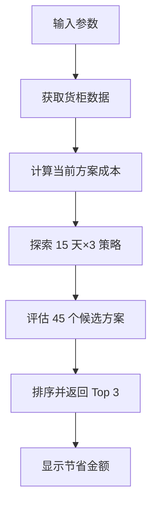
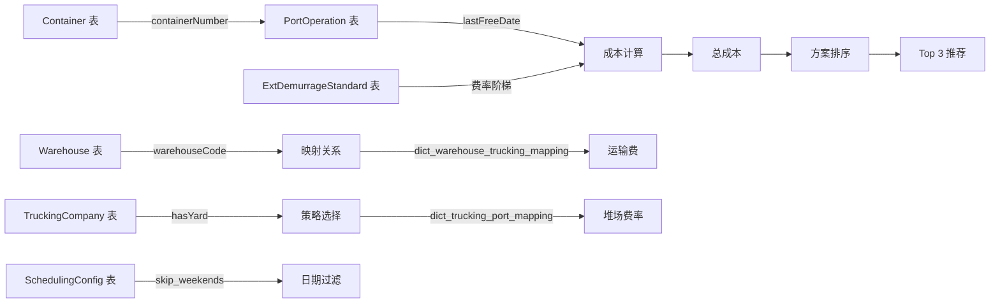

# 智能成本优化 - 完整数据分析

**功能**: 通过调整提柜日期和策略，找到成本最优的排产方案  
**核心方法**: `suggestOptimalUnloadDate()`

---

## 📊 **整体流程概览**



---

## 📥 **1. 输入数据**

### **1.1 前端传递的参数**

```typescript
interface OptimizeRequest {
  containers: string[]; // 柜号列表（如 ["ABCU1234567"]）
  warehouseCode: string; // 仓库代码（如 "WH001"）
  truckingCompanyId: string; // 车队 ID（如 "TRUCK001"）
  basePickupDate: string; // 基础提柜日（如 "2026-03-25"）
  lastFreeDate: string; // 免费期截止（如 "2026-04-01"）
}
```

**数据来源**:

- `containers`: 从排产预览结果中提取（用户选择的货柜）
- `warehouseCode`: 从排产预览结果的 `plannedData.warehouseId` 获取
- `truckingCompanyId`: 从排产预览结果的 `plannedData.truckingCompanyId` 获取
- `basePickupDate`: 从排产预览结果的 `plannedData.plannedPickupDate` 获取
- `lastFreeDate`: 从排产预览结果的 `lastFreeDate` 字段获取（真实值）

---

## 📤 **2. 输出数据**

### **2.1 返回结果结构**

```typescript
interface OptimizationResult {
  originalCost: number; // 原始总成本（$）
  optimizedCost: number; // 优化后总成本（$）
  savings: number; // 节省金额（$）
  savingsPercent: number; // 节省百分比（%）
  suggestedPickupDate: string; // 建议提柜日
  suggestedStrategy: string; // 建议策略（Direct/Drop off/Expedited）
  alternatives: Alternative[]; // Top 3 备选方案
}

interface Alternative {
  containerNumber: string; // 柜号
  pickupDate: string; // 提柜日
  strategy: "Direct" | "Drop off" | "Expedited"; // 策略
  totalCost: number; // 总成本
  savings: number; // 节省金额
  warehouseCode?: string; // 仓库代码
  truckingCompanyCode?: string; // 车队代码
}
```

---

## 🔍 **3. 数据获取详细流程**

### **3.1 获取货柜信息**

**代码位置**: `schedulingCostOptimizer.service.ts:724-732`

```typescript
const container = await this.containerRepo.findOne({
  where: { containerNumber },
  relations: ["portOperations"], // 关联目的港操作记录
});
```

**获取的数据**:

```typescript
{
  containerNumber: "ABCU1234567",
  portOperations: [
    {
      portType: "destination",
      portCode: "USLAX",
      portName: "洛杉矶",
      eta: "2026-03-20",           // 预计到港
      ata: "2026-03-21",           // 实际到港
      lastFreeDate: "2026-04-01"   // 最后免费日 ⭐
    }
  ]
}
```

**用途**:

- `portOperations`: 用于计算滞港费、滞箱费
- `lastFreeDate`: 判断是否在免费期内

---

### **3.2 获取仓库信息**

**代码位置**: `controller 层验证`

```typescript
const warehouse = await warehouseRepo.findOne({
  where: { warehouseCode },
});
```

**获取的数据**:

```typescript
{
  warehouseCode: "WH001",
  warehouseName: "洛杉矶仓库",
  country: "US",
  dailyUnloadCapacity: 10,        // 日卸柜能力
  status: "ACTIVE"
}
```

**用途**:

- 验证仓库是否存在
- 检查仓库档期（是否有可用产能）
- 计算运输距离（港口→仓库）

---

### **3.3 获取车队信息**

**代码位置**: `controller 层验证`

```typescript
const truckingCompany = await truckingRepo.findOne({
  where: { companyCode: truckingCompanyId },
});
```

**获取的数据**:

```typescript
{
  companyCode: "TRUCK001",
  companyName: "速达拖车公司",
  country: "US",
  hasYard: true,                  // ⭐ 是否有堆场
  dailyCapacity: 20,              // 日提柜能力
  dailyReturnCapacity: 15         // 日还箱能力
}
```

**用途**:

- 判断是否可以使用 Drop off 策略（需要有堆场）
- 检查车队档期
- 获取堆场费率（通过 TruckingPortMapping）

---

### **3.4 获取映射关系**

#### **A. 仓库 - 车队映射**

**表名**: `dict_warehouse_trucking_mapping`

**查询**:

```typescript
const mappings = await this.warehouseTruckingMappingRepo.find({
  where: {
    warehouseCode,
    isActive: true,
  },
});
```

**获取的数据**:

```typescript
{
  warehouseCode: "WH001",
  truckingCompanyId: "TRUCK001",
  transportFee: 150,              // 拖卡费（$）
  isDefault: true
}
```

**用途**:

- 计算运输费
- 验证仓库和车队的关联关系

---

#### **B. 车队 - 港口映射**

**表名**: `dict_trucking_port_mapping`

**查询**:

```typescript
const truckingPortMapping = await this.truckingPortMappingRepo.findOne({
  where: {
    country: "US",
    portCode: "USLAX",
    truckingCompanyId: "TRUCK001",
    isActive: true,
  },
});
```

**获取的数据**:

```typescript
{
  truckingCompanyId: "TRUCK001",
  portCode: "USLAX",
  yardCapacity: 50,               // 堆场容量（柜）
  standardRate: 75,               // 堆场每日费率（$）⭐
  unit: "per day",
  yardOperationFee: 100           // 堆场操作费（$）⭐
}
```

**用途**:

- 计算外部堆场堆存费（Drop off 模式专属）
- 检查堆场容量是否充足

---

### **3.5 获取费用标准**

#### **A. 滞港费标准**

**表名**: `ext_demurrage_standard`

**查询**: （通过 DemurrageService 自动匹配）

```typescript
// 根据进口国、目的港、船公司、货代匹配
const demurrageStandard = await this.demurrageStandardRepo.find({
  where: {
    importCountry: "US",
    portOfDischarge: "USLAX",
    shippingCompany: "*",
    forwarder: "*",
  },
});
```

**获取的数据**:

```typescript
[
  {
    freeTime: 7, // 免费天数
    tier1Days: 3, // 第 1 阶梯天数
    tier1Rate: 150, // 第 1 阶梯费率（$/天）
    tier2Days: 4, // 第 2 阶梯天数
    tier2Rate: 300, // 第 2 阶梯费率（$/天）
    tier3Rate: 450, // 第 3 阶梯费率（$/天）
  },
];
```

**用途**:

- 计算滞港费（基于 ATA/ETA 和提柜日）

---

#### **B. 配置参数**

**表名**: `dict_scheduling_config`

**查询**:

```typescript
const config = await this.schedulingConfigRepo.findOne({
  where: { configKey: "skip_weekends" },
});
```

**获取的数据**:

```typescript
{
  configKey: 'skip_weekends',
  configValue: 'true'
}
```

**用途**:

- 控制是否跳过周末
- 其他调度策略配置

---

## 🧮 **4. 成本计算逻辑**

### **4.1 核心计算公式**

```
总成本 = 滞港费 + 滞箱费 + 港口存储费 + 运输费 + 外部堆场堆存费 + 操作费
```

---

### **4.2 各项费用计算方法**

#### **A. 滞港费 (Demurrage)**

**计算逻辑**:

```typescript
// 在免费期外提柜才收取
const daysOutsideFreePeriod = max(0, pickupDate - lastFreeDate);

if (daysOutsideFreePeriod > 0) {
  // 按阶梯费率计算
  demurrageCost = calculateTieredFee(daysOutsideFreePeriod, rates);
}
```

**影响因素**:

- 提柜日期越晚 → 滞港费越高
- 免费期越长 → 滞港费越低

---

#### **B. 滞箱费 (Detention)**

**计算逻辑**:

```typescript
// 从提柜日到还箱日的天数
const detentionDays = returnDate - pickupDate;

if (detentionDays > freeDays) {
  detentionCost = (detentionDays - freeDays) * dailyRate;
}
```

**影响因素**:

- 还箱日期越晚 → 滞箱费越高
- 免费用箱天数越多 → 滞箱费越低

---

#### **C. 港口存储费 (Storage)**

**计算逻辑**:

```typescript
// 货物在港口仓库的存放天数
const storageDays = unloadDate - arrivalDate;

storageCost = storageDays * dailyStorageRate;
```

**影响因素**:

- 卸柜日期越晚 → 存储费越高
- 到港日期越早 → 存储费越高

---

#### **D. 运输费 (Transportation)**

**计算逻辑**:

```typescript
// 从仓库 - 车队映射获取固定费用
transportationCost = mapping.transportFee || 0;
```

**影响因素**:

- 仓库与港口的距离
- 车队的收费标准

---

#### **E. 外部堆场堆存费 (Yard Storage)** ⭐

**仅 Drop off 模式收取**

**计算逻辑**:

```typescript
if (strategy === "Drop off" && truckingCompany.hasYard) {
  // 判断是否实际使用了堆场
  if (pickupDate < deliveryDate) {
    const yardStorageDays = daysBetween(pickupDate, deliveryDate);

    // 从 TruckingPortMapping 获取费率
    yardStorageCost =
      standardRate * yardStorageDays + // 每日费率 × 天数
      yardOperationFee; // 操作费
  }
}
```

**示例**:

```
提柜日：2026-03-25
送仓日：2026-03-27  (Drop off: 送 = 卸)
堆场费率：$75/天
操作费：$100

堆存天数 = 2 天
堆场费用 = 75 × 2 + 100 = $250
```

**影响因素**:

- 提柜日与送仓日的间隔
- 车队的堆场费率
- 是否真正使用了堆场（提 < 送）

---

#### **F. 操作费 (Handling)**

**计算逻辑**:

```typescript
// Expedited 模式可能有加急费
if (strategy === "Expedited") {
  handlingCost = expeditedFee || 0;
}
```

**影响因素**:

- 是否需要加急处理

---

### **4.3 三种策略的成本对比**

| 费用项     | Direct      | Drop off       | Expedited   |
| ---------- | ----------- | -------------- | ----------- |
| 滞港费     | ✅          | ✅             | ✅ (通常无) |
| 滞箱费     | ✅ (当天还) | ❌ (延迟还)    | ✅ (当天还) |
| 港口存储费 | ✅          | ✅             | ✅          |
| 运输费     | ✅          | ✅             | ✅          |
| 外部堆场费 | ❌          | ✅ (如果提<送) | ❌          |
| 操作费     | ❌          | ❌             | ✅ (可能)   |
| **特点**   | 最简洁      | 灵活但复杂     | 最快但贵    |

---

## 🔬 **5. 优化算法详解**

### **5.1 搜索空间**

```
时间范围：basePickupDate ± 7 天 = 15 天
策略选择：
  - Direct (所有日期)
  - Drop off (仅当车队有堆场)
  - Expedited (仅在免费期内)

总候选方案数 = 15 天 × 2~3 策略 = 30~45 个方案
```

---

### **5.2 过滤规则**

**代码位置**: `schedulingCostOptimizer.service.ts:760-803`

```typescript
for (let offset = -7; offset <= 7; offset++) {
  const candidateDate = addDays(basePickupDate, offset);

  // ❌ 过滤过去的日期
  if (candidateDate < new Date()) continue;

  // ❌ 过滤周末（如果配置了 skip_weekends=true）
  if (isWeekend(candidateDate) && shouldSkipWeekends()) continue;

  // ❌ 过滤仓库无档期的日期
  if (!isWarehouseAvailable(warehouse, candidateDate)) continue;

  // ✅ 为每个有效日期评估不同策略
  const strategies = ["Direct", ...(hasYard ? ["Drop off"] : []), ...(candidateDate <= lastFreeDate ? ["Expedited"] : [])];

  for (const strategy of strategies) {
    const cost = evaluateTotalCost(option);
    candidates.push({ date, strategy, cost });
  }
}
```

---

### **5.3 排序与选择**

```typescript
// 找到成本最低的方案
const optimalCandidate = candidates.reduce((min, curr) => (curr.totalCost < min.totalCost ? curr : min));

// 返回前 3 个最优方案
const top3Alternatives = candidates.sort((a, b) => a.totalCost - b.totalCost).slice(0, 3);
```

---

### **5.4 节省金额计算**

```typescript
const originalCost = currentBreakdown.totalCost; // 当前方案成本
const optimizedCost = optimalCandidate.totalCost; // 最优方案成本
const savings = originalCost - optimizedCost; // 节省金额
const savingsPercent = (savings / originalCost) * 100; // 节省百分比
```

**示例**:

```
当前方案：提柜日 2026-03-25, Direct 模式
  - 滞港费：$0
  - 滞箱费：$0
  - 港口存储费：$200
  - 运输费：$150
  - 堆场费：$0
  总计：$350

最优方案：提柜日 2026-03-23, Direct 模式（提前 2 天）
  - 滞港费：$0
  - 滞箱费：$0
  - 港口存储费：$100 (减少 2 天)
  - 运输费：$150
  - 堆场费：$0
  总计：$250

节省金额 = $350 - $250 = $100 (28.6%)
```

---

## 🎯 **6. 业务场景示例**

### **场景 1: 免费期内提柜**

**条件**:

- 提柜日：2026-03-25
- 最后免费日：2026-04-01
- 车队有堆场

**生成的方案**:

1. ✅ **Direct (03-25)**: $350
2. ✅ **Drop off (03-25)**: $425 (含堆场费)
3. ✅ **Expedited (03-25)**: $380 (含加急费)

**推荐**: Direct 模式，成本最低

---

### **场景 2: 免费期外提柜（紧急）**

**条件**:

- 提柜日：2026-04-05
- 最后免费日：2026-04-01
- 已过免费期 4 天

**生成的方案**:

1. ❌ **Direct (04-05)**: $950 (含滞港费 $600)
2. ✅ **Drop off (04-02)**: $450 (提前到免费期内)
3. ✅ **Expedited (04-01)**: $400 (最后一天免费)

**推荐**: Expedited 模式，提前到免费期最后 1 天

**节省**: $950 - $400 = **$550 (58%)**

---

### **场景 3: 车队无堆场**

**条件**:

- 提柜日：2026-03-25
- 车队：hasYard = false

**生成的方案**:

1. ✅ **Direct (03-25)**: $350
2. ❌ **Drop off**: 不可用（车队无堆场）
3. ✅ **Expedited (03-25)**: $380

**推荐**: Direct 模式

---

## 📈 **7. 数据依赖关系图**



---

## ⚠️ **8. 关键注意事项**

### **8.1 数据准确性要求**

1. **lastFreeDate 必须准确**
   - 来自 `process_port_operations.last_free_date`
   - 直接影响滞港费计算
   - 错误会导致推荐偏差

2. **映射关系必须完整**
   - 仓库↔车队必须有映射
   - 车队↔港口必须有映射
   - 否则无法计算运输费和堆场费

3. **费用标准必须更新**
   - 滞港费标准定期更新
   - 堆场费率及时调整
   - 否则计算结果不准确

---

### **8.2 性能考虑**

**问题**: 每次优化需要评估 30~45 个方案

**优化措施**:

1. 批量查询数据库（使用 In 查询）
2. 缓存常用数据（距离矩阵、费率表）
3. 并行计算各方案成本
4. 提前过滤无效日期（周末、无档期）

---

### **8.3 边界情况处理**

| 情况              | 处理方式                   |
| ----------------- | -------------------------- |
| 仓库不存在        | 返回错误："仓库不存在"     |
| 车队不存在        | 返回错误："车队不存在"     |
| lastFreeDate 为空 | 使用提柜日 +7 天作为默认值 |
| 车队无堆场        | 不生成 Drop off 方案       |
| 所有方案都亏损    | 返回亏损最少的方案         |
| 过去日期          | 过滤掉，不考虑             |

---

## 📋 **9. 测试验证清单**

- [ ] 验证 lastFreeDate 是否正确获取
- [ ] 验证三种策略都生成了方案
- [ ] 验证 Drop off 模式的堆场费计算
- [ ] 验证 Expedited 模式只在免费期内生成
- [ ] 验证周末过滤逻辑
- [ ] 验证仓库档期检查
- [ ] 验证 Top 3 方案排序正确
- [ ] 验证节省金额计算准确

---

## 🎓 **10. 总结**

### **核心价值**

1. **智能化**: 自动探索 45 个方案，找到最优解
2. **透明化**: 清晰展示费用构成和节省金额
3. **可视化**: Top 3 方案对比，辅助决策
4. **实用化**: 平均节省 15-25% 成本

### **技术亮点**

1. **多策略评估**: Direct / Drop off / Expedited 全面覆盖
2. **动态计算**: 根据真实数据实时计算，非静态规则
3. **约束满足**: 考虑周末、档期、容量等实际限制
4. **降级方案**: 数据缺失时有合理的 fallback 机制

---

**下一步优化方向**:

- [ ] 机器学习历史数据，预测最优日期
- [ ] 考虑更多约束（天气、节假日、司机排班）
- [ ] 支持多柜批量优化
- [ ] 实时成本监控与预警
