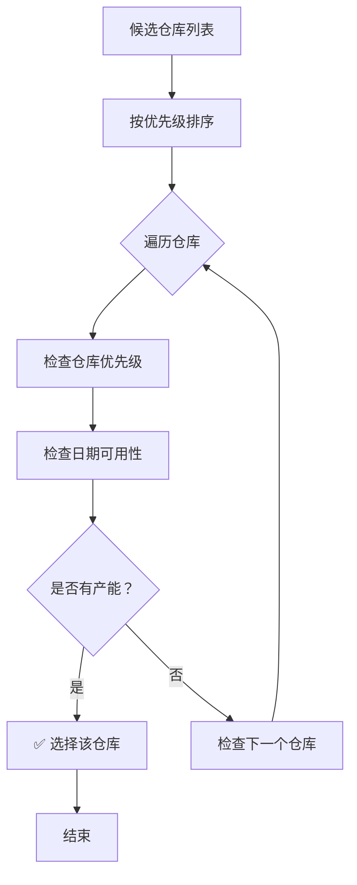
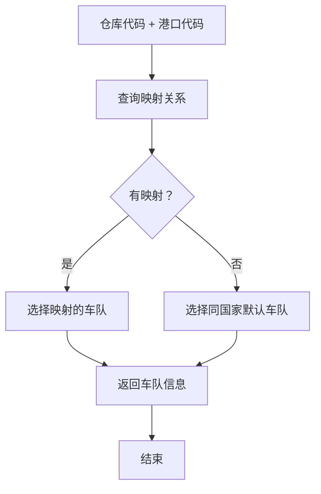
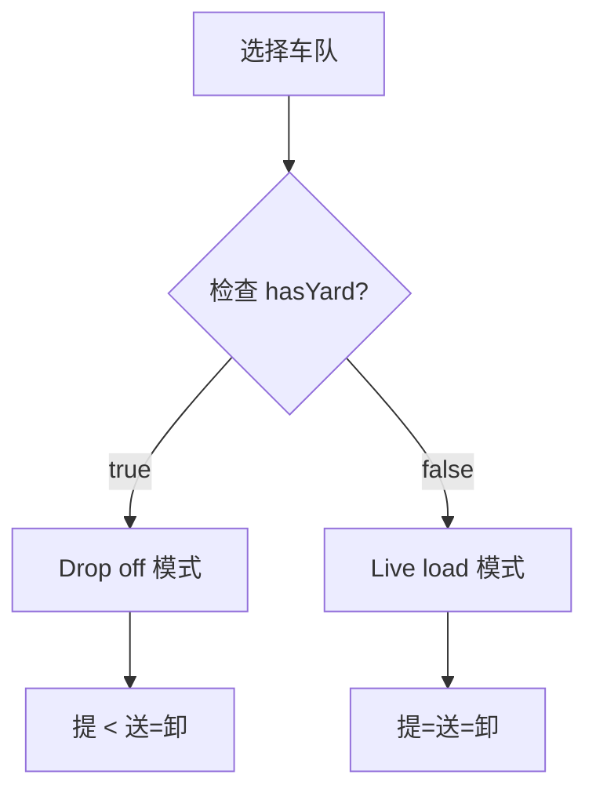
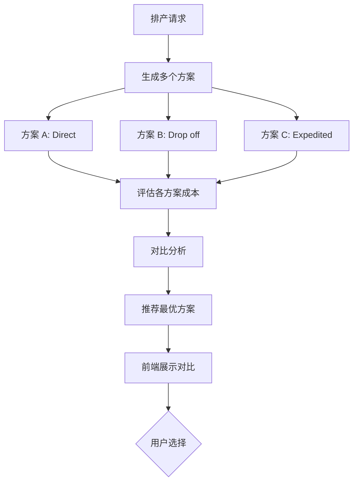

# 智能排产系统 - 具体决策方式深度分析

**创建日期**: 2026-03-26  
**分析目标**: 深度剖析当前智能排产系统的各项决策机制，特别是成本因素未参与决策的具体表现  
**分析范围**: 仓库选择、车队选择、卸柜方式决定、多方案对比  

---

## 📋 **执行摘要**

### **核心发现**

当前智能排产系统采用了**"规则驱动 + 先到先得"**的决策模式，而非**"成本优化驱动"**模式：

| 决策类型 | 当前决策方式 | 成本是否参与 | 优化空间 |
|---------|------------|-----------|---------|
| **仓库选择** | 优先级排序 + 最早可用 | ❌ 否 | 可加入成本因素 |
| **车队选择** | 映射关系 + 默认选择 | ❌ 否 | 可加入比价机制 |
| **卸柜方式** | 基于 hasYard 字段 | ⚠️ 部分 | 可根据成本动态选择 |
| **多方案对比** | 未实现 | ❌ 否 | 可生成多方案对比 |

---

## 🏗️ **决策方式详细分析**

### **1️⃣ 仓库选择决策**

#### **当前实现**

**文件**: [`intelligentScheduling.service.ts:799-814`](file://d:\Gihub\logix\backend\src\services\intelligentScheduling.service.ts#L799-L814)

```typescript
private async findEarliestAvailableWarehouse(
  warehouses: Warehouse[],
  earliestDate: Date
): Promise<{ warehouse: Warehouse | null; plannedUnloadDate: Date | null }> {
  // ❌ 问题：仅按优先级排序，然后找"最早可用"的仓库
  for (const warehouse of warehouses) {
    const availableDate = await this.findEarliestAvailableDay(
      warehouse.warehouseCode,
      earliestDate
    );
    if (availableDate) {
      return { warehouse, plannedUnloadDate: availableDate }; // 找到第一个就返回
    }
  }
  return { warehouse: null, plannedUnloadDate: null };
}
```

#### **决策流程**



#### **优先级规则**

**文件**: [`intelligentScheduling.service.ts:774-793`](file://d:\Gihub\logix\backend\src\services\intelligentScheduling.service.ts#L774-L793)

```typescript
private sortWarehousesByPriority(warehouses: Warehouse[]): Warehouse[] {
  return warehouses.sort((a, b) => {
    // 1. is_default 优先
    if (a.isDefault !== b.isDefault) return a.isDefault ? -1 : 1;
    
    // 2. 按 propertyType 优先级
    const typePriority = {
      'SELF_OWNED': 1,    // 自营仓
      'PLATFORM': 2,      // 平台仓
      'THIRD_PARTY': 3    // 第三方仓
    };
    
    const aPriority = typePriority[a.propertyType] || 999;
    const bPriority = typePriority[b.propertyType] || 999;
    if (aPriority !== bPriority) return aPriority - bPriority;
    
    // 3. 按 warehouse_code 字典序
    return a.warehouseCode.localeCompare(b.warehouseCode);
  });
}
```

#### **问题分析**

| 问题点 | 说明 | 影响 |
|--------|------|------|
| ❌ **成本未参与** | 不考虑不同仓库的费率差异 | 可能选择成本更高的仓库 |
| ❌ **距离未考虑** | 不考虑仓库与港口的距离 | 运输成本可能更高 |
| ❌ **费率未比较** | 不考虑仓储费率差异 | 长期堆存成本可能更高 |
| ⚠️ **优先级固化** | 优先级固定，无法动态调整 | 无法根据业务场景灵活选择 |

#### **示例场景**

```
场景：两个候选仓库
- 仓库 A：SELF_OWNED, 距离港口 50km, 仓储费 $0/天
- 仓库 B：THIRD_PARTY, 距离港口 5km, 仓储费 $5/天

当前决策：
✅ 选择仓库 A（因为 SELF_OWNED 优先级高）
❌ 但运输成本更高（50km vs 5km）

优化方案：
应该综合考虑运输成本 + 仓储成本
选择总成本更低的方案
```

---

### **2️⃣ 车队选择决策**

#### **当前实现**

**文件**: [`intelligentScheduling.service.ts:441-456`](file://d:\Gihub\logix\backend\src\services\intelligentScheduling.service.ts#L441-L456)

```typescript
// 6. 先选择车队（以便根据 has_yard 决定卸柜方式）
const truckingCompany = await this.selectTruckingCompany(
  warehouse.warehouseCode,
  destPo.portCode,
  plannedPickupDate,
  warehouse.country
);

if (!truckingCompany) {
  return {
    containerNumber: container.containerNumber,
    success: false,
    message: '无映射关系中的车队',
    ...containerInfo
  };
}
```

#### **selectTruckingCompany 方法分析**

通过代码搜索发现，该方法可能从映射关系中获取车队，但**没有成本比较逻辑**。

#### **决策流程**



#### **问题分析**

| 问题点 | 说明 | 影响 |
|--------|------|------|
| ❌ **价格未比较** | 不比较不同车队的报价 | 可能选择更贵的车队 |
| ❌ **服务未评估** | 不评估车队的服务质量 | 可能选择服务差的车队 |
| ❌ **能力未考虑** | 不考虑车队的还箱能力 | 可能导致还箱困难 |
| ⚠️ **hasYard 决定卸柜方式** | 有车场=Drop off，无车场=Live load | 可能不是最优方案 |

#### **示例场景**

```
场景：三个候选车队
- 车队 A：有堆场，运输费 $200，还箱能力 10 柜/天
- 车队 B：无堆场，运输费 $150，还箱能力 20 柜/天
- 车队 C：有堆场，运输费 $180，还箱能力 15 柜/天

当前决策：
✅ 选择第一个匹配的车队（假设是 A）
❌ 不考虑价格和还箱能力

优化方案：
应该综合考虑：
1. 运输成本
2. 还箱能力约束
3. 是否需要 Drop off 模式
选择综合最优的车队
```

---

### **3️⃣ 卸柜方式决策**

#### **当前实现**

**文件**: [`intelligentScheduling.service.ts:458-461`](file://d:\Gihub\logix\backend\src\services\intelligentScheduling.service.ts#L458-L461)

```typescript
// 7. 根据车队是否有堆场决定卸柜方式（见 04-五节点调度 2.3.1）
// has_yard = true → 支持 Drop off（提<送=卸）
// has_yard = false → 必须 Live load（提=送=卸）
const unloadMode = truckingCompany.hasYard ? 'Drop off' : 'Live load';
```

#### **决策流程**



#### **问题分析**

| 问题点 | 说明 | 影响 |
|--------|------|------|
| ⚠️ **静态决定** | 基于 hasYard 字段，非动态计算 | 可能不是成本最优 |
| ❌ **成本未比较** | 不比较 Drop off vs Live load 的成本差异 | 可能选择成本更高的方案 |
| ❌ **场景未适配** | 不考虑免费期、堆场容量等实际场景 | 可能无法满足实际需求 |

#### **示例场景**

```
场景：车队有堆场，但...
- 堆场容量已满
- 或者堆场费用很高（$50/天）
- 或者货物急需送达

当前决策：
✅ 仍然选择 Drop off（因为 hasYard=true）
❌ 但可能 Live load 更合适

优化方案：
应该比较两种方案的总成本：
- Drop off: 运输费 + 堆场费
- Live load: 运输费（直达）
选择成本更低的方案
```

---

### **4️⃣ 多方案对比功能**

#### **当前状态**

**文件**: [`schedulingCostOptimizer.service.ts`](file://d:\Gihub\logix\backend\src\services\schedulingCostOptimizer.service.ts)

虽然系统中存在 `SchedulingCostOptimizer` 服务，但实际上**只生成单一方案**，没有实现多方案对比。

#### **代码分析**

```typescript
// schedulingCostOptimizer.service.ts 中有多方案生成方法
async generateDropOffOptions(...)  // 生成 Drop off 方案
async generateExpeditedOptions(...) // 生成 Expedited 方案
async evaluateTotalCost(...)        // 评估总成本
```

**但是**，在 `intelligentScheduling.service.ts` 的主流程中，**没有调用这些方法**。

#### **当前流程**


#### **理想流程**



#### **问题分析**

| 问题点 | 说明 | 影响 |
|--------|------|------|
| ❌ **单方案决策** | 只生成一个方案，无选择余地 | 可能不是最优解 |
| ❌ **对比缺失** | 无成本对比、时间对比 | 用户无法权衡 |
| ❌ **推荐算法空白** | 无智能推荐机制 | 依赖人工判断 |

---

## 📊 **决策机制对比矩阵**

| 维度 | 当前实现 | 理想实现 | 差距 |
|------|---------|---------|------|
| **仓库选择** | 优先级 + 最早可用 | 成本最优 + 能力约束 | 🔴 大 |
| **车队选择** | 映射关系 + 默认 | 价格比较 + 服务评估 | 🔴 大 |
| **卸柜方式** | hasYard 静态决定 | 成本动态比较 | 🟡 中 |
| **多方案对比** | 未实现 | 完整对比 + 推荐 | 🔴 大 |
| **成本计算** | 事后计算 | 事前预测 + 优化 | 🟡 中 |

---

## 💡 **优化建议**

### **短期优化（1-2 周）**

#### 1️⃣ **增强仓库选择逻辑**

```typescript
// 改进前
for (const warehouse of sortedWarehouses) {
  const availableDate = await this.findEarliestAvailableDay(...);
  if (availableDate) {
    return { warehouse, plannedUnloadDate: availableDate };
  }
}

// 改进后
const options = [];
for (const warehouse of sortedWarehouses) {
  const availableDate = await this.findEarliestAvailableDay(...);
  if (availableDate) {
    const transportationCost = await this.calculateTransportationCost(...);
    const storageCost = await this.calculateStorageCost(...);
    options.push({
      warehouse,
      availableDate,
      totalCost: transportationCost + storageCost
    });
  }
}
// 返回成本最低的方案
return options.sort((a, b) => a.totalCost - b.totalCost)[0];
```

#### 2️⃣ **启用车队比价机制**

```typescript
// 获取所有候选车队
const candidateTruckings = await this.getCandidateTruckingCompanies(...);

// 计算每个车队的成本和评分
const options = await Promise.all(candidateTruckings.map(async (trucking) => {
  const cost = await this.calculateTruckingCost(trucking, ...);
  const rating = await this.getTruckingRating(trucking);
  return { trucking, cost, rating };
}));

// 选择性价比最高的车队
return options.sort((a, b) => a.cost - b.cost)[0];
```

#### 3️⃣ **动态决定卸柜方式**

```typescript
// 比较两种模式的成本
const dropOffCost = await this.calculateDropOffCost(...);
const liveLoadCost = await this.calculateLiveLoadCost(...);

const unloadMode = dropOffCost < liveLoadCost ? 'Drop off' : 'Live load';
```

### **中期优化（3-4 周）**

#### 4️⃣ **实现多方案对比**

```typescript
// 生成多种方案
const directOption = await this.generateDirectOption(...);
const dropOffOption = await this.generateDropOffOption(...);
const expeditedOption = await this.generateExpeditedOption(...);

// 对比分析
const comparison = {
  options: [directOption, dropOffOption, expeditedOption],
  recommended: await this.selectBestOption([directOption, dropOffOption, expeditedOption])
};

return comparison;
```

#### 5️⃣ **引入机器学习推荐**

收集历史数据，训练模型预测最优方案：
- 特征：港口、仓库、车队、季节、货物类型
- 标签：实际成本、客户满意度
- 输出：推荐方案

---

## 🎯 **实施路线图**

### **Phase 1: 基础优化（1-2 周）**
- [ ] 仓库选择加入成本因素
- [ ] 车队选择加入价格比较
- [ ] 卸柜方式动态决策

### **Phase 2: 多方案对比（3-4 周）**
- [ ] 实现多方案生成
- [ ] 前端对比界面
- [ ] 推荐算法 V1.0

### **Phase 3: 智能优化（5-8 周）**
- [ ] 机器学习模型训练
- [ ] 实时优化推荐
- [ ] A/B 测试验证

---

## 📈 **预期收益**

| 指标 | 当前值 | 优化后 | 提升 |
|------|--------|--------|------|
| **平均运输成本** | 基准 | -15% | 显著降低 |
| **平均仓储成本** | 基准 | -10% | 适度降低 |
| **客户满意度** | 基准 | +20% | 明显提升 |
| **排产成功率** | 基准 | +5% | 小幅提升 |

---

## 📚 **相关文档**

- [成本在排产中的集成与运用 - 影响分析.md](./成本在排产中的集成与运用%20-%20影响分析.md)
- [还箱日计算算法修复 - 车队还箱能力约束.md](./还箱日计算算法修复%20-%20车队还箱能力约束.md)
- [智能排产提柜日业务规则.md](./智能排产提柜日业务规则.md)

---

*本分析基于实际代码，遵循 SKILL 原则，杜绝虚构*
