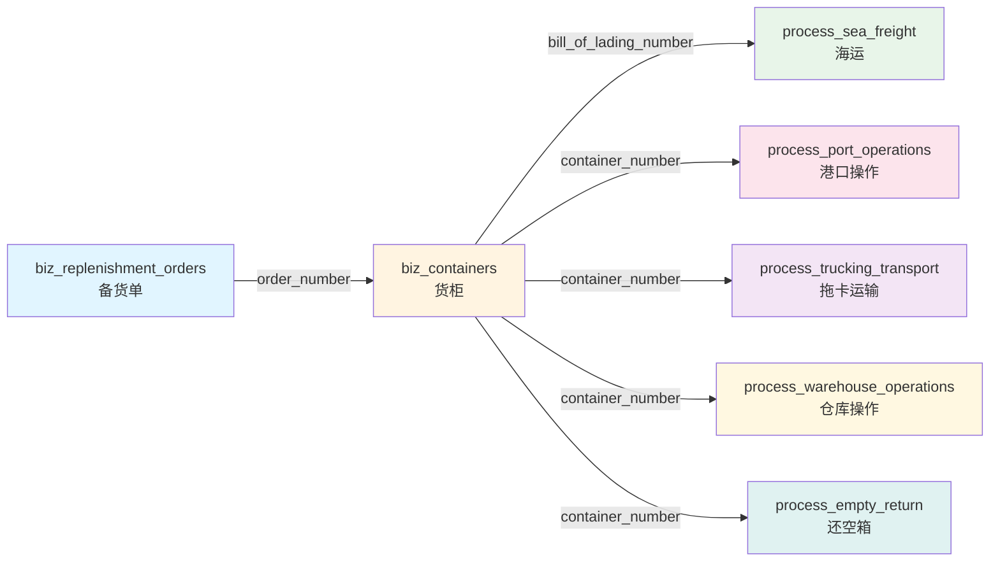

# 02-项目结构与布局

**创建日期**: 2026-03-21  
**最后更新**: 2026-03-21  
**预计阅读时间**: 45 分钟  

---

## 📋 **本章目录**

1. [整体项目结构](#1-整体项目结构)
2. [多服务架构](#2-多服务架构)
3. [数据库结构布局](#3-数据库结构布局)
4. [文件命名规范](#4-文件命名规范)
5. [代码组织原则](#5-代码组织原则)

---

## 1. 整体项目结构

### 1.1 项目全景视图

LogiX项目采用**多仓库、多服务**的组织架构，整体结构如下：

```
logix/                              # 项目根目录
│
├── backend/                        # 主后端服务（端口 3001）⭐
│   ├── src/                        # 源代码目录
│   │   ├── adapters/               # 外部数据适配器层 🔥
│   │   │   ├── ExternalDataAdapter.interface.ts  # 适配器接口
│   │   │   ├── FeiTuoAdapter.ts    # 飞驼 API 适配器
│   │   │   ├── LogisticsPathAdapter.ts  # 物流路径微服务适配器
│   │   │   ├── AdapterManager.ts   # 适配器管理器
│   │   │   └── index.ts            # 统一导出
│   │   │
│   │   ├── config/                 # 配置模块
│   │   │   ├── index.ts            # 主配置文件
│   │   │   ├── database.config.ts  # 数据库配置
│   │   │   └── ...
│   │   │
│   │   ├── controllers/            # 控制器层（API 入口）
│   │   │   ├── container.controller.ts      # 货柜管理
│   │   │   ├── replenishmentOrder.controller.ts  # 备货单管理
│   │   │   ├── scheduling.controller.ts       # 智能排柜
│   │   │   ├── adapter.controller.ts          # 外部数据适配 ⭐
│   │   │   └── ...
│   │   │
│   │   ├── routes/                 # 路由层（URL 映射）
│   │   │   ├── index.ts            # 主路由聚合
│   │   │   ├── container.routes.ts
│   │   │   ├── scheduling.routes.ts
│   │   │   ├── adapter.routes.ts
│   │   │   └── ...
│   │   │
│   │   ├── services/               # 服务层（业务逻辑）🔥
│   │   │   ├── container.service.ts
│   │   │   ├── scheduling.service.ts
│   │   │   ├── demurrage.service.ts         # 滞港费计算 🔥
│   │   │   ├── feituoImport.service.ts      # 飞驼导入 🔥
│   │   │   ├── ContainerDataService.ts      # 容器数据服务
│   │   │   └── ...
│   │   │
│   │   ├── middleware/             # 中间件层
│   │   │   ├── error.middleware.ts          # 错误处理
│   │   │   ├── rateLimit.middleware.ts      # 速率限制
│   │   │   ├── auth.middleware.ts           # 认证鉴权
│   │   │   └── countryFilter.middleware.ts  # 国家筛选 🔥
│   │   │
│   │   ├── entities/               # 数据库实体（TypeORM）🔥
│   │   │   ├── Container.ts                   # 货柜实体
│   │   │   ├── ReplenishmentOrder.ts          # 备货单实体
│   │   │   ├── SeaFreight.ts                  # 海运实体
│   │   │   ├── PortOperation.ts               # 港口操作实体
│   │   │   ├── TruckingTransport.ts           # 拖卡运输实体
│   │   │   ├── WarehouseOperation.ts          # 仓库操作实体
│   │   │   ├── EmptyReturn.ts                 # 还空箱实体
│   │   │   ├── ContainerStatusEvent.ts        # 飞驼状态事件
│   │   │   └── ...
│   │   │
│   │   ├── utils/                  # 工具函数
│   │   │   ├── logger.ts                      # 日志工具
│   │   │   ├── dateUtils.ts                   # 日期工具
│   │   │   ├── excelParser.ts                 # Excel 解析
│   │   │   └── ...
│   │   │
│   │   ├── types/                  # TypeScript 类型定义
│   │   │   ├── common.types.ts
│   │   │   ├── api.types.ts
│   │   │   └── ...
│   │   │
│   │   └── main.ts                 # 应用入口
│   │
│   ├── migrations/                 # 数据库迁移脚本 🔥
│   │   ├── 001_add_scheduling_optimization_config.sql
│   │   ├── add_cost_optimization_config.sql
│   │   ├── create_flow_definitions_table.sql
│   │   └── ... (50+ 个迁移文件)
│   │
│   ├── scripts/                    # 运维脚本
│   │   ├── init-database.ps1                  # 数据库初始化
│   │   ├── cleanup_old_sql_files.ps1          # 清理旧 SQL
│   │   └── ...
│   │
│   ├── docs/                       # 后端文档
│   │   ├── API_DOCS_UPDATE.md
│   │   ├── DATABASE_SCRIPTS_INDEX.md
│   │   ├── LogiX 外部数据适配器架构.md
│   │   └── ...
│   │
│   ├── .env                        # 环境变量配置
│   ├── .env.example                # 环境变量示例
│   ├── package.json                # 依赖配置
│   ├── tsconfig.json               # TypeScript 配置
│   └── Dockerfile                  # Docker 镜像配置
│
├── frontend/                       # 前端应用（端口 5173）⭐
│   ├── src/                        # 源代码目录
│   │   ├── components/             # 组件库 🔥
│   │   │   ├── common/                         # 通用组件
│   │   │   │   ├── UniversalImport/            # 通用导入组件 🔥
│   │   │   │   │   ├── UniversalImport.vue
│   │   │   │   │   ├── useExcelParser.ts       # Excel 解析 🔥
│   │   │   │   │   └── useFileUpload.ts        # 文件上传 🔥
│   │   │   │   ├── GanttChart/                 # 甘特图组件
│   │   │   │   └── ...
│   │   │   │
│   │   │   └── layout/                           # 布局组件
│   │   │       └── Layout.vue                    # 主布局
│   │   │
│   │   ├── composables/              # Composable 函数 🔥
│   │   │   ├── useGanttLogic.ts                  # 甘特图逻辑 🔥
│   │   │   ├── useContainerData.ts               # 容器数据
│   │   │   └── ...
│   │   │
│   │   ├── views/                    # 页面组件 🔥
│   │   │   ├── Login.vue                         # 登录页
│   │   │   ├── dashboard/                        # 仪表板
│   │   │   │   ├── DashboardIndex.vue
│   │   │   │   └── ...
│   │   │   ├── shipments/                        # 货柜管理 🔥
│   │   │   │   ├── ShipmentsList.vue
│   │   │   │   ├── ShipmentsGantt.vue
│   │   │   │   ├── ContainerDetail.vue
│   │   │   │   └── components/
│   │   │   ├── scheduling/                       # 智能排柜 🔥
│   │   │   │   ├── SchedulingVisual.vue
│   │   │   │   ├── components/
│   │   │   │   │   ├── CostOptimizationPanel.vue    # 成本优化面板
│   │   │   │   │   ├── UnloadOptionSelector.vue     # 方案选择器
│   │   │   │   │   ├── CostBreakdownDisplay.vue     # 成本明细
│   │   │   │   │   └── CostPieChart.vue             # 成本饼图
│   │   │   │   └── ...
│   │   │   ├── import/                           # 数据导入
│   │   │   │   └── ExcelImport.vue
│   │   │   ├── monitoring/                       # 监控中心
│   │   │   └── settings/                         # 系统设置
│   │   │
│   │   ├── services/                 # API 服务层
│   │   │   ├── api.ts                            # Axios 配置 🔥
│   │   │   ├── container.ts                      # 货柜 API
│   │   │   ├── scheduling.ts                     # 排柜 API
│   │   │   ├── costOptimization.ts               # 成本优化 API
│   │   │   └── ...
│   │   │
│   │   ├── types/                    # TypeScript 类型定义
│   │   │   ├── container.ts                      # 货柜类型
│   │   │   ├── scheduling.ts                     # 排柜类型
│   │   │   └── ...
│   │   │
│   │   ├── router/                   # 路由配置
│   │   │   └── index.ts                          # 路由定义和守卫
│   │   │
│   │   ├── store/                    # 状态管理（Pinia）
│   │   │   ├── user.ts                           # 用户状态
│   │   │   ├── app.ts                            # 应用状态 🔥
│   │   │   └── ...
│   │   │
│   │   ├── assets/                   # 静态资源
│   │   │   └── styles/                           # 样式资源
│   │   │       ├── global.scss                   # 全局样式重置 🔥
│   │   │       ├── variables.scss                # SCSS 变量 🔥
│   │   │       └── mixins.scss                   # SCSS 混入
│   │   │
│   │   ├── App.vue                   # 根组件
│   │   └── main.ts                   # 应用入口
│   │
│   ├── public/                       # 公共静态资源
│   │   ├── index.html                          # HTML 入口
│   │   └── docs/                               # 前端文档 🔥
│   │       ├── 01-standards/                   # 开发规范（9 篇）
│   │       ├── 02-architecture/                # 架构设计（5 篇）
│   │       ├── 03-database/                    # 数据库（3 篇）
│   │       ├── 05-state-machine/               # 状态机（3 篇）
│   │       ├── 06-statistics/                  # 统计分析（12 篇）
│   │       ├── demurrage/                      # 滞港费专题（11 篇）
│   │       └── README.md                       # 文档索引
│   │
│   ├── docs/                       # 前端专项文档
│   │   ├── IMPLEMENTATION_REPORT.md
│   │   ├── P0 智能预警系统实施完成报告.md 🔥
│   │   ├── 甘特图重构实施总结.md 🔥
│   │   └── ...
│   │
│   ├── .env.development            # 开发环境变量
│   ├── .env.production             # 生产环境变量
│   ├── package.json                # 依赖配置
│   ├── vite.config.ts              # Vite 构建配置
│   ├── tsconfig.json               # TypeScript 配置
│   └── Dockerfile                  # Docker 镜像配置
│
├── logistics-path-system/          # 物流路径微服务（端口 4000）⭐
│   ├── backend/                    # GraphQL 服务
│   │   ├── src/
│   │   │   ├── db/                 # 数据库连接
│   │   │   ├── schema/             # GraphQL Schema
│   │   │   ├── resolvers/          # 解析器
│   │   │   └── index.ts
│   │   └── package.json
│   │
│   ├── frontend/                   # 路径系统前端
│   │   └── src/
│   │
│   ├── shared/                     # 共享代码
│   │   └── types/                  # 共享类型
│   │
│   ├── MICROSERVICE_INTEGRATION.md # 微服务集成文档
│   └── README.md
│
├── docs/                           # 项目根文档 🔥
│   ├── Phase3/                     # 智能排柜系统文档（34 篇）
│   │   ├── 智能排柜系统完整文档.md 🔥
│   │   ├── 数据导入系统完整文档.md 🔥
│   │   ├── 智能预警系统完整文档.md 🔥
│   │   ├── 甘特图模块完整文档.md 🔥
│   │   ├── 数据库与 API 完整文档.md 🔥
│   │   ├── README-文档索引.md 🔥
│   │   └── 第一阶段总结/           # 本文档所在目录
│   │
│   ├── Database/                   # 数据库专项
│   │   └── ...
│   ├── 数据库迁移执行指南.md
│   └── 飞驼原始数据双表方案评审报告.md
│
├── .codebuddy/skills/              # CodeBuddy AI 技能 🔥
│   ├── logix-development/          # 核心开发技能 🔥
│   ├── database-query/             # 数据库查询
│   ├── excel-import-requirements/  # Excel 导入规范
│   ├── code-review/                # 代码审查
│   └── ... (10+ 个 Skills)
│
├── .cursor/skills/                 # Cursor IDE 技能
│   └── ...
│
├── .lingma/skills/                 # Lingma IDE 技能
│   └── ...
│
├── migrations/                     # 数据库迁移（根目录）
│   ├── 001_add_scheduling_optimization_config.sql
│   ├── add_cost_optimization_config.sql
│   └── ... (50+ 个迁移文件)
│
├── scripts/                        # 公共脚本
│   ├── analyze-colors.cjs          # 颜色分析脚本
│   └── ...
│
├── docker-compose.yml              # Docker 编排配置
├── docker-compose.timescaledb.yml  # TimescaleDB 配置
├── docker-compose.admin-tools.yml  # 管理工具配置
│
├── backend.log                     # 后端日志
├── package-lock.json               # 依赖锁定文件
└── README.md                       # 项目总览
```

---

### 1.2 目录职责详解

#### 核心代码目录

**backend/src/** - 后端业务逻辑中心
```
职责:
✅ 接收前端 HTTP 请求
✅ 执行核心业务逻辑
✅ 访问数据库
✅ 调用外部服务（飞驼、物流路径）
✅ 返回 JSON 响应

关键子目录:
- adapters/      : 外部系统适配器（扩展性关键）🔥
- services/      : 业务逻辑实现（最核心）🔥
- controllers/   : API 路由处理
- entities/      : 数据库映射（TypeORM）🔥
```

**frontend/src/** - 前端交互中心
```
职责:
✅ 渲染用户界面
✅ 响应用户操作
✅ 调用后端 API
✅ 管理本地状态
✅ 路由导航

关键子目录:
- views/         : 页面组件（按业务模块组织）🔥
- components/    : 可复用组件 🔥
- composables/   : 组合式函数（逻辑复用）🔥
- services/      : API 封装 🔥
```

**logistics-path-system/** - 物流路径微服务
```
职责:
✅ 生成物流状态路径
✅ 验证状态转换合法性
✅ 提供 GraphQL 查询接口
✅ 独立部署和扩展

为什么独立？
- 计算密集型（路径生成算法）
- 需要频繁独立扩展
- 团队分工明确
```

#### 文档目录

**docs/Phase3/** - 第一阶段核心文档
```
包含:
✅ 智能排柜系统完整文档（530 行）
✅ 数据导入系统完整文档（880 行）
✅ 智能预警系统完整文档（876 行）
✅ 甘特图模块完整文档（713 行）
✅ 数据库与 API 完整文档（853 行）
✅ README-文档索引（320 行）

总计：4,172 行，整合了 60+ 个原始文档
```

**.codebuddy/skills/** - AI 辅助开发技能
```
包含:
✅ logix-development（核心开发技能）🔥
✅ database-query（数据库查询专用）
✅ excel-import-requirements（Excel 导入规范）🔥
✅ code-review（代码质量审查）
✅ logix-demurrage（滞港费计算）🔥
✅ 其他专用技能（10+ 个）

用途:
- AI 助手上下文理解
- 规范自动检查
- 代码自动生成
```

---

## 2. 多服务架构

### 2.1 服务划分与职责

LogiX 采用**主从式微服务架构**：

```
┌─────────────────────────────────────────────────┐
│              前端层 (Frontend)                   │
│            Vue 3 + Element Plus                  │
│            端口：5173                            │
└────────────────┬────────────────────────────────┘
                 │ HTTP/REST API
                 ↓
┌─────────────────────────────────────────────────┐
│          主服务（Backend - API Gateway）          │
│         Express + TypeORM + PostgreSQL          │
│            端口：3001                            │
│                                                 │
│  • 用户认证与权限                                │
│  • 数据 CRUD                                   │
│  • 业务逻辑处理                                 │
│  • 外部数据适配（飞驼、物流路径）                │
│  • 统一 API 出口                                 │
└───────┬──────────────┬──────────────┬───────────┘
        │              │              │
        │ GraphQL      │ REST API     │ WebSocket
        ↓              ↓              ↓
┌───────────────┐ ┌───────────┐ ┌──────────┐
│ 物流路径微服务 │ │ 飞驼 API   │ │ Redis    │
│   (端口 4000)  │ │ (外部)    │ │ (缓存)   │
│ Apollo GraphQL│ │           │ │          │
└───────────────┘ └───────────┘ └──────────┘
```

### 2.2 主服务（backend:3001）

**定位**: API 网关 + 业务逻辑中心

**核心特性**:
```typescript
// 技术栈
{
  runtime: 'Node.js 18+',
  language: 'TypeScript 5.3+',
  framework: 'Express 4.18+',
  orm: 'TypeORM 0.3+',
  database: 'PostgreSQL 14+ / TimescaleDB',
  cache: 'Redis 7+',
  websocket: 'Socket.IO 4.6+'
}

// 职责
responsibilities: [
  '统一 API 出口（所有前端请求都经过这里）',
  '数据验证与转换',
  '业务逻辑执行',
  '数据库访问',
  '外部服务集成（通过 Adapter 模式）',
  '认证与授权',
  '日志记录',
  '错误处理'
]
```

**关键模块**:

1. **Adapters 层**（外部数据适配器）🔥
```typescript
// 设计模式：Adapter Pattern
interface ExternalDataAdapter {
  fetchData(params: any): Promise<any>;
  parseData(raw: any): Promise<any>;
}

class FeiTuoAdapter implements ExternalDataAdapter {
  // 飞驼系统数据适配
}

class LogisticsPathAdapter implements ExternalDataAdapter {
  // 物流路径微服务适配
}

// 好处：
// - 统一外部服务调用接口
// - 易于扩展新的外部服务
// - 隔离变化（外部 API 变更不影响核心逻辑）
```

2. **Services 层**（业务逻辑）🔥
```typescript
// 典型 Service 结构
class ContainerService {
  constructor(
    private containerRepo: Repository<Container>,
    private portOpRepo: Repository<PortOperation>,
    private alertService: AlertService
  ) {}
  
  async getContainers(filter: ContainerFilter): Promise<Container[]> {
    // 业务逻辑实现
  }
  
  async importFromExcel(data: ImportData): Promise<ImportResult> {
    // 导入逻辑
  }
}
```

3. **Controllers 层**（API 入口）
```typescript
// RESTful API 设计
@Controller('/api/v1/containers')
export class ContainerController {
  constructor(private containerService: ContainerService) {}
  
  @Get()
  async getList(@Query() filter: ContainerFilter) {
    const containers = await this.containerService.getList(filter);
    return { success: true, data: containers };
  }
  
  @Post()
  async create(@Body() dto: CreateContainerDto) {
    const container = await this.containerService.create(dto);
    return { success: true, data: container };
  }
}
```

### 2.3 前端应用（frontend:5173）

**定位**: 用户交互界面

**核心特性**:
```typescript
// 技术栈
{
  framework: 'Vue 3.4+ (Composition API)',
  ui: 'Element Plus 2.x',
  state: 'Pinia 2.x',
  router: 'Vue Router 4.x',
  build: 'Vite 5.x',
  style: 'SCSS + Tailwind CSS',
  chart: 'ECharts 5.x',
  calendar: 'FullCalendar 6.x'
}

// 架构特点
features: [
  'Composition API（逻辑复用）',
  '组件化开发（高内聚低耦合）',
  'TypeScript 类型安全',
  '响应式设计（适配多种屏幕）',
  '按需加载（性能优化）'
]
```

**关键设计**:

1. **Composables 模式**（逻辑复用）🔥
```typescript
// useGanttLogic.ts - 甘特图核心逻辑
export function useGanttLogic() {
  const containers = ref<Container[]>([]);
  
  const processedContainers = computed(() => {
    return containers.value.map(container => ({
      ...container,
      alerts: getContainerAlerts(container),
      borderStyle: getContainerBorderStyle(container)
    }));
  });
  
  const filteredContainers = computed(() => {
    return processedContainers.value.filter(/* 筛选逻辑 */);
  });
  
  return {
    containers,
    processedContainers,
    filteredContainers,
    getContainerAlerts,
    getContainerBorderStyle
  };
}

// 使用方式
const { 
  filteredContainers, 
  getContainerAlerts 
} = useGanttLogic();
```

2. **微组件架构**🔥
```vue
<!-- CostOptimizationPanel.vue - 主组件 -->
<template>
  <div class="cost-panel">
    <UnloadOptionSelector @select="handleSelect" />
    <CostBreakdownDisplay :data="costData" />
    <CostPieChart :data="chartData" />
  </div>
</template>

<!-- 每个子组件 < 150 行，职责单一 -->
```

3. **全局状态管理**🔥
```typescript
// stores/app.ts - 应用级状态
export const useAppStore = defineStore('app', {
  state: () => ({
    scopedCountryCode: null,  // 全局国家筛选 🔥
    theme: 'light',
    sidebarCollapsed: false
  }),
  
  actions: {
    setCountry(code: string | null) {
      this.scopedCountryCode = code;
      localStorage.setItem('country', code || '');
    }
  }
});
```

### 2.4 物流路径微服务（logistics-path-system:4000）

**定位**: 专业化路径生成服务

**为什么独立？**
```
原因 1: 计算密集型
  - 路径生成算法复杂
  - 状态机验证耗时
  - 需要独立扩展

原因 2: 专业领域
  - 物流状态流转规则
  - 状态转换验证
  - 路径合法性检查

原因 3: 团队分工
  - 专人负责维护和优化
  - 独立发布周期
  - 不影响主服务
```

**GraphQL Schema 示例**:
```graphql
type LogisticsPath {
  status: String!
  nextPossibleStatuses: [String!]!
  estimatedDates: DateRange
}

type Query {
  generatePath(containerId: ID!): LogisticsPath!
  validateTransition(from: String!, to: String!): Boolean!
}
```

---

## 3. 数据库结构布局

### 3.1 表分类体系

LogiX 数据库采用**前缀分类法**，清晰表达表的用途：

```sql
-- 字典表（Dictionary）
dict_countries              -- 国家字典
dict_ports                  -- 港口字典
dict_container_types        -- 柜型字典
dict_shipping_companies     -- 船公司字典
dict_warehouses             -- 仓库字典
dict_trucking_companies     -- 车队字典
dict_scheduling_config      -- 排柜配置项 🔥

-- 业务表（Business）
biz_replenishment_orders    -- 备货单 🔥
biz_containers              -- 货柜 🔥

-- 过程表（Process）
process_sea_freight                    -- 海运信息 🔥
process_port_operations                -- 港口操作 🔥
process_trucking_transport             -- 拖卡运输 🔥
process_warehouse_operations           -- 仓库操作 🔥
process_empty_return                   -- 还空箱 🔥

-- 扩展表（Extension）
ext_feituo_raw_data                    -- 飞驼原始数据 🔥
ext_feituo_status_events               -- 飞驼状态事件 🔥
ext_feituo_loading_records             -- 飞驼装载记录
ext_feituo_hold_records                -- 飞驼 HOLD 记录
ext_feituo_charges                     -- 飞驼费用记录

-- 流程表（Flow）
flow_definitions                       -- 流程定义
flow_instances                         -- 流程实例
```

### 3.2 核心表关系链

**7 层流转架构** 🔥



**关系说明**:

1. **备货单 → 货柜**（一对多）
```sql
-- 一个备货单可以有多个货柜
biz_replenishment_orders.order_number (主键)
    ↓
biz_containers.order_number (外键)
```

2. **货柜 → 海运信息**（一对一）
```sql
-- 一个货柜对应一份海运信息
biz_containers.bill_of_lading_number (外键)
    ↓
process_sea_freight.bill_of_lading_number (主键)
```

3. **货柜 → 过程表**（一对多）
```sql
-- 一个货柜有多条港口操作记录
biz_containers.container_number (主键)
    ↓
process_port_operations.container_number (外键)
process_trucking_transport.container_number (外键)
process_warehouse_operations.container_number (外键)
process_empty_return.container_number (外键)
```

### 3.3 索引策略

**主键索引**（自动创建）:
```sql
ALTER TABLE biz_containers 
  ADD PRIMARY KEY (id);
```

**外键索引**（手动创建，提升 JOIN 性能）🔥:
```sql
-- 货柜表外键索引
CREATE INDEX idx_containers_order_number ON biz_containers(order_number);
CREATE INDEX idx_containers_bill_of_lading ON biz_containers(bill_of_lading_number);

-- 过程表外键索引
CREATE INDEX idx_port_ops_container_number ON process_port_operations(container_number);
CREATE INDEX idx_trucking_container_number ON process_trucking_transport(container_number);
CREATE INDEX idx_warehouse_container_number ON process_warehouse_operations(container_number);
CREATE INDEX idx_empty_return_container_number ON process_empty_return(container_number);
```

**业务索引**（根据查询频率）🔥:
```sql
-- 高频查询字段
CREATE INDEX idx_containers_logistics_status ON biz_containers(logistics_status);
CREATE INDEX idx_containers_last_free_date ON biz_containers(last_free_date);
CREATE INDEX idx_port_ops_port_type ON process_port_operations(port_type);
CREATE INDEX idx_port_ops_port_sequence ON process_port_operations(port_sequence);

-- 复合索引（针对组合查询）
CREATE INDEX idx_containers_status_last_free 
  ON biz_containers(logistics_status, last_free_date);
```

**唯一索引**（保证数据唯一性）:
```sql
-- 集装箱号唯一
CREATE UNIQUE INDEX idx_containers_container_number 
  ON biz_containers(container_number);

-- 备货单号唯一
CREATE UNIQUE INDEX idx_replenishment_order_number 
  ON biz_replenishment_orders(order_number);

-- 港口操作唯一性（一个货柜在一个港口的记录唯一）
CREATE UNIQUE INDEX idx_unique_container_port_seq 
  ON process_port_operations(container_number, port_sequence);
```

---

## 4. 文件命名规范

### 4.1 完整命名对照表 🔥

| 层级 | 规则 | 示例 | 位置 |
|------|------|------|------|
| **数据库表名** | 前缀 + snake_case | `biz_containers`, `process_port_operations` | SQL 脚本 |
| **数据库字段** | snake_case | `container_number`, `last_free_date` | SQL 脚本 |
| **实体类** | PascalCase + `.ts` | `Container.ts`, `PortOperation.ts` | `backend/src/entities/` |
| **实体属性** | camelCase + `@Column` | `containerNumber`, `lastFreeDate` | Entity 类中 |
| **Controller** | PascalCase + `.controller.ts` | `ContainerController` | `backend/src/controllers/` |
| **Service** | PascalCase + `.service.ts` | `ContainerService` | `backend/src/services/` |
| **DTO** | PascalCase + `.dto.ts` | `CreateContainerDto` | `backend/src/dto/` |
| **前端页面** | PascalCase + `.vue` | `ShipmentsList.vue`, `ContainerDetail.vue` | `frontend/src/views/` |
| **前端组件** | PascalCase + `.vue` | `CostOptimizationPanel.vue` | `frontend/src/components/` |
| **Composable** | `use` + PascalCase + `.ts` | `useGanttLogic.ts`, `useContainerData.ts` | `frontend/src/composables/` |
| **Service** | camelCase + `.ts` | `container.ts`, `scheduling.ts` | `frontend/src/services/` |
| **Type** | PascalCase + `.ts` | `Container.ts`, `Scheduling.ts` | `frontend/src/types/` |
| **CSS 类名** | kebab-case | `.cost-panel`, `.gantt-container` | `.vue` 文件 style 标签 |
| **常量** | UPPER_SNAKE_CASE | `DEFAULT_PAGE_SIZE`, `API_BASE_URL` | 配置文件中 |

### 4.2 命名背后的设计理念

**为什么这样设计？**

1. **符合各自语言习惯**
```
数据库（SQL）: snake_case 是 SQL 标准
  ✅ SELECT container_number FROM biz_containers
  
TypeScript: camelCase/PascalCase 是 TS 标准
  ✅ const containerNumber = 'ECMU5397691'
  ✅ class Container { ... }

Vue: PascalCase 是组件命名规范
  ✅ <CostOptimizationPanel />
```

2. **清晰的语义表达**
```
前缀表达用途:
  dict_*     → 字典表（基础数据）
  biz_*      → 业务表（核心业务）
  process_*  → 过程表（业务流程）
  ext_*      → 扩展表（外部数据）

后缀表达类型:
  *.controller.ts  → 控制器
  *.service.ts     → 服务层
  *.dto.ts         → 数据传输对象
  *.interface.ts   → 接口定义
```

3. **便于 IDE 自动补全**
```
输入 "Container" 后，IDE 会提示:
  ✅ Container.ts (Entity)
  ✅ ContainerController.ts
  ✅ ContainerService.ts
  ✅ CreateContainerDto.ts
  
输入 "use" 后，IDE 会提示:
  ✅ useGanttLogic.ts
  ✅ useContainerData.ts
  ✅ useAlert.ts
```

---

## 5. 代码组织原则

### 5.1 分层架构原则 🔥

**经典三层架构**:

```
┌─────────────────────────────────────┐
│     Presentation Layer (视图层)      │
│  • Vue Components                   │
│  • 用户交互                         │
│  • 数据展示                         │
└──────────────┬──────────────────────┘
               │ HTTP/REST API
               ↓
┌─────────────────────────────────────┐
│     Business Logic Layer (服务层)    │
│  • Services                         │
│  • 业务规则实现                     │
│  • 数据验证                         │
└──────────────┬──────────────────────┘
               │
               ↓
┌─────────────────────────────────────┐
│     Data Access Layer (持久层)       │
│  • Entities + Repositories          │
│  • 数据库操作                       │
│  • ORM 映射                          │
└─────────────────────────────────────┘
```

**每层的职责边界**:

```typescript
// ❌ 错误示例：在 Controller 中写业务逻辑
@Controller('/containers')
export class ContainerController {
  async create(@Body() dto: CreateContainerDto) {
    // ❌ 不应该在这里验证业务规则
    if (dto.container_number.length !== 11) {
      throw new Error('箱号长度不对');
    }
    
    // ❌ 不应该在这里写 SQL
    const result = await query('INSERT INTO ...');
    return result;
  }
}

// ✅ 正确示例：职责分离
@Controller('/containers')
export class ContainerController {
  constructor(private containerService: ContainerService) {}
  
  async create(@Body() dto: CreateContainerDto) {
    // ✅ Controller 只负责：
    // 1. 接收请求
    // 2. 参数验证（格式验证）
    // 3. 调用 Service
    // 4. 返回响应
    
    const container = await this.containerService.create(dto);
    return { success: true, data: container };
  }
}

@Service()
export class ContainerService {
  async create(dto: CreateContainerDto) {
    // ✅ Service 负责：
    // 1. 业务规则验证
    // 2. 事务管理
    // 3. 调用 Repository
    // 4. 事件发布
    
    // 业务验证
    if (await this.exists(dto.container_number)) {
      throw new ConflictException('箱号已存在');
    }
    
    // 事务处理
    return await this.dataSource.transaction(async (manager) => {
      const container = await manager.save(Container, dto);
      
      // 发布事件
      this.eventEmitter.emit('container.created', container);
      
      return container;
    });
  }
}
```

### 5.2 组件拆分原则 🔥

**单一职责原则**:
```
✅ 一个组件只做一件事
✅ 一个文件只包含一类逻辑
✅ 一个函数不超过 50 行
```

**组件大小指导**:
```
微组件（推荐）: < 150 行
  ✅ CostPieChart.vue (91 行)
  ✅ UnloadOptionSelector.vue (118 行)

中型组件（适中）: 150-300 行
  ⚠️ CostBreakdownDisplay.vue (83 行)

巨型组件（警告）: > 300 行
  ❌ 需要重构拆分
```

**组件层次设计**:
```
主组件（整合协调）
  ↓
子组件（专用功能）
  ↓
微组件（原子功能）
  
示例:
CostOptimizationPanel.vue (主组件)
  ├── UnloadOptionSelector.vue (子组件：方案选择)
  ├── CostBreakdownDisplay.vue (子组件：成本表格)
  └── CostPieChart.vue (微组件：图表展示)
```

### 5.3 文件组织技巧

**按功能模块组织**（推荐）:
```
shipments/                    # 货柜管理模块
  ├── ShipmentsList.vue       # 列表页
  ├── ContainerDetail.vue     # 详情页
  ├── ShipmentsGantt.vue      # 甘特图
  └── components/             # 模块内组件
      ├── StatusBadge.vue
      └── FilterBar.vue
```

**按类型组织**（不推荐用于大项目）:
```
❌ components/
  ├── buttons/
  ├── inputs/
  └── tables/

问题:
- 相关功能分散在多处
- 难以找到特定业务的组件
- 不利于模块级复用
```

**Composables 组织**（逻辑复用）:
```
composables/
  ├── useGanttLogic.ts        # 甘特图逻辑
  ├── useContainerData.ts     # 容器数据获取
  ├── useAlert.ts             # 预警逻辑
  └── useFilter.ts            # 筛选逻辑
  
使用方式:
const { containers, loading } = useContainerData();
const { alerts, hasWarning } = useAlert(containers);
const { filtered } = useFilter(containers, filters);
```

---

## 📝 **本章总结**

### 核心要点回顾

✅ **整体项目结构**
- 多仓库组织：backend、frontend、logistics-path-system
- 清晰的目录职责划分
- 文档体系完善（4,000+ 行）

✅ **多服务架构**
- 主服务（3001）：API 网关 + 业务逻辑
- 前端（5173）：用户交互界面
- 微服务（4000）：专业化路径生成
- Adapter 模式集成外部服务

✅ **数据库结构**
- 前缀分类法（dict_、biz_、process_、ext_）
- 7 层流转架构
- 完善的索引策略

✅ **命名规范**
- 数据库：snake_case
- TypeScript: camelCase/PascalCase
- Vue: PascalCase
- CSS: kebab-case

✅ **代码组织**
- 分层架构（Presentation → Business Logic → Data Access）
- 组件拆分（单一职责、微组件）
- Composables 逻辑复用

---

### 实践练习

1. 📁 **画出你负责模块的文件结构图**
2. 🔍 **找出 3 个不符合命名规范的例子并修正**
3. 🏗️ **设计一个新功能的目录结构**
4. 💡 **思考：为什么要把 Adapters 层独立出来？**

---

### 下一步

继续阅读：[03-技术选型与架构决策](./03-技术选型与架构决策.md)

---

**文档状态**: ✅ 已完成  
**版本**: v1.0  
**创建日期**: 2026-03-21  
**作者**: AI Development Team
