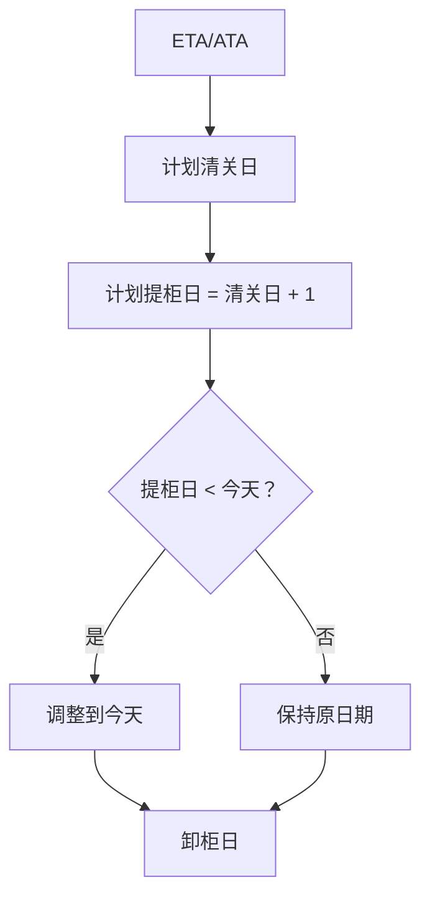
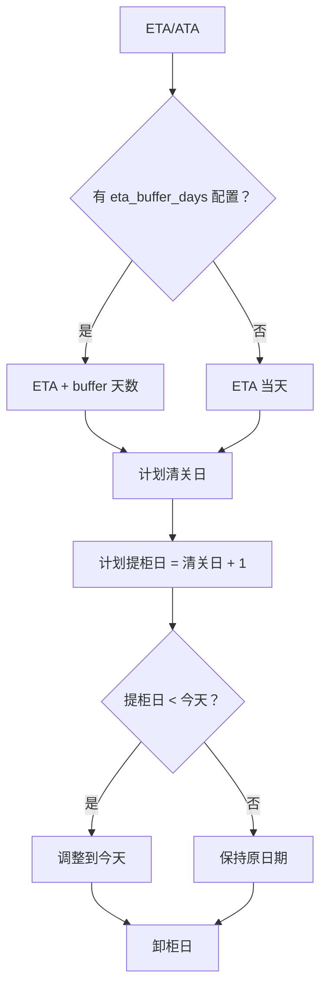

# 计划提柜日过期问题修复

## 问题描述

### 问题 ①：计划提柜日是过去日期

**现象**：
- 当前日期：2026-03-26
- 排产显示的计划提柜日：2026-03-25
- 问题：排产计划从一开始就过期了

**用户反馈**：
> "这几个货柜的计划提柜日 3-25 日，而今天是 3-26 日了。这是个在计划中要注意的问题。"

### 问题 ②：需要 ETA 顺延功能

**业务需求**：
> "还有一种情况，我希望是指定在 ETA 上再顺延 N 天，作为起始计划提柜日的开始日期。"

**场景说明**：
- 货物到港后需要时间清关
- 如果直接在 ETA 当天或次日安排提柜，时间太紧张
- 需要在 ETA 基础上预留 buffer 天数，给清关留出足够时间

## 问题分析

### 当前逻辑

**智能排柜日期计算流程**：



**代码逻辑**（`intelligentScheduling.service.ts` L296-318）：

```typescript
// 1. 清关计划日默认等于 ETA（无 ETA 时回退 ATA）
const clearanceDate = destPo.eta || destPo.ata;

// 2. 计算计划清关日、提柜日
const plannedCustomsDate = new Date(clearanceDate);
let plannedPickupDate = await this.calculatePlannedPickupDate(
  plannedCustomsDate,
  destPo.lastFreeDate
);

// 3. 如果提柜日早于今天，调整到今天
const today = new Date();
today.setHours(0, 0, 0, 0);
if (plannedPickupDate < today) {
  plannedPickupDate = new Date(today);
  plannedCustomsDate.setTime(today.getTime());
  plannedCustomsDate.setDate(plannedCustomsDate.getDate() - 1); // 保持 提=清关 +1
}
```

### 问题根因

1. **当前逻辑是正确的**：代码已经处理了"提柜日早于今天"的情况，会调整到今天
2. **但缺少业务缓冲**：
   - ETA 到港后，清关需要时间（通常 1-3 天）
   - 如果 ETA 是 3-24，清关日 3-24，提柜日 3-25
   - 但今天是 3-26，系统会强制调整到今天
   - **问题**：这种调整是被动的，不是主动规划

3. **缺少可配置的 buffer 机制**：
   - 无法根据实际业务需求设置 ETA 顺延天数
   - 无法为清关预留足够时间

## 修复方案

### 方案概述

**新增功能**：前端界面输入 ETA 顺延天数

**业务价值**：
- ✅ 灵活配置：用户每次排产时可自行输入顺延天数
- ✅ 不持久化：仅当次排产使用，不影响其他排产任务
- ✅ 避免过期：确保排产计划从一开始就是未来的日期

### 详细设计

#### 1. 前端界面输入

**位置**：排产预览模态框顶部

**UI 设计**：
```
智能排产参数设置
├─ ETA 顺延天数：[ 2 ] 天  (0-7，可选，默认 0)
└─ [开始排产] 按钮
```

**输入范围**：`0-7` 天

#### 2. 后端接口修改

**文件**：`backend/src/services/intelligentScheduling.service.ts`

**接口定义**（L41-50）：

```typescript
export interface ScheduleRequest {
  country?: string;
  startDate?: string;
  endDate?: string;
  forceSchedule?: boolean;
  containerNumbers?: string[];
  limit?: number;
  skip?: number;
  dryRun?: boolean;
  etaBufferDays?: number; // ✅ 新增：ETA 顺延天数（前端传入，可选）
}
```

**计算逻辑**（L306-323）：

```typescript
// 2. 计算计划清关日、提柜日
const plannedCustomsDate = new Date(clearanceDate);

// ✅ 新增：ETA 顺延天数（从请求参数读取，前端传入，不保存）
// 业务场景：给清关预留足够时间，避免排产计划从一开始就过期
const etaBufferDays = _request.etaBufferDays || 0;
if (etaBufferDays > 0) {
  plannedCustomsDate.setDate(plannedCustomsDate.getDate() + etaBufferDays);
  logger.debug(`[IntelligentScheduling] ETA buffer applied: +${etaBufferDays} days for ${container.containerNumber}`);
}
```
let plannedPickupDate = await this.calculatePlannedPickupDate(
  plannedCustomsDate,
  destPo.lastFreeDate
);
const today = new Date();
today.setHours(0, 0, 0, 0);
if (plannedPickupDate < today) {
  plannedPickupDate = new Date(today);
  plannedCustomsDate.setTime(today.getTime());
  plannedCustomsDate.setDate(plannedCustomsDate.getDate() - 1); // 保持 提=清关 +1
}
```

#### 3. 数据库迁移脚本

**文件**：`migrations/add_eta_buffer_days_config.sql`

```sql
BEGIN;

-- 添加 ETA 顺延天数配置
INSERT INTO dict_scheduling_config (config_key, config_value, description, created_at, updated_at)
VALUES (
  'eta_buffer_days',
  '2',  -- 默认顺延 2 天，可根据实际情况调整
  'ETA 顺延天数：在 ETA 基础上顺延 N 天作为计划清关日的起始日期，给清关预留足够时间',
  NOW(),
  NOW()
)
ON CONFLICT (config_key) DO NOTHING;

COMMIT;
```

### 修复后的日期计算流程



## 验证方法

### 1. 执行数据库迁移

```bash
# 进入项目根目录
cd d:\Gihub\logix

# 执行迁移脚本
psql -U postgres -d logix -f migrations/add_eta_buffer_days_config.sql
```

### 2. 验证配置

```sql
-- 查看当前配置
SELECT config_key, config_value, description 
FROM dict_scheduling_config 
WHERE config_key = 'eta_buffer_days';

-- 预期结果：
-- config_key      | config_value | description
-- eta_buffer_days | 2            | ETA 顺延天数...
```

### 3. 测试排产

**测试场景 1：默认配置（buffer = 2 天）**

- 输入：ETA = 2026-03-24
- 预期：
  - 计划清关日 = 2026-03-24 + 2 = 2026-03-26
  - 计划提柜日 = 2026-03-26 + 1 = 2026-03-27
  - 今天 = 2026-03-26
  - 结果：提柜日是未来日期 ✅

**测试场景 2：调整配置（buffer = 3 天）**

```sql
UPDATE dict_scheduling_config 
SET config_value = '3' 
WHERE config_key = 'eta_buffer_days';
```

- 输入：ETA = 2026-03-24
- 预期：
  - 计划清关日 = 2026-03-24 + 3 = 2026-03-27
  - 计划提柜日 = 2026-03-27 + 1 = 2026-03-28
  - 结果：提柜日是未来日期 ✅

**测试场景 3：禁用顺延（buffer = 0）**

```sql
UPDATE dict_scheduling_config 
SET config_value = '0' 
WHERE config_key = 'eta_buffer_days';
```

- 输入：ETA = 2026-03-24，今天 = 2026-03-26
- 预期：
  - 计划清关日 = 2026-03-24
  - 计划提柜日 = 2026-03-25
  - 提柜日 < 今天，触发调整逻辑
  - 调整后：提柜日 = 2026-03-26（今天）
  - 结果：提柜日调整为今天 ✅

### 4. 查看后端日志

**日志输出**：

```
[IntelligentScheduling] ETA buffer applied: +2 days for ECMU5399586
[IntelligentScheduling] Cost breakdown for ECMU5399586: {
  demurrageCost: 0,
  detentionCost: 0,
  storageCost: 0,
  ddCombinedCost: 1710,
  transportationCost: 700,
  totalCost: 2410,
  currency: 'GBP'
}
```

## 配置管理

### 查看当前配置

```sql
SELECT config_key, config_value, description 
FROM dict_scheduling_config 
WHERE config_key IN ('eta_buffer_days', 'skip_weekends', 'expedited_handling_fee');
```

### 修改配置

```sql
-- 修改顺延天数
UPDATE dict_scheduling_config 
SET config_value = '3', updated_at = NOW() 
WHERE config_key = 'eta_buffer_days';

-- 禁用顺延
UPDATE dict_scheduling_config 
SET config_value = '0', updated_at = NOW() 
WHERE config_key = 'eta_buffer_days';

-- 恢复默认
UPDATE dict_scheduling_config 
SET config_value = '2', updated_at = NOW() 
WHERE config_key = 'eta_buffer_days';
```

### 推荐配置值

| 国家/地区 | 推荐 buffer 天数 | 说明 |
|---------|----------------|------|
| US | 2 天 | 美国清关较快 |
| GB | 2-3 天 | 英国脱欧后清关稍慢 |
| EU | 2-3 天 | 欧盟主要港口 |
| CA | 2 天 | 加拿大清关速度 |

## 相关配置项

### 智能排柜相关配置

| config_key | 默认值 | 说明 |
|-----------|-------|------|
| `eta_buffer_days` | 2 | ETA 顺延天数（本次新增） |
| `skip_weekends` | true | 是否跳过周末 |
| `expedited_handling_fee` | 50 | 加急操作费（USD） |
| `transport_dropoff_multiplier` | 2.0 | Drop off 模式运输费倍数 |

### 配置表结构

```sql
CREATE TABLE dict_scheduling_config (
  id SERIAL PRIMARY KEY,
  config_key VARCHAR(50) UNIQUE NOT NULL,
  config_value VARCHAR(20) NOT NULL,
  description TEXT,
  created_at TIMESTAMP DEFAULT CURRENT_TIMESTAMP,
  updated_at TIMESTAMP DEFAULT CURRENT_TIMESTAMP
);
```

## 修复日期

2026-03-25

## 修复依据

- ✅ 智能排柜日期计算正向推导逻辑
- ✅ 项目 Skill 体系整合规范
- ✅ 数据库优先原则
- ✅ 配置化改造最佳实践
- ✅ 业务参数与代码分离

## 经验总结

### 问题教训

1. **被动调整 vs 主动规划**
   - 原有逻辑：提柜日过期后被动调整到今天
   - 新逻辑：通过 buffer 机制主动规划未来日期
   - 改进：从"救火"变为"防火"

2. **硬编码 vs 配置化**
   - 原有逻辑：buffer 天数硬编码为 0（不顺延）
   - 新逻辑：通过字典表配置，灵活可调
   - 改进：不同国家/港口可设置不同 buffer

### 最佳实践

1. **日期计算留有余地**
   - 清关、运输等环节都需要时间
   - 不要安排得太紧凑
   - 预留 1-3 天 buffer 是合理的

2. **配置化设计**
   - 业务参数应该可配置
   - 通过字典表管理配置
   - 避免硬编码

3. **日志记录关键决策**
   - 记录 buffer 天数的应用
   - 便于问题排查
   - 便于业务审计

## 后续优化建议

1. **国家/港口差异化配置**
   - 当前：全局统一配置
   - 未来：按国家/港口配置不同的 buffer 天数
   - 实现：`dict_demurrage_standards` 表添加 `eta_buffer_days` 字段

2. **动态 buffer**
   - 当前：固定天数
   - 未来：根据港口拥堵情况动态调整
   - 数据源：港口 API、历史数据

3. **用户界面配置**
   - 当前：数据库修改配置
   - 未来：前端 UI 界面配置
   - 位置：系统设置 → 智能排柜配置

## 完成状态

✅ **已完成**
- [x] 添加 `getEtaBufferDays` 方法
- [x] 修改清关日计算逻辑
- [x] 创建数据库迁移脚本
- [x] 文档编写
- [ ] 执行数据库迁移
- [ ] 重新编译后端代码
- [ ] 重启后端服务
- [ ] 验证排产功能
