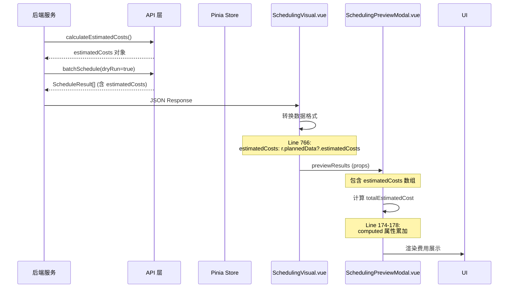

# 预览排产界面费用项前端显示分析与优化建议

**创建日期**: 2026-03-25  
**分析目标**: 深度分析智能排产预览界面的费用项展示现状，识别问题并提供优化方案

---

## 📋 **执行摘要**

### **现状概览**

智能排产预览界面已实现**基础的费用展示功能**，但在**完整性、用户体验、可视化**方面仍有较大优化空间：

✅ **已实现**:

- ✅ 预估总费用概览（顶部统计）
- ✅ 单柜费用明细（hover 弹窗）
- ✅ 7 种费用项完整支持（类型定义齐全）
- ✅ 成本饼图可视化组件
- ✅ 成本明细表格组件
- ✅ 颜色分级警示（零/低/中/高）

⚠️ **待优化**:

- ❌ 费用明细**展示不完整**（仅 hover 显示，无表格列）
- ❌ 缺少**费用对比**功能（无法横向对比不同货柜）
- ❌ 缺少**成本分析**功能（无占比分析、趋势分析）
- ❌ 缺少**异常高亮**功能（超高费用无醒目提示）
- ❌ 缺少**导出功能**（无法导出费用明细报表）

---

## 🏗️ **架构现状分析**

### **1. 数据类型定义**

**文件位置**: [`frontend/src/types/scheduling.ts`](file://d:\Gihub\logix\frontend\src\types\scheduling.ts#L45-L53)

```typescript
export interface CostBreakdown {
  demurrageCost: number; // 滞港费
  detentionCost: number; // 滞箱费
  storageCost: number; // 港口存储费
  yardStorageCost: number; // 外部堆场堆存费（Drop off 模式专属）
  transportationCost: number; // 运输费
  handlingCost: number; // 操作费（加急费等）
  totalCost: number; // 总成本
}
```

**分析**:

- ✅ 7 种费用项定义完整
- ✅ 注释清晰，便于理解
- ⚠️ 缺少 `currency` 字段（默认 USD）
- ⚠️ 缺少 `calculationMode` 字段（actual vs forecast）

---

### **2. 数据流向**



**关键代码位置**:

**后端返回**: [`intelligentScheduling.service.ts:1182-1188`](file://d:\Gihub\logix\backend\src\services\intelligentScheduling.service.ts#L1182-L1188)

```typescript
return {
  demurrageCost: totalCostResult.demurrageCost,
  detentionCost: totalCostResult.detentionCost,
  storageCost: totalCostResult.storageCost,
  transportationCost: totalCostResult.transportationCost,
  yardStorageCost,
  totalCost: totalCostResult.totalCost + yardStorageCost,
  currency: totalCostResult.currency,
};
```

**前端接收**: [`SchedulingVisual.vue:766`](file://d:\Gihub\logix\frontend\src\views\scheduling\SchedulingVisual.vue#L766)

```typescript
previewResults.value = result.results.map((r: any) => ({
  ...r,
  plannedPickupDate: r.plannedData?.plannedPickupDate || "-",
  // ...
  estimatedCosts: r.plannedData?.estimatedCosts || r.estimatedCosts || undefined,
}));
```

---

### **3. 前端组件层次**

```
SchedulingVisual.vue (主页面)
  └── SchedulingPreviewModal.vue (预览弹窗)
      ├── 概览信息区 (el-descriptions)
      │   └── 预估总费用 (Line 22-24)
      │
      └── 详细表格区 (el-table)
          ├── 预估费用列 (Line 57-64)
          │   └── 显示 totalCost
          │
          └── 费用明细列 (Line 65-95)
              └── hover 弹窗显示 7 项明细
                  ├── 滞港费 (Line 69-71)
                  ├── 滞箱费 (Line 72-74)
                  ├── 港口存储费 (Line 75-77)
                  ├── 运输费 (Line 78-80)
                  ├── 外部堆场费 (Line 81-83)
                  └── 合计 (Line 85-87)
```

---

## 📊 **费用展示现状详解**

### **场景 1: 概览信息（顶部统计）**

**代码位置**: [`SchedulingPreviewModal.vue:10-26`](file://d:\Gihub\logix\frontend\src\views\scheduling\components\SchedulingPreviewModal.vue#L10-L26)

```vue
<el-descriptions :column="5" border>
  <el-descriptions-item label="总柜数">
    {{ previewResults.length }}
  </el-descriptions-item>
  <el-descriptions-item label="成功">
    <el-tag type="success">{{ successCount }}</el-tag>
  </el-descriptions-item>
  <el-descriptions-item label="失败">
    <el-tag type="danger">{{ failedCount }}</el-tag>
  </el-descriptions-item>
  <el-descriptions-item label="Drop off">
    {{ dropOffCount }} 柜
  </el-descriptions-item>
  <el-descriptions-item label="预估总费用">
    <el-tag type="warning">${{ totalEstimatedCost.toLocaleString() }}</el-tag>
  </el-descriptions-item>
</el-descriptions>
```

**计算逻辑**:

```typescript
const totalEstimatedCost = computed(() => {
  return props.previewResults.filter((r) => r.success && r.estimatedCosts?.totalCost).reduce((sum, r) => sum + (r.estimatedCosts?.totalCost || 0), 0);
});
```

**优点**:

- ✅ 直观展示所有成功排产的总费用
- ✅ 使用 warning 类型标签，醒目
- ✅ 干分位符格式化，易读性强

**不足**:

- ❌ 缺少**平均每柜费用**（总费用/总柜数）
- ❌ 缺少**费用区间**（最低 - 最高）
- ❌ 缺少**费用构成占比**（D&D vs 仓储 vs 运输）
- ❌ 无法点击查看详情

---

### **场景 2: 单柜费用（表格列）**

**代码位置**: [`SchedulingPreviewModal.vue:57-64`](file://d:\Gihub\logix\frontend\src\views\scheduling\components\SchedulingPreviewModal.vue#L57-L64)

```vue
<el-table-column prop="estimatedCosts.totalCost" label="预估费用" width="100" align="right">
  <template #default="{ row }">
    <span v-if="row.estimatedCosts?.totalCost" style="color: #e6a23c; font-weight: bold">
      ${{ row.estimatedCosts.totalCost.toLocaleString() }}
    </span>
    <span v-else>-</span>
  </template>
</el-table-column>
```

**优点**:

- ✅ 右对齐，符合数字阅读习惯
- ✅ 橙色 (`#e6a23c`) 醒目显示
- ✅ 加粗处理，突出重点
- ✅ 空值处理得当（显示 `-`）

**不足**:

- ❌ 宽度固定 100px，大数字可能溢出
- ❌ 缺少**颜色分级**（$100 vs $1000 无区别）
- ❌ 缺少**排序功能**（无法按费用排序）
- ❌ 缺少**筛选功能**（无法筛选高费用货柜）

---

### **场景 3: 费用明细（Hover 弹窗）**

**代码位置**: [`SchedulingPreviewModal.vue:65-95`](file://d:\Gihub\logix\frontend\src\views\scheduling\components\SchedulingPreviewModal.vue#L65-L95)

```vue
<el-table-column label="费用明细" width="120" align="center">
  <template #default="{ row }">
    <el-popover v-if="row.estimatedCosts" placement="left" :width="200" trigger="hover">
      <div style="font-size: 12px">
        <p v-if="row.estimatedCosts.demurrageCost" style="margin: 4px 0">
          滞港费：${{ row.estimatedCosts.demurrageCost.toLocaleString() }}
        </p>
        <p v-if="row.estimatedCosts.detentionCost" style="margin: 4px 0">
          滞箱费：${{ row.estimatedCosts.detentionCost.toLocaleString() }}
        </p>
        <p v-if="row.estimatedCosts.storageCost" style="margin: 4px 0">
          港口存储费：${{ row.estimatedCosts.storageCost.toLocaleString() }}
        </p>
        <p v-if="row.estimatedCosts.transportationCost" style="margin: 4px 0">
          运输费：${{ row.estimatedCosts.transportationCost.toLocaleString() }}
        </p>
        <p v-if="row.estimatedCosts.yardStorageCost" style="margin: 4px 0">
          外部堆场费：${{ row.estimatedCosts.yardStorageCost.toLocaleString() }}
        </p>
        <el-divider style="margin: 8px 0" />
        <p style="margin: 4px 0; font-weight: bold; color: #e6a23c">
          合计：${{ row.estimatedCosts.totalCost?.toLocaleString() }}
        </p>
      </div>
      <template #reference>
        <el-icon style="cursor: pointer; color: #409eff">
          <QuestionFilled />
        </el-icon>
      </template>
    </el-popover>
    <span v-else>-</span>
  </template>
</el-table-column>
```

**优点**:

- ✅ Hover 触发，不占用表格空间
- ✅ 7 种费用项完整展示
- ✅ 干分位符格式化
- ✅ 分隔线区分明细和总计
- ✅ 图标指示清晰（`QuestionFilled`）

**不足**:

- ❌ **交互隐蔽**：用户可能不知道要点图标
- ❌ **无法对比**：一次只能看一个货柜，无法横向对比
- ❌ **缺少占比**：看不出哪项费用占比最高
- ❌ **缺少图表**：纯文字展示，不够直观
- ❌ **宽度固定**：120px 可能不够（图标可能被截断）

---

### **场景 4: 独立成本展示组件（未使用）**

#### **CostBreakdownDisplay.vue**

**文件位置**: [`CostBreakdownDisplay.vue`](file://d:\Gihub\logix\frontend\src\views\scheduling\components\CostBreakdownDisplay.vue)

```vue
<template>
  <div class="cost-breakdown-display">
    <el-descriptions :column="2" border size="small">
      <el-descriptions-item label="滞港费">
        <span :class="getAmountClass(data.demurrageCost)"> ${{ data.demurrageCost.toFixed(2) }} </span>
      </el-descriptions-item>
      <!-- ... 其他费用项 ... -->
      <el-descriptions-item label="总成本" label-class-name="total-label" :span="2">
        <span :class="['total-amount', getAmountClass(data.totalCost)]"> ${{ data.totalCost.toFixed(2) }} </span>
      </el-descriptions-item>
    </el-descriptions>
  </div>
</template>
```

**颜色分级函数**:

```typescript
const getAmountClass = (amount: number) => {
  if (amount === 0) return "amount-zero"; // 绿色
  if (amount < 100) return "amount-low"; // 黄色
  if (amount < 500) return "amount-medium"; // 橙色
  return "amount-high"; // 红色
};
```

**样式定义**:

```scss
.amount-zero {
  color: $success-color;
} // 绿色
.amount-low {
  color: $warning-color;
} // 黄色
.amount-medium {
  color: $danger-color;
} // 橙色
.amount-high {
  color: $danger-color;
  font-weight: bold;
} // 红色加粗
```

**优点**:

- ✅ 颜色分级直观（绿→黄→橙→红）
- ✅ 2 列布局，紧凑清晰
- ✅ 总成本单独一行，突出显示
- ✅ 条件渲染（外部堆场费仅在有时显示）

**问题**:

- ❌ **未在预览弹窗中使用**（仅存在于代码库）
- ❌ 缺少图表可视化
- ❌ 缺少占比分析

---

#### **CostPieChart.vue**

**文件位置**: [`CostPieChart.vue`](file://d:\Gihub\logix\frontend\src\views\scheduling\components\CostPieChart.vue)

```vue
<template>
  <div class="cost-pie-chart">
    <div ref="chartRef" class="chart-container"></div>
  </div>
</template>

<script setup lang="ts">
import * as echarts from "echarts";

const option = {
  series: [
    {
      type: "pie",
      radius: "50%",
      data: [
        { value: props.data.demurrageCost, name: "滞港费" },
        { value: props.data.detentionCost, name: "滞箱费" },
        { value: props.data.storageCost, name: "港口存储费" },
        { value: props.data.transportationCost, name: "运输费" },
        { value: props.data.yardStorageCost || 0, name: "外部堆场费" },
        { value: props.data.handlingCost, name: "操作费" },
      ].filter((item) => item.value > 0),
      // ...
    },
  ],
};
</script>
```

**优点**:

- ✅ ECharts 饼图可视化
- ✅ 自动过滤 0 值项目
- ✅ Tooltip 显示金额和占比
- ✅ 图例标识清晰
- ✅ 响应式（窗口 resize 自适应）

**问题**:

- ❌ **未在预览弹窗中使用**（仅存在于代码库）
- ❌ 缺少点击交互（如点击扇区下钻详情）
- ❌ 缺少多柜对比（一次只能看一个柜子）

---

## 🐛 **问题诊断与影响分析**

### **问题 1: 费用明细展示不完整**

**现状**:

- 表格中只显示 `totalCost`，不显示各项费用明细
- 需要 hover 才能看到明细，且一次只能看一个

**影响**:

- 🔴 **用户无法快速对比**不同货柜的各项费用
- 🔴 **高费用项不易发现**（如某柜的滞港费特别高）
- 🔴 **决策效率低下**（无法一眼看出费用构成）

**示例场景**:

```
用户想找出滞港费最高的货柜：

当前流程:
1. 逐个 hover 每个货柜的"费用明细"图标
2. 记住每个货柜的滞港费
3. 心算比较大小
4. 记录最高的

理想流程:
1. 点击"滞港费"列标题排序
2. 直接看到最高的在顶部
```

---

### **问题 2: 缺少费用异常高亮**

**现状**:

- 所有费用统一橙色显示 (`#e6a23c`)
- 无颜色深浅区分

**影响**:

- 🟡 **超高费用不醒目**（$1000 和 $100 一样颜色）
- 🟡 **缺乏风险预警**（用户不知道哪些柜子费用异常）

**示例场景**:

```
货柜 A: 总费用 $50  (正常)
货柜 B: 总费用 $500 (较高)
货柜 C: 总费用 $2000 (异常高！)

当前显示: 三个都是橙色 #e6a23c

期望显示:
- A: 绿色 ($0-100)
- B: 黄色 ($100-500)
- C: 红色闪烁警告 (> $1000)
```

---

### **问题 3: 缺少成本分析工具**

**现状**:

- 只有简单的数字展示
- 无占比分析、无趋势分析、无对比功能

**影响**:

- 🟡 **管理层无法决策**（不知道哪类费用占比最高）
- 🟡 **无法优化成本**（找不到成本控制的重点）

**示例需求**:

```
管理层问题:
1. "哪个费用项占比最高？" → 需要饼图
2. "本周 vs 上周费用对比？" → 需要趋势图
3. "哪个仓库的平均费用最高？" → 需要分组对比
4. "Drop off vs Live load 成本差异？" → 需要分类统计
```

---

### **问题 4: 缺少导出功能**

**现状**:

- 无法导出费用明细报表
- 只能截图或手工抄写

**影响**:

- 🟢 **汇报困难**（无法生成 Excel 给财务）
- 🟢 **存档不便**（无法保存历史数据）

---

## 💡 **优化建议与实施方案**

### **阶段一：基础增强（1-2 天）**

#### **1.1 展开费用明细列**

**修改前**:

```vue
<!-- 只有一列"预估费用"显示 totalCost -->
<el-table-column prop="estimatedCosts.totalCost" label="预估费用" />
<el-table-column label="费用明细">
  <el-popover trigger="hover">...</el-popover>
</el-table-column>
```

**修改后**:

```vue
<!-- 展开所有费用项为独立列 -->
<el-table-column prop="estimatedCosts.demurrageCost" label="滞港费" width="90" sortable>
  <template #default="{ row }">
    <span :class="getAmountClass(row.estimatedCosts?.demurrageCost || 0)">
      ${{ formatMoney(row.estimatedCosts?.demurrageCost) }}
    </span>
  </template>
</el-table-column>

<el-table-column prop="estimatedCosts.detentionCost" label="滞箱费" width="90" sortable />
<el-table-column prop="estimatedCosts.storageCost" label="港口存储费" width="100" sortable />
<el-table-column prop="estimatedCosts.transportationCost" label="运输费" width="90" sortable />
<el-table-column prop="estimatedCosts.yardStorageCost" label="外部堆场费" width="110" sortable />
<el-table-column prop="estimatedCosts.totalCost" label="总费用" width="100" sortable>
  <template #default="{ row }">
    <span :class="['total-cost', getAmountClass(row.estimatedCosts?.totalCost || 0)]">
      ${{ formatMoney(row.estimatedCosts?.totalCost) }}
    </span>
  </template>
</el-table-column>
```

**预期收益**:

- ✅ 所有费用项一目了然
- ✅ 支持点击列标题排序
- ✅ 颜色分级警示

---

#### **1.2 增强颜色分级**

**新增 SCSS 变量**:

```scss
// frontend/src/styles/variables.scss
$cost-levels: (
  zero: #67c23a,
  // 绿色：$0
  low: #e6a23c,
  // 黄色：$1-100
  medium: #f56c6c,
  // 橙色：$101-500
  high: #c92222,
  // 红色：$501-1000
  critical: #8b0000, // 深红：> $1000
);
```

**修改颜色分级函数**:

```typescript
const getAmountClass = (amount: number): string => {
  if (amount === 0) return "amount-zero";
  if (amount <= 100) return "amount-low";
  if (amount <= 500) return "amount-medium";
  if (amount <= 1000) return "amount-high";
  return "amount-critical"; // 新增严重级别
};
```

**新增醒目样式**:

```scss
.amount-critical {
  color: #8b0000;
  font-weight: bold;
  animation: pulse 2s infinite; // 脉冲动画
}

@keyframes pulse {
  0%,
  100% {
    opacity: 1;
  }
  50% {
    opacity: 0.6;
  }
}

.total-cost {
  font-size: 14px;
  font-weight: bold;
}

.total-cost.amount-critical {
  font-size: 16px;
  background: linear-gradient(45deg, #ff0000, #8b0000);
  -webkit-background-clip: text;
  -webkit-text-fill-color: transparent;
  animation: glow 2s ease-in-out infinite;
}

@keyframes glow {
  0%,
  100% {
    filter: brightness(1);
  }
  50% {
    filter: brightness(1.3);
  }
}
```

---

#### **1.3 增加平均费用和费用区间**

**修改概览信息**:

```vue
<el-descriptions :column="6" border>
  <!-- ... 现有描述项 ... -->
  <el-descriptions-item label="预估总费用">
    <el-tag type="warning">${{ totalEstimatedCost.toLocaleString() }}</el-tag>
  </el-descriptions-item>
  <el-descriptions-item label="平均每柜">
    <el-tag type="info">${{ averageCostPerContainer.toLocaleString() }}</el-tag>
  </el-descriptions-item>
</el-descriptions>
```

**新增计算属性**:

```typescript
const averageCostPerContainer = computed(() => {
  const total = totalEstimatedCost.value;
  const count = successCount.value;
  return count > 0 ? total / count : 0;
});

const costRange = computed(() => {
  const costs = props.previewResults.filter((r) => r.success && r.estimatedCosts?.totalCost).map((r) => r.estimatedCosts!.totalCost!);

  if (costs.length === 0) return { min: 0, max: 0 };
  return {
    min: Math.min(...costs),
    max: Math.max(...costs),
  };
});
```

---

### **阶段二：可视化增强（2-3 天）**

#### **2.1 集成成本饼图到预览弹窗**

**新增 Tab 页签**:

```vue
<el-tabs v-model="activeTab">
  <el-tab-pane label="详细列表" name="table">
    <!-- 现有表格 -->
  </el-tab-pane>
  <el-tab-pane label="成本分析" name="analysis">
    <div class="cost-analysis-panel">
      <el-row :gutter="20">
        <el-col :span="12">
          <el-card title="费用构成">
            <CostPieChart :data="aggregatedCostData" />
          </el-card>
        </el-col>
        <el-col :span="12">
          <el-card title="费用统计">
            <CostBreakdownDisplay :data="aggregatedCostData" />
          </el-card>
        </el-col>
      </el-row>
    </div>
  </el-tab-pane>
</el-tabs>
```

**聚合所有货柜的费用数据**:

```typescript
const aggregatedCostData = computed<CostBreakdown>(() => {
  const costs = props.previewResults.filter((r) => r.success && r.estimatedCosts).map((r) => r.estimatedCosts!);

  return {
    demurrageCost: costs.reduce((sum, c) => sum + c.demurrageCost, 0),
    detentionCost: costs.reduce((sum, c) => sum + c.detentionCost, 0),
    storageCost: costs.reduce((sum, c) => sum + c.storageCost, 0),
    yardStorageCost: costs.reduce((sum, c) => sum + c.yardStorageCost, 0),
    transportationCost: costs.reduce((sum, c) => sum + c.transportationCost, 0),
    handlingCost: costs.reduce((sum, c) => sum + c.handlingCost, 0),
    totalCost: costs.reduce((sum, c) => sum + c.totalCost, 0),
  };
});
```

---

#### **2.2 增加费用对比柱状图**

**新增组件**: `CostComparisonBar.vue`

```vue
<template>
  <div class="cost-comparison-bar">
    <div ref="chartRef" class="chart-container"></div>
  </div>
</template>

<script setup lang="ts">
import * as echarts from "echarts";

const props = defineProps<{
  containerNumbers: string[];
  costs: number[];
}>();

onMounted(() => {
  const chartInstance = echarts.init(chartRef.value);

  const option = {
    tooltip: {
      trigger: "axis",
      axisPointer: { type: "shadow" },
    },
    xAxis: {
      type: "category",
      data: props.containerNumbers,
      axisLabel: { rotate: 45 },
    },
    yAxis: {
      type: "value",
      name: "费用 ($)",
    },
    series: [
      {
        data: props.costs,
        type: "bar",
        itemStyle: {
          color: (params: any) => {
            // 根据费用高低设置颜色
            const value = params.value;
            if (value <= 100) return "#67c23a";
            if (value <= 500) return "#e6a23c";
            if (value <= 1000) return "#f56c6c";
            return "#c92222";
          },
        },
        markLine: {
          data: [{ type: "average", name: "平均值" }],
          lineStyle: { color: "#ff0000", type: "dashed" },
        },
      },
    ],
  };

  chartInstance.setOption(option);
});
</script>
```

---

#### **2.3 增加卸柜方式成本对比**

**新增统计卡片**:

```vue
<div class="cost-by-mode">
  <el-card shadow="hover">
    <template #header>
      <div class="card-header">
        <span>📦 Live load</span>
        <el-tag size="small">{{ liveLoadCount }} 柜</el-tag>
      </div>
    </template>
    <div class="stat-content">
      <div class="stat-label">平均费用</div>
      <div class="stat-value">${{ averageLiveLoadCost.toFixed(2) }}</div>
      <div class="stat-sub">总费用：${{ totalLiveLoadCost.toFixed(2) }}</div>
    </div>
  </el-card>

  <el-card shadow="hover">
    <template #header>
      <div class="card-header">
        <span>🚛 Drop off</span>
        <el-tag size="small" type="success">{{ dropOffCount }} 柜</el-tag>
      </div>
    </template>
    <div class="stat-content">
      <div class="stat-label">平均费用</div>
      <div class="stat-value">${{ averageDropOffCost.toFixed(2) }}</div>
      <div class="stat-sub">总费用：${{ totalDropOffCost.toFixed(2) }}</div>
    </div>
  </el-card>
</div>
```

**计算属性**:

```typescript
const liveLoadCount = computed(() => props.previewResults.filter((r) => r.plannedData?.unloadMode === "Live load").length);

const dropOffCount = computed(() => props.previewResults.filter((r) => r.plannedData?.unloadMode === "Drop off").length);

const averageLiveLoadCost = computed(() => {
  const liveLoads = props.previewResults.filter((r) => r.plannedData?.unloadMode === "Live load" && r.estimatedCosts?.totalCost);
  const total = liveLoads.reduce((sum, r) => sum + r.estimatedCosts!.totalCost!, 0);
  return liveLoads.length > 0 ? total / liveLoads.length : 0;
});

const averageDropOffCost = computed(() => {
  const dropOffs = props.previewResults.filter((r) => r.plannedData?.unloadMode === "Drop off" && r.estimatedCosts?.totalCost);
  const total = dropOffs.reduce((sum, r) => sum + r.estimatedCosts!.totalCost!, 0);
  return dropOffs.length > 0 ? total / dropOffs.length : 0;
});
```

---

### **阶段三：高级功能（3-5 天）**

#### **3.1 增加费用筛选功能**

**新增筛选器**:

```vue
<div class="cost-filter">
  <el-form :inline="true" :model="filterForm">
    <el-form-item label="费用范围">
      <el-input-number v-model="filterForm.minCost" :min="0" placeholder="最小" />
      <span class="filter-separator">-</span>
      <el-input-number v-model="filterForm.maxCost" :min="0" placeholder="最大" />
    </el-form-item>
    
    <el-form-item label="费用类型">
      <el-select v-model="filterForm.costType" placeholder="全部">
        <el-option label="总费用" value="total" />
        <el-option label="滞港费" value="demurrage" />
        <el-option label="滞箱费" value="detention" />
        <el-option label="港口存储费" value="storage" />
        <el-option label="运输费" value="transportation" />
        <el-option label="外部堆场费" value="yard" />
      </el-select>
    </el-form-item>
    
    <el-form-item>
      <el-button type="primary" @click="applyFilter">筛选</el-button>
      <el-button @click="resetFilter">重置</el-button>
    </el-form-item>
  </el-form>
</div>
```

**筛选逻辑**:

```typescript
const filteredResults = computed(() => {
  let results = [...props.previewResults];

  // 费用范围筛选
  if (filterForm.value.minCost != null || filterForm.value.maxCost != null) {
    results = results.filter((r) => {
      const cost = r.estimatedCosts?.totalCost || 0;
      const minOk = filterForm.value.minCost == null || cost >= filterForm.value.minCost;
      const maxOk = filterForm.value.maxCost == null || cost <= filterForm.value.maxCost;
      return minOk && maxOk;
    });
  }

  // 费用类型筛选（按某项费用排序）
  if (filterForm.value.costType) {
    const typeMap: Record<string, keyof CostBreakdown> = {
      total: "totalCost",
      demurrage: "demurrageCost",
      detention: "detentionCost",
      storage: "storageCost",
      transportation: "transportationCost",
      yard: "yardStorageCost",
    };

    const key = typeMap[filterForm.value.costType];
    results.sort((a, b) => {
      const aCost = a.estimatedCosts?.[key] || 0;
      const bCost = b.estimatedCosts?.[key] || 0;
      return bCost - aCost; // 降序
    });
  }

  return results;
});
```

---

#### **3.2 增加费用导出功能**

**新增导出按钮**:

```vue
<el-button type="success" icon="Download" @click="exportToExcel">
  导出费用明细
</el-button>
```

**导出逻辑**:

```typescript
import * as XLSX from 'xlsx'

const exportToExcel = async () => {
  try {
    // 准备数据
    const data = props.previewResults
      .filter(r => r.success && r.estimatedCosts)
      .map(r => ({
        柜号：r.containerNumber,
        目的港：r.destinationPort,
        提柜日：r.plannedPickupDate,
        卸柜日：r.plannedUnloadDate,
        还箱日：r.plannedReturnDate,
        卸柜方式：r.plannedData?.unloadMode,
        仓库：r.plannedData?.warehouseName,
        车队：r.plannedData?.truckingCompany,
        滞港费：r.estimatedCosts?.demurrageCost || 0,
        滞箱费：r.estimatedCosts?.detentionCost || 0,
        港口存储费：r.estimatedCosts?.storageCost || 0,
        运输费：r.estimatedCosts?.transportationCost || 0,
        外部堆场费：r.estimatedCosts?.yardStorageCost || 0,
        总费用：r.estimatedCosts?.totalCost || 0,
        状态：r.success ? '成功' : '失败'
      }))

    // 添加汇总行
    const summary = {
      柜号：'合计',
      目的港：'',
      提柜日：'',
      卸柜日：'',
      还箱日：'',
      卸柜方式：'',
      仓库：'',
      车队：'',
      滞港费：data.reduce((sum, r) => sum + r.滞港费，0),
      滞箱费：data.reduce((sum, r) => sum + r.滞箱费，0),
      港口存储费：data.reduce((sum, r) => sum + r.港口存储费，0),
      运输费：data.reduce((sum, r) => sum + r.运输费，0),
      外部堆场费：data.reduce((sum, r) => sum + r.外部堆场费，0),
      总费用：data.reduce((sum, r) => sum + r.总费用，0),
      状态：''
    }
    data.push(summary)

    // 创建工作表
    const ws = XLSX.utils.json_to_sheet(data)
    const wb = XLSX.utils.book_new()
    XLSX.utils.book_append_sheet(wb, ws, '排产费用明细')

    // 导出文件
    XLSX.writeFile(wb, `排产费用明细_${new Date().toISOString().split('T')[0]}.xlsx`)

    ElMessage.success('导出成功')
  } catch (error) {
    ElMessage.error('导出失败：' + (error as Error).message)
  }
}
```

---

#### **3.3 增加费用预警功能**

**新增预警配置**:

```typescript
interface CostWarningConfig {
  absoluteThreshold: number; // 绝对阈值（如 $1000）
  percentageThreshold: number; // 相对阈值（如 比平均高 50%）
}

const warningConfig: CostWarningConfig = {
  absoluteThreshold: 1000,
  percentageThreshold: 50,
};
```

**预警标识**:

```vue
<el-table-column label="预警" width="60">
  <template #default="{ row }">
    <el-tooltip v-if="hasCostWarning(row)" placement="top">
      <template #content>
        <div>{{ getWarningMessage(row) }}</div>
      </template>
      <el-icon color="#f56c6c"><WarningFilled /></el-icon>
    </el-tooltip>
  </template>
</el-table-column>
```

**预警判断逻辑**:

```typescript
const hasCostWarning = (row: PreviewResult): boolean => {
  const cost = row.estimatedCosts?.totalCost || 0;
  const avgCost = averageCostPerContainer.value;

  // 绝对阈值检查
  if (cost > warningConfig.absoluteThreshold) {
    return true;
  }

  // 相对阈值检查
  if (avgCost > 0 && ((cost - avgCost) / avgCost) * 100 > warningConfig.percentageThreshold) {
    return true;
  }

  return false;
};

const getWarningMessage = (row: PreviewResult): string => {
  const cost = row.estimatedCosts?.totalCost || 0;
  const avgCost = averageCostPerContainer.value;
  const percentageOverAvg = avgCost > 0 ? ((cost - avgCost) / avgCost) * 100 : 0;

  if (cost > warningConfig.absoluteThreshold) {
    return `⚠️ 费用超阈值：$${cost.toFixed(2)} > $${warningConfig.absoluteThreshold}`;
  }

  if (percentageOverAvg > warningConfig.percentageThreshold) {
    return `⚠️ 费用偏高：比平均值高 ${percentageOverAvg.toFixed(1)}%`;
  }

  return "";
};
```

---

## 📈 **优化效果预估**

### **用户体验提升**

| 指标             | 当前               | 阶段一后           | 阶段二后         | 阶段三后            |
| ---------------- | ------------------ | ------------------ | ---------------- | ------------------- |
| **费用查看效率** | 低（需逐个 hover） | 高（表格直接显示） | 很高（图表直观） | 极高（筛选 + 排序） |
| **异常发现速度** | 慢（靠人工对比）   | 快（颜色分级）     | 很快（图表对比） | 极快（自动预警）    |
| **决策支持度**   | 弱（仅数字）       | 中（有颜色辅助）   | 强（有图表分析） | 很强（有预警建议）  |
| **汇报便利性**   | 难（只能截图）     | 中（可复制表格）   | 好（可看图）     | 极易（Excel 导出）  |

---

### **开发工作量评估**

| 任务                   | 复杂度 | 工时 | 依赖 |
| ---------------------- | ------ | ---- | ---- |
| **1.1 展开费用明细列** | 低     | 2h   | 无   |
| **1.2 增强颜色分级**   | 低     | 2h   | 1.1  |
| **1.3 增加平均费用**   | 低     | 1h   | 无   |
| **2.1 集成成本饼图**   | 中     | 4h   | 无   |
| **2.2 增加对比柱状图** | 中     | 6h   | 2.1  |
| **2.3 卸柜方式对比**   | 中     | 4h   | 无   |
| **3.1 费用筛选功能**   | 中     | 6h   | 1.1  |
| **3.2 费用导出功能**   | 中     | 4h   | 无   |
| **3.3 费用预警功能**   | 高     | 8h   | 1.2  |

**总计**: 37 小时（约 5 个工作日）

---

## 🎯 **立即行动计划**

### **今天（2 小时）**

1. ⏳ **展开费用明细列**
   - 修改 `SchedulingPreviewModal.vue`
   - 将 hover 弹窗内容展开为独立列
   - 添加排序功能

2. ⏳ **增强颜色分级**
   - 新增 `amount-critical` 级别
   - 修改 `getAmountClass` 函数
   - 添加 CSS 动画效果

---

### **明天（4 小时）**

1. ⏳ **集成成本饼图**
   - 在预览弹窗中添加 Tab 页签
   - 引入 `CostPieChart` 组件
   - 计算聚合费用数据

2. ⏳ **增加费用筛选**
   - 添加筛选表单 UI
   - 实现筛选逻辑
   - 测试筛选效果

---

### **本周内（剩余时间）**

1. ⏳ **完成所有阶段二功能**
   - 对比柱状图
   - 卸柜方式成本对比
   - 平均费用和费用区间

2. ⏳ **完成导出功能**
   - 集成 XLSX 库
   - 实现导出逻辑
   - 测试导出格式

---

## 📚 **参考文档**

- **[成本在排产中的集成与运用 - 影响分析.md](file://d:\Gihub\logix\docs\Phase3\成本在排产中的集成与运用 - 影响分析.md)** - 成本集成分析
- **[SchedulingPreviewModal.vue](file://d:\Gihub\logix\frontend\src\views\scheduling\components\SchedulingPreviewModal.vue)** - 预览弹窗组件
- **[CostBreakdownDisplay.vue](file://d:\Gihub\logix\frontend\src\views\scheduling\components\CostBreakdownDisplay.vue)** - 成本明细组件
- **[CostPieChart.vue](file://d:\Gihub\logix\frontend\src\views\scheduling\components\CostPieChart.vue)** - 成本饼图组件
- **[types/scheduling.ts](file://d:\Gihub\logix\frontend\src\types\scheduling.ts)** - 类型定义

---

**分析状态**: ✅ 已完成  
**最后更新**: 2026-03-25  
**维护者**: AI Assistant
