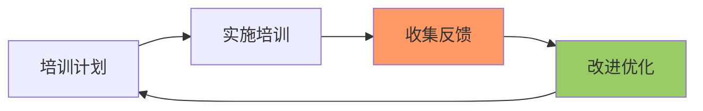

# 🎓 LogiX 开发范式培训计划

**目标**: 确保团队成员理解并应用开发范式，提升整体开发质量  
**周期**: 季度培训 + 月度分享 + 新人必修  
**形式**: 线上 + 线下结合

---

## 📚 培训体系

### Level 1: 入门级（新人必修）

**时长**: 4 小时  
**对象**: 新入职工程师  
**内容**:

#### Module 1: 开发范式概述 (1h)

- 为什么要制定开发范式？
- 核心理念与原则
- 七步法流程
- SKILL 原则详解

**实践练习**:

```markdown
练习 1: 阅读一个简单案例，识别使用了哪些范式步骤
练习 2: 使用 SKILL 原则分析一个小需求
```

#### Module 2: 架构分析法 (1h)

- 五维分析法详解
- 业务架构分析实战
- 数据模型分析要点
- 服务层/前端架构分析

**实践练习**:

```markdown
练习：给定一个功能需求，完成五维分析
输出：架构分析文档
```

#### Module 3: 问题诊断与策略选择 (1h)

- 问题诊断五步法
- 5 Why 分析法
- 方案选择矩阵
- 决策树应用

**实践练习**:

```markdown
练习 1: 对一个 Bug 进行根因分析
练习 2: 为给定场景选择最佳方案
```

#### Module 4: 实施与复盘 (1h)

- SKILL 原则检查清单
- 测试验证策略
- 复盘方法
- 知识沉淀技巧

**实践练习**:

```markdown
练习：模拟一次复盘会议
输出：复盘报告
```

**考核**:

- ✅ 完成所有练习
- ✅ 通过在线测试（80 分及格）
- ✅ 提交一份完整的案例分析

---

### Level 2: 进阶级（全员必修）

**时长**: 8 小时（分 4 次）  
**对象**: 全体开发工程师  
**频率**: 每季度一次

#### Session 1: 深度架构分析 (2h)

**主题**: 复杂系统的架构分析方法

**内容**:

- 微服务架构分析
- 分布式系统数据流分析
- 性能瓶颈识别
- 安全风险评估

**案例研究**:

```markdown
案例：排产系统架构演进

- V1.0: 单体架构
- V2.0: 分层架构
- V3.0: 微服务架构
  讨论：每个阶段的优缺点
```

#### Session 2: SKILL 原则实战 (2h)

**主题**: 如何在日常工作中应用 SKILL 原则

**内容**:

- Code Review 中的 SKILL 检查
- 技术债务识别与偿还
- 渐进式重构技巧
- 知识管理方法

**工作坊**:

```markdown
分组练习：每组分析一段代码

- 识别违反 SKILL 的地方
- 提出改进方案
- 现场重构演示
```

#### Session 3: 方案评审技巧 (2h)

**主题**: 高效的技术评审

**内容**:

- 评审 checklist
- 常见设计缺陷
- 评审沟通技巧
- 决策记录方法

**角色扮演**:

```markdown
模拟评审会：

- 一组汇报技术方案
- 其他组提问和挑战
- 讲师点评
```

#### Session 4: 案例库建设 (2h)

**主题**: 从实践中学习

**内容**:

- 如何编写高质量案例
- 经验教训提炼方法
- 知识库运营技巧
- 技术影响力建设

**实践**:

```markdown
每人贡献一个案例：

- 成功案例或失败案例
- 符合案例模板
- 同伴互评
```

**考核**:

- ✅ 出勤率 > 80%
- ✅ 完成所有工作坊
- ✅ 贡献至少 1 个案例

---

### Level 3: 专家级（可选修）

**时长**: 灵活安排  
**对象**: 技术骨干、架构师  
**形式**: 专题研讨

#### Topic 1: 架构演进模式

**内容**:

- 架构演进的驱动力
- 常见演进模式
- 演进时机判断
- 风险控制策略

**输出**: 架构演进路线图

---

#### Topic 2: 技术债务管理

**内容**:

- 技术债务识别
- 债务量化评估
- 偿还优先级
- 预防机制

**输出**: 技术债务清单和偿还计划

---

#### Topic 3: 工程效能提升

**内容**:

- 效能度量指标
- 瓶颈识别方法
- 改进实验设计
- 持续改进文化

**输出**: 效能提升方案

---

## 📅 月度分享会

**时间**: 每月最后一个周五下午 3:00-5:00  
**形式**: 线上直播 + 线下会议室  
**主讲**: 轮流制（每月 2-3 人）

### 分享主题示例

#### 2026-03: 开发范式发布

- 范式制定背景
- 核心内容解读
- 应用场景说明
- Q&A

#### 2026-04: 架构分析实战

- 真实项目架构分析
- 分析工具介绍
- 常见陷阱与规避
- 互动环节

#### 2026-05: SKILL 原则应用

- SKILL 原则深度解读
- 实际案例分析
- 小组讨论
- 经验分享

#### 2026-06: 中期复盘

- 范式应用情况回顾
- 优秀案例表彰
- 改进建议收集
- 下半年计划

---

## 🎯 培训效果评估

### 评估维度

```typescript
interface TrainingEvaluation {
  // 反应层（学员满意度）
  reaction: {
    satisfaction: number; // 满意度 (1-5)
    relevance: number; // 相关性 (1-5)
    engagement: number; // 参与度 (1-5)
  };

  // 学习层（知识掌握）
  learning: {
    quizScore: number; // 测试成绩
    assignmentScore: number; // 作业成绩
    caseStudyQuality: number; // 案例质量
  };

  // 行为层（实际应用）
  behavior: {
    codeReviewScore: number; // CR 表现
    paradigmCompliance: number; // 范式遵循度
    knowledgeContribution: number; // 知识贡献
  };

  // 结果层（业务影响）
  results: {
    defectRate: number; // 缺陷率变化
    productivity: number; // 生产力变化
    technicalDebt: number; // 技术债务变化
  };
}
```

### 评估方法

#### 即时反馈

- 培训后问卷调查
- 课堂互动表现
- 练习完成情况

#### 短期跟踪（1 个月）

- Code Review 质量
- 方案设计文档
- 案例贡献数量

#### 长期跟踪（季度）

- 代码质量指标
- 项目成功率
- 团队效能提升

---

## 📋 培训资源

### 教材

- ✅ 《LogiX 开发范式》SKILL 文档
- ✅ 《开发范式案例库》
- ✅ 《Clean Code》
- ✅ 《The Pragmatic Programmer》

### 工具

- ✅ 自动检查工具：`dev-paradigm-check.ts`
- ✅ 方案评审模板
- ✅ 复盘报告模板
- ✅ 案例编写模板

### 平台

- ✅ 内部 Wiki：文档查阅
- ✅ 在线学习平台：视频课程
- ✅ GitHub: 代码案例
- ✅ 会议室：线下培训

---

## 🏆 激励机制

### 优秀学员奖

- **评选标准**:
  - 培训成绩 Top 10%
  - 积极分享经验
  - 案例质量高
- **奖励**:
  - 证书
  - 奖金/礼品
  - 晋升加分

### 最佳案例奖

- **评选标准**:
  - 案例价值高
  - 被引用次数多
  - 启发性强
- **奖励**:
  - 公开表彰
  - 积分奖励
  - 年度评优参考

### 布道师认证

- **认证条件**:
  - 通过高级培训
  - 主导过 3+ 次分享
  - 贡献 5+ 高质量案例
- **权益**:
  - 内部讲师资格
  - 优先外派学习
  - 技术影响力提升

---

## 📊 培训日历

### 2026 年 Q2

| 月份 | 主题           | 形式     | 主讲       |
| ---- | -------------- | -------- | ---------- |
| 3 月 | 开发范式发布   | 发布会   | 技术委员会 |
| 4 月 | 架构分析实战   | 工作坊   | 资深架构师 |
| 5 月 | SKILL 原则应用 | 案例研讨 | 技术骨干   |
| 6 月 | 中期复盘       | 总结会   | 全员       |

### 2026 年 Q3

| 月份 | 主题         | 形式     | 主讲     |
| ---- | ------------ | -------- | -------- |
| 7 月 | 技术债务管理 | 专题研讨 | 外部专家 |
| 8 月 | 性能优化实践 | 技术分享 | 性能小组 |
| 9 月 | 季度总结     | 成果展示 | 优秀学员 |

---

## 🔄 持续改进

### 反馈收集

每次培训后收集反馈：

```markdown
## 培训反馈表

### 基本信息

- 培训主题：****\_\_****
- 培训日期：****\_\_****
- 主讲人：****\_\_****

### 评价（1-5 分）

- 内容实用性：⭐⭐⭐⭐⭐
- 讲解清晰度：⭐⭐⭐⭐⭐
- 互动充分性：⭐⭐⭐⭐⭐
- 时间合理性：⭐⭐⭐⭐⭐

### 收获

最大的 3 个收获：

1. ***
2. ***
3. ***

### 建议

需要改进的地方：

1. ***
2. ***

### 期望

希望下次培训的主题：

1. ***
```

### 改进循环



### 年度更新

每年底更新培训内容：

- 新增最佳实践
- 更新失败案例
- 调整培训重点
- 优化培训方式

---

## 📞 联系方式

**培训负责人**: 张三  
**邮箱**: training@logix.com  
**Slack**: #training-channel  
**办公时间**: 每周三下午 2:00-4:00

---

**版本**: v1.0  
**最后更新**: 2026-03-27  
**维护者**: LogiX 技术委员会
