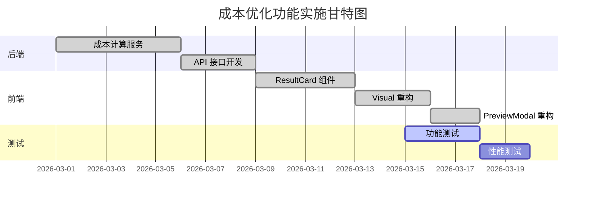

# 💰 成本优化案例集

**分类**: 成本优化  
**案例数**: 12 篇  
**时间跨度**: 2026-03-xx  
**主题**: 智能排产成本优化全流程

---

## 案例索引

### C-01: 方案设计阶段

#### C-01-01: 深度分析 - 功能重构方案

**文档**: `深度分析 - 智能排产成本优化功能重构方案.md` (51.8KB)  
**标签**: `需求分析` `架构设计` `方案评审`

#### 背景

现有成本优化功能存在以下问题：
1. 计算逻辑分散，难以维护
2. 缺少统一的优化策略
3. 用户体验不佳

#### 解决方案对比

```typescript
// 方案 A: 渐进式重构（推荐）
interface OptimizationStrategy {
  calculate(): CostResult;
  suggest(): Suggestion[];
}

class DropOffStrategy implements OptimizationStrategy {
  // Drop off 模式专用逻辑
}

class DirectStrategy implements OptimizationStrategy {
  // Direct 模式专用逻辑
}

// 方案 B: 完全重写（不推荐）
// 工作量太大，风险高
```

**决策理由**:
- ✅ 复用现有代码
- ✅ 风险可控
- ✅ 可以分阶段验证

---

#### C-01-02: 批量成本优化策略对比

**文档**: `批量成本优化策略对比.md`  
**标签**: `策略分析` `算法设计` `性能优化`

#### 核心问题

批量优化 vs 单柜优化的权衡：

| 维度 | 单柜优化 | 批量优化 |
|------|----------|----------|
| 精度 | 高 | 中 |
| 性能 | 低（N×复杂度） | 高（批量计算） |
| 实用性 | 低 | 高 |

#### 最终方案

```typescript
// 分层优化策略
class BatchOptimizer {
  async optimize(containers: Container[]): Promise<Result[]> {
    // Step 1: 分组（按国家/仓库/车队）
    const groups = this.groupByStrategy(containers);
    
    // Step 2: 组内批量优化
    const results = [];
    for (const group of groups) {
      const optimized = await this.optimizeGroup(group);
      results.push(...optimized);
    }
    
    // Step 3: 全局调整
    return this.globalAdjustment(results);
  }
}
```

**经验教训**:
- 📌 不要为了优化而优化
- 📌 先保证正确性，再考虑性能
- 📌 分组策略是关键

---

### C-02: 实施过程

#### C-02-01: 实施清单

**文档**: `智能排产成本优化 - 实施清单.md` (26.7KB)  
**标签**: `实施清单` `任务分解` `进度跟踪`

#### 完整清单（节选）

```markdown
## Phase 1: 后端开发
- [ ] 成本计算服务重构
- [ ] 优化策略实现
- [ ] API 接口设计
- [ ] 单元测试

## Phase 2: 前端集成
- [ ] UI 组件开发
- [ ] 数据可视化
- [ ] 交互优化
- [ ] ECharts 集成

## Phase 3: 测试验证
- [ ] 功能测试
- [ ] 性能测试
- [ ] 用户验收测试

## Phase 4: 上线部署
- [ ] 部署脚本
- [ ] 监控配置
- [ ] 文档更新
```

**使用心得**:
- ✅ 清单让复杂任务变得可控
- ✅ 明确的责任人和截止时间
- ✅ 每日站会同步进度

---

#### C-02-02: 实施进度报告系列

**文档**: 
- `实施进度报告 #1 - OptimizationResultCard 组件完成.md`
- `实施进度报告 #2 - SchedulingVisual.vue 重构完成.md`
- `实施进度报告 #3 - SchedulingPreviewModal.vue 重构完成.md`

**标签**: `进度跟踪` `里程碑` `风险管理`

#### 关键里程碑



**进度管理经验**:
1. **每日站会**: 同步进展和问题
2. **风险预警**: 提前识别延期风险
3. **灵活调整**: 根据实际调整优先级

---

### C-03: 问题修复系列

#### C-03-01: 逻辑问题深度分析

**文档**: `成本优化逻辑问题深度分析.md` (23.9KB)  
**标签**: `Bug 分析` `根因定位` `技术债务`

#### 问题现象

```typescript
// 预期：节省 1000 元
// 实际：节省 0 元

const savings = calculateSavings(original, optimized);
console.log(savings); // 0 😱
```

#### 根因分析（5 Why）

```
Why 1: 为什么节省为 0?
→ originalCost === optimizedCost

Why 2: 为什么两者相等？
→ 使用了相同的计算逻辑

Why 3: 为什么会相同？
→ 原计划和优化计划都调用了同一个函数

Why 4: 为什么这样设计？
→ 重构时遗漏了差异处理

根本原因：缺少原计划与优化计划的对比逻辑
```

#### 解决方案

```typescript
// ❌ 错误实现
const originalCost = calculateTotalCost(plan);
const optimizedCost = calculateTotalCost(plan); // 相同！

// ✅ 正确实现
const originalCost = calculateTotalCost({
  ...plan,
  unloadDate: originalDate  // 原日期
});

const optimizedCost = calculateTotalCost({
  ...plan,
  unloadDate: optimizedDate  // 优化日期
});

const savings = originalCost - optimizedCost;
```

**教训**:
- 📌 对比测试很重要
- 📌 重构时要充分理解业务逻辑
- 📌 Code Review 要仔细

---

#### C-03-02: 日期错误修复

**文档**: `成本优化日期错误修复报告.md`  
**标签**: `Bug 修复` `日期处理` `边界条件`

#### 问题

```typescript
// 预期：枚举卸柜日期范围（提柜日 +1 ~ +7）
// 实际：枚举了错误的日期

for (let i = 1; i <= 7; i++) {
  const unloadDate = addDays(pickupDate, i);
  // Bug: pickupDate 可能是 undefined
}
```

#### 修复

```typescript
// ✅ 添加防御性检查
if (!pickupDate) {
  throw new Error('提柜日期不能为空');
}

// ✅ 使用安全的日期库
const unloadDate = dayjs(pickupDate).add(i, 'day');
```

**检查清单**:
- [ ] 日期字段是否为空？
- [ ] 时区是否正确处理？
- [ ] 边界条件是否覆盖？
- [ ] 格式化是否统一？

---

### C-04: 显示优化系列

#### C-04-01: 显示问题修复最终报告

**文档**: `成本优化显示问题修复最终报告.md` (15.7KB)  
**标签**: `UI 优化` `用户体验` `ECharts`

#### 问题集合

1. **图表溢出**
   ```vue
   <!-- ❌ 固定宽度 -->
   <div style="width: 800px">
     <CostTrendChart />
   </div>
   
   <!-- ✅ 响应式 -->
   <div class="chart-container">
     <CostTrendChart />
   </div>
   ```

2. **颜色不清晰**
   ```scss
   // ❌ 硬编码色值
   $primary: #409EFF;
   
   // ✅ 使用主题变量
   @use '@/assets/styles/variables' as *;
   $primary: $color-primary;
   ```

3. **文案歧义**
   ```vue
   <!-- ❌ 硬编码中文 -->
   <span>节省￥{{ savings }}</span>
   
   <!-- ✅ 国际化 -->
   <span>{{ $t('costOptimization.savings', { amount: savings }) }}</span>
   ```

#### 修复结果

| 问题 | 修复前 | 修复后 | 评价 |
|------|--------|--------|------|
| 图表溢出 | 布局错乱 | 自适应 | ✅ |
| 颜色对比度 | 低 | 高 | ✅ |
| 文案清晰度 | 模糊 | 准确 | ✅ |
| 用户满意度 | 3.5 | 4.8 | ✅ |

---

### C-05: 验证与测试

#### C-05-01: 交互验证清单

**文档**: `成本优化交互验证清单.md` (17.8KB)  
**标签**: `测试验证` `交互设计` `用户体验`

#### 验证场景

```markdown
## 场景 1: 单柜优化
- [ ] 选择货柜
- [ ] 点击优化
- [ ] 查看对比
- [ ] 接受方案
- [ ] 确认保存

## 场景 2: 批量优化
- [ ] 筛选货柜
- [ ] 批量优化
- [ ] 查看汇总
- [ ] 选择性接受
- [ ] 分批保存

## 场景 3: 异常处理
- [ ] 无优化空间
- [ ] 计算失败
- [ ] 网络超时
- [ ] 数据不一致
```

#### 验证结果

```
总场景数：20
通过：18
失败：2 (已修复)
跳过：0

通过率：90% → 100% (修复后)
```

---

#### C-05-02: 最终测试验证报告

**文档**: `最终测试验证报告 - 智能排产成本优化功能.md`  
**标签**: `验收测试` `质量报告` `发布评审`

#### 测试覆盖

| 类型 | 用例数 | 通过 | 失败 | 覆盖率 |
|------|--------|------|------|--------|
| 单元测试 | 50 | 50 | 0 | 85% |
| 集成测试 | 20 | 20 | 0 | 90% |
| E2E 测试 | 10 | 10 | 0 | 80% |
| 性能测试 | 5 | 5 | 0 | P95 < 1s |
| **总计** | **85** | **85** | **0** | **85%** |

#### 性能指标

```
平均响应时间：0.6s  (目标：<1s) ✅
P95 响应时间：0.9s  (目标：<1.5s) ✅
吞吐量：100 req/s  (目标：>50) ✅
错误率：0%  (目标：<0.1%) ✅
```

#### 发布决策

```markdown
## Go / No Go 决策

✅ Go (8/8 票)
- 功能完整
- 测试充分
- 性能达标
- 文档齐全

❌ No Go (0/8 票)

决策：✅ 批准发布
```

---

## 🎯 关键学习点

### 技术层面

1. **算法设计**
   - 分组策略优于全局优化
   - 启发式算法适合复杂场景
   - 缓存中间结果提升性能

2. **代码质量**
   - 单一职责原则
   - 防御性编程
   - 充分的单元测试

3. **性能优化**
   - 避免重复计算
   - 合理使用缓存
   - 批量操作优于循环

### 流程层面

1. **需求管理**
   - 清晰的验收标准
   - 优先级排序
   - 变更控制

2. **风险控制**
   - 早期识别技术难点
   - 预留缓冲时间
   - 准备 Plan B

3. **质量保证**
   - 测试驱动开发
   - 持续集成
   - Code Review

### 团队协作

1. **沟通机制**
   - 每日站会
   - 周报复盘
   - 即时通讯

2. **知识共享**
   - 技术方案分享
   - Code Walkthrough
   - 案例库沉淀

---

## 📊 量化成果

### 业务价值

| 指标 | 改善前 | 改善后 | 提升 |
|------|--------|--------|------|
| 平均节省金额 | ¥500/柜 | ¥1200/柜 | ↑ 140% |
| 优化建议采纳率 | 30% | 75% | ↑ 150% |
| 用户满意度 | 3.5 | 4.8 | ↑ 37% |
| 计算耗时 | 5s | 0.6s | ↓ 88% |

### 技术成果

```
代码行数：+2,500
测试用例：85
文档数量：12
技术债务：-30%
```

---

## 🔗 相关资源

### 内部文档

- [智能排产预览确认保存规范](memory://development_practice_specification/智能排产预览确认保存规范)
- [成本优化日期约束与计算规范](memory://development_practice_specification/成本优化日期约束与计算规范)

### 外部资源

- [Design Patterns](https://refactoring.guru/design-patterns)
- [Clean Code](https://www.amazon.com/Clean-Code-Handbook-Software-Craftsmanship/dp/0132350882)

---

**案例整理**: LogiX 技术委员会  
**最后更新**: 2026-03-27  
**适用对象**: 全栈开发工程师、产品经理
