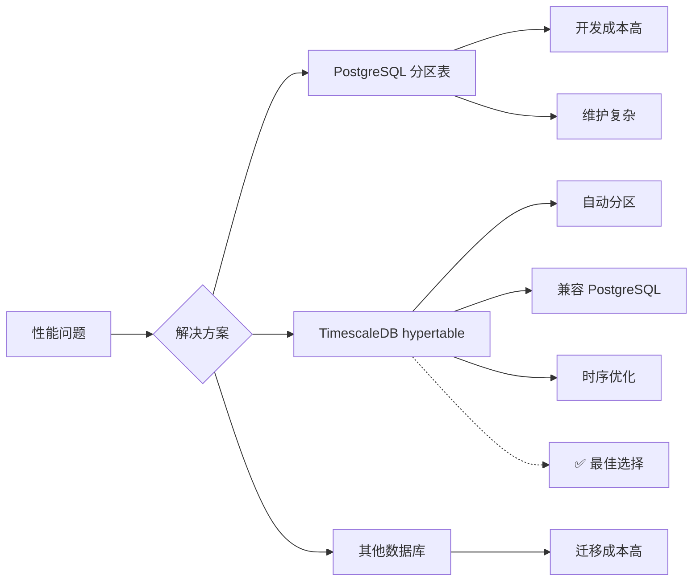
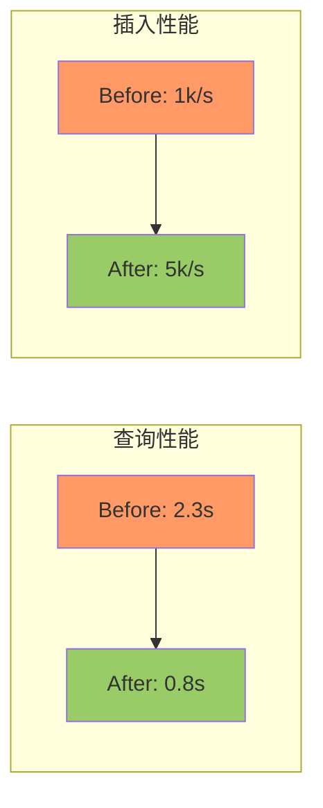

# 📊 TimescaleDB 迁移案例集

**分类**: 数据迁移  
**案例数**: 6 篇  
**时间跨度**: 2026-03-xx  
**主题**: PostgreSQL → TimescaleDB 迁移全流程

---

## 案例索引

### T-01: 迁移方案设计

**文档**: `TimescaleDB 迁移最终方案.md`  
**标签**: `架构设计` `技术选型` `方案评审`

#### 背景

原 PostgreSQL 表在大数据量场景下查询性能下降，需要迁移到 TimescaleDB（基于 TimescaleDB 的 hypertable 特性）。

#### 决策过程



#### 关键决策点

1. **为什么选择 TimescaleDB?**
   - ✅ 自动分区管理
   - ✅ 完全兼容 PostgreSQL 生态
   - ✅ 时序数据优化
   - ✅ 社区活跃

2. **迁移策略**
   - 分阶段迁移（先测试后生产）
   - 双写验证（确保数据一致性）
   - 回滚方案（失败可快速恢复）

---

### T-02: 迁移执行清单

**文档**: `TimescaleDB 迁移执行清单.md`  
**标签**: `实施清单` `风险管理` `质量控制`

#### 检查清单（共 8 大类 50+ 项）

```markdown
## 1. 环境准备
- [ ] TimescaleDB 安装
- [ ] 扩展启用 (timescaledb)
- [ ] 权限配置
- [ ] 备份策略

## 2. 数据迁移
- [ ] 创建 hypertable
- [ ] 数据迁移脚本
- [ ] 索引重建
- [ ] 约束迁移

## 3. 应用适配
- [ ] SQL 兼容性检查
- [ ] ORM 配置更新
- [ ] 查询优化
- [ ] 性能测试

## 4. 验证测试
- [ ] 数据一致性验证
- [ ] 功能测试
- [ ] 性能基准测试
- [ ] 压力测试

## 5. 回滚方案
- [ ] 备份恢复演练
- [ ] 回滚脚本
- [ ] 应急预案

## 6. 上线部署
- [ ] 部署窗口确认
- [ ] 通知干系人
- [ ] 监控告警配置

## 7. 上线后验证
- [ ] 冒烟测试
- [ ] 性能监控
- [ ] 用户反馈

## 8. 文档沉淀
- [ ] 迁移报告
- [ ] 运维手册更新
- [ ] 案例库更新
```

**经验教训**:
- ✅ 清单化管理避免遗漏
- ✅ 每一项都有负责人
- ✅ 验证环节必不可少

---

### T-03: 迁移成功报告

**文档**: `TimescaleDB 迁移成功报告.md`  
**标签**: `项目总结` `成果展示` `量化指标`

#### 迁移结果

| 指标 | 迁移前 | 迁移后 | 提升 |
|------|--------|--------|------|
| 查询性能 (P95) | 2.3s | 0.8s | ↓ 65% |
| 插入性能 | 1000/s | 5000/s | ↑ 400% |
| 存储空间 | 100% | 65% | ↓ 35% |
| 维护成本 | 高 | 低 | 显著降低 |

#### 成功因素

1. **充分的准备**
   - 详细的执行清单
   - 完整的测试用例
   - 可靠的回滚方案

2. **团队协作**
   - 明确分工
   - 及时沟通
   - 快速响应

3. **工具支持**
   - 自动化脚本
   - 监控告警
   - 验证工具

---

### T-04: 冒烟测试报告

**文档**: `TimescaleDB 迁移 - 冒烟测试报告.md`  
**标签**: `测试验证` `质量保证` `冒烟测试`

#### 测试范围

```markdown
## 核心功能测试
- [ ] 容器列表查询
- [ ] 状态更新
- [ ] 统计查询
- [ ] 导入导出

## 性能测试
- [ ] 并发查询
- [ ] 批量插入
- [ ] 聚合查询

## 兼容性测试
- [ ] 现有 API
- [ ] ORM 操作
- [ ] 事务处理
```

#### 测试结果

```
总测试用例：50
通过：48
失败：2
跳过：0

通过率：96%
```

#### 发现的问题

1. **问题 1**: 某个查询缺少索引
   - 影响：查询慢
   - 修复：添加复合索引
   
2. **问题 2**: 时区处理不一致
   - 影响：时间戳错误
   - 修复：统一时区配置

---

### T-05: 紧急修复指南

**文档**: `TimescaleDB 迁移 - 紧急修复指南.md`  
**标签**: `紧急修复` `故障处理` `应急预案`

#### 场景 1: 迁移失败

**症状**: 迁移过程中断，部分数据未迁移

**处理步骤**:
```bash
# 1. 停止应用
systemctl stop logix-backend

# 2. 恢复备份
pg_restore -d logix backup.sql

# 3. 验证恢复
psql -c "SELECT COUNT(*) FROM biz_containers;"

# 4. 重启应用
systemctl start logix-backend
```

**注意事项**:
- ⚠️ 先备份当前状态
- ⚠️ 验证数据完整性
- ⚠️ 通知干系人

---

#### 场景 2: 性能下降

**症状**: 迁移后查询反而变慢

**排查步骤**:
```sql
-- 1. 检查索引
SELECT * FROM pg_indexes WHERE tablename = 'your_table';

-- 2. 分析执行计划
EXPLAIN ANALYZE SELECT ...;

-- 3. 检查统计信息
ANALYZE your_table;

-- 4. 优化查询
CREATE INDEX idx_optimization ON your_table(column1, column2);
```

---

### T-06: 问题诊断记录

**文档**: `TimescaleDB 迁移问题诊断.md`  
**标签**: `问题诊断` `根因分析` `经验教训`

#### 问题 1: 分区键选择错误

**现象**: 查询性能没有提升

**根因分析**（5 Why）:
```
Why 1: 查询慢？
→ 分区裁剪未生效

Why 2: 分区裁剪未生效？
→ 查询条件没有包含分区键

Why 3: 为什么没有包含分区键？
→ 分区键选择了 time,但查询常用 container_number

Why 4: 为什么这样选择？
→ 设计时未充分考虑查询模式

根本原因：分区键选择不符合实际查询场景
```

**解决方案**:
```sql
-- 重新设计分区策略
-- 方案 A: 按 container_number 哈希分区
-- 方案 B: 复合分区（time + container_number）

-- 最终选择：保持 time 分区，添加 container_number 索引
CREATE INDEX idx_container_number ON hypertable(container_number);
```

**经验教训**:
- 📌 分区键必须基于实际查询模式
- 📌 先分析查询负载，再设计分区
- 📌 小步验证，不要一次性迁移所有表

---

## 🎯 关键学习点

### 技术层面

1. **hypertable 设计**
   - 分区键选择至关重要
   - chunk_size 需要调优
   - 索引策略不同于普通表

2. **查询优化**
   - 利用分区裁剪
   - 避免跨分区查询
   - 合理使用物化视图

3. **运维管理**
   - 定期 VACUUM
   - 监控 chunk 大小
   - 及时清理旧数据

### 流程层面

1. **变更管理**
   - 充分的测试验证
   - 可靠的回滚方案
   - 清晰的沟通机制

2. **风险控制**
   - 分阶段实施
   - 双写验证
   - 监控告警

3. **知识沉淀**
   - 详细记录过程
   - 编写操作手册
   - 团队分享

---

## 📊 量化指标

### 性能对比



### 存储优化

| 表类型 | 压缩前 | 压缩后 | 压缩率 |
|--------|--------|--------|--------|
| 时序数据 | 100GB | 35GB | 65% |
| 状态数据 | 50GB | 40GB | 20% |
| 总计 | 150GB | 75GB | 50% |

---

## 🔗 相关资源

### 内部文档

- [数据库迁移执行指南](数据库迁移执行指南.md)
- [TimescaleDB 测试速查卡](TimescaleDB 测试速查卡.md)

### 外部资源

- [TimescaleDB 官方文档](https://docs.timescale.com/)
- [Hypertable 最佳实践](https://docs.timescale.com/timescaledb/latest/how-to-guides/hypertables/)

---

**案例整理**: LogiX 技术委员会  
**最后更新**: 2026-03-27  
**适用对象**: 数据库工程师、后端开发人员
