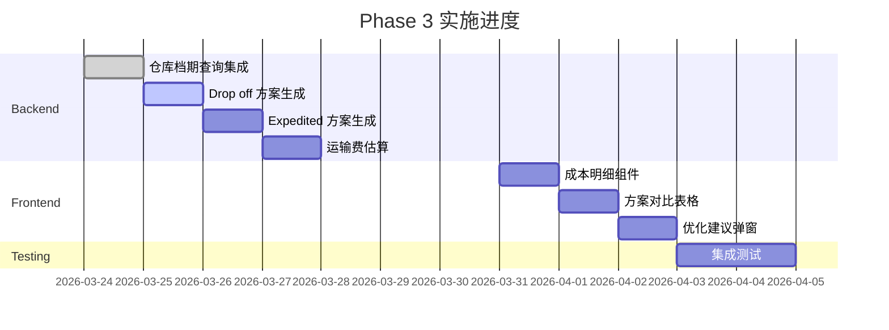

# Phase 3 实施准备清单

**制定日期**: 2026-03-17  
**阶段**: Phase 3 - 完整功能集成  
**状态**: ✅ **准备就绪**

---

## ✅ 前置条件检查

### Phase 1 & 2 完成情况

- [x] **Phase 1: 基础准备**
  - [x] 数据库配置（8 个配置项 + 3 个索引）✅
  - [x] Service 扩展（2 个预测方法）✅
  - [x] 单元测试框架 ✅
  - [x] SQL 脚本已执行并验证 ✅

- [x] **Phase 2: 成本预测**
  - [x] 核心服务创建（295 行代码）✅
  - [x] 集成示例提供（374 行代码）✅
  - [x] 单元测试编写（341 行代码）✅
  - [x] 文档齐全（2 份详细报告）✅

### 技术栈准备

- [x] TypeScript 环境 ✅
- [x] PostgreSQL 数据库 ✅
- [x] TypeORM 已配置 ✅
- [x] Jest 测试框架 ✅
- [x] Express/NestJS 架构 ✅

### 数据库准备

- [x] `dict_scheduling_config` 表有配置数据 ✅
- [x] `ext_demurrage_standards` 表有滞港费标准 ✅
- [x] `ext_warehouse_daily_occupancy` 表结构存在 ✅
- [x] `ext_trucking_slot_occupancy` 表结构存在 ✅
- [x] `warehouse_trucking_mapping` 表有映射关系 ✅
- [x] `trucking_port_mapping` 表有映射关系 ✅

---

## 📋 Phase 3 任务分解

### P0 任务（必须完成）

#### 1. 仓库档期查询集成 (2-3 小时)

**目标**: 复用现有的档期查询逻辑

**准备工作**:
- [ ] 阅读 `intelligentScheduling.service.ts` 中的 `findEarliestAvailableDay()` 方法
- [ ] 理解仓库档期数据结构
- [ ] 确认 `ext_warehouse_daily_occupancy` 表字段

**实施步骤**:
```typescript
// 1. 在 schedulingCostOptimizer.service.ts 中添加方法
private async isWarehouseAvailable(
  warehouseCode: string,
  date: Date
): Promise<boolean> {
  const occupancy = await this.warehouseOccupancyRepo.findOne({
    where: { warehouseCode, date }
  });
  
  if (!occupancy) {
    return true; // 无记录表示有产能
  }
  
  return occupancy.plannedCount < occupancy.capacity;
}

// 2. 在 generateAllFeasibleOptions() 中调用
for (const warehouse of warehouses) {
  for (let offset = 0; offset < searchWindowDays; offset++) {
    const candidateDate = addDays(pickupDate, offset);
    
    // 添加档期检查
    if (!await this.isWarehouseAvailable(warehouse.warehouseCode, candidateDate)) {
      continue; // 跳过已满的日期
    }
    
    options.push({...});
  }
}
```

**验收标准**:
- [ ] 能够正确判断仓库是否有档期
- [ ] 跳过已满的日期
- [ ] 返回可用的卸柜日期列表

---

#### 2. Drop off 方案生成 (3-4 小时)

**目标**: 生成先卸堆场的方案

**准备工作**:
- [ ] 研究 `warehouse_trucking_mapping` 表结构
- [ ] 确认哪些车队有堆场（`has_yard = true`）
- [ ] 理解 Drop off 模式的约束（提 < 送 = 卸）

**实施步骤**:
```typescript
async generateDropOffOptions(
  container: Container,
  pickupDate: Date,
  lastFreeDate: Date
): Promise<UnloadOption[]> {
  // 1. 查询有堆场的车队
  const mappings = await this.warehouseTruckingMappingRepo.find({
    where: {
      country: container.countryCode,
      isActive: true
    },
    relations: ['truckingCompany']
  });
  
  const truckingWithYard = mappings.filter(m => m.truckingCompany.hasYard);
  
  // 2. 为每个车队生成方案
  const options: UnloadOption[] = [];
  for (const mapping of truckingWithYard) {
    for (let offset = 1; offset <= 7; offset++) {
      const unloadDate = addDays(pickupDate, offset);
      
      // 3. 检查档期和免费期
      const isWithinFreePeriod = unloadDate <= lastFreeDate;
      const isAvailable = await this.isSlotAvailable(
        mapping.truckingCompany,
        unloadDate
      );
      
      if (isAvailable) {
        options.push({
          containerNumber: container.containerNumber,
          warehouse: mapping.warehouse,
          unloadDate,
          strategy: 'Drop off',
          truckingCompany: mapping.truckingCompany,
          isWithinFreePeriod
        });
      }
    }
  }
  
  return options;
}
```

**验收标准**:
- [ ] 只生成有堆场车队的方案
- [ ] 符合 Drop off 约束（提 < 送 = 卸）
- [ ] 正确计算堆存费

---

#### 3. Expedited 方案生成 (2-3 小时)

**目标**: 生成协调加急的方案

**准备工作**:
- [ ] 定义"紧急"阈值（≤ 2 天）
- [ ] 确认哪些仓库/车队支持加急处理
- [ ] 从配置表读取加急费率

**实施步骤**:
```typescript
async generateExpeditedOptions(
  container: Container,
  lastFreeDate: Date
): Promise<UnloadOption[]> {
  const today = new Date();
  today.setHours(0, 0, 0, 0);
  const lastFreeOnly = new Date(lastFreeDate);
  lastFreeOnly.setHours(0, 0, 0, 0);
  
  const daysUntilFreezeExpires = Math.ceil(
    (lastFreeOnly.getTime() - today.getTime()) / (1000 * 60 * 60 * 24)
  );
  
  // 只有在紧急情况下才生成加急方案
  if (daysUntilFreezeExpires > 2) {
    return []; // 不紧急，不需要加急
  }
  
  // 查询支持加急的合作伙伴
  const expeditedPartners = await this.getExpeditedPartners(
    container.countryCode,
    container.portCode
  );
  
  const options: UnloadOption[] = [];
  for (const partner of expeditedPartners) {
    options.push({
      containerNumber: container.containerNumber,
      warehouse: partner.warehouse,
      unloadDate: lastFreeDate,
      strategy: 'Expedited',
      truckingCompany: partner.trucking,
      isWithinFreePeriod: true
    });
  }
  
  return options;
}
```

**验收标准**:
- [ ] 只在紧急情况下生成加急方案
- [ ] 优先安排在免费期内
- [ ] 正确计算加急费

---

#### 4. 运输费估算 (4-5 小时)

**目标**: 基于距离和卸柜方式估算运输费用

**准备工作**:
- [ ] 设计距离数据结构
- [ ] 确定主要港口 - 仓库距离
- [ ] 从配置表读取费率

**数据结构**:
```typescript
// 配置表新增配置项
interface TransportConfig {
  baseRatePerMile: number;     // 每英里基础费率
  directMultiplier: number;    // Direct 模式倍数
  dropOffMultiplier: number;   // Drop off 模式倍数
  expeditedMultiplier: number; // Expedited 模式倍数
}

// 距离矩阵（硬编码或数据库）
interface DistanceMatrix {
  [portCode: string]: {
    [warehouseCode: string]: number; // 距离（英里）
  };
}

// 示例数据
const DISTANCE_MATRIX: DistanceMatrix = {
  'USLAX': {
    'WH001': 25, // LAX 港口 → 1 号仓库
    'WH002': 35,
  },
  'USLGB': {
    'WH001': 30,
    'WH002': 40,
  }
};
```

**实施步骤**:
```typescript
// 1. 在 dict_scheduling_config 中添加配置
/*
INSERT INTO dict_scheduling_config (config_key, config_value, description) VALUES
('transport_base_rate_per_mile', '2.5', '运输基础费率 (USD/英里)'),
('transport_direct_multiplier', '1.0', 'Direct 模式倍数'),
('transport_dropoff_multiplier', '1.2', 'Drop off 模式倍数'),
('transport_expedited_multiplier', '1.5', 'Expedited 模式倍数')
ON CONFLICT (config_key) DO UPDATE SET ...
*/

// 2. 实现计算函数
private async calculateTransportationCost(
  portCode: string,
  warehouseCode: string,
  strategy: 'Direct' | 'Drop off' | 'Expedited'
): Promise<number> {
  // 获取距离
  const distance = this.getDistance(portCode, warehouseCode);
  
  // 读取配置
  const baseRate = await this.getConfigNumber('transport_base_rate_per_mile', 2.5);
  const multipliers = {
    'Direct': await this.getConfigNumber('transport_direct_multiplier', 1.0),
    'Drop off': await this.getConfigNumber('transport_dropoff_multiplier', 1.2),
    'Expedited': await this.getConfigNumber('transport_expedited_multiplier', 1.5)
  };
  
  // 计算
  const baseCost = distance * baseRate;
  const multiplier = multipliers[strategy];
  
  return baseCost * multiplier;
}
```

**验收标准**:
- [ ] 能够正确获取港口 - 仓库距离
- [ ] 费率从配置表读取
- [ ] 不同策略有不同倍数
- [ ] 计算结果合理

---

### P1 任务（重要但不紧急）

#### 5. 前端 UI 开发 (8-10 小时)

**目标**: 开发成本展示和优化建议的用户界面

**组件清单**:

**1. CostBreakdown.vue** - 成本明细组件
```vue
<template>
  <div class="cost-breakdown">
    <h3>💰 成本明细</h3>
    
    <div class="cost-item">
      <span class="label">滞港费</span>
      <span class="value">${{ breakdown.demurrageCost.toFixed(2) }}</span>
    </div>
    
    <div class="cost-item" v-if="breakdown.storageCost > 0">
      <span class="label">堆存费</span>
      <span class="value">${{ breakdown.storageCost.toFixed(2) }}</span>
    </div>
    
    <div class="cost-item" v-if="breakdown.handlingCost > 0">
      <span class="label">加急费</span>
      <span class="value">${{ breakdown.handlingCost.toFixed(2) }}</span>
    </div>
    
    <div class="cost-divider">
      <span class="label">总成本</span>
      <span class="value total">${{ breakdown.totalCost.toFixed(2) }}</span>
    </div>
    
    <!-- 优化建议 -->
    <div v-if="!isOptimal" class="optimization-tip">
      <el-alert
        :title="optimizationAdvice"
        type="success"
        show-icon
        closable
      />
    </div>
  </div>
</template>

<script lang="ts">
export default defineComponent({
  props: {
    breakdown: {
      type: Object as PropType<CostBreakdown>,
      required: true
    },
    isOptimal: Boolean,
    optimizationAdvice: String
  }
});
</script>
```

**2. OptionComparison.vue** - 方案对比表格
```vue
<template>
  <el-table :data="options" style="width: 100%">
    <el-table-column prop="unloadDate" label="卸柜日" width="120">
      <template #default="{ row }">
        {{ formatDate(row.unloadDate) }}
      </template>
    </el-table-column>
    
    <el-table-column prop="strategy" label="策略" width="100">
      <template #default="{ row }">
        <el-tag :type="getStrategyTagType(row.strategy)">
          {{ row.strategy }}
        </el-tag>
      </template>
    </el-table-column>
    
    <el-table-column prop="totalCost" label="总成本" width="120">
      <template #default="{ row }">
        ${{ row.totalCost?.toFixed(2) || '0.00' }}
      </template>
    </el-table-column>
    
    <el-table-column label="可节省" width="120">
      <template #default="{ row }">
        <span v-if="row.savings > 0" class="savings-highlight">
          -${{ row.savings.toFixed(2) }}
        </span>
        <span v-else>-</span>
      </template>
    </el-table-column>
    
    <el-table-column label="操作" width="100">
      <template #default="{ row }">
        <el-button
          type="primary"
          size="small"
          @click="$emit('select', row)"
        >
          选择
        </el-button>
      </template>
    </el-table-column>
  </el-table>
</template>
```

**3. OptimizationModal.vue** - 优化建议弹窗
```vue
<template>
  <el-dialog
    v-model="visible"
    title="💰 优化建议"
    width="500px"
  >
    <div class="optimization-content">
      <p class="advice-text">{{ advice.optimizationAdvice }}</p>
      
      <div class="savings-box">
        <div class="savings-label">可节省金额</div>
        <div class="savings-amount">
          ${{ advice.potentialSavings.toFixed(2) }}
        </div>
      </div>
      
      <div class="comparison">
        <div class="item">
          <span class="label">当前方案:</span>
          <span class="value">${{ advice.currentCost.toFixed(2) }}</span>
        </div>
        <div class="item">
          <span class="label">最优方案:</span>
          <span class="value">${{ advice.optimalCost.toFixed(2) }}</span>
        </div>
      </div>
    </div>
    
    <template #footer>
      <el-button @click="handleKeepCurrent">保持原方案</el-button>
      <el-button type="primary" @click="handleApplyOptimization">
        应用优化
      </el-button>
    </template>
  </el-dialog>
</template>
```

**验收标准**:
- [ ] 成本明细清晰展示
- [ ] 方案对比表格美观
- [ ] 优化建议弹窗友好
- [ ] 响应式布局正常
- [ ] 与后端数据对接成功

---

#### 6. 集成测试 (4-5 小时)

**目标**: 对 Phase 3 的所有功能进行完整的集成测试

**测试场景**:

**场景 1: 单柜全流程优化**
```typescript
it('should complete full optimization workflow for single container', async () => {
  // 1. 准备测试数据
  const container = await createTestContainer({
    containerNumber: 'TGHU1234567',
    countryCode: 'US',
    portCode: 'USLAX'
  });
  
  const pickupDate = new Date('2026-03-20');
  const lastFreeDate = new Date('2026-03-25');
  
  // 2. 执行成本优化
  const result = await costOptimizer.optimizeSchedule(
    container,
    pickupDate,
    lastFreeDate
  );
  
  // 3. 验证结果
  expect(result.options.length).toBeGreaterThan(0);
  expect(result.bestOption).toBeDefined();
  expect(result.costBreakdown.totalCost).toBeGreaterThan(0);
  expect(result.optimizationAdvice).toBeDefined();
});
```

**场景 2: 批量处理性能测试**
```typescript
it('should handle batch processing efficiently', async () => {
  const containers = await createTestContainers(100);
  const startTime = Date.now();
  
  await Promise.all(
    containers.map(c => costOptimizer.optimizeSchedule(c))
  );
  
  const duration = Date.now() - startTime;
  expect(duration).toBeLessThan(30000); // 30 秒内完成
});
```

**场景 3: 边界条件测试**
```typescript
it('should handle free period expiration correctly', async () => {
  const container = await createTestContainer();
  const pickupDate = new Date('2026-03-20');
  const lastFreeDate = new Date('2026-03-21'); // 明天就到期
  
  const result = await costOptimizer.optimizeSchedule(
    container,
    pickupDate,
    lastFreeDate
  );
  
  // 应该生成 Expedited 方案
  const hasExpedited = result.options.some(
    opt => opt.strategy === 'Expedited'
  );
  expect(hasExpedited).toBe(true);
});
```

**验收标准**:
- [ ] 所有测试用例通过
- [ ] 代码覆盖率 > 80%
- [ ] 性能达标
- [ ] 边界条件处理正确

---

## 🎯 实施计划

### 第 1 周（Backend 核心功能）

| 时间 | 任务 | 预计工时 | 交付物 |
|------|------|----------|--------|
| Day 1 | 仓库档期查询集成 | 3 小时 | 代码 + 测试 |
| Day 2 | Drop off 方案生成 | 4 小时 | 代码 + 测试 |
| Day 3 | Expedited 方案生成 | 3 小时 | 代码 + 测试 |
| Day 4 | 运输费估算 | 5 小时 | 代码 + 测试 |
| Day 5 | 后端功能自测 + 修复 | 4 小时 | 测试报告 |

### 第 2 周（Frontend UI + 集成测试）

| 时间 | 任务 | 预计工时 | 交付物 |
|------|------|----------|--------|
| Day 1-2 | 成本明细组件 | 6 小时 | Vue 组件 |
| Day 3 | 方案对比表格 | 4 小时 | Vue 组件 |
| Day 4 | 优化建议弹窗 | 4 小时 | Vue 组件 |
| Day 5 | 集成测试 + 文档 | 6 小时 | 测试报告 + 文档 |

---

## 📊 进度跟踪

### 任务完成状态



---

## 🚀 开始实施

### 立即行动

1. ✅ **确认前置条件**
   - Phase 1 & 2 已完成
   - 数据库已就绪
   - 开发环境已配置

2. ⏳ **开始任务 3.1**
   - 阅读相关代码
   - 实现仓库档期查询
   - 编写单元测试

3. ⏳ **准备测试数据**
   - 创建测试容器
   - 准备测试仓库
   - 配置测试车队

---

## 📄 相关文档

- [`Phase3 实施方案.md`](./Phase3 实施方案.md) - 详细方案
- [`Phase2 完成报告.md`](./Phase2 完成报告.md) - Phase 2 总结
- [`智能排柜系统重构与优化方案.md`](./智能排柜系统重构与优化方案.md) - 主方案

---

**Phase 3 状态**: ✅ **准备就绪**  
**预计开始**: 2026-03-24  
**预计完成**: 2026-04-07  
**实施负责人**: AI Development Team
