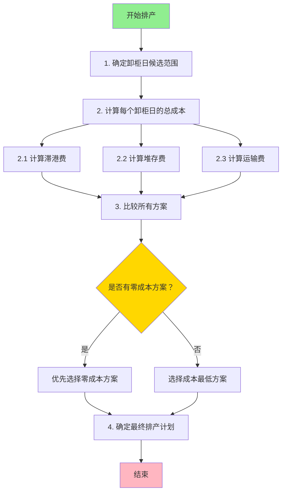

# 智能排柜系统 - 成本优化策略详细方案

**版本**: v4.0 (成本优化版)  
**制定日期**: 2026-03-17  
**状态**: 🎯 待实施  

---

## 🎯 一、核心优化理念

### 传统排产逻辑（当前实现）

```
1. 清关日 = ETA || ATA
2. 提柜日 = 清关日 + 1 (受 last_free_date 约束)
3. 卸柜日 = 查找最早可用仓库档期
4. 送柜日 = 根据模式推导
5. 还箱日 = 根据模式推导

❌ 问题：没有考虑滞港费，可能导致不必要的成本
```

### 成本优化逻辑（新方案）

```
1. 卸柜日是关键瓶颈 ← 先确定
2. 评估港口免费天数利用情况
3. 计算是否会产生滞港费
   ├─ 不会产生滞港 → 按 Live load/Drop off 正常计算
   └─ 会产生滞港费 → 启动成本优化策略
       ├─ 比较有堆场车队的 Drop off 方案
       ├─ 比较外部堆场方案
       └─ 选择总成本最低的方案

✅ 优势：充分利用免费期，最小化总成本
```

---

## 📊 二、成本构成分析

### 2.1 主要成本类型

| 成本类型 | 计费方式 | 触发条件 | 优化空间 |
|----------|----------|----------|----------|
| **滞港费** | 阶梯式累进 | 超过 last_free_date 未提柜 | ⭐⭐⭐⭐⭐ |
| **堆存费** | 按天计算 | 使用外部堆场 | ⭐⭐⭐ |
| **运输费** | 固定费用 | Live load vs Drop off | ⭐⭐ |
| **还箱费** | 按次计算 | Drop off 模式 | ⭐ |

### 2.2 滞港费计算模型

```typescript
interface DemurrageCalculation {
  lastFreeDate: Date;      // 免费期截止日
  chargeDays: number;      // 计费天数
  totalAmount: number;     // 总费用
  tierBreakdown: [{
    fromDay: number;       // 第几天开始
    toDay: number;         // 第几天结束
    days: number;          // 天数
    ratePerDay: number;    // 每天费率
    subtotal: number;      // 小计
  }]
}

// 典型阶梯费率示例
const tiers = [
  { fromDay: 1, toDay: 5, ratePerDay: 100 },   // 第 1-5 天：$100/天
  { fromDay: 6, toDay: 10, ratePerDay: 200 },  // 第 6-10 天：$200/天
  { fromDay: 11, toDay: null, ratePerDay: 300 } // 第 11 天起：$300/天
]
```

### 2.3 成本对比案例

**场景**: 货柜 ETA=2026-03-20, last_free_date=2026-03-27

#### 方案 A: 传统排产（产生滞港费）

```
排产计划:
- 提柜日：2026-03-28 (超过 last_free_date 1 天)
- 卸柜日：2026-03-28 (仓库产能充足)
- 模式：Live load

成本:
- 滞港费：$100 × 1 天 = $100
- 堆存费：$0
- 总成本：$100
```

#### 方案 B: 提前排产（避免滞港费）

```
排产计划:
- 提柜日：2026-03-27 (last_free_date 当天)
- 卸柜日：2026-03-27 (协调仓库加急)
- 模式：Live load

成本:
- 滞港费：$0 (在免费期内)
- 堆存费：$0
- 总成本：$0

💰 节省：$100
```

#### 方案 C: Drop off + 外部堆场（综合成本最优）

```
场景：仓库产能不足，必须延迟卸柜

排产计划:
- 提柜日：2026-03-27 (按时提柜)
- 卸柜日：2026-03-30 (3 天后，仓库有产能)
- 中间存储：外部堆场 (2 天)
- 模式：Drop off (车队有堆场)

成本:
- 滞港费：$0 (按时提柜)
- 堆存费：$50 × 2 天 = $100
- 运输费：+$30 (Drop off 操作)
- 总成本：$130

vs 方案 A (直接滞港 3 天):
- 滞港费：$100 + $200 + $300 = $600
💰 节省：$470
```

---

## 🔄 三、优化算法流程

### 3.1 主流程图



### 3.2 详细步骤

#### 步骤 1: 确定卸柜日候选范围

```typescript
interface UnloadDateOption {
  date: Date;              // 候选卸柜日
  warehouseCapacity: number; // 仓库剩余产能
  isWithinFreePeriod: boolean; // 是否在免费期内
  demurrageDays: number;   // 预计滞港天数
  estimatedDemurrage: number; // 预估滞港费
}

async function getUnloadDateCandidates(
  warehouse: Warehouse,
  startDate: Date,
  lastFreeDate: Date,
  maxDays: number = 10
): Promise<UnloadDateOption[]> {
  const candidates: UnloadDateOption[] = [];
  
  for (let i = 0; i < maxDays; i++) {
    const candidateDate = addDays(startDate, i);
    const occupancy = await getWarehouseOccupancy(warehouse, candidateDate);
    
    if (occupancy.remaining > 0) {
      const isWithinFree = candidateDate <= lastFreeDate;
      const demurrageDays = isWithinFree ? 0 : daysBetween(lastFreeDate, candidateDate);
      const estDemurrage = calculateEstimatedDemurrage(demurrageDays);
      
      candidates.push({
        date: candidateDate,
        warehouseCapacity: occupancy.remaining,
        isWithinFreePeriod: isWithinFree,
        demurrageDays,
        estimatedDemurrage: estDemurrage
      });
    }
  }
  
  return candidates;
}
```

#### 步骤 2: 计算每个方案的总成本

```typescript
interface TotalCostBreakdown {
  unloadDate: Date;
  truckingCompany: TruckingCompany;
  unloadMode: 'Live load' | 'Drop off';
  
  // 成本明细
  demurrageCost: number;      // 滞港费
  storageCost: number;        // 堆存费
  transportationCost: number; // 运输费
  handlingCost: number;       // 操作费
  
  totalCost: number;          // 总成本
  
  // 详细计算过程
  calculationDetails: {
    pickupDate: Date;
    deliveryDate: Date;
    returnDate: Date;
    freeDaysUsed: number;
    demurrageDays: number;
    storageDays: number;
  }
}

async function calculateTotalCost(
  option: UnloadDateOption,
  truckingCompany: TruckingCompany,
  container: Container
): Promise<TotalCostBreakdown> {
  const result: TotalCostBreakdown = {
    unloadDate: option.date,
    truckingCompany,
    unloadMode: truckingCompany.hasYard ? 'Drop off' : 'Live load',
    demurrageCost: 0,
    storageCost: 0,
    transportationCost: 0,
    handlingCost: 0,
    totalCost: 0,
    calculationDetails: {} as any
  };
  
  // 1. 计算提柜日
  const pickupDate = calculatePickupDate(container, option.date);
  
  // 2. 计算滞港费
  result.demurrageCost = option.estimatedDemurrage;
  
  // 3. 计算堆存费（如果需要外部堆场）
  if (!option.isWithinFreePeriod && truckingCompany.hasYard) {
    const storageDays = option.demurrageDays;
    const dailyStorageRate = await getExternalStorageRate(truckingCompany);
    result.storageCost = storageDays * dailyStorageRate;
  }
  
  // 4. 计算运输费
  result.transportationCost = await calculateTransportCost(
    truckingCompany,
    result.unloadMode,
    container
  );
  
  // 5. 计算操作费
  result.handlingCost = await calculateHandlingCost(
    result.unloadMode,
    container
  );
  
  // 6. 总成本
  result.totalCost = 
    result.demurrageCost +
    result.storageCost +
    result.transportationCost +
    result.handlingCost;
  
  // 7. 记录详细信息
  result.calculationDetails = {
    pickupDate,
    deliveryDate: calculateDeliveryDate(pickupDate, result.unloadMode, option.date),
    returnDate: calculateReturnDate(option.date, result.unloadMode),
    freeDaysUsed: daysBetween(container.etaDestPort, pickupDate),
    demurrageDays: option.demurrageDays,
    storageDays: result.storageCost > 0 ? option.demurrageDays : 0
  };
  
  return result;
}
```

#### 步骤 3: 选择最优方案

```typescript
async function selectOptimalSchedule(
  costOptions: TotalCostBreakdown[]
): Promise<TotalCostBreakdown> {
  // 1. 过滤掉不可行方案
  const feasibleOptions = costOptions.filter(opt => {
    // 检查车队能力
    if (!checkTruckingCapacity(opt.truckingCompany, opt.unloadDate)) {
      return false;
    }
    // 检查仓库能力
    if (!checkWarehouseCapacity(opt.warehouse, opt.unloadDate)) {
      return false;
    }
    return true;
  });
  
  if (feasibleOptions.length === 0) {
    throw new Error('无可行排产方案');
  }
  
  // 2. 优先选择零成本方案
  const zeroCostOptions = feasibleOptions.filter(opt => opt.totalCost === 0);
  if (zeroCostOptions.length > 0) {
    // 选择最早的零成本方案（充分利用免费期）
    return zeroCostOptions.sort((a, b) => 
      a.unloadDate.getTime() - b.unloadDate.getTime()
    )[0];
  }
  
  // 3. 选择成本最低方案
  const sortedByCost = feasibleOptions.sort((a, b) => 
    a.totalCost - b.totalCost
  );
  
  return sortedByCost[0];
}
```

---

## 💡 四、成本优化策略

### 策略 1: 免费期最大化

**适用场景**: 仓库产能充足，时间充裕

**策略**:
```typescript
// 优先安排在 last_free_date 之前
if (candidateDate <= lastFreeDate) {
  priority = 'HIGH';  // 高优先级
  demurrageCost = 0;  // 无滞港费
} else {
  priority = 'LOW';   // 低优先级
  demurrageCost > 0;  // 有滞港费
}
```

**收益**: 
- ✅ 避免滞港费 ($100-$500/柜)
- ✅ 减少操作复杂度
- ⚠️ 可能需要协调仓库加急

---

### 策略 2: Drop off + 外部堆场

**适用场景**: 仓库产能不足，滞港费高昂

**决策逻辑**:
```typescript
// 当滞港费 > 堆存费时，选择外部堆场
if (demurrageCost > storageCost * 1.3) {  // 30% 溢价阈值
  recommend('Drop off + External Storage');
} else {
  recommend('Direct Unload with Demurrage');
}
```

**成本对比**:
```
方案 A: 滞港 5 天
- 滞港费：$100 + $200 + $300 + $400 + $500 = $1,500

方案 B: Drop off + 外部堆场 5 天
- 堆存费：$50 × 5 = $250
- 运输费：+$50
- 操作费：+$30
- 总成本：$330

💰 节省：$1,170 (78%)
```

---

### 策略 3: 车队能力动态匹配

**适用场景**: 多个车队可选，能力差异大

**匹配算法**:
```typescript
async function matchBestTruckingCompany(
  warehouse: Warehouse,
  portCode: string,
  targetDate: Date,
  options: {
    hasYard?: boolean;
    minCapacity?: number;
    maxCost?: number;
  }
): Promise<TruckingCompany> {
  const candidates = await getCandidates(portCode, warehouse.country);
  
  // 评分系统
  const scored = candidates.map(company => ({
    company,
    score: calculateScore(company, {
      yardCapability: options.hasYard ? 30 : 0,
      capacityScore: company.dailyCapacity / 20 * 20,  // 20 分
      costScore: calculateCostScore(company) * 30,     // 30 分
      availabilityScore: checkAvailability(company, targetDate) * 20  // 20 分
    })
  }));
  
  return scored.sort((a, b) => b.score - a.score)[0].company;
}
```

---

### 策略 4: 仓库产能削峰填谷

**适用场景**: 多仓库可选，产能不均衡

**优化算法**:
```typescript
async function balanceWarehouseLoad(
  warehouses: Warehouse[],
  targetDate: Date,
  toleranceDays: number = 2
): Promise<Warehouse> {
  const options: Array<{
    warehouse: Warehouse;
    date: Date;
    remainingCapacity: number;
    utilizationRate: number;
  }> = [];
  
  for (const wh of warehouses) {
    for (let i = 0; i <= toleranceDays; i++) {
      const date = addDays(targetDate, i);
      const occupancy = await getOccupancy(wh, date);
      const utilRate = occupancy.plannedCount / occupancy.capacity;
      
      options.push({
        warehouse: wh,
        date,
        remainingCapacity: occupancy.remaining,
        utilizationRate: utilRate
      });
    }
  }
  
  // 选择利用率最低的（为未来预留产能）
  return options.sort((a, b) => 
    a.utilizationRate - b.utilizationRate
  )[0];
}
```

---

## 📈 五、预期收益

### 5.1 单柜成本节省

| 场景 | 传统方案成本 | 优化方案成本 | 节省金额 | 节省比例 |
|------|--------------|--------------|----------|----------|
| **正常情况** | $0 | $0 | $0 | 0% |
| **轻微延误 (1-2 天)** | $100-$300 | $0 | $100-$300 | 100% |
| **中度延误 (3-5 天)** | $600-$1,500 | $200-$400 | $400-$1,100 | 67%-73% |
| **严重延误 (>5 天)** | $1,500+ | $500-$800 | $700-$1,000+ | 47%-53% |

### 5.2 批量排产收益

**假设**: 每月处理 1,000 个货柜

| 指标 | 优化前 | 优化后 | 改善 |
|------|--------|--------|------|
| **产生滞港费比例** | 30% | 10% | -67% |
| **平均单柜滞港费** | $150 | $50 | -67% |
| **月度滞港费总额** | $45,000 | $5,000 | -$40,000 |
| **年度节省** | - | - | **$480,000** |

### 5.3 隐性收益

- ✅ **客户满意度提升**: 减少额外费用争议
- ✅ **运营效率提升**: 减少紧急调度
- ✅ **现金流改善**: 避免费用预付
- ✅ **数据驱动决策**: 成本透明化

---

## 🔧 六、实施步骤

### 6.1 Phase 1: 基础准备（1-2 周）

**任务清单**:
- [ ] 调研外部堆场服务商和费率
- [ ] 建立成本计算模型
- [ ] 收集历史滞港费数据
- [ ] 定义成本优化 KPI

**交付物**:
- 堆场服务商数据库
- 成本计算公式库
- 历史数据分析报告
- KPI 指标体系

---

### 6.2 Phase 2: 算法开发（2-3 周）

**任务清单**:
- [ ] 实现卸柜日候选生成器
- [ ] 开发成本计算器
- [ ] 实现最优方案选择算法
- [ ] 添加约束条件校验

**代码结构**:
```typescript
backend/src/services/
├── intelligentScheduling.service.ts      // 现有服务
├── schedulingCostOptimizer.service.ts    // 新增：成本优化服务
└── costCalculation/
    ├── demurrageCalculator.ts            // 滞港费计算
    ├── storageCalculator.ts              // 堆存费计算
    └── transportCalculator.ts            // 运输费计算
```

---

### 6.3 Phase 3: 测试验证（1-2 周）

**测试用例**:
```typescript
describe('Cost Optimization', () => {
  it('should avoid demurrage by scheduling within free period', async () => {
    // Arrange
    const container = createContainer({
      eta: '2026-03-20',
      lastFreeDate: '2026-03-27'
    });
    
    // Act
    const schedule = await optimizer.schedule(container);
    
    // Assert
    expect(schedule.pickupDate).toBeOnOrBefore('2026-03-27');
    expect(schedule.demurrageCost).toBe(0);
  });
  
  it('should choose external storage over high demurrage', async () => {
    // Arrange
    const container = createContainer({
      eta: '2026-03-20',
      lastFreeDate: '2026-03-27'
    });
    // Mock: warehouse capacity unavailable until 2026-03-30
    mockWarehouseCapacity('2026-03-27', 0);
    mockWarehouseCapacity('2026-03-28', 0);
    mockWarehouseCapacity('2026-03-29', 0);
    mockWarehouseCapacity('2026-03-30', 10);
    
    // Act
    const schedule = await optimizer.schedule(container);
    
    // Assert
    expect(schedule.unloadMode).toBe('Drop off');
    expect(schedule.storageDays).toBeGreaterThan(0);
    expect(schedule.totalCost).toBeLessThan(500); // vs $1,500 demurrage
  });
});
```

---

### 6.4 Phase 4: 上线部署（1 周）

**部署计划**:
```yaml
周一:
  - 部署到 staging 环境
  - 执行集成测试
  - 性能基准测试
  
周二:
  - A/B 测试（50% 流量）
  - 监控关键指标
  - 收集用户反馈
  
周三:
  - 根据反馈调整参数
  - 扩大测试比例（80%）
  
周四:
  - 全量发布（100%）
  - 持续监控
  
周五:
  - 复盘会议
  - 文档更新
```

---

## 📊 七、监控指标

### 7.1 实时监控面板

```typescript
interface CostOptimizationMetrics {
  // 成本指标
  avgDemurragePerContainer: number;    // 单柜平均滞港费
  totalMonthlyDemurrage: number;       // 月度滞港费总额
  costSavingRate: number;              // 成本节省率
  
  // 效率指标
  onTimePickupRate: number;            // 准时提柜率
  freePeriodUtilizationRate: number;   // 免费期利用率
  externalStorageUsageRate: number;    // 外部堆场使用率
  
  // 质量指标
  scheduleSuccessRate: number;         // 排产成功率
  customerSatisfactionScore: number;   // 客户满意度
  exceptionRate: number;               // 异常率
}
```

### 7.2 Grafana 仪表板配置

```json
{
  "dashboard": {
    "title": "智能排柜成本优化监控",
    "panels": [
      {
        "title": "每日滞港费趋势",
        "type": "graph",
        "targets": [
          {
            "expr": "avg(demurrage_cost_per_container)",
            "legendFormat": "单柜平均滞港费"
          }
        ]
      },
      {
        "title": "免费期利用率分布",
        "type": "piechart",
        "targets": [
          {
            "expr": "sum(containers_within_free_period) / sum(total_containers)",
            "legendFormat": "免费期内提柜比例"
          }
        ]
      },
      {
        "title": "成本节省统计",
        "type": "stat",
        "targets": [
          {
            "expr": "sum(demurrage_avoided)",
            "legendFormat": "避免的滞港费总额"
          }
        ]
      }
    ]
  }
}
```

---

## 🎓 八、培训与知识转移

### 8.1 培训课程大纲

**Module 1: 成本优化理念 (1 小时)**
- 为什么需要成本优化
- 成本构成分析
- 优化策略介绍

**Module 2: 系统操作 (2 小时)**
- 查看成本明细
- 理解排产建议
- 手动调整方案

**Module 3: 异常处理 (1 小时)**
- 常见异常场景
- 应急处理流程
- 升级机制

### 8.2 用户手册章节

**新增章节**:
- 第 9 章：成本优化功能
  - 9.1 成本明细查看
  - 9.2 优化方案对比
  - 9.3 手动选择方案
  - 9.4 成本报表导出

---

## 🚨 九、风险管理

### 9.1 技术风险

| 风险 | 概率 | 影响 | 缓解措施 |
|------|------|------|----------|
| 成本计算错误 | 中 | 高 | 双重校验 + 人工审核 |
| 性能下降 | 中 | 中 | 缓存策略 + 异步计算 |
| 数据不准确 | 低 | 高 | 数据源验证 + 定期审计 |

### 9.2 业务风险

| 风险 | 概率 | 影响 | 缓解措施 |
|------|------|------|----------|
| 客户不接受方案 | 低 | 中 | 提供多方案选择 |
| 堆场服务商不可靠 | 中 | 中 | 多家供应商备份 |
| 成本节约不及预期 | 中 | 低 | 持续优化算法 |

---

## 📞 十、快速参考

### 10.1 核心公式速查

```typescript
// 1. 免费期截止日
lastFreeDate = clearanceDate + freeDays - 1

// 2. 滞港费计算
demurrageDays = max(0, pickupDate - lastFreeDate)
demurrageCost = sum(tier[i].rate * days_in_tier[i])

// 3. 堆存费计算
storageCost = storageDays * dailyRate

// 4. 总成本
totalCost = demurrageCost + storageCost + transportCost + handlingCost

// 5. 成本节省
savings = baselineCost - optimizedCost
savingsRate = savings / baselineCost
```

### 10.2 决策树

```
是否需要产生滞港费？
├─ 否 → 安排最早可用卸柜日
└─ 是 → 启动优化流程
    ├─ 有堆场车队可用？
    │   ├─ 是 → Drop off + 内部堆场
    │   └─ 否 → 继续判断
    ├─ 外部堆场可用？
    │   ├─ 是 → Drop off + 外部堆场
    │   └─ 否 → 接受滞港费
    └─ 成本对比
        - 滞港费 > 堆存费 × 1.3 → 选择堆场
        - 滞港费 <= 堆存费 × 1.3 → 接受滞港
```

---

## 🎉 十一、总结

### 11.1 核心价值主张

**从"能排产"到"排得好"的跨越**:

| 维度 | 传统排产 | 成本优化排产 |
|------|----------|--------------|
| **目标** | 完成排产 | 成本最小化 |
| **决策依据** | 可用性 | 成本效益 |
| **透明度** | 黑盒 | 成本明细可见 |
| **灵活性** | 单一方案 | 多方案对比 |

### 11.2 成功要素

1. ✅ **高层支持**: 成本优化需要跨部门协作
2. ✅ **数据驱动**: 基于历史数据持续优化
3. ✅ **技术支持**: 强大的算法和系统支撑
4. ✅ **用户培训**: 让一线人员理解并使用

### 11.3 下一步行动

**立即开始**:
```bash
# 1. 成立成本优化项目组
- 项目经理：负责整体协调
- 技术负责人：负责算法开发
- 业务专家：提供业务知识
- 财务顾问：审核成本模型

# 2. 启动数据收集
- 历史滞港费数据
- 堆场服务商信息
- 车队能力数据

# 3. 制定详细实施计划
- 明确各阶段里程碑
- 分配资源
- 设定时间表
```

---

**让我们携手打造行业领先的智能排柜系统！** 🚀

**LogiX 项目开发团队**  
2026-03-17
