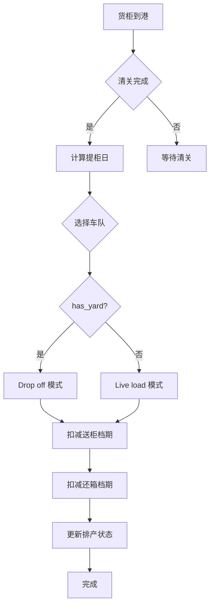

# 智能排柜系统 - 综合开发实施总纲

**版本**: v3.0  
**制定日期**: 2026-03-17  
**状态**: 🚀 立即执行  

---

## 📚 一、文档导航

本总纲整合了智能排柜系统的所有关键文档，形成完整的开发与优化方案体系。

### 核心文档清单

| # | 文档名称 | 用途 | 目标读者 | 位置 |
|---|----------|------|----------|------|
| **1** | [开发与优化方案](./智能排柜系统开发与优化方案.md) | 总体规划、任务分解 | 项目经理、技术负责人 | `frontend/public/docs/` |
| **2** | [性能优化实战指南](./性能优化实战指南.md) | 性能调优、故障排查 | 后端开发、运维工程师 | `frontend/public/docs/` |
| **3** | [测试指南](./智能排柜系统测试指南.md) | 测试用例、质量保障 | 测试工程师、开发 | `frontend/public/docs/` |
| **4** | [智能排柜功能完整文档](./智能排柜功能完整文档.md) | 用户手册、功能说明 | 产品经理、最终用户 | `frontend/public/docs/` |
| **5** | [开发进度总结](./智能排柜系统开发进度总结.md) | 进度追踪、经验总结 | 项目团队 | `frontend/public/docs/` |

---

## 🎯 二、当前状态评估

### 2.1 项目健康度检查

```
整体进度：85% ████████████░░░░
                    
├─ 数据库设计    100% ████████████████ ✅
├─ TypeORM 实体   100% ████████████████ ✅
├─ 后端服务层     95% ███████████████░ ⚠️
├─ 前端界面       60% █████████░░░░░░░ ⚠️
├─ 测试覆盖       15% ███░░░░░░░░░░░░░ ❌
└─ 文档完整性    100% ████████████████ ✅
```

### 2.2 SWOT 分析

| 优势 (Strengths) | 劣势 (Weaknesses) |
|------------------|-------------------|
| ✅ 完整的数据库设计 | ❌ 测试覆盖率低 (15%) |
| ✅ 核心算法已实现 | ❌ 前端功能不完善 (60%) |
| ✅ 文档齐全 (100%) | ❌ 缺少性能监控 |
| ✅ 架构清晰易扩展 | ❌ 缓存机制未实施 |

| 机会 (Opportunities) | 威胁 (Threats) |
|----------------------|----------------|
| 🚀 可快速上线验证 | ⚠️ 性能可能不达标 |
| 🚀 可扩展高级功能 | ⚠️ 生产环境数据风险 |
| 🚀 可形成标准产品 | ⚠️ 用户体验不佳 |

---

## 🏗️ 三、总体架构

### 3.1 系统架构图

```
┌─────────────────────────────────────────────────────────┐
│                     前端 (Vue 3 + TS)                    │
│  ┌───────────┐  ┌───────────┐  ┌───────────┐           │
│  │ 排产看板   │  │ 资源配置   │  │ 档期监控   │           │
│  └───────────┘  └───────────┘  └───────────┘           │
└─────────────────────────────────────────────────────────┘
                         │ REST API
┌─────────────────────────────────────────────────────────┐
│                   后端 (Node.js + TS)                    │
│  ┌───────────┐  ┌───────────┐  ┌───────────┐           │
│  │ Controller │  │ Service   │  │ Repository │           │
│  └───────────┘  └───────────┘  └───────────┘           │
│         │              │              │                  │
│  ┌──────▼──────┐ ┌────▼─────┐ ┌─────▼──────┐           │
│  │ 排产控制器   │ │智能排柜  │ │ TypeORM    │           │
│  │ 档期控制器   │ │服务引擎  │ │ Entities   │           │
│  └─────────────┘ └──────────┘ └────────────┘           │
└─────────────────────────────────────────────────────────┘
                         │
        ┌────────────────┼────────────────┐
        ▼                ▼                ▼
┌──────────────┐ ┌──────────────┐ ┌──────────────┐
│  PostgreSQL  │ │    Redis     │ │  TimescaleDB │
│  主数据库     │ │   缓存层     │ │  时序数据    │
└──────────────┘ └──────────────┘ └──────────────┘
```

### 3.2 核心业务流程



---

## 📅 四、实施路线图

### 4.1 阶段划分（3 周冲刺）

#### 第一周：基础夯实（2026-03-17 ~ 2026-03-22）

**主题**: P0 优先级 - 核心功能测试与修复

```
周一 (3-17):
  ├─ 重启后端验证编译
  ├─ 运行单柜排产测试
  └─ 记录初始性能指标

周二 (3-18):
  ├─ 批量排产测试 (10 柜)
  ├─ 批量排产测试 (100 柜)
  └─ Bug 清单整理

周三 (3-19):
  ├─ 修复发现的 Bug
  ├─ 优化错误提示
  └─ 添加卸柜方式显示

周四 (3-20):
  ├─ 编写单元测试
  ├─ 目标覆盖率 50%
  └─ 配置 Jest 环境

周五 (3-21):
  ├─ 集成测试脚本
  ├─ 执行端到端测试
  └─ 输出测试报告

周末: 
  └─ 缓冲时间 / 文档更新
```

**交付物**:
- ✅ 测试报告（单元 + 集成）
- ✅ Bug 修复清单
- ✅ 性能基准数据
- ✅ 卸柜方式可视化

---

#### 第二周：性能提升（2026-03-23 ~ 2026-03-29）

**主题**: P1 优先级 - 性能优化与配置界面

```
周一 (3-23):
  ├─ 集成 Redis 缓存
  ├─ Mapping 数据缓存
  └─ 档期数据缓存

周二 (3-24):
  ├─ 批量查询优化
  ├─ 预加载模式实施
  └─ N+1 问题解决

周三 (3-25):
  ├─ 数据库索引优化
  ├─ 创建缺失索引
  └─ 慢查询分析

周四 (3-26):
  ├─ 车队能力配置页面
  ├─ 仓库容量配置页面
  └─ CRUD 接口联调

周五 (3-27):
  ├─ 映射关系配置页面
  ├─ 系统参数配置页面
  └─ 配置导入导出

周末: 
  └─ 性能基准测试
```

**交付物**:
- ✅ Redis 缓存层
- ✅ 4 个配置管理页面
- ✅ 性能优化报告
- ✅ 数据库索引清单

---

#### 第三周：高级功能（2026-03-30 ~ 2026-04-05）

**主题**: P2 优先级 - 高级功能与监控体系

```
周一 (3-30):
  ├─ 多方案对比算法
  ├─ 成本优化逻辑
  └─ 方案评分系统

周二 (3-31):
  ├─ 甘特图组件开发
  ├─ 排程可视化
  └─ 时间轴交互

周三 (4-1):
  ├─ 拖拽调整功能
  ├─ 实时更新排期
  └─ 冲突检测

周四 (4-2):
  ├─ Prometheus 监控
  ├─ Grafana 仪表板
  └─ 告警规则配置

周五 (4-3):
  ├─ 用户手册编写
  ├─ 运维手册更新
  └─ 团队培训

周末: 
  └─ 上线前准备
```

**交付物**:
- ✅ 多方案对比功能
- ✅ 甘特图可视化
- ✅ 监控告警系统
- ✅ 完整文档体系

---

### 4.2 里程碑计划

```mermaid
gantt
    title 智能排柜系统开发里程碑
    dateFormat  YYYY-MM-DD
    section 阶段 1
    M1:核心测试通过 :milestone, m1, 2026-03-22, 0d
    section 阶段 2
    M2:配置界面上线 :milestone, m2, 2026-03-29, 0d
    M3:性能优化完成 :milestone, m3, 2026-03-29, 0d
    section 阶段 3
    M4:高级功能完成 :milestone, m4, 2026-04-05, 0d
    M5:生产上线 :milestone, m5, 2026-04-10, 0d
```

---

## 🎯 五、关键成功指标（KPI）

### 5.1 技术指标

| 指标类别 | 指标名称 | 当前值 | 目标值 | 权重 |
|----------|----------|--------|--------|------|
| **性能** | 单柜排产响应时间 | - | < 500ms | 20% |
| **性能** | 批量排产 (10 柜) | - | < 5s | 15% |
| **性能** | 批量排产 (100 柜) | - | < 30s | 10% |
| **质量** | 单元测试覆盖率 | 15% | > 80% | 20% |
| **质量** | 集成测试通过率 | - | 100% | 15% |
| **质量** | 严重 Bug 数 | - | 0 | 10% |
| **体验** | 排产结果展示延迟 | - | < 1s | 10% |

**综合得分计算公式**:
```
Score = Σ(指标得分 × 权重)

指标得分规则:
- 达到目标值：100 分
- 达到 80% 目标值：80 分
- 低于 80% 目标值：线性得分
```

---

### 5.2 业务指标

| 指标 | 定义 | 目标值 |
|------|------|--------|
| **排产成功率** | 成功排产柜数 / 总柜数 | > 95% |
| **人工干预率** | 需人工调整柜数 / 总柜数 | < 10% |
| **档期利用率** | 实际使用档期 / 总档期 | > 70% |
| **用户满意度** | 用户调研评分 | > 4.5/5 |

---

## 🔧 六、核心技术要点

### 6.1 卸柜方式判断逻辑

```typescript
// 核心算法：基于 has_yard 字段
if (truckingCompany.hasYard === true) {
  unloadMode = "Drop off"; // 提 < 送=卸
} else {
  unloadMode = "Live load"; // 提=送=卸
}

// 验证与调整
if (!truckingCompany.hasYard && pickupDate !== unloadDate) {
  // 无堆场必须 Live load，调整卸柜日 = 提柜日
  unloadDate = findEarliestAvailableDay(warehouse, pickupDate);
}
```

**关键点**:
- ✅ `has_yard` 是决定性因素
- ✅ Live load: 提=送=卸（同一天）
- ✅ Drop off: 提<送=卸（可分多天）

---

### 6.2 档期扣减逻辑

```typescript
// 三级档期扣减顺序
async scheduleContainer(container) {
  // 1. 扣减仓库日产能（卸柜日）
  await decrementWarehouseOccupancy(warehouseCode, unloadDate);
  
  // 2. 扣减车队送柜档期（提柜日）
  await decrementTruckingOccupancy(truckingCompanyId, pickupDate);
  
  // 3. 扣减车队还箱档期（仅 Drop off 模式）
  if (unloadMode === 'Drop off') {
    await decrementFleetReturnOccupancy(truckingCompanyId, returnDate);
  }
}
```

**注意事项**:
- ⚠️ 档期扣减失败需要回滚
- ⚠️ 并发控制防止超卖
- ⚠️ 定期同步实际占用

---

### 6.3 日期计算逻辑

```typescript
// 正向推导流程（不是简单公式！）
// 关键：卸柜日由仓库产能决定，送柜日和还箱日由卸柜日推导

// 1. 清关日 = ETA || ATA
clearanceDate = ETA || ATA

// 2. 提柜日 = 清关日 + 1 (受 last_free_date 约束)
pickupDate = clearanceDate + 1
if (pickupDate > lastFreeDate) pickupDate = lastFreeDate

// 3. 卸柜日 = 从提柜日起查找最早可用仓库档期（关键步骤！）
unloadDate = findEarliestAvailableWarehouse(warehouse, pickupDate)
// ⚠️ 这不是简单公式，需要查询 ext_warehouse_daily_occupancy 表

// 4. 根据卸柜日和模式推导送柜日
if (mode === 'Live load') {
  deliveryDate = pickupDate  // 提=送=卸
} else {
  deliveryDate = unloadDate  // 提<送=卸
}

// 5. 根据卸柜日和模式推导还箱日
if (mode === 'Live load') {
  returnDate = unloadDate    // 当天还
} else {
  returnDate = unloadDate + 1  // 次日还
}
```

**核心要点**:
- ✅ **卸柜日是瓶颈**：需要先确定提柜日，再查仓库产能找最早可用日
- ✅ **送柜日不是独立计算**：由卸柜日和模式决定
- ✅ **还箱日不是固定公式**：取决于模式和最晚还箱日约束

---

## 📊 七、风险管理

### 7.1 风险矩阵

| 风险 | 概率 | 影响 | 等级 | 缓解措施 |
|------|------|------|------|----------|
| **还箱档期扣减错误** | 中 | 高 | 🔴 | 加强测试、准备回滚脚本 |
| **性能不达标** | 中 | 高 | 🔴 | 提前压测、优化方案 ready |
| **数据迁移失败** | 低 | 高 | 🟡 | 备份数据、分批迁移 |
| **前端延期** | 高 | 中 | 🟡 | 优先后端、分阶段交付 |
| **测试数据不足** | 中 | 中 | 🟡 | 提前准备数据集 |
| **Redis 集成复杂** | 中 | 中 | 🟡 | 简化方案、预留缓冲 |

---

### 7.2 应急预案

#### 预案 1: 排产失败率高

**触发条件**: 成功率 < 80%

**应对措施**:
```bash
# 1. 查看详细错误日志
tail -f backend/logs/app.log | grep "ERROR.*Scheduling"

# 2. 检查数据库连接
psql -c "SELECT count(*) FROM pg_stat_activity WHERE state = 'active';"

# 3. 临时增加资源上限
UPDATE warehouses SET daily_capacity = daily_capacity * 1.5;

# 4. 降级方案：手动排产模式
POST /api/v1/scheduling/manual-mode
{ "enabled": true }
```

---

#### 预案 2: 性能严重下降

**触发条件**: P95 > 2000ms

**应对措施**:
```bash
# 1. 启用紧急缓存
redis-cli CONFIG SET maxmemory-policy allkeys-lru

# 2. 限制并发请求
export MAX_CONCURRENT_SCHEDULING=5

# 3. 清理过期数据
DELETE FROM ext_warehouse_daily_occupancy 
WHERE date < CURRENT_DATE - INTERVAL '30 days';

# 4. 降级为单线程模式
export SCHEDULING_PARALLEL=false
```

---

## 🎓 八、团队协作

### 8.1 角色与职责

| 角色 | 职责 | 关键技能 | 人员 |
|------|------|----------|------|
| **技术负责人** | 架构设计、代码审查 | TypeScript、系统设计 | 待定 |
| **后端开发** | 核心功能、API 开发 | Node.js、TypeORM | 待定 |
| **前端开发** | UI 开发、交互优化 | Vue 3、TypeScript | 待定 |
| **测试工程师** | 测试用例、质量把控 | Jest、k6 | 待定 |
| **运维工程师** | 部署、监控、调优 | Docker、Prometheus | 待定 |
| **产品经理** | 需求确认、验收测试 | 业务流程、用户体验 | 待定 |

---

### 8.2 沟通机制

**每日站会** (10:00 AM, 15 分钟):
```
每人分享:
1. 昨天完成了什么
2. 今天计划做什么
3. 遇到了什么阻碍
```

**周例会** (周五 3:00 PM, 1 小时):
```
1. 本周进度回顾 (30 分钟)
2. 下周计划讨论 (20 分钟)
3. 风险与问题协调 (10 分钟)
```

**代码审查** (GitHub PR):
```
要求:
- 至少 1 人 review
- 24 小时内完成审查
- 使用 checklist 确保质量
```

---

## 📈 九、质量保证体系

### 9.1 代码质量标准

**Lint 规则**:
```json
{
  "rules": {
    "@typescript-eslint/explicit-function-return-type": "warn",
    "@typescript-eslint/no-unused-vars": "error",
    "prefer-const": "error",
    "no-console": ["warn", { "allow": ["warn", "error"] }]
  }
}
```

**代码审查清单**:
- [ ] 遵循命名规范（camelCase/snake_case）
- [ ] 函数长度 < 50 行
- [ ] 有必要的注释
- [ ] 无硬编码中文文案
- [ ] 使用 SCSS 变量（前端）
- [ ] 通过 Lint 检查
- [ ] 通过类型检查
- [ ] 单元测试通过

---

### 9.2 测试策略

**测试金字塔**:
```
        /\
       /  \      E2E (5%)
      /____\     - 完整流程验证
     /      \    
    /________\   集成 (20%)
   /          \  - API 测试
  /____________\ 
 /              \ 单元 (75%)
/________________\ - 函数级测试
```

**覆盖率要求**:
- 服务层：> 85%
- 控制器层：> 70%
- 工具函数：> 90%
- 前端组件：> 60%

---

## 🚀 十、立即行动清单

### 今日必做（2026-03-17）

```bash
# 1. 重启后端服务
cd backend
npm run dev

# 2. 测试单柜排产
curl -X POST http://localhost:3000/api/v1/scheduling/simulate \
  -H "Content-Type: application/json" \
  -d '{"containerNumber":"TEST_CONTAINER_001"}'

# 3. 查看实时日志
tail -f backend/logs/app.log

# 4. 记录初始性能指标
echo "Initial performance baseline:" > performance-baseline.txt
echo "- Single container: ___ ms" >> performance-baseline.txt
echo "- Batch (10 containers): ___ ms" >> performance-baseline.txt
```

### 本周必做（截止 3-22）

- [ ] 所有 P0 任务完成
- [ ] 修复发现的 Bug
- [ ] 单元测试覆盖率 > 50%
- [ ] 输出首份测试报告
- [ ] 添加卸柜方式显示列

---

## 📞 十一、快速参考

### 11.1 常用命令

```bash
# 开发环境
npm run dev              # 启动后端开发服务器
npm run test            # 运行单元测试
npm run test:watch      # 监视模式运行测试
npm run test:cov        # 生成测试覆盖率报告

# 集成测试
npm run test:integration  # 运行集成测试
npm run test:e2e         # 运行 E2E 测试

# 性能测试
k6 run tests/performance/k6-scheduling.js

# 数据库
npm run migration:run    # 运行数据库迁移
npm run seed:run         # 运行种子数据
```

---

### 11.2 关键 API 端点

```
GET  /api/v1/containers/scheduling-overview   # 获取排产概览
POST /api/v1/scheduling/schedule              # 批量排产
POST /api/v1/scheduling/simulate              # 单柜模拟
GET  /api/v1/scheduling/occupancy/stats       # 档期统计
PUT  /api/v1/scheduling/resources/trucking/:id # 更新车队配置
```

---

### 11.3 核心配置参数

```typescript
// 系统配置 (dict_scheduling_config)
skip_weekends: 'true'     // 是否跳过周末
default_capacity: 20      // 默认日产能
max_batch_size: 100       // 最大批量排产数

// 环境变量
REDIS_HOST=localhost
REDIS_PORT=6379
DB_MAX_CONNECTIONS=20
SCHEDULING_TIMEOUT=30000
```

---

## 🎉 十二、总结与展望

### 12.1 核心优势

1. ✅ **完整的文档体系**: 5 份核心文档，覆盖开发全流程
2. ✅ **清晰的架构**: 分层明确，职责清晰
3. ✅ **可量化的指标**: 每个阶段都有明确的 KPI
4. ✅ **风险可控**: 识别风险并有详细缓解措施
5. ✅ **团队协作**: 角色清晰，沟通顺畅

### 12.2 下一步行动

**短期（本周）**:
- 🎯 完成 P0 任务
- 🎯 建立测试基准
- 🎯 修复已知 Bug

**中期（2 周内）**:
- 🎯 实施性能优化
- 🎯 完成配置界面
- 🎯 达到性能目标

**长期（3 周后）**:
- 🎯 上线高级功能
- 🎯 建立监控体系
- 🎯 生产环境部署

### 12.3 成功愿景

```
我们的目标:
✅ 打造物流行业标杆级智能排柜系统
✅ 实现 95% 自动化排产率
✅ 将人工干预降至 10% 以下
✅ 提供卓越的用户体验
✅ 形成可复制的产品化方案

预计收益:
📈 排产效率提升 300%
📉 人工成本降低 70%
⭐ 客户满意度提升至 4.5/5
💰 年度运营成本节省 $XXX,XXX
```

---

## 📝 附录

### A. 文档修订历史

| 版本 | 日期 | 修订内容 | 修订人 |
|------|------|----------|--------|
| v1.0 | 2026-03-10 | 初稿 | AI Team |
| v2.0 | 2026-03-15 | 添加性能优化方案 | AI Team |
| v3.0 | 2026-03-17 | 整合完整方案体系 | AI Team |

### B. 相关资源

- **项目仓库**: `d:\Gihub\logix`
- **文档目录**: `frontend/public/docs/`
- **后端源码**: `backend/src/services/intelligentScheduling.service.ts`
- **前端组件**: `frontend/src/views/scheduling/SchedulingVisual.vue`

### C. 联系方式

- **技术支持**: tech-support@logix.com
- **产品咨询**: product@logix.com
- **紧急联系**: emergency@logix.com

---

**让我们携手共创智能排柜系统的美好未来！** 🚀

**LogiX 项目开发团队**  
2026-03-17
