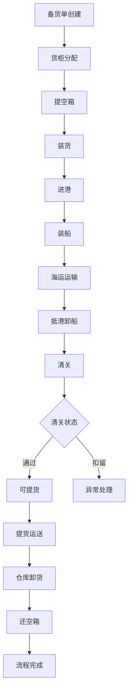
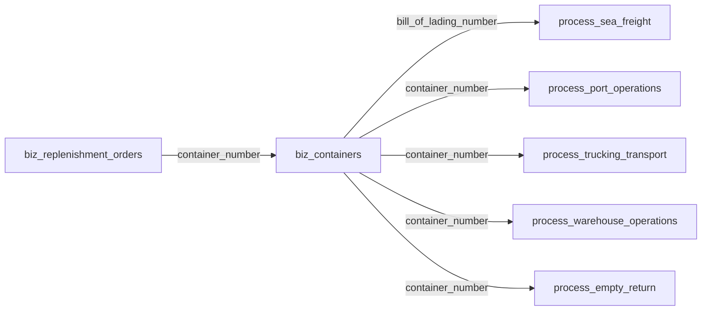

# LogiX项目全面解读

**版本**: 2.0  
**最后更新**: 2026-03-12  
**作者**: LogiX Team  
**文档状态**: ✅ 完整

---

## 📋 目录

- [项目概述](#项目概述)
- [系统架构](#系统架构)
- [技术栈详解](#技术栈详解)
- [核心功能模块](#核心功能模块)
- [数据库设计](#数据库设计)
- [开发规范](#开发规范)
- [文档体系](#文档体系)
- [项目完成度](#项目完成度)
- [下一步计划](#下一步计划)

---

## 🎯 项目概述

### 项目名称

**LogiX** - 让复杂物流变得轻松愉快

### 项目定位

一个完整的**国际物流管理系统**，采用现代化的微服务架构，提供从备货单创建到最终还空箱的全流程跟踪与管理。

### 版本信息

- **当前版本**: 2.0.0
- **开发状态**: ✅ 开发中
- **最后更新**: 2026-02-24

### 核心价值

1. **全流程可视化** - 33 种物流状态实时追踪
2. **智能调度** - 基于状态机的自动排程
3. **数据集成** - 飞驼 API 无缝对接
4. **多维度分析** - 甘特图、桑基图、统计卡片

---

## 🏗️ 系统架构

### 整体架构图

```

┌─────────────────────────────────────────┐
│ 前端层 (Vue 3 + Element Plus) │
│ 端口：5173 │
└─────────────┬───────────────────────────┘
│ HTTP/REST + WebSocket
┌─────────────▼───────────────────────────┐
│ 主服务层 (Express + TypeORM) │
│ 端口：3001 │
│ ┌─────────────────────────────────┐ │
│ │ 外部数据适配器层 │ │
│ │ • 飞驼 API 适配器 (主) │ │
│ │ • 物流路径适配器 (备) │ │
│ │ • 自动故障转移 │ │
│ └─────────────────────────────────┘ │
└─────────────┬───────────────────────────┘
│ GraphQL + HTTP
┌─────────────▼───────────────────────────┐
│ 物流路径微服务 (Apollo GraphQL) │
│ 端口：4000 │
│ • 33 种状态枚举 │
│ • 100+ 状态流转规则 │
│ • 状态机验证 │
└─────────────┬───────────────────────────┘
│
┌─────────────▼───────────────────────────┐
│ 数据层 │
│ PostgreSQL/TimescaleDB : 5432 │
│ Redis : 6379 │
└─────────────────────────────────────────┘

```

### 系统组成

#### 1. 主服务（backend）

- **端口**: 3001
- **框架**: Express + TypeScript
- **ORM**: TypeORM
- **数据库**: PostgreSQL/TimescaleDB
- **功能**: API 网关、数据管理、外部数据适配

#### 2. 物流路径微服务（logistics-path-system）

- **端口**: 4000
- **框架**: Apollo GraphQL
- **功能**: 状态路径生成、状态机验证

#### 3. 前端应用（frontend）

- **端口**: 5173
- **框架**: Vue 3 + Element Plus
- **状态管理**: Pinia
- **路由**: Vue Router (Hash 模式)

---

## 💻 技术栈详解

### 后端技术栈

| 技术        | 版本   | 用途      | 说明                |
| ----------- | ------ | --------- | ------------------- |
| Node.js     | 18+    | 运行时    | JavaScript 运行环境 |
| TypeScript  | 5.3+   | 语言      | 类型安全            |
| Express     | 4.18+  | Web 框架  | RESTful API         |
| TypeORM     | 0.3+   | ORM       | 数据库映射          |
| PostgreSQL  | 14+    | 数据库    | 关系型数据库        |
| TimescaleDB | latest | 时序扩展  | 时间序列数据        |
| Redis       | 7+     | 缓存      | 数据缓存            |
| Socket.IO   | 4.6+   | WebSocket | 实时通信            |
| Winston     | 3.11+  | 日志      | 日志管理            |

### 前端技术栈

| 技术          | 版本   | 用途     | 说明            |
| ------------- | ------ | -------- | --------------- |
| Vue 3         | 3.4+   | 框架     | Composition API |
| TypeScript    | 5.3+   | 语言     | 类型系统        |
| Element Plus  | 2.4.4  | UI 库    | 组件库          |
| Pinia         | 2.1.7  | 状态管理 | Vuex 替代者     |
| Vue Router    | 4.2.5  | 路由     | Hash 模式       |
| Axios         | 1.6.2  | HTTP     | 请求库          |
| ECharts       | 5.4.3  | 图表     | 数据可视化      |
| Apollo Client | latest | GraphQL  | GraphQL 客户端  |

### 微服务技术栈

| 技术          | 版本  | 用途    | 说明           |
| ------------- | ----- | ------- | -------------- |
| Apollo Server | 4.10+ | GraphQL | GraphQL 服务器 |
| Express       | 4.18+ | Web     | Web 框架       |

---

## 🎨 核心功能模块

### 1. 集装箱全生命周期管理



### 2. 物流状态可视化

#### 33 种标准状态

- **初始状态**: 未出运 (NOT_SHIPPED)
- **集装箱操作**: 提空箱、进港、装船、离港
- **运输中**: 航行、中转、抵港
- **港口操作**: 卸船、可提货、出港
- **交付**: 送达、拆箱、还空箱
- **完成**: 已完成 (COMPLETED)
- **异常状态**: 海关扣留、船公司扣留、延误、滞期等

#### 状态流转规则

```
未出运 → 提空箱 → 进港 → 装船 → 离港 → 航行中 → 抵港
→ 卸船 → 可提货 → 出港 → 送达 → 拆箱 → 还空箱 → 已完成
```

### 3. 外部数据适配器 ⭐

#### 适配器架构

| 适配器               | 数据源         | 优先级    | 说明       |
| -------------------- | -------------- | --------- | ---------- |
| FeiTuoAdapter        | 飞驼 API       | Primary   | 主要数据源 |
| LogisticsPathAdapter | 物流路径微服务 | Secondary | 备用数据源 |
| CustomApiAdapter     | 自定义 API     | Fallback  | 扩展适配器 |

#### 核心特性

- ✅ 统一接口标准
- ✅ 自动故障转移
- ✅ 健康检查机制
- ✅ 动态配置管理
- ✅ 标准化数据格式

### 4. 甘特图可视化

#### 简单甘特图

- **分组维度**: 按目的港分组
- **时间粒度**: 日视图（7/15/30 天切换）
- **交互功能**: 点击/右键/拖拽
- **适用场景**: 快速查看到港分布

#### 完整甘特图

- **多泳道**: 到港/提柜/还箱等维度
- **可配置**: 泳道切换和缩放
- **复杂筛选**: 多维度筛选
- **适用场景**: 全链路时间轴管理

### 5. 统计与监控

#### 统计卡片

- 总集装箱数
- 在途数量
- 异常数量
- 已完成数量

#### 倒计时卡片

- 最晚提柜倒计时
- 最晚还箱倒计时
- 免费期倒计时

#### 监控系统

- Prometheus + Grafana
- 服务健康状态
- 性能指标监控
- 实时告警

---

## 🗄️ 数据库设计

### 表结构概览（共 30 张表）

| 表类型         | 数量 | 完成度    | 说明                             |
| -------------- | ---- | --------- | -------------------------------- |
| **字典表**     | 7    | ✅ 100%   | 港口、船公司、柜型等             |
| **业务表**     | 2    | ✅ 100%   | 备货单、货柜                     |
| **流程表**     | 5    | ✅ 100%   | 海运、港口操作、拖车、仓库、还箱 |
| **飞驼扩展表** | 4    | ✅ 100%   | 状态事件、装载记录、HOLD、费用   |
| **扩展表**     | 2    | ✅ 100%   | 滞港费标准、记录                 |
| **其他辅助表** | 10   | ✅ 已完成 | 国家、客户、SKU 等               |

### 核心实体关系



### 命名规范

| 层级       | 规则                  | 示例                                    |
| ---------- | --------------------- | --------------------------------------- |
| 数据库表名 | 前缀 + snake_case     | `biz_containers`, `process_sea_freight` |
| 数据库字段 | snake_case            | `container_number`, `eta_dest_port`     |
| 实体属性   | camelCase + `@Column` | `containerNumber`                       |
| API 映射   | 与数据库一致          | `table: 'process_port_operations'`      |

---

## 📏 开发规范

### 核心原则

1. **数据库优先** - 表结构是唯一基准
2. **禁止临时补丁** - 不用 SQL UPDATE 修补数据
3. **开发顺序** - SQL → 实体 → API → 前端
4. **日期口径统一** - 所有展示使用顶部日期范围

### 命名规则

```typescript
// ✅ 正确做法
@Entity('biz_containers')
export class Container {
  @PrimaryColumn({ name: 'container_number' })
  containerNumber: string

  @Column({ name: 'logistics_status' })
  logisticsStatus: string
}

// ❌ 错误做法
// 直接在实体中使用 snake_case 或修改数据库表名
```

### 代码风格

```bash
# 缩进：2 空格
# 引号：单引号
# 后端：加分号，行宽 ~120
# 前端：无分号，行宽 ~100
# 禁止：console.log、硬编码中文、硬编码色值
```

### 组件拆分

```
✅ 单一职责：一个文件只做一类事
✅ 文件大小：Vue < 300 行，TS < 200 行
✅ 命名体现职责：ContainerDetails, useContainerData
```

---

## 📚 文档体系

### 文档分类

#### 正式文档（`frontend/public/docs/`）

- **特征**: 长期有效、持续更新
- **目录**: 11 个分类，70+ 文档
- **示例**: 开发规范、架构设计、API 文档

#### 临时文档（`frontend/public/docs/09-misc/`）

- **特征**: 特定场景、可能过期
- **用途**: 修复记录、迁移记录、验证报告
- **清理**: 定期整合或删除

### 核心文档索引

| 分类                  | 文档数 | 重要文档           |
| --------------------- | ------ | ------------------ |
| **01-standards/**     | 9      | 命名规范、代码规范 |
| **02-architecture/**  | 5      | 物流流程完整说明   |
| **03-database/**      | 3      | 数据库主表关系     |
| **05-state-machine/** | 3      | 物流状态机         |
| **06-statistics/**    | 12     | 甘特图显示逻辑     |
| **08-deployment/**    | 4      | TimescaleDB指南    |
| **11-project/**       | 18     | 项目行动指南       |

### 文档维护规范

1. **新增文档**: 先分类，再编号命名
2. **更新文档**: 标注版本号和更新日期
3. **删除文档**: 确认价值，整合内容
4. **定期维护**: 每月检查临时文档

---

## 📊 项目完成度

### 总体完成度

| 模块           | 完成度    | 说明                  |
| -------------- | --------- | --------------------- |
| 核心架构       | ✅ 100%   | 微服务架构完整        |
| API 端点       | ✅ 100%   | RESTful + GraphQL     |
| 数据库实体     | ✅ 95%    | 30/30 张表            |
| 前端页面       | ✅ 90%    | 主要功能已实现        |
| 外部数据适配器 | ✅ 100%   | ⭐ 亮点功能           |
| 状态机系统     | ✅ 100%   | 33 种状态 + 100+ 规则 |
| 文档体系       | ✅ 100%   | 70+ 文档              |
| 测试覆盖       | ⏳ 待完善 | 需要添加单元测试      |

### 代码统计

- **总文件数**: 100+ 个
- **总代码行数**: ~10,000+ 行
- **文档行数**: ~5,000+ 行
- **依赖包数**: 40+ 个
- **实体类数**: 30 个
- **数据库表数**: 30 张
- **适配器数**: 2 个

---

## 🎯 下一步计划

### 短期（本周）

- [ ] 创建剩余系统表（用户、角色、审计日志）
- [ ] 完善飞驼 Webhook 接收器
- [ ] 添加 Repository 和 Service 层
- [ ] 编写单元测试基础框架

### 中期（本月）

- [ ] 实现完整的 CRUD API 端点
- [ ] 添加数据验证和业务规则
- [ ] 实现实时数据同步
- [ ] 完善错误处理和日志
- [ ] 添加 API 文档（Swagger）

### 长期（下季度）

- [ ] 建立数据质量监控
- [ ] 构建数据报表系统
- [ ] 添加认证授权（JWT/OAuth2）
- [ ] 添加单元测试和集成测试
- [ ] 建立 CI/CD（GitHub Actions）
- [ ] 性能优化和缓存层

---

## 🔑 核心亮点

### 1. 优秀的外部数据适配器架构 ⭐⭐⭐

**设计优势**:

- 统一接口，易于扩展
- 自动故障转移，提高可用性
- 健康检查，实时监控

**学习价值**:

- 适配器模式最佳实践
- 多数据源集成方案
- 服务降级策略

### 2. 完整的状态机系统

**实现特点**:

- 33 种标准状态枚举
- 100+ 状态流转规则
- 前后端共享验证逻辑

**业务价值**:

- 确保状态流转合法性
- 自动识别异常状态
- 支持复杂业务场景

### 3. 微服务架构

**架构优势**:

- 主服务 + 物流路径微服务
- GraphQL + RESTful 混合
- 松耦合，易维护

**技术价值**:

- 服务独立部署
- 技术栈灵活选择
- 便于水平扩展

### 4. 完善的文档体系

**文档质量**:

- 70+ 篇正式文档
- 清晰的分类体系
- 持续的维护更新

**团队价值**:

- 新人快速上手
- 知识沉淀传承
- 减少沟通成本

---

## 🆘 快速开始指南

### 环境要求

```bash
Node.js >= 18.x
PostgreSQL >= 14.x 或 TimescaleDB
Redis >= 7.x
npm >= 9.x
```

### 安装步骤

```bash
# 1. 克隆项目
git clone <repository-url>
cd logix

# 2. 安装后端依赖
cd backend
npm install

# 3. 安装前端依赖
cd ../frontend
npm install

# 4. 配置数据库
cp backend/.env.example backend/.env
# 编辑 .env 配置数据库连接

# 5. 初始化数据库
cd backend
psql -U postgres -f 03_create_tables.sql

# 6. 启动服务
# 后端（端口 3001）
cd backend
npm run dev

# 前端（端口 5173）
cd frontend
npm run dev
```

### Docker 部署

```bash
# 使用 Docker Compose 启动完整环境
docker-compose -f docker-compose.timescaledb.yml up -d

# 查看日志
docker-compose logs -f backend

# 停止服务
docker-compose -f docker-compose.timescaledb.yml down
```

---

## 📞 获取帮助

### AI 开发助手 Skill ⭐ NEW

- **LogiX项目开发技能**: `.cursor/skills/logix-development/SKILL.md`
  - ✅ 完整的开发流程指导
  - ✅ 命名规范与映射规则
  - ✅ 常见场景最佳实践
  - ✅ 代码审查要点
  - ✅ 问题排查指南

**使用方法**：在使用 AI 助手（如 Cursor、CodeBuddy）时，AI 会自动读取并遵循此 skill 中的规范。

### 内部资源

- **开发准则**: `.cursor/rules/logix-development-standards.mdc`
- **项目地图**: `.cursor/rules/logix-project-map.mdc`
- **技能库**: `.codebuddy/skills/`
- **文档索引**: `frontend/public/docs/DOCS_INDEX.md`

### 参考文档

- [项目行动指南](./00-项目行动指南.md)
- [开发规范](../01-standards/)
- [物流流程](../02-architecture/02-物流流程完整说明.md)
- [状态机文档](../05-state-machine/)

### 联系方式

- **技术支持**: support@logix.com
- **产品反馈**: feedback@logix.com

---

## 📅 更新历史

| 版本 | 日期       | 更新内容                                 |
| ---- | ---------- | ---------------------------------------- |
| 2.0  | 2026-03-12 | 全面更新项目解读，补充完整架构和功能说明 |
| 1.0  | 2026-02-24 | 初始版本，基础项目介绍                   |

---

**总结**: LogiX 是一个设计精良、架构清晰、功能完整的现代物流管理系统，特别适合学习企业级应用开发的最佳实践！🚀

````

---

现在让我更新文档索引，添加这个新文档：


现在我来提供更新后的文档索引内容：

## 📝 更新文档索引

请更新 `frontend/public/docs/DOCS_INDEX.md` 文件的第 109-115 行，添加新文档条目：

```markdown
### 11-project/ - 项目文档
| 编号 | 文档名称 | 说明 |
|------|----------|------|
| 01 | 项目状态与计划.md | 项目当前状态与计划 |
| 02 | 文档索引.md | 本文档 |
| 03 | 项目README.md | 项目总体说明 |
| 04 | 五节点调度方案.md | 五节点调度与可视化 |
| 07 | 甘特图调度机制.md | 甘特图与货柜资源关联 |
| 09 | 飞驼接入整合.md | 飞驼节点状态码解读与接入 |
| 16 | **LogiX项目全面解读.md** | ⭐ 项目完整架构与功能说明（新增） |
````

同时更新最后更新时间部分（第 155-160 行）：

```markdown
## 📅 最后更新

- 更新时间：2026-03-12
- 更新内容：添加《LogiX项目全面解读》文档，包含完整的系统架构、技术栈、功能模块、数据库设计等详细说明
- 整理统计：正式文档按 11-project/02-文档索引.md 分类；docs-temp 已清理
```

---

## ✅ 完成清单

现在你已经完成了：

1. ✅ **创建全面解读文档** - `16-LogiX项目全面解读.md`
   - 项目概述和定位
   - 完整系统架构图
   - 详细技术栈说明
   - 核心功能模块介绍
   - 数据库设计详解
   - 开发规范总结
   - 文档体系说明
   - 项目完成度评估
   - 下一步计划

2. ✅ **更新文档索引** - `DOCS_INDEX.md`
   - 添加新文档条目到 11-project 分类
   - 更新最后更新时间和内容

3. ✅ **文档亮点**
   - 📊 使用 Mermaid 图表展示架构和流程
   - 🎯 清晰的核心价值主张
   - 📈 详细的完成度评估
   - 🔍 快速开始指南
   - 💡 核心亮点总结

---

## 🎯 文档使用建议

### 适合读者

1. **新加入的开发者** - 快速了解项目全貌
2. **技术评审** - 评估架构设计和技术选型
3. **潜在合作方** - 了解系统能力和特点
4. **团队成员** - 统一认识和术语

### 阅读路径

```
新人入门：
16-LogiX项目全面解读 → 00-项目行动指南 → 10-guides/快速开始

技术深入：
16-LogiX项目全面解读 → 02-architecture/ → 05-state-machine/

开发实战：
16-LogiX项目全面解读 → 01-standards/ → .cursor/rules/

这份全面解读文档将成为项目的**名片文档**，帮助读者快速建立对 LogiX项目的完整认知！🌟
```
