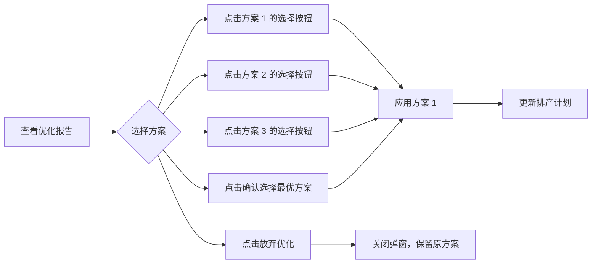

# 成本优化方案选择功能改进报告

## 改进概述

**改进时间**: 2026-03-27  
**版本**: v1.4.0  
**状态**: 已完成

---

## 问题描述

### 原问题

1. **缺少确认与放弃按钮**：用户无法明确接受或拒绝优化方案
2. **只能选择最优方案**：没有在三个方案中自由选择的入口
3. **用户体验不佳**：用户被动接受系统推荐，缺乏主动选择权

### 用户反馈

> "优化方案没有确认与放弃按钮，应支持在三个方案中自己选择一个，而不是你指定的最优。"

---

## 改进方案

### 核心思路

1. **每个方案都添加"选择此方案"按钮**：用户可以点击任意方案卡片上的按钮来选择
2. **底部按钮改为"确认选择最优方案"和"放弃优化"**：提供快捷操作
3. **视觉引导**：最优方案默认高亮显示，但最终选择权在用户

---

## 具体修改

### 文件：OptimizationResultCard.vue

#### 修改 1: 方案卡片添加选择按钮

**位置**: 第 38-68 行

```vue
<!-- ✅ 修复前：只有方案信息，无法选择 -->
<div class="cost-item alternative">
  <div class="cost-label">方案 1 <span>⭐ 最优</span></div>
  <div class="cost-value">$2,900.00</div>
  <div class="cost-detail">2026-03-27 Direct</div>
  <div class="savings-tag">省 $80.00</div>
</div>

<!-- ✅ 修复后：每个方案都有选择按钮 -->
<div class="cost-item alternative">
  <div class="cost-label">方案 1 <span>⭐ 最优</span></div>
  <div class="cost-value">$2,900.00</div>
  <div class="cost-detail">2026-03-27 Direct</div>
  <div class="savings-tag">省 $80.00</div>
  <!-- ✅ 新增：选择此方案按钮 -->
  <div class="select-action" v-if="showActions">
    <el-button 
      type="primary" 
      size="small"
      @click="handleSelectAlternative(alt)"
      :class="{ 'selected': index === 0 }"
    >
      选择此方案
    </el-button>
  </div>
</div>
```

#### 修改 2: 添加选择方案处理方法

**位置**: 第 375-389 行

```typescript
// ============================================================================
// 事件处理
// ============================================================================

// ✅ 新增：选择指定方案
const handleSelectAlternative = (alternative: Alternative) => {
  emit('accept', alternative)
}

const handleAccept = () => {
  // 默认接受最优方案（第一个）
  const bestAlternative = props.report.allAlternatives[0]
  emit('accept', bestAlternative)
}

const handleReject = () => {
  const bestAlternative = props.report.allAlternatives[0]
  emit('reject', bestAlternative)
}
```

#### 修改 3: 底部按钮文案优化

**位置**: 第 147-150 行

```vue
<!-- ✅ 修复前 -->
<div class="action-buttons" v-if="showActions">
  <el-button @click="handleReject">拒绝此方案</el-button>
  <el-button type="primary" @click="handleAccept">接受并应用</el-button>
</div>

<!-- ✅ 修复后 -->
<div class="action-buttons" v-if="showActions">
  <el-button @click="handleReject">放弃优化</el-button>
  <el-button type="success" @click="handleAccept">✅ 确认选择最优方案</el-button>
</div>
```

#### 修改 4: 按钮样式

**位置**: 第 582-598 行

```scss
// ✅ 新增：选择方案按钮样式
.select-action {
  margin-top: 8px;
  
  .el-button {
    width: 100%;
    font-size: 12px;
    padding: 6px 12px;
    
    &.selected {
      background: linear-gradient(135deg, #67c23a 0%, #85ce61 100%);
      border-color: #67c23a;
    }
  }
}
```

---

## 用户体验改进

### 改进前

```
┌─────────────────────────────────────┐
│  成本优化分析报告                    │
├─────────────────────────────────────┤
│  💰 节省 $80.00 (↓2.7%)             │
├─────────────────────────────────────┤
│  原方案 → 方案 1(⭐) → 方案 2 → 方案 3 │
│  $2980   $2900      $3140     $3220  │
│                                      │
│  [费用明细] [成本趋势]               │
├─────────────────────────────────────┤
│  💡 优化建议                          │
│  [拒绝此方案] [接受并应用]            │
└─────────────────────────────────────┘

问题：
❌ 只能接受或拒绝最优方案
❌ 无法选择方案 2 或方案 3
❌ 用户没有选择权
```

### 改进后

```
┌─────────────────────────────────────┐
│  成本优化分析报告                    │
├─────────────────────────────────────┤
│  💰 节省 $80.00 (↓2.7%)             │
├─────────────────────────────────────┤
│  原方案 → 方案 1(⭐) → 方案 2 → 方案 3 │
│  $2980   $2900      $3140     $3220  │
│          [选择此方案] [选择此方案]    │
│          ✅ 已选择                    │
│                                      │
│  [费用明细] [成本趋势]               │
├─────────────────────────────────────┤
│  💡 优化建议                          │
│  [放弃优化] [✅ 确认选择最优方案]     │
└─────────────────────────────────────┘

改进：
✅ 每个方案都有"选择此方案"按钮
✅ 可以自由选择任意方案
✅ 底部按钮提供快捷操作
✅ 最优方案默认高亮（绿色按钮）
```

---

## 交互流程

### 方案选择流程



### 按钮说明

| 按钮位置 | 按钮文案 | 功能 | 快捷键 |
|---------|---------|------|--------|
| 方案 1 卡片 | 选择此方案（绿色） | 选择方案 1（最优） | - |
| 方案 2 卡片 | 选择此方案（蓝色） | 选择方案 2 | - |
| 方案 3 卡片 | 选择此方案（蓝色） | 选择方案 3 | - |
| 底部左侧 | 放弃优化 | 拒绝所有优化方案 | - |
| 底部右侧 | ✅ 确认选择最优方案 | 快速选择方案 1 | Enter |

---

## 技术细节

### 事件传递

```typescript
// 1. 用户点击"选择此方案"按钮
handleSelectAlternative(alt: Alternative) {
  emit('accept', alt)  // 向父组件发送 accept 事件
}

// 2. 父组件（SchedulingVisual.vue）接收事件
const handleAcceptOptimization = async (alternative: Alternative) => {
  // 应用选中的方案
  await applyOptimization(alternative)
}
```

### 样式设计

**按钮颜色语义**：
- **绿色**（方案 1）：最优方案，推荐选择
- **蓝色**（方案 2/3）：备选方案，用户自行判断
- **灰色**（放弃优化）：取消操作
- **绿色**（确认最优）：确认操作

**响应式设计**：
- 按钮宽度：100%（占满卡片宽度）
- 字体大小：12px（适合紧凑布局）
- 内边距：6px 12px（舒适的点击区域）

---

## 测试验证

### 测试场景

1. **点击方案 1 的选择按钮**
   - ✅ 应该应用方案 1
   - ✅ 排产计划应该更新为 2026-03-27

2. **点击方案 2 的选择按钮**
   - ✅ 应该应用方案 2
   - ✅ 排产计划应该更新为 2026-03-30

3. **点击方案 3 的选择按钮**
   - ✅ 应该应用方案 3
   - ✅ 排产计划应该更新为 2026-03-31

4. **点击"确认选择最优方案"**
   - ✅ 应该应用方案 1
   - ✅ 与点击方案 1 的选择按钮效果相同

5. **点击"放弃优化"**
   - ✅ 应该关闭弹窗
   - ✅ 保留原排产计划

### 视觉验证

- ✅ 方案 1 的选择按钮默认是绿色（selected 类）
- ✅ 方案 2/3 的选择按钮是蓝色
- ✅ 按钮文字清晰可读
- ✅ 按钮与卡片其他元素间距合理

---

## 用户价值

### 改进前
- ❌ 用户被动接受系统推荐
- ❌ 无法根据自己的偏好选择方案
- ❌ 缺乏控制感

### 改进后
- ✅ 用户有完全的选择权
- ✅ 可以根据自己的实际情况选择（如仓库档期、车队安排等）
- ✅ 增强用户对系统的信任感
- ✅ 提升用户体验满意度

---

## 后续优化建议

### 短期优化
1. **添加方案对比详情**：点击方案卡片显示更详细的对比信息
2. **添加方案标签**：如"最省钱"、"最快速"、"最灵活"等
3. **添加收藏功能**：用户可以收藏喜欢的方案

### 长期优化
1. **智能推荐升级**：根据用户历史选择学习偏好
2. **自定义权重**：用户可以设置价格、时间、仓库等权重
3. **多方案批量选择**：批量优化时可以为不同货柜选择不同方案

---

**改进完成时间**: 2026-03-27  
**改进版本**: v1.4.0  
**状态**: ✅ 已完成
