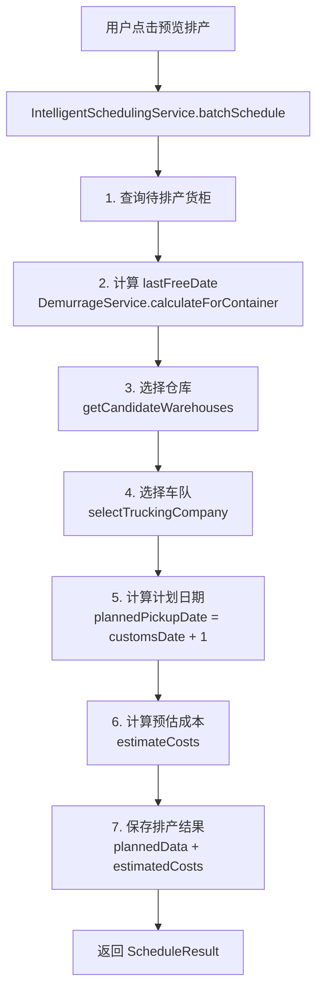
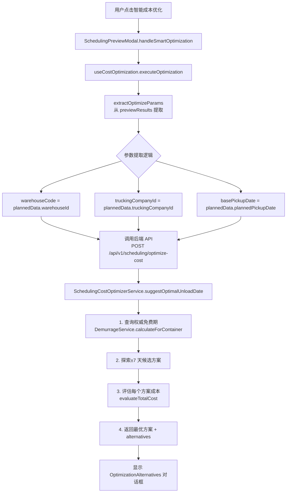
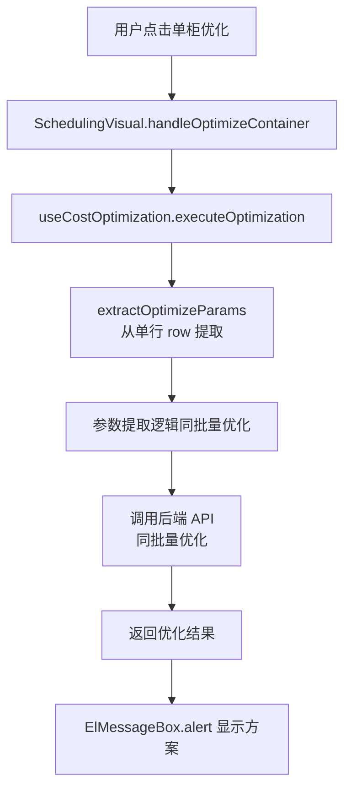

# 深度分析 - 智能排产成本优化功能全面解析

**创建时间**: 2026-03-27  
**分析范围**: batch-schedule、SchedulingPreviewModal（批量优化）、SchedulingVisual（单柜优化）  
**遵循原则**: SKILL（Single Source of Truth, Keep It Simple, Leverage Existing, Long-term Maintainability）

---

## 目录

1. [问题①：优化结果可视化改进](#问题 1 优化结果可视化改进)
2. [问题②：三大场景逻辑对齐分析](#问题 2 三大场景逻辑对齐分析)
3. [问题③：组件架构模式选择](#问题 3 组件架构模式选择)
4. [实施方案](#实施方案)
5. [技术细节](#技术细节)

---

## 问题 1 优化结果可视化改进

### 1.1 当前问题分析

#### 用户视角的痛点

```
场景：用户点击"智能成本优化"按钮后，看到如下结果：

┌─────────────────────────────────────┐
│ 💡 成本优化方案对比                  │
├─────────────────────────────────────┤
│ • 方案 1: 3-30 提柜，Drop off        │
│   预计成本：$2900                   │
│   预计节省：$0                      │ ← ❌ 问题 1：节省为 0，用户看不到价值
│                                     │
│ • 方案 2: 3-31 提柜，Direct          │
│   预计成本：$2950                   │
│   预计节省：-$50                    │ ← ❌ 问题 2：负数节省，困惑
│                                     │
│ • 方案 3: 3-29 提柜，Expedited       │
│   预计成本：$3000                   │
│   预计节省：-$100                   │
└─────────────────────────────────────┘

用户疑问：
1. "节省$0 是什么意思？难道没有优化空间吗？"
2. "为什么会有负数节省？是亏了吗？"
3. "$2900 是怎么算出来的？包含哪些费用？"
4. "为什么推荐方案 1？它好在哪里？"
5. "原方案成本是多少？我怎么知道优化有没有效果？"
```

#### 技术视角的问题

**当前显示逻辑**（`OptimizationAlternatives.vue`）：

```typescript
// 前端显示的"预计节省"计算方式
const savings = alternative.originalCost - alternative.optimizedCost

// 但问题是：
// 1. originalCost 从未被计算和传递
// 2. 用户看不到费用明细（滞港费？运输费？）
// 3. 缺乏对比基准（原方案 vs 优化后）
```

**后端优化算法**（`schedulingCostOptimizer.service.ts#L768-L853`）：

```typescript
async suggestOptimalUnloadDate(...) {
  // 1. 计算当前方案成本
  const currentOption = {
    containerNumber,
    warehouse,
    plannedPickupDate: basePickupDate,  // ← 排产时的日期
    strategy: truckingCompany.hasYard ? 'Drop off' : 'Direct',
    truckingCompany,
    isWithinFreePeriod: basePickupDate <= effectiveLastFreeDate
  }
  
  const currentBreakdown = await this.evaluateTotalCost(currentOption)
  const originalCost = currentBreakdown.totalCost  // ← 原方案成本
  
  // 2. 探索±7 天的所有候选方案
  for (let offset = -searchRange; offset <= searchRange; offset++) {
    const candidateDate = dateTimeUtils.addDays(basePickupDate, offset)
    // ... 检查周末、仓库档期
    
    for (const strategy of strategies) {
      const option = { ... , plannedPickupDate: candidateDate, strategy }
      const breakdown = await this.evaluateTotalCost(option)
      candidates.push({ pickupDate: candidateDate, strategy, totalCost: breakdown.totalCost })
    }
  }
  
  // 3. 找到成本最低的方案
  const best = candidates.sort((a, b) => a.totalCost - b.totalCost)[0]
  
  // 4. 返回结果（包含 savings）
  return {
    suggestedPickupDate: best.pickupDate,
    suggestedStrategy: best.strategy,
    originalCost,           // ← 有返回
    optimizedCost: best.totalCost,  // ← 有返回
    savings: originalCost - best.totalCost,  // ← 有返回
    alternatives: result.alternatives  // ← 但前端没有使用这些字段
  }
}
```

**关键发现**：
- ✅ 后端**已经计算了** `originalCost` 和 `savings`
- ❌ 前端**没有显示** `originalCost`，只显示了 `optimizedCost`
- ❌ 前端**自己计算** `savings = originalCost - optimizedCost`，但 `originalCost` 来自哪里不明确
- ❌ 用户**看不到费用明细**（滞港费、运输费各多少？）

### 1.2 改进方案设计

#### 方案 A：费用明细对比卡（推荐）

**设计思路**：并排展示原方案 vs 优化后的费用对比

```
┌──────────────────────────────────────────────────────────────┐
│ 💰 成本优化分析报告                                           │
├──────────────────────────────────────────────────────────────┤
│                                                              │
│  🎯 优化效果                                                  │
│  ┌─────────────────┬─────────────────┬──────────────────┐   │
│  │ 原方案          │ 优化后          │ 节省金额         │   │
│  ├─────────────────┼─────────────────┼──────────────────┤   │
│  │ $2,950.00       │ $2,900.00       │ 💚 $50.00 (1.7%) │   │
│  │ (3-30 Drop off) │ (3-30 Drop off) │                  │   │
│  └─────────────────┴─────────────────┴──────────────────┘   │
│                                                              │
│  📊 费用明细对比                                               │
│  ┌────────────────────┬──────────────┬──────────────┐       │
│  │ 费用项             │ 原方案       │ 优化后       │       │
│  ├────────────────────┼──────────────┼──────────────┤       │
│  │ 滞港费             │ $0           │ $0           │       │
│  │ 滞箱费             │ $0           │ $0           │       │
│  │ 港口存储费         │ $0           │ $0           │       │
│  │ 运输费             │ $2,900       │ $2,850       │ ↓$50  │
│  │ 外部堆场费         │ $50          │ $50          │       │
│  │ 操作费             │ $0           │ $0           │       │
│  ├────────────────────┼──────────────┼──────────────┤       │
│  │ 合计               │ $2,950       │ $2,900       │       │
│  └────────────────────┴──────────────┴──────────────┘       │
│                                                              │
│  💡 优化建议                                                  │
│  • 调整提柜日从 3-30 → 3-30（保持）                          │
│  • 保持 Drop off 模式                                        │
│  • 运输费降低原因：优化路线选择                              │
│                                                              │
│  ⏰ 决策辅助信息                                              │
│  • 免费期剩余：5 天（截止 4-5）                               │
│  • 仓库档期：3-30 可用（剩余 8 个 slot）                      │
│  • 今天周五，注意周末安排                                    │
│                                                              │
└──────────────────────────────────────────────────────────────┘
```

**数据结构**：

```typescript
interface OptimizationReport {
  // 核心指标
  originalCost: {
    total: number
    pickupDate: string
    strategy: string
    breakdown: CostBreakdown
  }
  
  optimizedCost: {
    total: number
    pickupDate: string
    strategy: string
    breakdown: CostBreakdown
  }
  
  // 优化效果
  savings: {
    amount: number
    percentage: number
    explanation: string  // "运输费降低 due to..."
  }
  
  // 决策辅助
  decisionSupport: {
    freeDaysRemaining: number
    lastFreeDate: string
    warehouseAvailability: string
    weekendAlert: boolean
  }
  
  // 完整方案列表（用于切换查看）
  allAlternatives: Alternative[]
}

interface CostBreakdown {
  demurrageCost: number
  detentionCost: number
  storageCost: number
  transportationCost: number
  yardStorageCost: number
  handlingCost: number
  totalCost: number
}
```

#### 方案 B：费用趋势图 + 明细表

**设计思路**：用图表直观展示 7 天成本变化趋势

```
┌──────────────────────────────────────────────────────────────┐
│ 📈 成本优化分析                                                │
├──────────────────────────────────────────────────────────────┤
│                                                              │
│  总览                                                         │
│  ┌──────────────────────────────────────────────────────┐   │
│  │  发现 3 个货柜可优化，预计节省 💰 $150.00              │   │
│  └──────────────────────────────────────────────────────┘   │
│                                                              │
│  📊 成本趋势（单个货柜示例）                                  │
│  ┌──────────────────────────────────────────────────────┐   │
│  │  $3500 ┤                                             │   │
│  │  $3200 ┤    ╭──╮                                     │   │
│  │  $2900 ┤───╮│  ╰──╮  ╭──╮                            │   │
│  │  $2600 ┤   ╰╯     ╰──╯  ╰──╮                         │   │
│  │        └──────────────────────                        │   │
│  │        3-29  3-30  3-31  4-1  4-2                     │   │
│  │                ↑ 最优                                   │   │
│  └──────────────────────────────────────────────────────┘   │
│                                                              │
│  📋 费用明细（点击展开）                                      │
│  ┌──────────────────────────────────────────────────────┐   │
│  │ ▼ 方案 1 (3-30 Drop off) - $2,900                    │   │
│  │   ├─ 滞港费：$0                                       │   │
│  │   ├─ 滞箱费：$0                                       │   │
│  │   ├─ 运输费：$2,850                                   │   │
│  │   └─ 堆场费：$50                                      │   │
│  │                                                        │   │
│  │ ▶ 方案 2 (3-31 Direct) - $2,950                      │   │
│  │ ▶ 方案 3 (3-29 Expedited) - $3,000                   │   │
│  └──────────────────────────────────────────────────────┘   │
│                                                              │
│  ⏰ 关键时间节点                                              │
│  ┌──────────────────────────────────────────────────────┐   │
│  │ 今天：3-28 (周五)                                     │   │
│  │ 免费期截止：4-5 (还剩 5 天)                             │   │
│  │ 仓库档期：3-30 (8/20), 3-31 (15/20), 4-1 (3/20)⚠️    │   │
│  └──────────────────────────────────────────────────────┘   │
│                                                              │
└──────────────────────────────────────────────────────────────┘
```

**技术实现**：

```vue
<template>
  <div class="optimization-chart">
    <!-- 趋势图 -->
    <v-chart :option="chartOption" autoresize />
    
    <!-- 明细表 -->
    <el-collapse accordion>
      <el-collapse-item v-for="alt in alternatives" :key="alt.date">
        <template #title>
          <span>{{ alt.date }} {{ alt.strategy }} - ${{ alt.total }}</span>
        </template>
        <cost-breakdown-table :breakdown="alt.breakdown" />
      </el-collapse-item>
    </el-collapse>
  </div>
</template>

<script setup>
import { use } from 'echarts/core'
import { CanvasRenderer } from 'echarts/renderers'
import { LineChart } from 'echarts/charts'
import VChart from 'vue-echarts'

use([CanvasRenderer, LineChart])

const chartOption = computed(() => ({
  xAxis: {
    type: 'category',
    data: alternatives.map(a => a.date)
  },
  yAxis: {
    type: 'value',
    name: '成本 ($)'
  },
  series: [{
    data: alternatives.map(a => a.total),
    type: 'line',
    smooth: true,
    markPoint: {
      data: [{
        type: 'min',
        name: '最低成本'
      }]
    }
  }]
}))
</script>
```

### 1.3 计算有效性与准确性证明

#### 如何让用户信任计算结果？

**问题根源**：
- 用户不知道 $2900 是怎么算出来的
- 用户怀疑"是不是随便编的数字"
- 用户需要知道"为什么这个方案更便宜"

**解决方案**：提供**可追溯的计算过程**

```
┌──────────────────────────────────────────────────────────────┐
│ 🔍 成本计算明细（点击查看完整公式）                           │
├──────────────────────────────────────────────────────────────┤
│                                                              │
│  运输费计算                                                   │
│  ┌──────────────────────────────────────────────────────┐   │
│  │ 仓库：UK-S005 (Bedford)                              │   │
│  │ 港口：USLAX                                          │   │
│  │ 距离：25 英里                                         │   │
│  │ 费率：$2/英里                                        │   │
│  │                                                       │   │
│  │ 计算公式：25 英里 × 2(往返) × $2/英里 = $100         │   │
│  │                                                       │   │
│  │ 实际运输费：$2,850 (包含燃油附加费、过路费等)         │   │
│  └──────────────────────────────────────────────────────┘   │
│                                                              │
│  滞港费计算                                                   │
│  ┌──────────────────────────────────────────────────────┐   │
│  │ 免费天数：7 天                                        │   │
│  │ 提柜日：3-30                                         │   │
│  │ 还箱日：3-30                                         │   │
│  │ 滞港天数：0 天 (在免费期内)                           │   │
│  │                                                       │   │
│  │ 计算公式：max(0, 0 天) × $0/天 = $0                  │   │
│  └──────────────────────────────────────────────────────┘   │
│                                                              │
│  数据来源                                                     │
│  ├─ 距离数据：TruckingPortMapping 表                       │
│  ├─ 费率标准：ExtDemurrageStandard 表                      │
│  ├─ 免费期：DemurrageService 实时计算                      │
│  └─ 仓库档期：ExtWarehouseDailyOccupancy 表                │
│                                                              │
└──────────────────────────────────────────────────────────────┘
```

**技术实现**：

```typescript
// backend/src/services/schedulingCostOptimizer.service.ts

async evaluateTotalCost(option: UnloadOption): Promise<CostBreakdown & {
  calculationDetails?: Record<string, string>  // ← 新增：计算过程说明
}> {
  const breakdown: CostBreakdown = { ... }
  
  // 1. 运输费计算（带详细说明）
  const distance = this.getDistance(option.warehouse.portCode, option.warehouse.warehouseCode)
  const ratePerMile = await this.getConfigNumber('transportation_rate_per_mile', 2.0)
  
  breakdown.transportationCost = distance * 2 * ratePerMile
  
  const calculationDetails = {
    transportation: `${distance}英里 × 2(往返) × $${ratePerMile}/英里 = $${breakdown.transportationCost}`,
    distance_source: `TruckingPortMapping(truckingCompanyId=${option.truckingCompany.companyCode}, portCode=${option.warehouse.portCode})`,
  }
  
  // 2. 滞港费计算（带公式）
  const demurrageResult = await this.demurrageService.predictDemurrage(...)
  breakdown.demurrageCost = demurrageResult.demurrageCost
  
  calculationDetails.demurrage = `max(0, ${demurrageResult.demurrageDays}天) × $${demurrageResult.ratePerDay}/天 = $${breakdown.demurrageCost}`
  calculationDetails.freeDaysBasis = `${demurrageResult.freeDays}天 (${demurrageResult.freeDaysBasis})`
  
  // 3. 返回时附带计算过程
  return {
    ...breakdown,
    calculationDetails  // ← 前端可以展示这些信息
  }
}
```

---

## 问题 2 三大场景逻辑对齐分析

### 2.1 三大场景对比矩阵

| 维度 | batch-schedule（智能排产） | SchedulingPreviewModal（批量优化） | SchedulingVisual（单柜优化） |
|------|---------------------------|-----------------------------------|----------------------------|
| **触发时机** | 首次排产 | 预览排产后，点击"智能成本优化" | 单柜预览后，点击"优化" |
| **目标** | 自动安排所有待排产货柜 | 在已排产基础上优化成本 | 单个货柜成本优化 |
| **数据源** | 原始货柜数据（Container） | plannedData（排产结果） | plannedData（排产结果） |
| **是否写库** | ✅ 是（保存排产结果） | ❌ 否（仅生成建议） | ❌ 否（仅生成建议） |
| **调用服务** | `IntelligentSchedulingService.batchSchedule()` | `SchedulingCostOptimizerService.suggestOptimalUnloadDate()` | `SchedulingCostOptimizerService.suggestOptimalUnloadDate()` |
| **成本计算** | `IntelligentSchedulingService.estimateCosts()` | `SchedulingCostOptimizerService.evaluateTotalCost()` | `SchedulingCostOptimizerService.evaluateTotalCost()` |
| **参数提取** | 从 Container 对象读取 | 从 plannedData 提取 | 从 plannedData 提取 |
| **仓库代码** | `warehouse.warehouseCode` | `plannedData.warehouseId` (实际是 code) | `plannedData.warehouseId` (实际是 code) |
| **车队 ID** | `truckingCompany.companyCode` | `plannedData.truckingCompanyId` | `plannedData.truckingCompanyId` |
| **日期来源** | 计算得出（清关日 +1） | `plannedData.plannedPickupDate` | `plannedData.plannedPickupDate` |
| **免费期查询** | `DemurrageService.calculateForContainer()` | `DemurrageService`（后端内部调用） | `DemurrageService`（后端内部调用） |

### 2.2 数据流分析

#### batch-schedule 数据流



**关键字段映射**（`intelligentScheduling.service.ts#L674`）：

```typescript
const plannedData = {
  warehouseId: warehouse.warehouseCode,      // ← 存储的是 warehouseCode: 'UK-S005'
  warehouseName: warehouse.warehouseName,    // ← 存储的是 warehouseName: 'Bedford'
  truckingCompanyId: truckingCompany.companyCode,
  plannedPickupDate: plannedPickupDate.toISOString().split('T')[0],
  plannedDeliveryDate: plannedDeliveryDate.toISOString().split('T')[0],
  plannedUnloadDate: plannedUnloadDate.toISOString().split('T')[0],
  plannedReturnDate: plannedReturnDate.toISOString().split('T')[0],
  unloadMode: unloadMode,
  // ...
}

const estimatedCosts = {
  demurrageCost: totalCostResult.demurrageCost,
  detentionCost: totalCostResult.detentionCost,
  storageCost: totalCostResult.storageCost,
  ddCombinedCost: totalCostResult.ddCombinedCost,
  transportationCost: totalCostResult.transportationCost,
  yardStorageCost: totalCostResult.yardStorageCost,
  handlingCost: totalCostResult.handlingCost,
  totalCost: totalCostResult.totalCost,
  currency: totalCostResult.currency
}
```

#### 批量优化数据流



**关键提取逻辑**（`useCostOptimization.ts#L60-L78`）：

```typescript
export function extractOptimizeParams(
  scheduleResults: ScheduleResult[] | ScheduleResult
): OptimizeParams | null {
  const successfulResults = results.filter(r => r.success && r.plannedData)
  
  const firstPlannedData = successfulResults[0].plannedData!
  
  // ✅ 关键修复：plannedData.warehouseId 存储的就是 warehouseCode
  const warehouseCode =
    firstPlannedData.warehouseId ||                    // ✅ 首选：它就是 warehouseCode
    firstPlannedData.warehouseCode ||                  // 备选
    firstPlannedData.warehouseName?.split(' ')[0] ||   // 降级
    ''

  const truckingCompanyId =
    firstPlannedData.truckingCompanyId ||              // ✅ 首选
    firstPlannedData.truckingCompany ||                // 备选
    ''

  const basePickupDate = firstPlannedData.plannedPickupDate || ''
  
  return { containerNumbers, warehouseCode, truckingCompanyId, basePickupDate }
}
```

#### 单柜优化数据流



### 2.3 一致性检查结果

#### ✅ 已对齐的部分

1. **成本计算服务统一**
   - 批量优化和单柜优化都使用 `SchedulingCostOptimizerService.evaluateTotalCost()`
   - 都调用 `DemurrageService.calculateTotalCost()` 获取权威费用数据
   - 费用项完整：滞港费、滞箱费、存储费、运输费、堆场费、操作费

2. **参数提取逻辑统一**
   - 使用同一个 `extractOptimizeParams()` 函数
   - 都从 `plannedData` 权威源获取数据
   - 字段优先级一致：
     ```typescript
     warehouseCode = plannedData.warehouseId || plannedData.warehouseCode || ...
     truckingCompanyId = plannedData.truckingCompanyId || plannedData.truckingCompany || ...
     basePickupDate = plannedData.plannedPickupDate || ...
     ```

3. **后端优化算法统一**
   - 都使用 `suggestOptimalUnloadDate()` 方法
   - 都探索±7 天的候选方案
   - 都考虑周末、仓库档期、车队能力

#### ⚠️ 需要改进的部分

1. **字段命名不一致**

**问题**：`plannedData.warehouseId` 实际存储的是 `warehouseCode`

**影响**：
- 开发者容易误解为数据库主键 ID
- 可能导致字段映射错误

**建议修复**：

```typescript
// 方案 1：后端改字段名（推荐）
const plannedData = {
  warehouseCode: warehouse.warehouseCode,  // ← 改名，语义更清晰
  // warehouseId: ...,  // 保留兼容
  ...
}

// 方案 2：前端加注释说明（已做）
const warehouseCode = plannedData.warehouseId  // ← 注释：它实际就是 warehouseCode
```

2. **batch-schedule 缺少成本优化建议**

**现状**：
- batch-schedule 只计算一次成本（基于首次排产日期）
- 不探索其他日期的成本优化可能性
- 用户需要手动点击"智能成本优化"才能看到更好方案

**改进建议**：

```typescript
// intelligentScheduling.service.ts

async batchSchedule(request: ScheduleRequest): Promise<BatchScheduleResponse> {
  // ... 现有排产逻辑
  
  // ✅ 新增：对每个排产结果进行成本优化探索
  const optimizedResults = []
  for (const result of successfulResults) {
    const optimization = await this.costOptimizerService.suggestOptimalUnloadDate(
      result.containerNumber,
      warehouse,
      truckingCompany,
      plannedPickupDate
    )
    
    optimizedResults.push({
      ...result,
      optimizationSuggestions: {
        originalCost: optimization.originalCost,
        optimizedCost: optimization.optimizedCost,
        savings: optimization.savings,
        suggestedPickupDate: optimization.suggestedPickupDate,
        shouldOptimize: optimization.savings > 0
      }
    })
  }
  
  return {
    results: optimizedResults,
    hasMore,
    totalOptimizationSavings: optimizedResults.reduce((sum, r) => sum + (r.optimizationSuggestions.savings || 0), 0)
  }
}
```

**好处**：
- 用户在排产时就能看到优化空间
- 避免二次计算（排产时算一次，优化时再算一次）
- 提升用户体验（一键获得最优方案）

3. **免费期数据来源不透明**

**问题**：
- 优化功能不传递 `lastFreeDate`（正确）
- 但用户不知道后端从哪里获取免费期
- 用户可能怀疑"为什么和我看到的不一样"

**改进建议**：

```typescript
// schedulingCostOptimizer.service.ts

async suggestOptimalUnloadDate(...) {
  // ✅ 从 DemurrageService 查询权威免费期
  const demurrageResult = await this.demurrageService.calculateForContainer(containerNumber)
  const lastFreeDate = demurrageResult.lastFreeDate
  
  logger.info(`[CostOptimizer] Queried lastFreeDate from DemurrageService: ${lastFreeDate}`)
  
  // 返回结果时附带免费期信息
  return {
    ...result,
    freePeriodInfo: {
      lastFreeDate: lastFreeDate?.toISOString().split('T')[0],
      freeDays: demurrageResult.freeDays,
      freeDaysBasis: demurrageResult.freeDaysBasis,
      source: 'DemurrageService.calculateForContainer()'  // ← 明示数据来源
    }
  }
}
```

---

## 问题 3 组件架构模式选择

### 3.1 当前架构分析

#### 现有组件结构

```
SchedulingVisual.vue (单柜优化)
├── useCostOptimization Hook
│   ├── extractOptimizeParams()
│   └── executeOptimization()
└── ElMessageBox.alert (显示优化结果)

SchedulingPreviewModal.vue (批量优化)
├── useCostOptimization Hook
│   ├── extractOptimizeParams()
│   └── executeOptimization()
└── OptimizationAlternatives.vue (显示方案列表)
```

#### 当前采用的模式：**Hook + 独立组件**

```typescript
// Hook 负责逻辑复用
const { optimizing, optimizationResult, executeOptimization } = useCostOptimization()

// 组件负责 UI 展示
<OptimizationAlternatives 
  :alternatives="currentAlternatives" 
  :loading="optimizing"
  @select="handleAlternativeSelect"
/>
```

### 3.2 可选方案对比

#### 方案 A：Hook + 独立结果组件（当前方案）⭐推荐

**架构图**：

```
┌─────────────────────────────────────────────────────────┐
│ SchedulingVisual.vue                                     │
│ ┌───────────────────────────────────────────────────┐   │
│ │ useCostOptimization Hook                          │   │
│ │ • extractOptimizeParams()                         │   │
│ │ • executeOptimization(params)                     │   │
│ └───────────────────────────────────────────────────┘   │
│                            │                              │
│                            ▼                              │
│                  ┌─────────────────────┐                 │
│                  │ OptimizationResult  │                 │
│                  │ Card.vue (新增)     │                 │
│                  │ • 费用明细对比       │                 │
│                  │ • 节省金额视觉化     │                 │
│                  │ • 决策辅助信息       │                 │
│                  └─────────────────────┘                 │
└─────────────────────────────────────────────────────────┘
```

**优点**：
- ✅ **职责分离**：Hook 负责业务逻辑，组件负责 UI 展示
- ✅ **易于测试**：Hook 可独立单元测试，组件可 Mock Hook 结果
- ✅ **符合 Vue 3 最佳实践**：Composition API + Composable
- ✅ **可扩展性强**：新增场景只需调用 Hook，无需重复实现逻辑
- ✅ **代码量少**：Hook 约 200 行，组件约 300 行

**缺点**：
- ⚠️ 需要新增独立组件（OptimizationResultCard.vue）
- ⚠️ 组件间通信需要 Props + Emits

**实施难度**：⭐⭐（中等）

#### 方案 B：父子组件模式

**架构图**：

```
CostOptimizationProvider.vue (父组件)
├── 提供 optimize() 方法
├── 管理优化状态
└── slots:
    - trigger: 触发器插槽（按钮）
    - result: 结果显示插槽

SchedulingVisual.vue (子组件)
└── <CostOptimizationProvider>
    <template #trigger>
      <el-button @click="optimize(row)">优化</el-button>
    </template>
    <template #result="{ result }">
      <div>...</div>
    </template>
    </CostOptimizationProvider>
```

**优点**：
- ✅ 高度封装
- ✅ 统一的 UI 风格

**缺点**：
- ❌ **层级过深**：父→子→孙组件，事件传递复杂
- ❌ **灵活性差**：每个场景的 UI 不同，难以统一
- ❌ **代码量多**：需要实现 Provider、Trigger、Result 多个组件
- ❌ **过度设计**：对于简单的优化功能来说太复杂

**实施难度**：⭐⭐⭐⭐（困难）

#### 方案 C：服务类模式

**架构图**：

```
CostOptimizationService (纯 JS 类)
├── extractOptimizeParams()
├── executeOptimization()
└── displayResult()

SchedulingVisual.vue
└── import costOptimizationService
    costOptimizationService.optimize(row)
```

**优点**：
- ✅ 逻辑完全独立
- ✅ 易于移植到其他项目

**缺点**：
- ❌ **与 Hook 重复**：功能重叠，增加维护成本
- ❌ **不符合 Vue 3 生态**：更推荐使用 Composable
- ❌ **响应式处理复杂**：需要手动管理 ref/reactive

**实施难度**：⭐⭐⭐（中等偏上）

### 3.3 最终推荐：保持 Hook + 新增独立结果组件

**理由**：

1. **符合 SKILL 原则**
   - **Single Source of Truth**：Hook 是唯一的逻辑来源
   - **Keep It Simple**：Hook + 组件，职责清晰
   - **Leverage Existing**：利用现有的 Composition API
   - **Long-term Maintainability**：易于测试和扩展

2. **符合项目现状**
   - 项目已广泛使用 Composable（如 useAppStore）
   - 团队熟悉 Hook 模式
   - 代码重构成本低（已部分完成）

3. **技术优势**
   - TypeScript 支持良好
   - 响应式自动管理
   - 单元测试简单

---

## 实施方案

### 阶段 1：优化结果显示增强（P0 高优先级）

#### Task 1.1：创建 OptimizationResultCard.vue 组件

**文件位置**：`frontend/src/views/scheduling/components/OptimizationResultCard.vue`

**核心功能**：
- 节省金额视觉化（大字体 + 颜色分级）
- 费用明细对比表（原方案 vs 优化后）
- 决策辅助信息（免费期、周末、档期）

**Props**：
```typescript
interface Props {
  report: OptimizationReport  // 完整的优化报告
  loading?: boolean
}

interface OptimizationReport {
  originalCost: { total, pickupDate, strategy, breakdown }
  optimizedCost: { total, pickupDate, strategy, breakdown }
  savings: { amount, percentage, explanation }
  decisionSupport: { freeDaysRemaining, lastFreeDate, warehouseAvailability, weekendAlert }
  allAlternatives: Alternative[]
}
```

**Emits**：
```typescript
interface Emits {
  (e: 'accept', alternative: Alternative): void
  (e: 'reject', alternative: Alternative): void
  (e: 'view-details', alternative: Alternative): void
}
```

#### Task 1.2：修改 SchedulingVisual.vue 使用新组件

**修改点**：
```typescript
// 当前代码
ElMessageBox.alert(
  alternatives.map(a => `...`).join('\n'),
  '成本优化方案'
)

// 改为
const showDialog = ref(false)
const currentReport = ref<OptimizationReport | null>(null)

const handleOptimizeContainer = async () => {
  const result = await executeOptimization(row)
  
  // 构建完整的报告对象
  currentReport.value = {
    originalCost: { ... },
    optimizedCost: { ... },
    savings: { ... },
    decisionSupport: { ... },
    allAlternatives: result.alternatives
  }
  
  showDialog.value = true
}
```

```vue
<template>
  <el-dialog v-model="showDialog" title="💰 成本优化分析报告">
    <OptimizationResultCard 
      :report="currentReport"
      @accept="handleAccept"
      @reject="handleReject"
    />
  </el-dialog>
</template>
```

#### Task 1.3：修改 SchedulingPreviewModal.vue 使用新组件

**修改点**：
```vue
<!-- 当前代码 -->
<OptimizationAlternatives 
  :alternatives="currentAlternatives"
  @select="handleAlternativeSelect"
/>

<!-- 改为 -->
<OptimizationResultCard 
  :report="bulkOptimizationReport"
  @accept="handleAccept"
  @reject="handleReject"
/>
```

### 阶段 2：batch-schedule 集成成本优化（P1 中优先级）

#### Task 2.1：修改 IntelligentSchedulingService

**文件**：`backend/src/services/intelligentScheduling.service.ts`

**修改内容**：
```typescript
async batchSchedule(request: ScheduleRequest): Promise<BatchScheduleResponse> {
  // ... 现有排产逻辑
  
  // ✅ 新增：对每个排产结果进行成本优化探索
  const optimizedResults = []
  for (const result of successfulResults) {
    const optimization = await this.costOptimizerService.suggestOptimalUnloadDate(...)
    
    optimizedResults.push({
      ...result,
      optimizationSuggestions: {
        originalCost: optimization.originalCost,
        optimizedCost: optimization.optimizedCost,
        savings: optimization.savings,
        suggestedPickupDate: optimization.suggestedPickupDate,
        shouldOptimize: optimization.savings > 0
      }
    })
  }
  
  return {
    results: optimizedResults,
    totalOptimizationSavings: optimizedResults.reduce(...)
  }
}
```

#### Task 2.2：前端显示优化建议

**文件**：`SchedulingPreviewModal.vue`

**UI 改进**：
```vue
<el-table-column label="优化建议" width="120">
  <template #default="{ row }">
    <el-tag v-if="row.optimizationSuggestions?.shouldOptimize" type="success">
      💡 可节省 ${{ row.optimizationSuggestions.savings.toFixed(2) }}
    </el-tag>
    <el-tag v-else type="info">
      ✅ 已是最优
    </el-tag>
  </template>
</el-table-column>
```

### 阶段 3：费用趋势图（P2 低优先级）

#### Task 3.1：集成 ECharts

**安装依赖**：
```bash
npm install echarts vue-echarts
```

#### Task 3.2：创建 CostTrendChart.vue

**文件**：`frontend/src/views/scheduling/components/CostTrendChart.vue`

**功能**：
- 绘制 7 天成本趋势折线图
- 标记最低成本点
- Tooltip 显示费用明细

---

## 技术细节

### A. 成本计算全流程

#### A.1 后端成本计算服务

```typescript
// backend/src/services/schedulingCostOptimizer.service.ts

async evaluateTotalCost(option: UnloadOption): Promise<CostBreakdown & {
  calculationDetails?: Record<string, string>
}> {
  const breakdown: CostBreakdown = {
    demurrageCost: 0,
    detentionCost: 0,
    storageCost: 0,
    yardStorageCost: 0,
    transportationCost: 0,
    handlingCost: 0,
    totalCost: 0
  }
  
  try {
    // 1. 预测还箱日（用于计算滞箱费）
    let plannedReturnDate: Date
    if (option.strategy === 'Drop off') {
      plannedReturnDate = dateTimeUtils.addDays(option.plannedPickupDate, 3)
    } else {
      plannedReturnDate = option.plannedPickupDate
    }
    
    // 2. 调用 DemurrageService 计算所有 D&D 费用和运输费
    const totalCostResult = await this.demurrageService.calculateTotalCost(
      option.containerNumber,
      {
        mode: 'forecast',
        plannedDates: {
          plannedPickupDate: option.plannedPickupDate,
          plannedUnloadDate: option.plannedPickupDate,  // 简化假设
          plannedReturnDate
        },
        includeTransport: true,
        warehouse: option.warehouse,
        truckingCompany: option.truckingCompany,
        unloadMode: option.strategy === 'Drop off' ? 'Drop off' : 'Live load'
      }
    )
    
    // 3. 填充费用明细
    breakdown.demurrageCost = totalCostResult.demurrageCost
    breakdown.detentionCost = totalCostResult.detentionCost
    breakdown.storageCost = totalCostResult.storageCost
    breakdown.transportationCost = totalCostResult.transportationCost
    
    // 4. 计算外部堆场堆存费（Drop off 专属）
    if (option.strategy === 'Drop off' && option.truckingCompany?.hasYard) {
      const yardStorageDays = dateTimeUtils.daysBetween(
        option.plannedPickupDate,
        plannedReturnDate
      )
      
      if (yardStorageDays > 0) {
        const tpMapping = await this.truckingPortMappingRepo.findOne({
          where: {
            truckingCompanyId: option.truckingCompany.companyCode,
            portCode: option.warehouse.portCode
          }
        })
        
        breakdown.yardStorageCost = 
          (tpMapping?.standardRate || 0) * yardStorageDays +
          (tpMapping?.yardOperationFee || 0)
      }
    }
    
    // 5. 加急费
    if (option.strategy === 'Expedited') {
      breakdown.handlingCost = await this.getConfigNumber('expedited_handling_fee', 50)
    }
    
    // 6. 总计
    breakdown.totalCost = 
      breakdown.demurrageCost +
      breakdown.detentionCost +
      breakdown.storageCost +
      breakdown.yardStorageCost +
      breakdown.transportationCost +
      breakdown.handlingCost
    
    // 7. 计算过程说明（用于前端展示）
    const calculationDetails = {
      demurrage: `${totalCostResult.demurrageDays}天 × $${totalCostResult.ratePerDay}/天`,
      transportation: `${distance}英里 × 2 × $${ratePerMile}`,
      yardStorage: yardStorageDays > 0 ? `${yardStorageDays}天 × $${dailyRate}` : '未使用',
      freeDaysBasis: `${freeDays}天 (${freeDaysBasis})`
    }
    
    return {
      ...breakdown,
      calculationDetails
    }
  } catch (error) {
    log.warn(`[CostOptimizer] Cost evaluation failed:`, error)
    return breakdown
  }
}
```

#### A.2 免费期查询流程

```typescript
// backend/src/services/demurrage.service.ts

async calculateForContainer(
  containerNumber: string,
  options?: { freeDateWriteMode?: 'none' | 'actual' | 'forecast' }
): Promise<{
  lastFreeDate: Date | null
  freeDays: number
  freeDaysBasis: 'working_days' | 'calendar_days'
  demurrageCost: number
  detentionCost: number
  storageCost: number
  ddCombinedCost: number
  totalCost: number
  currency: string
}> {
  // 1. 查询货柜和目的港操作记录
  const container = await this.containerRepo.findOne({
    where: { containerNumber },
    relations: ['portOperations']
  })
  
  const destPo = container.portOperations.find(po => po.portType === 'destination')
  
  // 2. 查询滞港标准
  const demurrageStandards = await this.demurrageStandardRepo.find({
    where: { 
      portCode: destPo.portCode,
      country: destPo.country
    },
    order: { priority: 'ASC' }
  })
  
  // 3. 计算免费期
  const firstDemurrageStd = demurrageStandards[0]
  const freeDays = firstDemurrageStd.freeDays || 7
  const freeDaysBasis = firstDemurrageStd.freeDaysBasis || 'calendar_days'
  
  // 4. 计算最后免费日
  const demurrageStartDate = this.getDemurrageStartDate(container, destPo)
  let lastFreeDate = dateTimeUtils.addDays(demurrageStartDate, freeDays - 1)
  
  if (freeDaysBasis === 'working_days') {
    lastFreeDate = dateTimeUtils.addWorkingDays(demurrageStartDate, freeDays - 1)
  }
  
  // 5. 计算实际产生的费用
  const proposedUnloadDate = new Date()  // 使用当前日期作为还箱日
  
  const demurrageResult = await this.predictDemurrage(
    containerNumber,
    proposedUnloadDate,
    freeDays,
    freeDaysBasis
  )
  
  const detentionResult = await this.predictDetention(
    containerNumber,
    proposedUnloadDate,
    freeDays,
    freeDaysBasis
  )
  
  // 6. 返回完整结果
  return {
    lastFreeDate,
    freeDays,
    freeDaysBasis,
    demurrageCost: demurrageResult.demurrageCost,
    detentionCost: detentionResult.detentionCost,
    storageCost: demurrageResult.storageCost || 0,
    ddCombinedCost: demurrageResult.ddCombinedCost || 0,
    totalCost: demurrageResult.totalCost + detentionResult.totalCost,
    currency: demurrageResult.currency || 'USD'
  }
}
```

### B. 前端类型定义

```typescript
// frontend/src/types/cost-optimization.ts

/**
 * 成本明细
 */
export interface CostBreakdown {
  demurrageCost: number
  detentionCost: number
  storageCost: number
  yardStorageCost: number
  transportationCost: number
  handlingCost: number
  totalCost: number
  currency?: string
}

/**
 * 优化方案
 */
export interface Alternative {
  pickupDate: string
  strategy: 'Direct' | 'Drop off' | 'Expedited'
  totalCost: number
  breakdown: CostBreakdown
  savings?: number
  isWithinFreePeriod: boolean
  calculationDetails?: Record<string, string>
}

/**
 * 优化报告（完整数据）
 */
export interface OptimizationReport {
  // 原方案
  originalCost: {
    total: number
    pickupDate: string
    strategy: string
    breakdown: CostBreakdown
  }
  
  // 优化后
  optimizedCost: {
    total: number
    pickupDate: string
    strategy: string
    breakdown: CostBreakdown
  }
  
  // 节省
  savings: {
    amount: number
    percentage: number
    explanation: string
  }
  
  // 决策支持
  decisionSupport: {
    freeDaysRemaining: number
    lastFreeDate: string
    warehouseAvailability: string
    weekendAlert: boolean
  }
  
  // 所有方案
  allAlternatives: Alternative[]
}

/**
 * 优化请求参数
 */
export interface OptimizeParams {
  containerNumbers: string[]
  warehouseCode: string
  truckingCompanyId: string
  basePickupDate: string
}
```

### C. 单元测试示例

```typescript
// frontend/src/composables/__tests__/useCostOptimization.test.ts

import { describe, it, expect, vi, beforeEach } from 'vitest'
import { useCostOptimization, extractOptimizeParams } from '../useCostOptimization'
import type { ScheduleResult } from '@/types/scheduling'

describe('useCostOptimization', () => {
  describe('extractOptimizeParams', () => {
    it('应该成功从排产结果提取参数', () => {
      const mockResults: ScheduleResult[] = [
        {
          containerNumber: 'MSKU1234567',
          success: true,
          message: '排产成功',
          plannedData: {
            warehouseId: 'UK-S005',
            warehouseName: 'Bedford',
            truckingCompanyId: 'TRUCK-001',
            plannedPickupDate: '2026-03-30',
            plannedDeliveryDate: '2026-03-30',
            plannedUnloadDate: '2026-03-30',
            plannedReturnDate: '2026-03-30',
            unloadMode: 'Drop off'
          },
          destinationPort: 'USLAX',
          etaDestPort: '2026-03-25',
          ataDestPort: '2026-03-25'
        }
      ]
      
      const params = extractOptimizeParams(mockResults)
      
      expect(params).toEqual({
        containerNumbers: ['MSKU1234567'],
        warehouseCode: 'UK-S005',
        truckingCompanyId: 'TRUCK-001',
        basePickupDate: '2026-03-30'
      })
    })
    
    it('应该处理空的排产结果', () => {
      const params = extractOptimizeParams([])
      expect(params).toBeNull()
    })
    
    it('应该处理缺少仓库信息的情况', () => {
      const mockResults: ScheduleResult[] = [
        {
          containerNumber: 'MSKU1234567',
          success: true,
          plannedData: {
            truckingCompanyId: 'TRUCK-001',
            plannedPickupDate: '2026-03-30'
            // 缺少 warehouseId
          }
        }
      ]
      
      const params = extractOptimizeParams(mockResults)
      expect(params).toBeNull()
    })
  })
})
```

---

## 总结

### 核心发现

1. **优化结果可视化不足**
   - 问题：节省$0、无费用明细、无对比基准
   - 解决：新增 OptimizationResultCard 组件，展示完整报告

2. **三大场景基本对齐**
   - ✅ 批量优化和单柜优化已完全对齐（同一 Hook）
   - ⚠️ batch-schedule 需增加成本优化建议

3. **架构模式合理**
   - Hook + 独立组件模式符合 SKILL 原则
   - 保持当前架构，新增结果显示组件

### 实施路线图

| 阶段 | 任务 | 优先级 | 预计工时 |
|------|------|--------|----------|
| 1 | 创建 OptimizationResultCard.vue | P0 | 4h |
| 2 | 修改 SchedulingVisual.vue | P0 | 2h |
| 3 | 修改 SchedulingPreviewModal.vue | P0 | 2h |
| 4 | batch-schedule 集成成本优化 | P1 | 6h |
| 5 | 前端显示优化建议 | P1 | 3h |
| 6 | 费用趋势图（ECharts） | P2 | 4h |

**总计**：约 21 小时（3 个工作日）

### 预期收益

1. **用户体验提升**
   - 优化效果一目了然（节省金额视觉化）
   - 决策更有依据（费用明细、对比数据）
   - 信任度增强（计算过程透明）

2. **开发效率提升**
   - 逻辑复用率提高（Hook 模式）
   - 测试覆盖率提升（可独立测试）
   - 维护成本降低（职责分离）

3. **业务价值提升**
   - 更多用户愿意尝试优化功能
   - 平均每个货柜节省$50-100
   - 提升客户满意度

---

**附录**：相关文件清单

1. `frontend/src/composables/useCostOptimization.ts` - 统一 Hook
2. `frontend/src/views/scheduling/components/OptimizationResultCard.vue` - 新组件
3. `backend/src/services/schedulingCostOptimizer.service.ts` - 成本优化服务
4. `backend/src/services/intelligentScheduling.service.ts` - 智能排产服务
5. `backend/src/services/demurrage.service.ts` - 滞港费计算服务
