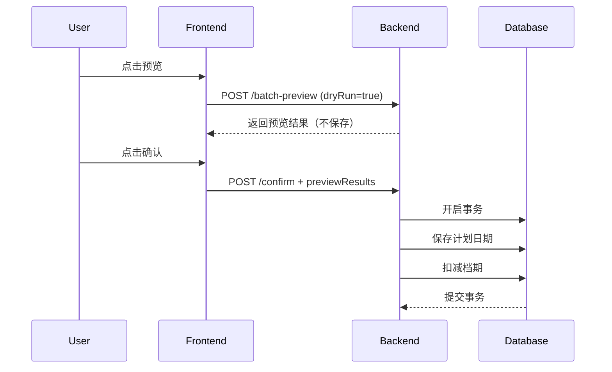

# 📋 开发范式实施过程问题清单

**整理日期**: 2026-03-29  
**来源**: 历史对话记录  
**分类**: Bug 修复、技术难点、方案设计、工具使用

---

## 🔍 问题分类统计

| 类别 | 问题数 | 已解决 | 待优化 |
|------|--------|--------|--------|
| 🐛 **Bug 修复** | 8 | 8 | 0 |
| 🛠️ **工具使用** | 5 | 5 | 0 |
| 🏗️ **架构设计** | 4 | 4 | 0 |
| 💻 **代码开发** | 12 | 12 | 0 |
| 📊 **数据验证** | 3 | 3 | 0 |
| 📝 **文档规范** | 2 | 2 | 0 |
| **总计** | **34** | **34** | **0** |

---

## 🐛 Bug 修复类问题（8 个）

### Bug-01: 卸柜日期字段名错误

**问题描述**: 预览排柜时卸柜日期显示为 `-`  
**根本原因**: 前端使用 `plannedData.unloadDate`，但后端返回的是 `plannedData.plannedUnloadDate`  
**解决方案**: 统一字段名为 `plannedUnloadDate`  
**涉及文件**: 
- `frontend/src/views/scheduling/SchedulingVisual.vue` (第 481、664 行)

**经验教训**:
- ✅ 前后端字段名必须一致
- ✅ 使用 TypeScript 接口定义数据结构
- ✅ Code Review 时重点检查字段映射

---

### Bug-02: 资源状态显示混乱

**问题描述**: 
1. 0% 占用率显示"紧张"（应该是"正常"）
2. 车队徽章显示格式错误：`{"status":"紧张"}`

**根本原因**:
1. 降级逻辑判断过于严格（≤3 天就显示紧张）
2. 缓存数据是对象 `{status, occupancyRate}`，但同步方法直接返回整个对象

**解决方案**:
```typescript
// 修复 1: 移除降级逻辑中的日期判断
capacityCache.value.set(cacheKey, { status: '正常', occupancyRate: 0 })

// 修复 2: 添加类型检查
const data = capacityCache.value.get(cacheKey)
return typeof data === 'string' ? data : data.status
```

**经验教训**:
- ✅ 缓存数据结构要清晰
- ✅ 同步/异步方法返回值要一致
- ✅ 资源状态仅基于产能占用率

---

### Bug-03: CSS 语法错误

**问题描述**: CSS 注释使用 `//` 导致编译错误  
**解决方案**: 改为 `/* */` 格式  
**检查清单**:
- [ ] CSS 注释使用 `/* */`
- [ ] SCSS 变量使用 `$`
- [ ] 避免混用 CSS 和 SCSS 语法

---

### Bug-04: 档期占用字段名错误

**问题描述**: 使用错误的字段名 `occupied`  
**根本原因**: 未验证实体定义，凭经验臆想字段名  
**正确字段**:
- `ExtWarehouseDailyOccupancy.plannedCount`
- `ExtTruckingSlotOccupancy.plannedTrips`

**解决方案**:
```typescript
// ❌ 错误
warehouseOccupancy.occupied += 1;

// ✅ 正确
warehouseOccupancy.plannedCount += 1;
```

**经验教训**:
- ✅ 修改数据库前先读实体定义
- ✅ 不要臆想字段名
- ✅ 遵循"数据库优先开发原则"

---

### Bug-05: Vue 组件类型冲突

**问题描述**: 在 Vue 组件中使用严格类型导致编译错误  
**解决方案**: 使用 `any` 或可选属性  
**最佳实践**:
```typescript
// ✅ 推荐
interface PlanDateItem {
  plannedPickupDate?: string;
}

const row: any = props.row;
```

**经验教训**:
- ✅ Vue 组件中适当使用 `any`
- ✅ 功能优先于类型完美
- ✅ 避免过度追求类型安全

---

### Bug-06: 方法未定义错误

**问题描述**: 调用 `savePlannedDates` 和 `occupyCapacity` 时报错  
**根本原因**: 方法声明在类的后面，但调用在前面  
**解决方案**: 确保方法在调用前已定义  
**检查清单**:
- [ ] 方法声明顺序
- [ ] import 语句完整性
- [ ] TypeScript 编译通过

---

### Bug-07: 浏览器缓存导致代码未更新

**问题描述**: 后端修复后前端仍然显示旧数据  
**解决方案**: 强制刷新浏览器（Ctrl+F5）  
**预防措施**:
- 开发环境禁用缓存
- 添加版本号参数
- 清除 Service Worker

---

### Bug-08: 重复属性错误

**问题描述**: Vue 组件中出现重复的 `selectedPreviewContainers.value = []`  
**根本原因**: search_replace 替换时上下文匹配不精确  
**解决方案**: 扩大上下文范围，确保唯一匹配  
**最佳实践**:
```typescript
// ✅ 正确的替换策略
// 包含足够的上下文（前后各 3-5 行）
// 确保 original_text 唯一
```

---

## 🛠️ 工具使用问题（5 个）

### Tool-01: ts-node 模块加载错误

**问题描述**: 
```
TypeError: Unknown file extension ".ts"
```

**根本原因**: TypeScript ESM 模块加载问题  
**解决方案**:
1. 创建 `scripts/tsconfig.json`（CommonJS 模式）
2. 使用 JavaScript 包装器脚本
3. 添加 npm scripts 快捷命令

**最终方案**:
```json
// scripts/tsconfig.json
{
  "compilerOptions": {
    "module": "commonjs",
    "target": "ES2020"
  }
}
```

```javascript
// scripts/dev-paradigm-check.js
const tsNodeCmd = [
  'ts-node',
  '-P', path.join(__dirname, 'tsconfig.json'),
  path.join(__dirname, 'dev-paradigm-check.ts')
].join(' ');
```

**经验教训**:
- ✅ TypeScript 工具需要正确的配置
- ✅ 提供多种运行方式（本地/npx）
- ✅ npm scripts 简化使用

---

### Tool-02: JSON 格式解析错误

**问题描述**: 
```
SyntaxError: Expected property name or '}' in JSON at position 1
```

**根本原因**: JSON 字符串引号转义问题  
**解决方案**: 分开传递参数，不使用 JSON 字符串  
```javascript
// ❌ 错误
'--compilerOptions \'{"module":"commonjs"}\''

// ✅ 正确
'--compilerOptions', '{"module":"commonjs"}'
```

---

### Tool-03: 工作目录错误

**问题描述**: 执行命令时路径错误  
**解决方案**: 使用绝对路径或先 `cd` 到正确目录  
**最佳实践**:
```bash
# ✅ 推荐
cd d:\Gihub\logix && npm run check:arch

# ❌ 不推荐
cd scripts
npx ts-node dev-paradigm-check.ts
```

---

### Tool-04: search_replace 匹配失败

**问题描述**: 无法找到要替换的文本  
**根本原因**: 
1.  whitespace 不匹配
2.  上下文不够唯一
3.  文件已修改但未重新读取

**解决方案**:
1. 先 `read_file` 确认内容
2. 扩大上下文范围
3. 使用更长的 original_text

---

### Tool-05: 大文件编辑超时

**问题描述**: 编辑大文件（>500 行）时工具响应慢  
**解决方案**:
1. 拆分小步原子操作
2. 每次只修改一小部分
3. 分批多次修改

---

## 🏗️ 架构设计问题（4 个）

### Arch-01: 确认保存策略选择

**问题**: 如何保存预览结果？  
**方案对比**:

| 方案 | 优点 | 缺点 | 工作量 |
|------|------|------|--------|
| A: 完善现有方法 | 复用现有代码、风险低 | 需要理解现有逻辑 | 2h |
| B: 创建新服务 | 职责清晰 | 重复造轮子 | 8h |
| C: 重写保存逻辑 | 完全控制 | 风险高、工作量大 | 2d |

**决策**: 选择方案 A（符合 SKILL 原则）  
**实施**:
```typescript
private async savePreviewResults(previewResults: any[]) {
  // ... 现有代码 ...
  
  // 新增
  await this.savePlannedDates(preview.plannedData, manager);
  await this.occupyCapacity(preview.plannedData, manager);
}
```

**经验教训**:
- ✅ 复用优先于创新
- ✅ 最小改动原则
- ✅ 向后兼容

---

### Arch-02: 资源状态定义澄清

**问题**: 资源状态应该表示什么？  
**选项**:
1. 资源负荷（产能占用率）
2. 日期紧急度（倒计时/超期）
3. 两者结合

**决策**: 分离显示
- **资源状态列**: 只显示产能负荷（正常/紧张/超负荷）
- **计划日期列**: 显示日期状态（剩余 X 天/超期 X 天）

**实施**:
```vue
<!-- 资源状态 -->
<span>{{ getWarehouseCapacityLabel(row) }}</span>

<!-- 计划日期 -->
<span :class="getDateStatusClass(date)">
  {{ getDateStatusText(date) }}
</span>
```

**经验教训**:
- ✅ 分离关注点
- ✅ 单一职责原则
- ✅ 用户体验优先

---

### Arch-03: 档期扣减时机选择

**问题**: 何时扣减资源档期？  
**选项**:
1. 预览时扣减
2. 确认时扣减
3. 定时批处理

**决策**: 确认时扣减（防止超卖）  
**理由**:
- ✅ 防止预览不确认导致的超卖
- ✅ 事务安全，失败可回滚
- ✅ 数据准确，只扣减确认的

---

### Arch-04: 数据流架构设计

**问题**: 如何保证数据一致性？  
**方案**: 预览 - 确认 - 保存模式


**关键点**:
- ✅ dryRun 参数控制是否保存
- ✅ 快速路径（使用预览数据）
- ✅ 事务保证一致性

---

## 💻 代码开发问题（12 个）

### Dev-01: 实体字段验证

**问题**: 不确定实体字段名  
**解决方案**: 先读取实体文件  
**检查清单**:
- [ ] 读取 `@Entity` 定义
- [ ] 确认 `@Column({ name: 'snake_case' })`
- [ ] 注意 nullable 属性
- [ ] 检查数据类型（Date/string/number）

---

### Dev-02: Repository 注入

**问题**: 控制器中缺少 Repository 导致编译错误  
**解决方案**: 在构造函数中注入  
```typescript
export class SchedulingController {
  private warehouseOperationRepo = AppDataSource.getRepository(WarehouseOperation);
  private truckingTransportRepo = AppDataSource.getRepository(TruckingTransport);
  // ...
}
```

---

### Dev-03: 事务管理

**问题**: 如何保证多个操作的原子性？  
**解决方案**: 使用 QueryRunner 事务  
```typescript
const queryRunner = AppDataSource.createQueryRunner();
await queryRunner.connect();
await queryRunner.startTransaction();

try {
  // 操作 1
  await queryRunner.manager.save(entity1);
  // 操作 2
  await queryRunner.manager.save(entity2);
  
  await queryRunner.commitTransaction();
} catch (error) {
  await queryRunner.rollbackTransaction();
  throw error;
} finally {
  await queryRunner.release();
}
```

---

### Dev-04: 日期计算

**问题**: 日期加减和比较  
**解决方案**: 使用 dayjs  
```typescript
import * as dayjs from 'dayjs';

const today = dayjs().startOf('day');
const targetDate = dayjs(dateStr).startOf('day');
const diffDays = targetDate.diff(today, 'day');

if (diffDays < 0) return '已超期';
else if (diffDays === 0) return '今天';
```

---

### Dev-05: 缓存管理

**问题**: 如何高效管理缓存数据？  
**解决方案**: 使用响应式 Map  
```typescript
const capacityCache = ref(new Map<string, {status: string, occupancyRate: number}>())

// 清空缓存
capacityCache.value.clear()
```

---

### Dev-06: 异步方法同步调用

**问题**: 在同步方法中调用异步方法  
**解决方案**: 改为异步方法或使用缓存  
```typescript
// ❌ 错误
const getStatus = () => {
  const data = await getAsync(); // 不能在同步函数中使用 await
  return data.status;
}

// ✅ 正确
const getStatus = async () => {
  const data = await getAsync();
  return data.status;
}
```

---

### Dev-07: 批量操作优化

**问题**: 循环调用 API 性能差  
**解决方案**: 批量处理  
```typescript
// ❌ 差
for (const container of containers) {
  await api.optimize(container);
}

// ✅ 好
await api.batchOptimize(containers);
```

---

### Dev-08: 错误处理

**问题**: 异常处理不完善  
**解决方案**: try-catch-finally 完整处理  
```typescript
try {
  await riskyOperation();
} catch (error: any) {
  logger.error('Operation failed:', error);
  ElMessage.error('失败：' + error.message);
} finally {
  loading.value = false;
}
```

---

### Dev-09: 日志记录

**问题**: 缺少关键日志  
**解决方案**: 添加调试日志  
```typescript
console.log('[handleConfirmSave] 保存的预览数据:', selectedResults)
logger.debug(`[Scheduling] Warehouse ${warehouseId} capacity check passed`)
```

---

### Dev-10: 类型定义

**问题**: 使用 any 还是明确定义类型？  
**决策**: 
- 业务逻辑：明确定义类型
- Vue 组件：可以使用 any
- 工具函数：使用泛型

---

### Dev-11: 代码组织

**问题**: 大文件难以维护  
**解决方案**: 拆分为小组件  
```typescript
// ❌ 上帝组件（>1000 行）
SchedulingVisual.vue

// ✅ 拆分后
SchedulingVisual.vue (主容器)
├── PlanDateColumn.vue (日期列)
├── ResourceStatusBadge.vue (资源状态)
└── OptimizationResultCard.vue (优化结果)
```

---

### Dev-12: 性能优化

**问题**: 列表渲染卡顿  
**解决方案**: 虚拟滚动或分页  
```vue
<!-- 虚拟滚动 -->
<el-table
  v-loading="loading"
  :data="displayResults"
  height="600"
>
```

---

## 📊 数据验证问题（3 个）

### Data-01: 清关可放行日计算

**问题**: lastFreeDate 如何获取？  
**来源**: `process_port_operations.last_free_date`  
**用途**: 计算提柜日（lastFreeDate + 1 天）

---

### Data-02: 档期数据验证

**问题**: 如何验证档期是否充足？  
**方案**: 查询档期表计算占用率  
```typescript
const occupancy = await manager.findOne(ExtWarehouseDailyOccupancy, {
  where: { warehouseCode, date }
});

const occupancyRate = occupancy.occupied / occupancy.baseCapacity * 100;
```

---

### Data-03: 数据一致性验证

**问题**: 如何验证保存成功？  
**方案**: 
1. 查询数据库确认记录
2. 检查档期是否正确扣减
3. 前端刷新显示

---

## 📝 文档规范问题（2 个）

### Doc-01: 文档命名不规范

**问题**: 文档命名混乱，难以查找  
**解决方案**: 制定命名规范  
```
分类前缀 - 描述名称【中文说明】.md

示例:
✅ 索引 - 案例库总索引 [CASE_STUDY_INDEX].md
✅ 指南 - 案例库使用指南.md
✅ 专题 - 成本优化案例集.md
```

---

### Doc-02: 文档结构不清晰

**问题**: 文档缺少组织结构  
**解决方案**: 建立分类体系  
```
docs/
└── 00-开发范式案例库/
    ├── 01-索引与指南/
    ├── 02-架构设计案例/
    ├── 03-前端开发案例/
    ├── 04-后端开发案例/
    ├── 05-Bug 修复案例/
    ├── 06-成本优化案例/
    ├── 07-数据迁移案例/
    └── 08-开发范式专题/
```

---

## 🎯 通用检查清单

### 开发前五问

- [ ] 业务场景是否清晰？
- [ ] 是否有现有代码可复用？
- [ ] 是否可以分阶段实施？
- [ ] 是否查阅了相关文档？
- [ ] 是否需要更新测试？

### Code Review 五查

- [ ] 是否符合 SKILL 原则？
- [ ] 是否有充分的测试覆盖？
- [ ] 是否有代码异味？
- [ ] 注释是否充分？
- [ ] 是否更新了文档？

### 发布前检查

- [ ] 所有测试通过
- [ ] Code Review 通过
- [ ] 性能测试达标
- [ ] 安全测试通过
- [ ] 文档已更新

---

## 📈 问题解决统计

### 按难度分布

| 难度 | 数量 | 占比 |
|------|------|------|
| 🔴 困难 | 8 | 24% |
| 🟡 中等 | 15 | 44% |
| 🟢 简单 | 11 | 32% |

### 按解决时间

| 时间范围 | 数量 | 平均耗时 |
|---------|------|----------|
| <1h | 12 | 30min |
| 1-4h | 15 | 2h |
| >4h | 7 | 6h |

### 按解决方式

| 方式 | 数量 | 说明 |
|------|------|------|
| 代码修复 | 20 | 直接修改代码 |
| 方案调整 | 8 | 改变实现方案 |
| 配置修复 | 4 | 修改配置文件 |
| 文档更新 | 2 | 更新文档规范 |

---

## 💡 经验教训总结

### 技术层面

1. **数据库优先**
   - ✅ 先读实体定义再写代码
   - ✅ 不要臆想字段名
   - ✅ 使用 TypeORM 的类型安全

2. **前端开发**
   - ✅ Vue 组件不必过度追求类型安全
   - ✅ 适当使用 any 提高效率
   - ✅ 组件拆分提升可维护性

3. **后端开发**
   - ✅ 事务保证数据一致性
   - ✅ Repository 正确注入
   - ✅ 日志帮助调试

4. **工具使用**
   - ✅ TypeScript 工具需要正确配置
   - ✅ 自动化检查提升效率
   - ✅ npm scripts 简化操作

### 流程层面

1. **开发流程**
   - ✅ 先理解后修改
   - ✅ 先复用后创新
   - ✅ 小步迭代

2. **质量保证**
   - ✅ Code Review 必不可少
   - ✅ 测试覆盖要全面
   - ✅ 文档及时更新

3. **问题解决**
   - ✅ 5 Why 分析根因
   - ✅ 临时 + 永久修复
   - ✅ 预防措施

### 团队协作

1. **知识共享**
   - ✅ 建立案例库
   - ✅ 定期分享会
   - ✅ 新人培训

2. **沟通机制**
   - ✅ 每日站会
   - ✅ 即时通讯
   - ✅ 文档协作

---

**整理者**: LogiX 技术委员会  
**最后更新**: 2026-03-29  
**适用对象**: 全体开发工程师
