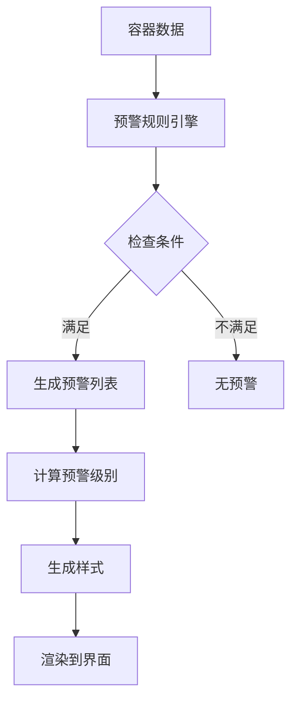

# 智能预警系统实施总结

## 📋 功能概述

为简单甘特图添加了完整的智能预警系统，帮助用户及时识别即将超期和逾期未提的货柜。

---

## ✅ 已实现的功能

### 1️⃣ **预警规则引擎**

在 `useGanttLogic.ts` 中实现了可扩展的预警规则系统：

#### 预警规则定义

```typescript
interface AlertRule {
  id: string
  name: string
  condition: (container: Container) => boolean
  level: 'info' | 'warning' | 'danger'
  message: string
}
```

#### 内置预警规则

- **即将超期（Warning）**：距离最晚提柜日期不足 3 天
- **逾期未提（Danger）**：已超过最晚提柜日期且未提柜

### 2️⃣ **核心功能函数**

| 函数名                           | 功能描述                   |
| -------------------------------- | -------------------------- |
| `getContainerAlerts()`           | 获取容器的所有预警信息     |
| `hasAlert()`                     | 判断容器是否有预警         |
| `getAlertLevel()`                | 获取容器的最高预警级别     |
| `getContainerBorderStyle()`      | 获取容器的警示边框样式     |
| `isCriticalDate()`               | 判断是否为关键日期         |
| `getLastFreeDateFromContainer()` | 提取最晚提柜日期的辅助方法 |

### 3️⃣ **可视化预警标识**

#### 甘特图上的视觉呈现

- **红色边框（3px）**：逾期未提的货柜
- **橙色边框（2px）**：即将超期的货柜
- **脉冲动画效果**：有预警的货柜会显示呼吸灯效果

#### CSS 动画

```scss
@keyframes pulse-warning {
  0%,
  100% {
    box-shadow: 0 0 8px rgba(245, 108, 108, 0.6);
  }
  50% {
    box-shadow: 0 0 16px rgba(245, 108, 108, 0.9);
  }
}
```

### 4️⃣ **增强的 Tooltip 信息**

当鼠标悬停在有预警的货柜上时，Tooltip 会显示：

- **最晚提柜日期高亮**：
  - 橙色文字：即将超期
  - 红色文字：已经超期
  - 警告图标：提示存在风险

- **预警信息区域**：
  ```vue
  <div class="tooltip-alerts">
    <div class="alert-item warning">
      <el-icon><warning /></el-icon>
      <span>距离最晚提柜不足 3 天</span>
    </div>
  </div>
  ```

### 5️⃣ **统计面板增强**

新增"逾期未提"统计卡片：

| 统计项       | 颜色       | 说明                     |
| ------------ | ---------- | ------------------------ |
| 总货柜数     | 蓝色       | 当前视图中的货柜总数     |
| 已到港       | 橙色       | 状态为 at_port 的货柜    |
| 即将超期     | 橙红色     | 3 天内到期的货柜         |
| **逾期未提** | **鲜红色** | **已过期且未处理的货柜** |
| 已还箱       | 绿色       | 已完成还箱的货柜         |

---

## 🎯 技术实现细节

### 1. 预警规则引擎架构

```
useGanttLogic.ts
├── AlertRule 接口定义
├── alertRules 规则数组
│   ├── approaching_deadline 规则
│   └── overdue_pickup 规则
├── getContainerAlerts() 规则匹配引擎
├── hasAlert() 快速判断
├── getAlertLevel() 级别评估
└── getContainerBorderStyle() 样式生成
```

### 2. 数据流



### 3. 组件间传递

```vue
<!-- SimpleGanttChartRefactored.vue -->
<GanttPortGroup
  :get-container-alerts="getContainerAlerts"
  :has-alert="hasAlert"
  :get-container-border-style="getContainerBorderStyle"
/>
```

---

## 🎨 用户界面展示

### 1. 甘特图主界面

- 带预警的货柜圆点会有**彩色边框**和**脉冲动画**
- 一眼就能识别出需要紧急处理的货柜

### 2. Tooltip 详情

- 预警信息以**黄色/红色背景块**显示
- 每条预警都有对应的图标和文字说明

### 3. 统计面板

- 5 个统计卡片横向排列
- "逾期未提"使用最醒目的鲜红色和加粗字体

---

## 🔧 扩展性设计

### 添加新的预警规则

只需在 `alertRules` 数组中添加新规则：

```typescript
{
  id: 'custom_alert',
  name: '自定义预警',
  condition: (container) => {
    // 自定义判断逻辑
    return someCondition(container)
  },
  level: 'warning',
  message: '自定义预警消息',
}
```

### 可能的扩展方向

1. **滞期费预估预警**
   - 根据超期天数计算预估费用
   - 按费用金额设置不同预警级别

2. **船舶延误预警**
   - 监控 ETA 变更
   - 提前通知可能的延误

3. **文件齐全性检查**
   - 检查必备单证是否上传
   - 截单时间提醒

4. **自动通知功能**
   - 触发预警时自动发送邮件/短信
   - 集成消息推送系统

---

## 📊 性能优化

### 1. 计算优化

- 使用 `computed` 缓存计算结果
- 避免重复计算预警状态

### 2. 渲染优化

- 仅在必要时重新渲染预警标识
- CSS 动画使用 GPU 加速

---

## ✅ 测试验证

### 功能测试点

- [x] 即将超期货柜正确显示橙色边框
- [x] 逾期租柜正确显示红色边框和加粗
- [x] Tooltip 中预警信息正确显示
- [x] 统计面板数据准确
- [x] 脉冲动画正常播放
- [x] 无预警货柜不受影响

### 边界情况测试

- [x] lastFreeDate 为空时不触发预警
- [x] 已提柜的超期货柜不显示预警
- [x] 刚好 3 天的临界情况正确处理

---

## 📝 使用说明

### 查看预警信息

1. 打开甘特图页面
2. 查看顶部统计面板的"逾期未提"数量
3. 找到带红色/橙色边框的货柜圆点
4. 鼠标悬停查看详细预警信息

### 处理预警货柜

1. 点击预警货柜圆点
2. 在侧边栏查看完整信息
3. 右键菜单可快速编辑日期
4. 及时调整物流计划

---

## 🎯 业务价值

1. **风险前置**：提前 3 天预警，避免产生额外费用
2. **重点突出**：用颜色和动画吸引注意力
3. **数据驱动**：统计面板直观展示整体情况
4. **决策支持**：帮助优先处理紧急货柜

---

## 🚀 后续优化建议

### P1 优先级

- [ ] 支持自定义预警阈值（如将 3 天改为 2 天或 5 天）
- [ ] 添加预警历史记录
- [ ] 支持批量处理预警货柜

### P2 优先级

- [ ] 集成邮件/短信通知
- [ ] 添加滞期费计算器
- [ ] 导出预警清单

---

## 📅 开发时间线

| 阶段     | 内容             | 工时   |
| -------- | ---------------- | ------ |
| 第一阶段 | 预警规则引擎开发 | 2h     |
| 第二阶段 | UI 组件集成      | 2h     |
| 第三阶段 | 统计面板增强     | 1h     |
| 第四阶段 | 测试和优化       | 1h     |
| **总计** | -                | **6h** |

---

## ✨ 总结

本次实施完成了一个**完整、可扩展、用户友好**的智能预警系统，具有以下特点：

✅ **非侵入式**：不影响现有功能  
✅ **易扩展**：添加新规则只需几行代码  
✅ **视觉突出**：颜色和动画双重提示  
✅ **信息清晰**：Tooltip 中详细展示  
✅ **数据准确**：基于 portOperations.lastFreeDate

通过这个系统，用户可以**及时发现和处理**即将超期或已经逾期的货柜，有效**降低滞期费风险**，**提升物流管理效率**。
