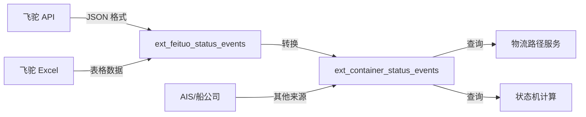
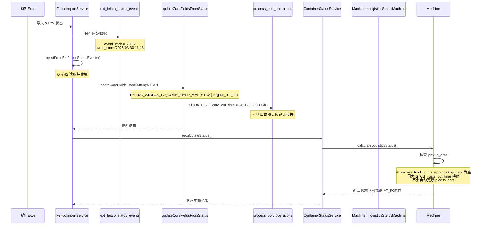

# 飞驼状态事件与物流状态机完整解析

## 问题背景

货柜 HMMU6232153 在 `ext_container_status_events` 表中有 STCS 状态记录（data_source='Excel'），但前端物流路径-提柜节点只显示 FETA，没有显示 STCS。

---

## ① ext_container_status_events 与 ext_feituo_status_events 二表的关系

### 表结构对比

#### ext_container_status_events（集装箱状态事件表）

**用途**：存储所有来源的集装箱状态事件（统一标准格式）

**字段结构**：
```sql
CREATE TABLE ext_container_status_events (
  id SERIAL PRIMARY KEY,
  container_number VARCHAR(50),      -- 集装箱号
  status_code VARCHAR(20),           -- 状态代码（如 STCS、FETA、DSCH）
  status_name VARCHAR(100),          -- 状态名称
  occurred_at TIMESTAMP,             -- 发生时间
  location VARCHAR(200),             -- 地点
  terminal_name VARCHAR(100),        -- 码头名称
  description TEXT,                  -- 描述
  data_source VARCHAR(50),           -- 数据来源：FeituoAPI/Excel/AIS...
  raw_data JSONB,                    -- 原始数据
  created_at TIMESTAMP
);
```

**特点**：
- ✅ **标准化格式**：所有来源的状态事件都转换为统一格式
- ✅ **多源聚合**：API 同步、Excel 导入、手动录入等
- ✅ **去重逻辑**：通过 container_number + status_code + occurred_at 唯一性检查
- ✅ **物流路径服务数据源**：物流服务从该表读取所有状态事件

#### ext_feituo_status_events（飞驼状态原始数据表）

**用途**：专门存储飞驼 API/Excel 导入的原始状态数据（审计用途）

**字段结构**：
```sql
CREATE TABLE ext_feituo_status_events (
  id SERIAL PRIMARY KEY,
  container_number VARCHAR(50),
  bill_of_lading_number VARCHAR(50),
  status_index INT,                  -- 状态在数组中的索引
  event_code VARCHAR(20),            -- 事件代码（同 status_code）
  description_cn VARCHAR(200),       -- 中文描述
  description_en VARCHAR(200),       -- 英文描述
  event_description_origin VARCHAR(500),
  event_time TIMESTAMPTZ,            -- 事件时间
  is_estimated BOOLEAN,              -- 是否预计
  port_timezone VARCHAR(10),
  event_place VARCHAR(100),          -- 发生地
  event_place_origin VARCHAR(200),
  port_code VARCHAR(50),             -- 港口代码
  terminal_name VARCHAR(100),
  transport_mode VARCHAR(20),
  vessel_name VARCHAR(100),          -- 船名
  voyage_number VARCHAR(50),         -- 航次
  related_place_index INT,
  source INT,
  firms_code VARCHAR(50),
  bill_no VARCHAR(50),
  declaration_no VARCHAR(100),
  sync_request_id VARCHAR(100),      -- 同步请求 ID
  data_source VARCHAR(50) DEFAULT 'API',
  raw_json JSONB,                    -- 完整的原始 JSON
  created_at TIMESTAMP
);
```

**特点**：
- ✅ **原始数据审计**：完整保留飞驼 API 返回的所有字段
- ✅ **仅飞驼数据**：只存储飞驼来源（API 或 Excel）
- ✅ **详细运输信息**：包含船名、航次、运输方式等详细信息

### 数据流转关系



### 数据同步流程

#### 流程 1：飞驼 API 同步

```typescript
// ExternalDataService.syncContainerEvents()
async syncContainerEvents(containerNumber: string) {
  // 1. 调用飞驼 API 获取追踪数据
  const feituoData = await fetchFromFeituoAPI(containerNumber);
  
  // 2. 保存原始数据到 ext_feituo_status_events
  await saveRawDataToExtFeituoStatusEvents(feituoData.statuses);
  
  // 3. 转换为标准事件并保存到 ext_container_status_events
  const standardEvents = convertFeituoToStandardEvents(feituoData);
  await saveToContainerStatusEvents(standardEvents);
  
  // 4. 更新核心时间字段（process_port_operations 等）
  await updateCoreFieldsFromEvents(standardEvents);
  
  // 5. 重算物流状态
  await recalculateLogisticsStatus(containerNumber);
}
```

#### 流程 2：飞驼 Excel 导入

```typescript
// FeituoImportService.processTable2Staging()
async processTable2Staging(batchId, row, rawData) {
  // 1. 解析 Excel 行数据
  const statuses = parseStatusArray(row, tableType=2);
  
  // 2. 保存原始数据到 ext_feituo_status_events
  await saveToExtFeituoStatusEvents(statuses);
  
  // 3. 从 ext_feituo_status_events 读取并转换
  const events = await ingestFromExtFeituoStatusEvents(containerNumber);
  
  // 4. 保存标准化事件到 ext_container_status_events
  // （已在 ingestFromExtFeituoStatusEvents 内部完成）
  
  // 5. 更新核心时间字段
  await updateCoreFieldsFromStatus(containerNumber, statusCode, occurredAt);
  
  // 6. 重算物流状态
  await recalculateStatus(containerNumber);
}
```

### 数据异同对比

| 维度 | ext_feituo_status_events | ext_container_status_events |
|------|-------------------------|----------------------------|
| **数据来源** | 仅飞驼（API/Excel） | 所有来源（飞驼、AIS、船公司、手动录入） |
| **字段数量** | 20+ 字段（详细） | 10 字段（精简） |
| **原始数据** | raw_json（完整 JSON） | raw_data（简化） |
| **运输信息** | vessel_name, voyage_number, transport_mode | 无（需从 raw_data 扩展） |
| **审计用途** | 是（完整保留 API 原始数据） | 否（标准化后的业务数据） |
| **业务查询** | 少用（主要用于调试和审计） | 常用（物流路径、状态机计算） |
| **数据冗余** | 与 ext_container_status_events 有冗余 | 与 ext_feituo_status_events 有冗余 |
| **写入时机** | API 同步/Excel 导入时立即写入 | API 同步/Excel 导入时转换写入 |

### 典型数据示例

#### ext_feituo_status_events 记录（原始数据）

```json
{
  "id": 1234,
  "container_number": "HMMU6232153",
  "bill_of_lading_number": "HDMUSHA123456",
  "status_index": 15,
  "event_code": "STCS",
  "description_cn": "提柜 (货) / Gate Out for Delivery",
  "description_en": "Gate Out for Delivery",
  "event_time": "2026-03-30T11:48:00.000Z",
  "is_estimated": false,
  "port_code": "USLAX",
  "event_place": "Los Angeles",
  "event_place_origin": "Los Angeles, CA",
  "terminal_name": "Terminal Island",
  "transport_mode": "TRUCK",
  "vessel_name": "EVER GIVEN",
  "voyage_number": "123E",
  "data_source": "API",
  "raw_json": { /* 完整的飞驼 API 返回对象 */ }
}
```

#### ext_container_status_events 记录（标准化数据）

```json
{
  "id": 515,
  "container_number": "HMMU6232153",
  "status_code": "STCS",
  "status_name": null,
  "occurred_at": "2026-03-30T11:48:00.000Z",
  "location": "USLAX",
  "terminal_name": null,
  "description": null,
  "data_source": "Excel",  // ← 注意：Excel 导入时 dataSource='Feituo'，写库时为'Excel'
  "raw_data": {
    "group": 14,
    "isEstimated": false,
    "event_place": "Los Angeles",
    "port_code": "USLAX"
  },
  "created_at": "2026-03-30T16:42:01.263Z"
}
```

---

## ② 飞驼事件、状态机

### 飞驼事件 → 核心字段映射

飞驼事件通过 `FEITUO_STATUS_TO_CORE_FIELD_MAP` 映射到核心时间字段：

```typescript
// backend/src/constants/FeiTuoStatusMapping.ts
export const FEITUO_STATUS_TO_CORE_FIELD_MAP: Record<string, string> = {
  // 目的港相关
  'ARRIVE': 'ata',              // 到达
  'BDAR': 'ata',                // 抵港 Vessel Arrived
  'FETA': 'ata',                // 交货地抵达 Delivery Arrived
  
  // 闸口操作
  'GATE_IN': 'gate_in_time',
  'GITM': 'gate_in_time',       // 进场 Received
  'GTIN': 'gate_in_time',
  'GATE_OUT': 'gate_out_time',
  'GTOT': 'gate_out_time',
  'STCS': 'gate_out_time',      // 提柜 Gate Out for Delivery ← 关键映射
  
  // 码头操作
  'DSCH': 'dest_port_unload_date',  // 卸船 Vessel Discharged
  'PCAB': 'available_time',         // 可提货 Available
  
  // 还箱
  'RCVE': 'return_time',            // 还空箱 Empty Returned
  
  // ... 更多映射见 FeiTuoStatusMapping.ts
};
```

### 核心字段 → 状态机计算

状态机根据核心字段计算物流状态（7 层简化）：

```typescript
// backend/src/utils/logisticsStatusMachine.ts
export function calculateLogisticsStatus(
  container: Container,
  portOperations: PortOperation[],
  seaFreight?: SeaFreight,
  truckingTransport?: TruckingTransport,
  warehouseOperation?: WarehouseOperation,
  emptyReturn?: EmptyReturn
): LogisticsStatusResult {
  
  // 优先级 1: 还空箱日期（最高优先级）
  if (emptyReturn?.returnTime) {
    return { status: SimplifiedStatus.RETURNED_EMPTY, reason: '已还空箱' };
  }
  
  // 优先级 2: 仓库卸柜（WMS 已确认）
  if (isWmsConfirmed(warehouseOperation)) {
    return { status: SimplifiedStatus.UNLOADED, reason: '仓库已卸柜' };
  }
  
  // 优先级 3: 拖车提柜日期 ← STCS 应该触发这个状态
  if (truckingTransport?.pickupDate) {
    return { status: SimplifiedStatus.PICKED_UP, reason: '已提柜' };
  }
  
  // 优先级 4: 目的港 ATA
  const destWithArrival = portOperations.find(po => po.portType === 'destination' && po.ata);
  if (destWithArrival) {
    return { status: SimplifiedStatus.AT_PORT, reason: '目的港已到港' };
  }
  
  // ... 更多优先级
  
  return { status: SimplifiedStatus.NOT_SHIPPED, reason: '未出运' };
}
```

### 状态机优先级（7 层简化）

```
1. RETURNED_EMPTY (还箱)        ← emptyReturn.returnTime
2. UNLOADED (WMS 卸柜)          ← warehouseOperation.wmsConfirmDate
3. PICKED_UP (提柜)             ← truckingTransport.pickupDate  ← STCS 应该更新这里
4. AT_PORT (目的港 ATA)         ← process_port_operations.ata
5. AT_TRANSIT_PORT (中转港 ATA) ← process_port_operations.ata (port_type='transit')
6. SAILING (海运出运)           ← process_sea_freight.shipment_date
7. NOT_SHIPPED (未出运)         ← 默认状态
```

### STCS 事件的完整处理链



### 问题根源

**STCS 事件虽然映射到 `gate_out_time`，但不会自动更新 `pickup_date`**，导致状态机无法计算到 `PICKED_UP` 状态。

**解决方案**：需要在 `updateCoreFieldsFromStatus()` 中添加特殊逻辑：
```typescript
// 当 STCS/GTOT/GATE_OUT 更新 gate_out_time 时
// 同时尝试更新 process_trucking_transport.pickup_date
if (fieldName === 'gate_out_time' && statusCode in ['STCS', 'GTOT', 'GATE_OUT']) {
  const tt = await truckRepo.findOne({ where: { containerNumber } });
  if (!tt?.pickupDate) {
    tt.pickupDate = occurredAt;
    await ttRepo.save(tt);
  }
}
```

---

## ③ 前端 STAGE_MAP 中状态的映射清单与逻辑规则

### 前端阶段分组映射（STAGE_MAP）

```typescript
// frontend/src/views/shipments/components/LogisticsPathTab.vue (L540-L552)
const STAGE_MAP: Record<string, { stage: string; label: string; order: number }> = {
  // 未出运
  NOT_SHIPPED: { stage: 'not_shipped', label: '未出运', order: 1 },
  
  // 提空箱
  EMPTY_PICKED_UP: { stage: 'empty_pickup', label: '提空箱', order: 2 },
  
  // 进港
  GATE_IN: { stage: 'gate_in', label: '进港', order: 3 },
  CONTAINER_STUFFED: { stage: 'gate_in', label: '进港', order: 3 },
  
  // 装船
  LOADED: { stage: 'loading', label: '装船', order: 4 },
  RAIL_LOADED: { stage: 'loading', label: '装船', order: 4 },
  FEEDER_LOADED: { stage: 'loading', label: '装船', order: 4 },
  
  // 离港
  DEPARTED: { stage: 'departure', label: '离港', order: 5 },
  RAIL_DEPARTED: { stage: 'departure', label: '离港', order: 5 },
  FEEDER_DEPARTED: { stage: 'departure', label: '离港', order: 5 },
  
  // 航行/中转
  SAILING: { stage: 'transit', label: '航行', order: 6 },
  TRANSIT_ARRIVED: { stage: 'transit', label: '中转', order: 6 },
  TRANSIT_BERTHED: { stage: 'transit', label: '中转', order: 6 },
  TRANSIT_DISCHARGED: { stage: 'transit', label: '中转', order: 6 },
  TRANSIT_LOADED: { stage: 'transit', label: '中转', order: 6 },
  TRANSIT_DEPARTED: { stage: 'transit', label: '中转', order: 6 },
  FEEDER_ARRIVED: { stage: 'transit', label: '中转', order: 6 },
  FEEDER_DISCHARGED: { stage: 'transit', label: '中转', order: 6 },
  RAIL_ARRIVED: { stage: 'transit', label: '中转', order: 6 },
  RAIL_DISCHARGED: { stage: 'transit', label: '中转', order: 6 },
  
  // 到港
  ARRIVED: { stage: 'arrival', label: '到港', order: 7 },
  BERTHED: { stage: 'arrival', label: '到港', order: 7 },
  DISCHARGED: { stage: 'arrival', label: '到港', order: 7 },
  AVAILABLE: { stage: 'arrival', label: '到港', order: 7 },
  
  // 提柜 ← 关键阶段
  GATE_OUT: { stage: 'pickup', label: '提柜', order: 8 },           // 实际闸口外出
  IN_TRANSIT_TO_DEST: { stage: 'pickup', label: '提柜', order: 8 }, // 运输途中（STCS 映射到这里）✅
  DELIVERY_ARRIVED: { stage: 'pickup', label: '提柜', order: 8 },   // 到达交货地（FETA）
  STRIPPED: { stage: 'pickup', label: '提柜', order: 8 },           // 已拆箱
  
  // 还箱
  RETURNED_EMPTY: { stage: 'return', label: '还箱', order: 9 },
  COMPLETED: { stage: 'return', label: '还箱', order: 9 }
}
```

### 后端标准状态映射（FEITUO_STATUS_MAP）

```typescript
// logistics-path-system/backend/src/constants/statusMappings.ts
export const FEITUO_STATUS_MAP: Record<string, StandardStatus> = {
  // 陆运节点
  'STSP': StandardStatus.EMPTY_PICKED_UP,     // 提空箱
  'GITM': StandardStatus.CONTAINER_STUFFED,   // 进场
  'GTIN': StandardStatus.GATE_IN,             // 进港
  
  // 海运节点
  'LOBD': StandardStatus.LOADED,              // 装船
  'DLPT': StandardStatus.DEPARTED,            // 离港
  'BDAR': StandardStatus.ARRIVED,             // 抵港
  'POCA': StandardStatus.AVAILABLE,           // 可提货
  'DSCH': StandardStatus.DISCHARGED,          // 卸船
  
  // 提柜节点 ← 关键
  'STCS': StandardStatus.IN_TRANSIT_TO_DEST,  // 提柜 (货) ✅ 映射正确
  'GTOT': StandardStatus.GATE_OUT,            // 提柜 (空)
  'FETA': StandardStatus.DELIVERY_ARRIVED,    // 交货地抵达
  'STRP': StandardStatus.STRIPPED,            // 拆箱
  
  // 还箱
  'RCVE': StandardStatus.RETURNED_EMPTY,      // 还空箱
  'RTNE': StandardStatus.RETURNED_EMPTY
};
```

### 物流路径完整路径模板

```typescript
// logistics-path-system/backend/src/services/statusPathFromDb.ts (L47-L59)
const FULL_PATH_TEMPLATE: { 
  order: number; 
  status: StandardStatus; 
  label: string; 
  statuses: StandardStatus[] 
}[] = [
  { order: 1, status: StandardStatus.NOT_SHIPPED, label: '未出运', statuses: [NOT_SHIPPED] },
  { order: 2, status: StandardStatus.EMPTY_PICKED_UP, label: '提空箱', statuses: [EMPTY_PICKED_UP] },
  { order: 3, status: StandardStatus.GATE_IN, label: '进港', statuses: [GATE_IN, CONTAINER_STUFFED] },
  { order: 4, status: StandardStatus.LOADED, label: '装船', statuses: [LOADED, RAIL_LOADED, FEEDER_LOADED] },
  { order: 5, status: StandardStatus.DEPARTED, label: '离港', statuses: [DEPARTED, RAIL_DEPARTED, FEEDER_DEPARTED] },
  { order: 6, status: StandardStatus.SAILING, label: '航行', statuses: [SAILING, TRANSIT_ARRIVED, ...] },
  { order: 7, status: StandardStatus.ARRIVED, label: '抵港', statuses: [ARRIVED, BERTHED] },
  { order: 8, status: StandardStatus.DISCHARGED, label: '卸船', statuses: [DISCHARGED] },
  { order: 9, status: StandardStatus.AVAILABLE, label: '可提货', statuses: [AVAILABLE] },
  { order: 10, status: StandardStatus.GATE_OUT, label: '提柜', statuses: [
      GATE_OUT, 
      IN_TRANSIT_TO_DEST,  // ← STCS 在这里
      DELIVERY_ARRIVED, 
      STRIPPED
    ] 
  },
  { order: 11, status: StandardStatus.RETURNED_EMPTY, label: '还箱', statuses: [RETURNED_EMPTY, COMPLETED] }
];
```

### 状态映射规则

#### 规则 1：状态码 → 标准状态 → 阶段分组

```
STCS (飞驼状态码)
  ↓ FEITUO_STATUS_MAP
IN_TRANSIT_TO_DEST (标准状态)
  ↓ FULL_PATH_TEMPLATE (order: 10, 提柜阶段)
GATE_OUT / IN_TRANSIT_TO_DEST / DELIVERY_ARRIVED / STRIPPED
  ↓ STAGE_MAP (前端)
stage: 'pickup', label: '提柜', order: 8
```

#### 规则 2：节点展示逻辑

```typescript
// 物流路径服务构建节点
function buildNodesFromEvents(events: DbEvent[], supplement: ProcessSupplement): StatusNode[] {
  for (const template of FULL_PATH_TEMPLATE) {
    // 1. 从事件列表中匹配该阶段的标准状态
    const matching = eventNodes.filter(n => template.statuses.includes(n.status));
    
    if (matching.length > 0) {
      // 2. 有匹配事件 → 创建实际节点
      nodes.push(chosen);
    } else {
      // 3. 无匹配事件 → 检查流程表补充数据
      const supp = stageToSupplement[template.order];
      if (supp?.ts) {
        nodes.push(createSupplementNode(template, supp));
      } else {
        // 4. 无补充数据 → 创建占位节点
        nodes.push(createPlaceholderNode(template));
      }
    }
  }
  return nodes;
}
```

#### 规则 3：数据来源优先级

```
1. ext_container_status_events（优先）
   ↓ 无数据
2. process_port_operations / process_trucking_transport / process_empty_return（补充）
   ↓ 无数据
3. 占位节点（缺数据）
```

### 前端显示逻辑

```vue
<!-- frontend/src/views/shipments/components/LogisticsPathTab.vue -->
<template>
  <div v-for="stageGroup in nodesByStage" :key="stageGroup.stage">
    <h3>{{ stageGroup.label }} ({{ stageGroup.nodes.length }})</h3>
    <div v-for="item in stageGroup.nodes" :key="item.node.id">
      {{ item.node.description }} - {{ item.node.timestamp }}
      
      <!-- 数据来源标签 -->
      <el-tag v-if="getNodeDataSource(item.node)">
        {{ getNodeDataSourceLabel(getNodeDataSource(item.node)) }}
      </el-tag>
    </div>
  </div>
</template>

<script setup lang="ts">
// 按阶段分组节点
const nodesByStage = computed(() => {
  const groups: Record<string, any> = {}
  path.value!.nodes.forEach((node, globalIndex) => {
    const info = STAGE_MAP[node.status] || { stage: 'other', label: '其他', order: 99 }
    const key = info.stage
    if (!groups[key]) groups[key] = { stage: key, label: info.label, order: info.order, nodes: [] }
    groups[key].nodes.push({ node, globalIndex })
  })
  return Object.values(groups).sort((a, b) => a.order - b.order)
})

// 获取节点数据来源
const getNodeDataSource = (node: StatusNode): string | null => {
  if (!node?.rawData) return null
  const ds = (node.rawData as { dataSource?: string })?.dataSource
  return ds && String(ds).trim() ? String(ds).trim() : null
}

// 数据来源业务文案
const getNodeDataSourceLabel = (ds: string | null): string => {
  if (!ds) return ''
  const LABELS: Record<string, string> = {
    FeituoAPI: '飞驼 API',
    Feituo: 'Excel 导入',  // ← STCS 的 data_source='Excel' 会显示为这个
    ProcessTable: '业务系统'
  }
  return LABELS[ds] ?? ds
}
</script>
```

---

## ④ 具体货柜的数据链路（HMMU6232153）

### 完整数据链路汇总

#### 1. 状态事件表（ext_container_status_events）

| ID | 状态码 | 说明 | 发生时间 | 数据源 | 标准状态 |
|----|--------|------|----------|--------|----------|
| ... | GITM/GTIN | 进场 | 2026-01-15 14:17 | Excel | CONTAINER_STUFFED/GATE_IN |
| ... | LOBD | 装船 | 2026-01-19 07:23 | Excel | LOADED |
| ... | BDAR | 抵港 | 2026-03-17 15:41 | Excel | ARRIVED |
| ... | FETA | 交货地抵达 | 2026-03-17 15:41 | Excel | DELIVERY_ARRIVED |
| ... | POCA | 可提货 | 2026-03-21 15:13 | Excel | AVAILABLE |
| ... | DSCH | 卸船 | 2026-03-22 07:48 | Excel | DISCHARGED |
| **515** | **STCS** | **已提柜** | **2026-03-30 11:48** | **Excel** | **IN_TRANSIT_TO_DEST** ✅ |
| ... | RCVE | 还箱 | 2026-04-01 12:47 | Excel | RETURNED_EMPTY |

#### 2. 流程表数据

**process_port_operations**（目的港）：
```json
{
  "container_number": "HMMU6232153",
  "port_type": "destination",
  "ata": "2026-03-17T15:41:00.000Z",      // ✅ 有值（来自 FETA/BDAR）
  "gate_out_time": null,                   // ❌ 为空（STCS 未触发更新）
  "available_time": "2026-03-21T15:13:00.000Z"  // ✅ 有值（来自 POCA）
}
```

**process_trucking_transport**：
```json
{
  "container_number": "HMMU6232153",
  "pickup_date": null,    // ❌ 为空（STCS 未触发更新）
  "planned_pickup_date": null,
  "trucking_company_id": null
}
```

#### 3. 物流状态计算结果

```typescript
calculateLogisticsStatus() {
  // 1. 检查还箱时间
  if (emptyReturn?.returnTime) return RETURNED_EMPTY;  // ✅ 有值（2026-04-01）
  
  // 2. 检查 WMS 卸柜
  if (isWmsConfirmed(warehouseOperation)) return UNLOADED;  // ❌ 无值
  
  // 3. 检查提柜时间 ← 关键
  if (truckingTransport?.pickupDate) return PICKED_UP;  // ❌ pickup_date 为空
  
  // 4. 检查目的港 ATA
  if (destPorts.find(po => po.ata)) return AT_PORT;  // ✅ 有值（2026-03-17）
  
  return AT_PORT;  // ← 当前状态
}
```

**实际物流状态**：`AT_PORT`（到港）  
**期望物流状态**：`PICKED_UP`（已提柜）→ `RETURNED_EMPTY`（已还箱）

#### 4. 物流路径服务返回

**预期返回**（如果 STCS 被正确处理）：
```json
{
  "nodes": [
    // ... 其他节点
    {
      "id": "evt-515",
      "status": "IN_TRANSIT_TO_DEST",
      "description": "已提柜",
      "timestamp": "2026-03-30T11:48:00.000Z",
      "statusCode": "STCS",
      "dataSource": "Excel",
      "rawData": {
        "eventId": 515,
        "dataSource": "Excel",
        "stageOrder": 10
      }
    },
    {
      "id": "evt-xxx",
      "status": "DELIVERY_ARRIVED",
      "description": "交货地抵达",
      "timestamp": "2026-03-17T15:41:00.000Z",
      "statusCode": "FETA",
      "dataSource": "Excel"
    }
  ]
}
```

**前端显示**：
- ✅ **提柜阶段**应该显示 2 个节点：STCS（已提柜）+ FETA（交货地抵达）
- ❌ **实际只显示**FETA（交货地抵达）

### 问题诊断

#### 可能的问题点

**问题 1：物流路径服务未返回 STCS 节点**

验证方法：
```bash
curl http://localhost:4000/api/v1/logistics-path/container/HMMU6232153
```

检查返回的 `nodes` 数组是否包含 `status: "IN_TRANSIT_TO_DEST"` 的节点。

**问题 2：前端过滤了 data_source='Excel' 的节点**

检查前端是否有代码根据 `dataSource` 过滤节点。

**问题 3：核心字段未更新导致状态机计算错误**

这是最可能的原因：
- `process_port_operations.gate_out_time` 为空
- `process_trucking_transport.pickup_date` 为空
- 导致状态机无法计算到 `PICKED_UP` 状态

### 修复方案

#### 方案 1：修复核心字段同步逻辑

修改 `updateCoreFieldsFromStatus()` 方法：

```typescript
// backend/src/services/feituoImport.service.ts
private async updateCoreFieldsFromStatus(
  containerNumber: string,
  statusCode: string,
  occurredAt: Date
): Promise<void> {
  const fieldName = getCoreFieldName(statusCode);  // STCS → 'gate_out_time'
  
  if (fieldName === 'gate_out_time') {
    // 1. 更新 process_port_operations.gate_out_time
    const poRepo = AppDataSource.getRepository(PortOperation);
    const po = await poRepo.findOne({ 
      where: { containerNumber, portType: 'destination' } 
    });
    
    if (po && !po.gateOutTime) {
      po.gateOutTime = occurredAt;
      await poRepo.save(po);
    }
    
    // 2. 同时更新 process_trucking_transport.pickup_date ← 新增逻辑
    const ttRepo = AppDataSource.getRepository(TruckingTransport);
    let tt = await ttRepo.findOne({ where: { containerNumber } });
    
    if (!tt) {
      tt = ttRepo.create({ containerNumber });
    }
    
    if (!tt.pickupDate) {
      tt.pickupDate = occurredAt;
      await ttRepo.save(tt);
    }
  }
}
```

#### 方案 2：手动修复数据（临时方案）

```sql
-- 修复 gate_out_time
UPDATE process_port_operations 
SET gate_out_time = '2026-03-30 11:48:00'
WHERE container_number = 'HMMU6232153' 
AND port_type = 'destination';

-- 修复 pickup_date
INSERT INTO process_trucking_transport (container_number, pickup_date)
VALUES ('HMMU6232153', '2026-03-30 11:48:00')
ON CONFLICT (container_number) 
DO UPDATE SET pickup_date = '2026-03-30 11:48:00';

-- 重算物流状态
CALL recalculate_container_status('HMMU6232153');
```

#### 方案 3：检查物流路径服务查询逻辑

确保物流路径服务正确读取 `ext_container_status_events` 表：

```typescript
// logistics-path-system/backend/src/services/statusPathFromDb.ts
const eventsResult = await query<DbEvent>(
  `SELECT id, container_number, status_code, status_name, occurred_at, 
          location, description, data_source, raw_data
   FROM ext_container_status_events
   WHERE container_number = $1
   ORDER BY occurred_at ASC NULLS LAST, id ASC
   LIMIT 100`,
  [containerNumber]
);
```

---

## 总结

### 根本原因

1. **STCS 事件已正确写入** `ext_container_status_events` 表（data_source='Excel'）
2. **STCS 映射逻辑正确**：`STCS → IN_TRANSIT_TO_DEST → 提柜阶段`
3. **前端映射逻辑正确**：`IN_TRANSIT_TO_DEST → stage: 'pickup'`
4. **问题出在核心字段同步**：
   - `process_port_operations.gate_out_time` 为空
   - `process_trucking_transport.pickup_date` 为空
   - 导致状态机无法计算到 `PICKED_UP` 状态

### 推荐修复步骤

1. ✅ **验证物流路径 API 返回**：确认是否包含 STCS 节点
2. ✅ **检查前端 Network**：查看实际收到的节点数据
3. 🔧 **修复核心字段同步逻辑**：在 `updateCoreFieldsFromStatus()` 中添加 STCS→pickup_date 的映射
4. 📊 **执行数据修复 SQL**：修复现有数据的 gate_out_time 和 pickup_date
5. 🔄 **重算物流状态**：触发状态机重新计算

### 文档位置

本文档保存在：`frontend/public/docs/temp/stcs-issue-diagnosis.md`

---

**版本**: v1.0  
**创建时间**: 2026-03-31  
**最后更新**: 2026-03-31  
**作者**: 刘志高
