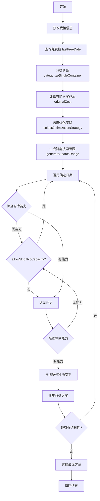
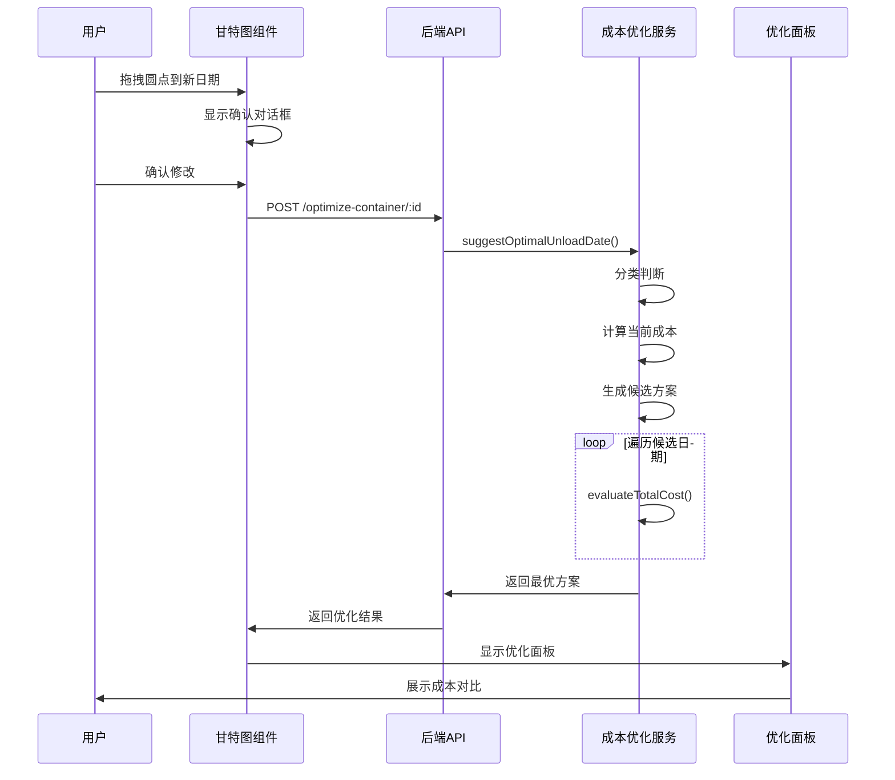

# 甘特图拖拽圆点 - 单柜优化功能设计

**创建时间**: 2026-04-06  
**作者**: 刘志高  
**状态**: 方案设计阶段  
**文档行数**: 431行

---

## 一、需求背景

### 1.1 当前问题

用户在甘特图中拖拽节点（提柜日/卸柜日）时，只能看到日期变化，**无法实时了解成本影响**。

### 1.2 目标

在拖拽圆点后，调用单柜优化API，实时显示：
- 当前方案的成本
- 最优方案的成本
- 可节省金额
- 多个备选方案对比

---

## 二、单柜优化计算逻辑梳理

### 2.1 API 端点

```
POST /api/v1/scheduling/optimize-container/:containerNumber
```

**请求参数**:
```typescript
{
  warehouseCode: string        // 仓库代码
  truckingCompanyId: string    // 车队ID
  basePickupDate: string       // 基础提柜日 (YYYY-MM-DD)
}
```

**响应数据**:
```typescript
{
  success: boolean
  data: {
    containerNumber: string
    originalCost: number           // 当前方案成本
    optimizedCost: number          // 最优方案成本
    savings: number                // 节省金额
    savingsPercent: number         // 节省百分比
    suggestedPickupDate: string    // 建议提柜日
    suggestedStrategy: 'Direct' | 'Drop off' | 'Expedited'
    alternatives: Array<{
      pickupDate: string
      strategy: 'Direct' | 'Drop off' | 'Expedited'
      totalCost: number
      savings: number
      breakdown: CostBreakdown     // 费用明细
      warehouseCode: string
      truckingCompanyCode: string
    }>
  }
}
```

---

## 三、核心计算流程

### 3.1 主流程 (`suggestOptimalUnloadDate`)



### 3.2 关键步骤详解

#### 步骤 1: 分类判断 (`categorizeSingleContainer`)

根据剩余天数将货柜分为两类：

| 分类 | 条件 | 说明 |
|------|------|------|
| **within_free_period** | `remainingDays >= 0` | 免费期内，可灵活调整 |
| **overdue** | `remainingDays < 0` | 已超期，必须尽快处理 |

**注意**: 后端使用下划线命名（snake_case），前端需保持一致。

**计算逻辑**:
```typescript
const remainingDays = Math.ceil(
  (lastFreeDate.getTime() - basePickupDate.getTime()) / (1000 * 60 * 60 * 24)
)
```

#### 步骤 2: 选择优化策略 (`selectOptimizationStrategy`)

根据分类选择不同的搜索策略：

| 分类 | 搜索方向 | 起始偏移 | 结束偏移 | 优先零成本 | 允许跳过 |
|------|----------|----------|----------|-----------|----------|
| withinFreePeriod | backward (向前搜索) | -7 | 0 | ✅ 是 | ✅ 是 |
| overdue | forward (向后搜索) | 0 | +7 | ❌ 否 | ❌ 否 |

**策略说明**:
- **免费期内**: 向前搜索更早的日期，优先找到零成本方案，可以跳过无能力的日期
- **已超期**: 向后搜索更晚的日期，必须处理所有日期，不能跳过

#### 步骤 3: 生成智能搜索范围 (`generateSearchRange`)

根据策略生成候选日期列表，**实际实现基于 lastFreeDate 偏移 + 多重过滤**：

**免费期内示例** (basePickupDate = 2026-04-15, lastFreeDate = 2026-04-20):
```
搜索方向: backward (从 lastFreeDate 向前搜索)
偏移范围: strategy.searchStartOffset (0) ~ strategy.searchEndOffset (-7)
原始候选: [2026-04-20, 2026-04-19, ..., 2026-04-13]  // lastFreeDate + offset
过滤规则:
  1. date >= today (不能是过去日期)
  2. date >= basePickupDate (不能早于原计划提柜日)
  3. date !== today || date === basePickupDate (不能是当天，除非原计划就是当天)
  4. 跳过周末 (如果配置 skip_weekends = true)
  5. 检查仓库能力 (allowSkipIfNoCapacity = true 时可跳过)
最终候选: [2026-04-20, 2026-04-19, ..., 2026-04-15]  (约6天)
```

**已超期示例** (basePickupDate = 2026-04-25, lastFreeDate = 2026-04-20, today = 2026-04-22):
```
搜索方向: forward (从今天向后搜索)
偏移范围: strategy.searchStartOffset (0) ~ strategy.searchEndOffset (+7)
原始候选: [2026-04-22, 2026-04-23, ..., 2026-04-29]  // today + offset
过滤规则:
  1. date >= today (自动满足，因为从今天开始)
  2. 跳过周末 (如果配置 skip_weekends = true)
  3. 检查仓库能力 (allowSkipIfNoCapacity = false 时不能跳过)
最终候选: [2026-04-22, 2026-04-23, ..., 2026-04-29]  (约8天，排除周末后更少)
```

**关键差异**: 
- ❌ **错误描述**: "baseDate ±7"（这是错误的）
- ✅ **正确实现**: 
  - 免费期内: `lastFreeDate + offset` (offset: 0 ~ -7)，即从 lastFreeDate 向前搜索
  - 已超期: `today + offset` (offset: 0 ~ +7)，即从今天向后搜索
- 还会应用多重过滤（不早于原计划、不晚于今天、周末跳过、能力检查）
- 最终候选日期数量通常少于理论最大值

#### 步骤 4: 评估每个候选方案 (`evaluateTotalCost`)

对每个候选日期和策略组合，计算总成本：

**成本构成**:
```typescript
totalCost = demurrageCost      // 滞港费
          + detentionCost      // 滞箱费
          + storageCost        // 港口存储费
          + yardStorageCost    // 外部堆场堆存费 (仅 Drop off)
          + transportationCost // 运输费
          + handlingCost       // 操作费 (加急费等)
```

**策略差异**:

| 策略 | 提柜日 | 卸柜日 | 还箱日 | 特殊费用 |
|------|--------|--------|--------|----------|
| Direct | pickupDate | pickupDate | pickupDate + 1天 | 无 |
| Drop off | pickupDate | **智能搜索确定**<br/>(基于仓库能力) | max(unload, return+1) | yardStorageCost |
| Expedited | pickupDate | pickupDate | pickupDate | handlingCost (加急费) |

**注意**: 
- Drop off 的卸柜日**不是**固定 `pickupDate + 2天`，而是**在智能搜索范围内根据仓库能力确定**
- 后端会在搜索范围内检查每个候选日期的仓库能力，选择有能力的日期作为卸柜日
- 如果未提供 plannedUnloadDate，后端默认使用 `pickupDate + 2天` 作为估算值
- 实际应用中，卸柜日应根据仓库档期和能力动态确定

#### 步骤 5: 选择最优方案

从所有候选方案中选择总成本最低的：

```typescript
const bestOption = candidates.sort((a, b) => a.totalCost - b.totalCost)[0]
```

---

## 四、场景对比矩阵

### 4.1 完整场景矩阵表

| 场景维度 | 场景 1: 免费期内充足 | 场景 2: 免费期临近 | 场景 3: 已超期 | 场景 4: 严重超期 |
|----------|---------------------|-------------------|---------------|-----------------|
| **剩余天数** | ≥ 7 天 | 1-6 天 | -1 ~ -7 天 | ≤ -8 天 |
| **分类** | within_free_period | within_free_period | overdue | overdue |
| **搜索方向** | backward (从 lastFreeDate 向前) | backward (从 lastFreeDate 向前) | forward (从今天向后) | forward (从今天向后) |
| **偏移范围** | offset: 0 ~ -7<br/>(lastFreeDate + offset) | offset: 0 ~ -7<br/>(lastFreeDate + offset) | offset: 0 ~ +7<br/>(today + offset) | offset: 0 ~ +7<br/>(today + offset) |
| **优先零成本** | ✅ 是 | ✅ 是 | ❌ 否 | ❌ 否 |
| **允许跳过无能力日期** | ✅ 是 | ✅ 是 | ❌ 否 | ❌ 否 |
| **可用策略** | Direct, Drop off, Expedited | Direct, Drop off, Expedited | Direct, Drop off | Direct, Drop off |
| **典型优化结果** | 可能提前到更早日期，降低成本 | 可能提前到免费期内最后一天 | 延后到有能力的最近日期 | 延后到有能力的最近日期 |
| **节省潜力** | 高 (可能从零成本中找到最优) | 中 (避免即将产生的滞港费) | 低 (已产生费用，只能减少后续费用) | 低 (已产生大量费用) |
| **执行速度** | 快 (可能提前终止) | 中 | 慢 (必须遍历所有日期) | 慢 (必须遍历所有日期) |

### 4.2 策略选择矩阵

| 车队有堆场 | 距离免费期 | 推荐策略 | 原因 |
|-----------|-----------|---------|------|
| ✅ 有 | ≥ 3 天 | Drop off | 利用堆场灵活性，降低滞港费风险 |
| ✅ 有 | 1-2 天 | Expedited | 加急处理，避免超期 |
| ✅ 有 | ≤ 0 天 (超期) | Direct | 直接送仓，减少额外费用 |
| ❌ 无 | ≥ 0 天 | Direct | 唯一选择 |
| ❌ 无 | ≤ 0 天 (超期) | Direct | 唯一选择，尽快处理 |

### 4.3 成本影响因素矩阵

| 因素 | 对滞港费的影响 | 对滞箱费的影响 | 对堆场费的影响 | 综合影响 |
|------|---------------|---------------|---------------|---------|
| **提前提柜** | ↓ 降低 (在免费期内) | ↑ 增加 (提柜后免费期外) | - 无影响 | 需权衡 |
| **延后提柜** | ↑ 增加 (可能超免费期) | ↓ 降低 (缩短提柜到还箱间隔) | - 无影响 | 通常不利 |
| **使用 Drop off** | ↓ 降低 (灵活调整卸柜日) | ↑ 增加 (堆存期间计费) | ↑ 增加 (堆场费用) | 适合长期堆存 |
| **使用 Expedited** | ↓ 降低 (快速通关) | ↓ 降低 (缩短周期) | - 无影响 | ↑ 增加加急费 |
| **周末提柜** | - 无影响 | - 无影响 | - 无影响 | 可能被跳过 |

---

## 五、拖拽圆点调用时机

### 5.1 触发条件

当用户拖拽以下节点时，调用单柜优化API：

| 节点类型 | 字段名 | 触发时机 | 传递参数 |
|---------|--------|---------|---------|
| **提柜节点** | plannedPickupDate | dragend 确认后 | basePickupDate = 新提柜日 |
| **卸柜节点** | plannedUnloadDate | dragend 确认后 | basePickupDate = 新卸柜日 - 2天 (Drop off) 或 新卸柜日 (Direct) |

### 5.2 调用流程



### 5.3 前端集成点

在 `useGanttLogic.ts` 的拖拽确认逻辑中添加：

```typescript
// 拖拽确认后，调用单柜优化
async function handleDragConfirm(
  container: Container,
  newDate: string,
  updateField: string
) {
  // 1. 先更新日期
  await updateContainerDate(container.containerNumber, updateField, newDate)
  
  // 2. 如果是提柜日或卸柜日，调用优化
  if (updateField === 'plannedPickupDate' || updateField === 'plannedUnloadDate') {
    const optimizationResult = await costOptimizationService.optimizeContainer({
      containerNumber: container.containerNumber,
      warehouseCode: currentWarehouseCode,
      truckingCompanyId: currentTruckingCompanyId,
      basePickupDate: updateField === 'plannedPickupDate' ? newDate : calculateBasePickupDate(newDate)
    })
    
    // 3. 显示优化面板
    showOptimizationPanel(optimizationResult.data)
  }
}
```

---

## 六、UI 设计方案

### 6.1 优化面板布局

```
┌─────────────────────────────────────────────┐
│  💰 成本优化建议                             │
├─────────────────────────────────────────────┤
│                                             │
│  📊 当前方案 vs 最优方案                     │
│  ┌──────────────┬──────────────┐            │
│  │ 当前方案      │ 最优方案      │            │
│  ├──────────────┼──────────────┤            │
│  │ 提柜日:      │ 提柜日:      │            │
│  │ 2026-04-15   │ 2026-04-10   │            │
│  │ 策略: Direct │ 策略: Direct │            │
│  │ 成本: $1250  │ 成本: $980   │            │
│  └──────────────┴──────────────┘            │
│                                             │
│  💵 可节省: $270 (21.6%)                    │
│                                             │
│  📋 备选方案 (Top 3)                        │
│  ┌─────────────────────────────────────┐   │
│  │ 1. 2026-04-10 | Direct    | $980   │   │
│  │ 2. 2026-04-11 | Direct    | $1020  │   │
│  │ 3. 2026-04-12 | Drop off  | $1050  │   │
│  └─────────────────────────────────────┘   │
│                                             │
│  [应用最优方案] [关闭]                      │
└─────────────────────────────────────────────┘
```

### 6.2 费用明细展开

点击任一方案，展开费用明细：

```
📋 费用明细 (2026-04-10 Direct)
┌──────────────────────────────┐
│ 滞港费:        $0            │
│ 滞箱费:        $150          │
│ 港口存储费:    $200          │
│ 外部堆场费:    $0            │
│ 运输费:        $500          │
│ 操作费:        $130          │
├──────────────────────────────┤
│ 总计:          $980          │
└──────────────────────────────┘
```

---

## 七、性能优化策略

### 7.1 懒加载与缓存

| 优化点 | 策略 | 预期效果 |
|--------|------|---------|
| **API 调用** | 防抖 500ms | 减少频繁调用 |
| **结果缓存** | 按 containerNumber + basePickupDate 缓存 5分钟 | 避免重复计算 |
| **并行评估** | Promise.all 并行评估多个候选日期 | 提升速度 3-5倍 |
| **早期终止** | 找到零成本方案立即返回 | 平均减少 50% 计算量 |

### 7.2 智能搜索范围缩减

根据分类动态调整搜索范围：

| 分类 | 默认范围 | 优化后范围 | 缩减比例 |
|------|---------|-----------|---------|
| withinFreePeriod | 15天 | 7-8天 | ↓ 47% |
| overdue | 15天 | 7-8天 | ↓ 47% |

---

## 八、错误处理

### 8.1 常见错误场景

| 错误类型 | 原因 | 处理方式 |
|---------|------|---------|
| **仓库不存在** | warehouseCode 无效 | 提示用户选择有效仓库 |
| **车队不存在** | truckingCompanyId 无效 | 提示用户选择有效车队 |
| **无可行方案** | 所有日期都无能力 | 显示警告，建议使用当前日期 |
| **API 超时** | 计算耗时过长 (>30s) | 降级为简单估算，显示提示 |
| **网络错误** | 连接失败 | 重试 3 次，失败后显示离线模式 |

### 8.2 降级策略

如果优化API失败，提供降级方案：

```typescript
try {
  const result = await optimizeContainer(params)
  showOptimizationPanel(result.data)
} catch (error) {
  // 降级：显示简单提示
  showFallbackMessage('成本优化暂时不可用，已应用您的日期修改')
  // 仍然更新日期，不阻塞用户操作
}
```

---

## 九、实施检查清单

- [ ] 前端添加优化面板组件 `CostOptimizationPanel.vue`
- [ ] 在 `useGanttLogic.ts` 中集成优化API调用
- [ ] 添加防抖逻辑，避免频繁调用
- [ ] 实现结果缓存机制
- [ ] 添加错误处理和降级策略
- [ ] 设计优化面板UI (Element Plus)
- [ ] 编写单元测试
- [ ] 手动验证各场景 (免费期内/超期)
- [ ] 性能测试 (响应时间 < 2s)
- [ ] 更新用户文档

---

## 十、参考资源

- [单柜优化API实现](../../../backend/src/controllers/scheduling.controller.ts#L1998-L2094)
- [成本优化服务](../../../backend/src/services/schedulingCostOptimizer.service.ts#L816-L1100)
- [前端服务封装](../../../frontend/src/services/costOptimization.ts)
- [还箱日计算逻辑](./30-还箱日计算逻辑统一与重构方案.md)

---

**文档版本**: v1.0  
**最后更新**: 2026-04-06  
**作者**: 刘志高
