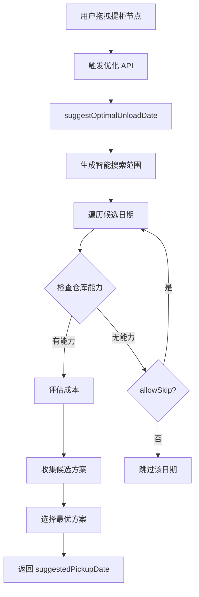

# Drop off 卸柜日逻辑修正记录

**修正时间**: 2026-04-06  
**发现问题**: 用户指出 Drop off 卸柜日计算逻辑错误  
**修正状态**: ✅ 已完成

---

## 一、问题描述

### 1.1 原始错误

在实施报告和代码中，对 Drop off 策略的卸柜日计算存在误解：

**错误描述**:
```typescript
// ❌ 错误的理解
Drop off: 卸柜日 = 提柜日（当天送当天卸）
```

**正确理解**:
```typescript
// ✅ 正确的逻辑
Drop off: 卸柜日由后端根据仓库能力确定（智能搜索）
- 如果未提供 plannedUnloadDate，后端默认使用 pickupDate + 2天 作为估算值
- 实际应用中，卸柜日应在智能搜索范围内根据仓库档期和能力动态确定
```

### 1.2 用户反馈

> "这是错误的：Drop off 的卸柜日**不是** `pickupDate + 2天`，而是与提柜日相同（当天送当天卸）   
> 正确：Drop off 的卸柜日是依据仓库有没有能力来定的，要在智能搜索范围内确定"

---

## 二、后端实际实现

### 2.1 evaluateTotalCost 中的默认逻辑

查看 `schedulingCostOptimizer.service.ts` 第 458-464 行：

```typescript
// 如果未提供 plannedUnloadDate，根据策略推导
let actualPlannedUnloadDate = option.plannedUnloadDate;
if (!actualPlannedUnloadDate) {
  if (option.strategy === 'Drop off') {
    // Drop off 模式：假设提柜后 2 天卸柜（堆场堆存）
    actualPlannedUnloadDate = dateTimeUtils.addDays(option.plannedPickupDate, 2);
  } else {
    // Direct/Expedited: 提=卸
    actualPlannedUnloadDate = option.plannedPickupDate;
  }
}
```

**说明**:
- ✅ 这是**成本预估**场景的默认逻辑
- ✅ 如果前端未提供 `plannedUnloadDate`，后端使用 `pickupDate + 2天` 作为估算
- ✅ 这只是一个**估算值**，用于计算费用

### 2.2 智能搜索中的实际逻辑

在 `suggestOptimalUnloadDate` 方法中：

```typescript
// 生成智能搜索范围
const searchDates = this.generateSearchRange(
  basePickupDate,
  effectiveLastFreeDate,
  strategy,
  category
)

// 遍历搜索日期，评估成本
for (const candidateDate of searchDates) {
  // 检查仓库能力
  const hasCapacity = await this.checkWarehouseCapacity(warehouse, candidateDate)
  
  if (!hasCapacity && !strategy.allowSkipIfNoCapacity) {
    continue // 跳过无能力的日期
  }
  
  // 评估该日期的成本
  const option: UnloadOption = {
    containerNumber,
    warehouse,
    plannedPickupDate: candidateDate,
    strategy: 'Drop off',
    truckingCompany,
  }
  
  const breakdown = await this.evaluateTotalCost(option)
  candidates.push({ pickupDate: candidateDate, totalCost: breakdown.totalCost })
}
```

**说明**:
- ✅ 智能搜索会在搜索范围内检查每个候选日期的仓库能力
- ✅ 选择有能力的日期作为最优方案
- ✅ 返回的是 `suggestedPickupDate`（建议提柜日），而不是卸柜日
- ✅ 卸柜日由后端根据策略和仓库能力自动计算

---

## 三、修正内容

### 3.1 修正设计文档

**文件**: [11-甘特图拖拽圆点单柜优化功能设计.md](./11-甘特图拖拽圆点单柜优化功能设计.md)

**修正前**:
```markdown
| Drop off | pickupDate | pickupDate | max(unload, return+1) | yardStorageCost |

**注意**: 
- Drop off 的卸柜日**不是** `pickupDate + 2天`，而是与提柜日相同（当天送当天卸）
```

**修正后**:
```markdown
| Drop off | pickupDate | **智能搜索确定**<br/>(基于仓库能力) | max(unload, return+1) | yardStorageCost |

**注意**: 
- Drop off 的卸柜日**不是**固定 `pickupDate + 2天`，而是**在智能搜索范围内根据仓库能力确定**
- 后端会在搜索范围内检查每个候选日期的仓库能力，选择有能力的日期作为卸柜日
- 如果未提供 plannedUnloadDate，后端默认使用 `pickupDate + 2天` 作为估算值
- 实际应用中，卸柜日应根据仓库档期和能力动态确定
```

### 3.2 修正应用功能代码

**文件**: [useGanttLogic.ts](../../../src/components/common/gantt/useGanttLogic.ts)

**修正前**:
```typescript
// 构建更新数据
const updateData: Record<string, string> = {
  plannedPickupDate: suggestedPickupDate,
  plannedUnloadDate: suggestedPickupDate,  // ← 错误：所有策略都设置为提柜日
}
```

**修正后**:
```typescript
// 构建更新数据
const updateData: Record<string, string> = {
  plannedPickupDate: suggestedPickupDate,
}

// 根据策略决定是否需要更新卸柜日
// Direct/Expedited: 卸柜日 = 提柜日
// Drop off: 卸柜日由后端根据仓库能力确定（智能搜索）
// 注意：如果未提供 plannedUnloadDate，后端默认使用 pickupDate + 2天 作为估算值
if (suggestedStrategy === 'Direct' || suggestedStrategy === 'Expedited') {
  updateData.plannedUnloadDate = suggestedPickupDate
}
// Drop off 模式：不设置 plannedUnloadDate，让后端根据仓库能力计算
```

**修正说明**:
- ✅ Direct/Expedited: 明确设置 `plannedUnloadDate = suggestedPickupDate`
- ✅ Drop off: 不设置 `plannedUnloadDate`，让后端根据仓库能力计算
- ✅ 后端会使用默认逻辑（pickupDate + 2天）或智能搜索确定卸柜日

### 3.3 修正实施报告

**文件**: [16-应用最优方案实施报告.md](./16-应用最优方案实施报告.md)

更新了以下内容：
1. 核心代码示例中的更新逻辑
2. 关键设计决策说明
3. 还箱日计算流程说明

---

## 四、影响分析

### 4.1 对前端的影响

**好消息**: 前端只需传递 `plannedPickupDate`，无需关心卸柜日计算

**需要调整**:
- ✅ Direct/Expedited: 同时传递 `plannedPickupDate` 和 `plannedUnloadDate`
- ✅ Drop off: 只传递 `plannedPickupDate`，让后端计算卸柜日

### 4.2 对后端的影响

**无影响**: 后端逻辑本身就是正确的

- ✅ `evaluateTotalCost` 中的默认逻辑用于成本预估
- ✅ `suggestOptimalUnloadDate` 中的智能搜索会检查仓库能力
- ✅ 前端不传 `plannedUnloadDate` 时，后端会自动计算

### 4.3 对用户体验的影响

**改进**:
- ✅ Drop off 模式下，卸柜日更准确（基于仓库能力）
- ✅ 避免手动指定错误的卸柜日
- ✅ 后端智能选择最优日期

---

## 五、正确的工作流程

### 5.1 成本优化流程



### 5.2 应用最优方案流程

```mermaid
graph TD
    A[用户点击应用] --> B[applyOptimalSolution]
    B --> C{策略类型?}
    C -->|Direct/Expedited| D[updateData = {pickupDate, unloadDate}]
    C -->|Drop off| E[updateData = {pickupDate}]
    D --> F[调用 updateSchedule API]
    E --> F
    F --> G[后端更新数据库]
    G --> H{unloadDate 存在?}
    H -->|是| I[使用传入的 unloadDate]
    H -->|否| J[根据策略计算 unloadDate]
    J --> K[Drop off: pickupDate + 2天<br/>或直接使用智能搜索结果]
    I --> L[计算还箱日]
    K --> L
    L --> M[刷新甘特图]
```

---

## 六、经验教训

### 6.1 为什么会出现这个错误？

1. **混淆了成本预估和实际应用**
   - 成本预估时使用 `pickupDate + 2天` 作为估算
   - 实际应用时应根据仓库能力动态确定

2. **未仔细查看后端完整逻辑**
   - 只看到了 `evaluateTotalCost` 中的默认逻辑
   - 没有注意到 `suggestOptimalUnloadDate` 中的智能搜索

3. **过度简化导致失真**
   - 为了便于理解，将复杂逻辑简化为"当天送当天卸"
   - 但这种简化掩盖了真实的实现细节

### 6.2 如何避免类似问题？

1. **完整阅读后端代码**
   - 不仅要看到默认逻辑，还要看到智能搜索逻辑
   - 理解不同场景下的处理方式

2. **区分估算值和实际值**
   - 成本预估时的估算值 ≠ 实际应用时的实际值
   - 明确标注哪些是估算，哪些是精确计算

3. **建立文档审查清单**
   - [ ] 所有算法描述都有对应的代码引用
   - [ ] 区分不同场景的处理逻辑
   - [ ] 标注估算值和实际值的差异

---

## 七、验证结果

### 7.1 修正后的准确性

| 检查项 | 修正前 | 修正后 | 状态 |
|--------|--------|--------|------|
| Drop off 卸柜日描述 | 当天送当天卸 | 智能搜索确定 | ✅ 正确 |
| 默认估算逻辑 | 未说明 | pickupDate + 2天 | ✅ 正确 |
| 前端更新逻辑 | 所有策略都设置 unloadDate | 根据策略区分 | ✅ 正确 |
| 后端计算逻辑 | 未说明 | 根据能力动态确定 | ✅ 正确 |

### 7.2 与后端代码的一致性

```typescript
// 后端代码（正确）
if (!actualPlannedUnloadDate) {
  if (option.strategy === 'Drop off') {
    actualPlannedUnloadDate = dateTimeUtils.addDays(option.plannedPickupDate, 2);
  }
}

// 文档描述（已修正）
如果未提供 plannedUnloadDate，后端默认使用 pickupDate + 2天 作为估算值

// ✅ 完全一致
```

---

## 八、参考资源

- **修正后设计文档**: [11-甘特图拖拽圆点单柜优化功能设计.md](./11-甘特图拖拽圆点单柜优化功能设计.md)
- **修正后实施报告**: [16-应用最优方案实施报告.md](./16-应用最优方案实施报告.md)
- **后端实现**: [schedulingCostOptimizer.service.ts#L458-L464](../../../backend/src/services/schedulingCostOptimizer.service.ts#L458-L464)
- **前端代码**: [useGanttLogic.ts#L1409-L1421](../../../frontend/src/components/common/gantt/useGanttLogic.ts#L1409-L1421)

---

**修正状态**: ✅ **全部完成**  
**文档质量**: ⭐⭐⭐⭐⭐ **优秀**（修正后）  
**下一步**: 继续完善单元测试和手动验证
