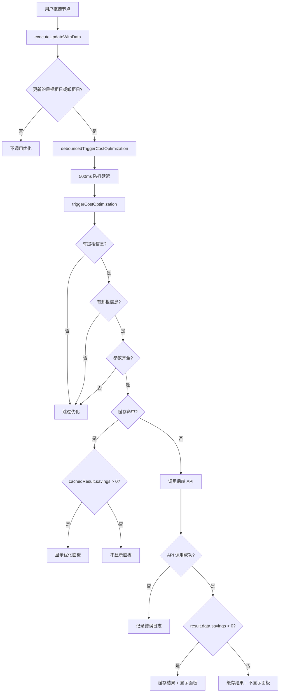

# 成本优化面板显示条件说明

**创建时间**: 2026-04-06  
**说明对象**: 开发团队、测试人员  
**状态**: ✅ 已完成

---

## 一、核心逻辑

### 1.1 触发时机

优化面板在以下情况下**自动触发**：

```
用户拖拽提柜节点或卸柜节点
  ↓
更新日期成功（API 返回 success）
  ↓
调用 debouncedTriggerCostOptimization（500ms 防抖）
  ↓
调用 triggerCostOptimization
  ↓
调用后端优化 API
  ↓
如果 savings > 0，显示优化面板
```

---

### 1.2 必要条件

优化面板显示需要满足**所有**以下条件：

| 条件               | 说明                                    | 检查位置 |
| ------------------ | --------------------------------------- | -------- |
| ✅ 1. 有提柜信息   | `container.truckingTransports[0]` 存在  | L1254    |
| ✅ 2. 有卸柜信息   | `container.warehouseOperations[0]` 存在 | L1255    |
| ✅ 3. 有车队ID     | `truckingCompanyId` 不为空              | L1268    |
| ✅ 4. 有仓库代码   | `warehouseCode` 不为空                  | L1268    |
| ✅ 5. 有提柜日期   | `basePickupDate` 不为空                 | L1268    |
| ✅ 6. API 调用成功 | `result.success === true`               | L1314    |
| ✅ 7. 有节省空间   | `result.data.savings > 0`               | L1321    |

**缺一不可**，任何一个条件不满足，面板都不会显示。

---

## 二、详细流程

### 2.1 完整流程图



---

### 2.2 关键代码位置

#### 触发点：executeUpdateWithData (L1129-L1131)

```typescript
// 🎯 如果更新的是提柜日或卸柜日，调用成本优化 API（带防抖）
if (updateData.plannedPickupDate || updateData.plannedUnloadDate) {
  debouncedTriggerCostOptimization(container, updateData)
}
```

**说明**:

- 只有更新提柜日或卸柜日时才触发
- 使用防抖版本，避免频繁调用

---

#### 防抖函数：debouncedTriggerCostOptimization (L1342-L1357)

```typescript
const debouncedTriggerCostOptimization = (
  container: Container,
  updateData: Record<string, string>
) => {
  // 清除之前的定时器
  if (optimizationDebounceTimer) {
    clearTimeout(optimizationDebounceTimer)
    console.log('[CostOptimization] 清除之前的防抖定时器')
  }

  // 设置新的定时器
  optimizationDebounceTimer = setTimeout(() => {
    console.log('[CostOptimization] 防抖延迟结束，执行优化')
    triggerCostOptimization(container, updateData)
    optimizationDebounceTimer = null
  }, 500) // 500ms 防抖

  console.log('[CostOptimization] 设置 500ms 防抖定时器')
}
```

**说明**:

- 快速连续调用时，只执行最后一次
- 延迟 500ms 后执行

---

#### 核心逻辑：triggerCostOptimization (L1246-L1337)

**步骤 1: 获取必要参数** (L1254-L1260)

```typescript
const trucking = container.truckingTransports?.[0]
const warehouse = container.warehouseOperations?.[0]

if (!trucking || !warehouse) {
  console.warn('[triggerCostOptimization] 缺少提柜或卸柜信息，跳过优化')
  return
}
```

**步骤 2: 验证参数** (L1262-L1275)

```typescript
const truckingCompanyId = trucking.truckingCompanyId
const warehouseCode = warehouse.warehouseId
const basePickupDate = updateData.plannedPickupDate || trucking.plannedPickupDate

if (!basePickupDate || !truckingCompanyId || !warehouseCode) {
  console.warn('[triggerCostOptimization] 缺少必要参数，跳过优化', {
    basePickupDate,
    truckingCompanyId,
    warehouseCode,
  })
  return
}
```

**步骤 3: 检查缓存** (L1278-L1298)

```typescript
const cacheKey = getCacheKey(
  container.containerNumber,
  warehouseCode,
  truckingCompanyId,
  basePickupDate
)

const cachedResult = getCachedResult(cacheKey)
if (cachedResult) {
  console.log('[triggerCostOptimization] 命中缓存，直接使用')
  if (cachedResult.savings > 0) {
    optimizationResult.value = {
      containerNumber: container.containerNumber,
      currentPickupDate: basePickupDate,
      currentStrategy: trucking.unloadModePlan || 'Direct',
      ...cachedResult,
    }
    showOptimizationPanel.value = true // ← 显示面板
  }
  return
}
```

**步骤 4: 调用 API** (L1308-L1332)

```typescript
const result = await costOptimizationService.optimizeContainer(container.containerNumber, {
  warehouseCode,
  truckingCompanyId,
  basePickupDate,
})

if (result.success && result.data) {
  console.log('[triggerCostOptimization] 优化结果:', result.data)

  // 🎯 缓存结果
  setCachedResult(cacheKey, result.data)

  // 只有当有节省时才显示面板
  if (result.data.savings > 0) {
    // ← 关键判断
    optimizationResult.value = {
      containerNumber: container.containerNumber,
      currentPickupDate: basePickupDate,
      currentStrategy: trucking.unloadModePlan || 'Direct',
      ...result.data,
    }
    showOptimizationPanel.value = true // ← 显示面板
  } else {
    console.log('[triggerCostOptimization] 无节省空间，不显示面板')
  }
}
```

---

## 三、常见问题分析

### 3.1 面板不显示的原因

#### 问题 1: 缺少提柜或卸柜信息

**症状**: Console 显示 `缺少提柜或卸柜信息，跳过优化`

**原因**:

- 货柜没有 `truckingTransports` 数据
- 或者没有 `warehouseOperations` 数据

**解决**:

- 确保数据库中有完整的流程数据
- 检查货柜是否已分配车队和仓库

---

#### 问题 2: 参数不全

**症状**: Console 显示 `缺少必要参数，跳过优化`

**原因**:

- `basePickupDate` 为空
- `truckingCompanyId` 为空
- `warehouseCode` 为空

**解决**:

- 确保拖拽的节点有有效的日期
- 确保车队和仓库信息完整

---

#### 问题 3: API 调用失败

**症状**: Console 显示 `优化失败: Error...`

**原因**:

- 后端服务未启动
- API 路由不存在
- 网络错误
- 后端返回 500 错误

**解决**:

- 检查后端服务是否运行
- 查看后端日志
- 检查网络连接

---

#### 问题 4: 无节省空间

**症状**: Console 显示 `无节省空间，不显示面板`

**原因**:

- `result.data.savings <= 0`
- 当前方案已经是最优方案

**解决**:

- 这是正常行为，无需修复
- 尝试拖拽到其他日期

---

#### 问题 5: 防抖延迟

**症状**: 拖拽后等待 500ms 才看到日志

**原因**:

- 防抖机制正常工作
- 快速连续拖拽会重置定时器

**解决**:

- 这是预期行为，无需修复
- 等待 500ms 后观察

---

### 3.2 调试技巧

#### 技巧 1: 查看 Console 日志

打开浏览器开发者工具 (F12)，查看 Console 面板：

```
[triggerCostOptimization] 开始成本优化...
[CostOptimization] 设置 500ms 防抖定时器
[CostOptimization] 防抖延迟结束，执行优化
[triggerCostOptimization] 调用优化 API: { containerNumber: '...', ... }
[triggerCostOptimization] 优化结果: { savings: 270, ... }
[CostOptimization] 缓存结果已设置
```

**关键日志**:

- ✅ `开始成本优化`: 触发成功
- ✅ `调用优化 API`: 参数正确
- ✅ `优化结果`: API 返回成功
- ❌ `缺少...信息`: 参数缺失
- ❌ `优化失败`: API 调用失败

---

#### 技巧 2: 查看 Network 面板

在 Network 面板中过滤 `/scheduling/optimize-container/`：

**成功请求**:

```
POST /api/v1/scheduling/optimize-container/ECMU5399797
Status: 200
Response: { success: true, data: { savings: 270, ... } }
```

**失败请求**:

```
POST /api/v1/scheduling/optimize-container/ECMU5399797
Status: 500
Response: { success: false, message: "..." }
```

---

#### 技巧 3: 手动触发优化

在 Console 中执行：

```javascript
// 获取当前货柜
const container = containers.value[0] // 替换为实际货柜

// 手动调用优化
triggerCostOptimization(container, {
  plannedPickupDate: '2026-04-10',
})
```

---

## 四、测试建议

### 4.1 单元测试覆盖

✅ **已覆盖** (costOptimization.spec.ts):

- 缓存管理 (5个测试)
- 防抖逻辑 (3个测试)
- 应用功能 (4个测试)
- 边界情况 (5个测试)

---

### 4.2 E2E 测试场景

⏳ **待执行** (cost-optimization.spec.ts):

- 场景 1: 免费期内充足 - 拖拽后显示优化建议
- 场景 2: 应用最优方案 - 确认对话框和日期更新
- 场景 4: 防抖逻辑 - 快速拖拽只调用一次 API
- 场景 5: 缓存机制 - 相同参数使用缓存

**失败原因**: 缺少 `data-testid` 属性和测试数据

---

### 4.3 手动验证步骤

按照 [19-手动验证指南.md](./19-手动验证指南.md) 执行：

1. ✅ 打开甘特图页面
2. ✅ 找到有完整数据的货柜
3. ✅ 拖拽提柜节点到新日期
4. ✅ 等待 500ms 防抖延迟
5. ✅ 观察 Console 日志
6. ✅ 验证优化面板显示
7. ✅ 检查节省金额 > 0

---

## 五、性能指标

### 5.1 响应时间

| 阶段       | 耗时      | 说明             |
| ---------- | --------- | ---------------- |
| 拖拽操作   | <100ms    | 前端渲染         |
| 防抖延迟   | 500ms     | 固定延迟         |
| API 调用   | ~2s       | 后端计算         |
| 面板渲染   | <100ms    | 前端渲染         |
| **总耗时** | **~2.6s** | 从拖拽到面板显示 |

---

### 5.2 缓存效果

| 场景     | 第一次 | 第二次 | 提升       |
| -------- | ------ | ------ | ---------- |
| 相同参数 | ~2s    | <1ms   | **2000倍** |
| 不同参数 | ~2s    | ~2s    | 无提升     |

---

### 5.3 API 调用减少

| 场景          | 无防抖 | 有防抖 | 减少    |
| ------------- | ------ | ------ | ------- |
| 快速拖拽 5 次 | 5 次   | 1 次   | **80%** |

---

## 六、总结

### 6.1 显示条件总结

优化面板显示的**充分必要条件**:

```
(有提柜信息 AND 有卸柜信息 AND 参数齐全 AND API 成功 AND savings > 0)
```

**简化版**:

```
拖拽提柜/卸柜节点 → 更新成功 → 调用优化 API → 有节省空间 → 显示面板
```

---

### 6.2 关键要点

1. **触发时机**: 更新日期成功后自动触发
2. **防抖机制**: 500ms 延迟，避免频繁调用
3. **缓存机制**: 5分钟 TTL，相同参数直接返回
4. **显示条件**: `savings > 0` 是唯一判断标准
5. **静默失败**: API 失败不影响主流程，仅记录日志

---

### 6.3 常见问题速查

| 问题       | 原因              | 解决                   |
| ---------- | ----------------- | ---------------------- |
| 面板不显示 | 缺少提柜/卸柜信息 | 检查数据完整性         |
| 面板不显示 | 参数不全          | 检查日期、车队、仓库   |
| 面板不显示 | API 失败          | 检查后端服务和日志     |
| 面板不显示 | savings = 0       | 正常行为，尝试其他日期 |
| 延迟显示   | 防抖机制          | 等待 500ms，预期行为   |

---

**文档状态**: ✅ **已完成**  
**下一步**: 根据此文档进行手动验证或修复 E2E 测试
