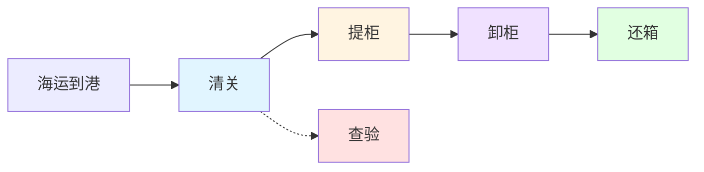

# 五节点状态系统完整指南

## 文档信息

- **版本**: v1.0
- **创建时间**: 2026-04-09
- **最后更新**: 2026-04-09
- **作者**: 刘志高
- **状态**: 正式文档
- **适用读者**: 前端开发、后端开发、产品经理、测试工程师

---

## 快速导航

### 核心文档(必读)

- [01-五节点状态计算逻辑详解](./01-五节点状态计算逻辑详解.md) - 前端状态判断算法与场景模拟
- [02-五节点数据源与后端实现](./02-五节点数据源与后端实现.md) - 数据库表结构与 API 设计

### 业务背景

- [为什么需要五节点状态](#业务背景) - 五节点的设计初衷
- [五节点定义](#五节点定义) - 五个关键业务节点详解
- [业务流程关系](#业务流程关系) - 节点间的依赖关系

### 技术实现

- [前端实现](#前端实现) - 状态判断与展示逻辑
- [后端数据源](#后端数据源) - 数据来源与查询逻辑

### 使用与维护

- [使用场景](#使用场景) - 在哪些地方使用五节点
- [常见问题](#常见问题) - FAQ 与注意事项
- [测试覆盖](#测试覆盖) - 单元测试要点
- [相关文档](#相关文档) - 延伸阅读

---

## 业务背景

### 为什么需要五节点状态

在国际物流管理中,货柜从出运到还箱经历多个关键环节。为了在列表中快速掌握货柜的核心进度,我们设计了**五节点状态**机制,将复杂的物流流程简化为五个关键业务节点:

1. **清关** - 目的港清关是否完成
2. **提柜** - 是否已从港口提取货柜
3. **卸柜** - 是否在仓库完成卸货
4. **还箱** - 是否已将空柜归还
5. **查验** - 是否需要海关查验

通过这五个节点的状态标识(已完成/进行中/未完成),用户可以一目了然地看到每个货柜的当前进度和潜在风险。

### 与七层状态机的区别

| 对比项       | 五节点状态       | 七层状态机             |
| ------------ | ---------------- | ---------------------- |
| **用途**     | 列表快速概览     | 详细物流路径追踪       |
| **粒度**     | 粗粒度(5个节点)  | 细粒度(7层+多个子节点) |
| **展示位置** | Shipments 表格列 | 货柜详情页物流路径 Tab |
| **数据来源** | 多表聚合         | 飞驼事件 + 流程表      |
| **交互方式** | 静态展示         | 可点击展开详情         |

**核心差异**: 五节点是简化的业务状态快照,七层状态机是完整的物流时间线。

---

## 五节点定义

### 节点总览

```
海运到港 → 清关 → 提柜 → 卸柜 → 还箱
              ↓
           查验(可能发生在任何阶段)
```

### 1. 清关节点 (Customs)

**业务含义**: 目的港海关清关是否完成

**数据来源**: `process_port_operations.customs_status` (port_type = 'destination')

**状态枚举**:

- `COMPLETED` - 已完成
- `IN_PROGRESS` - 清关中
- `FAILED` - 清关失败
- `PENDING` - 待清关
- `null` - 无数据

**前端判断逻辑**:

```typescript
if (!customsStatus) → 'bad'        // 未清关
else if (customsStatus === 'COMPLETED') → 'ok'  // 已完成
else if (customsStatus === 'FAILED') → 'bad'    // 失败
else → 'warn'                       // 进行中/待清关
```

**显示文本映射**:
| 状态码 | 显示文本 | 图标 | Tag颜色 |
|--------|---------|------|---------|
| COMPLETED | 已完成 | ✓ | info (灰色) |
| IN_PROGRESS | 清关中 | ⚠ | info (灰色) |
| FAILED | 失败 | ✗ | info (灰色) |
| PENDING | 待清关 | ⚠ | info (灰色) |
| null/其他 | 未清关 | ✗ | info (灰色) |

**业务规则**:

- 清关必须在提柜前完成
- 清关失败会触发预警
- 清关日期记录在 `actual_customs_date`

---

### 2. 提柜节点 (Pickup)

**业务含义**: 是否已从目的港提取货柜

**数据来源**:

- `process_trucking_transport.planned_pickup_date` - 计划提柜日
- `process_trucking_transport.pickup_date` - 实际提柜日

**状态判断逻辑**:

```typescript
if (pickupDate) → 'ok'                    // 已提柜(有实际提柜日)
else if (plannedPickupDate) → 'warn'      // 已计划但未提
else → 'bad'                              // 未计划提柜
```

**显示文本映射**:
| 条件 | 显示文本 | 图标 | Tag颜色 |
|------|---------|------|---------|
| 有 pickupDate | 已提柜 | ✓ | warning (黄色) |
| 只有 plannedPickupDate | 已计划提柜 | ⚠ | warning (黄色) |
| 两者都无 | 未计划提柜 | ✗ | warning (黄色) |

**业务规则**:

- **只有实际提柜才算完成**,有计划但未提应显示为"进行中"
- 提柜后才会产生卸柜和还箱环节
- 最晚提柜日(LFD)用于计算滞港费

**常见误区**:

- ❌ 错误: 有计划提柜日就显示"已完成"
- ✅ 正确: 必须有实际提柜日才算完成

---

### 3. 卸柜节点 (Unload)

**业务含义**: 是否在仓库完成卸货操作

**数据来源**: `biz_containers.logistics_status` (七层状态机计算结果)

**状态判断逻辑**:

```typescript
const s = logisticsStatus.toLowerCase()
if (['unloaded', 'returned_empty'].includes(s)) → 'ok'   // 已卸柜或已还箱
else if (['at_port', 'picked_up'].includes(s)) → 'warn'  // 已到港或已提柜
else → 'bad'                                              // 其他状态
```

**显示文本映射**:
| 物流状态 | 显示文本 | 图标 | Tag颜色 |
|---------|---------|------|---------|
| unloaded | 已卸柜 | ✓ | primary (蓝色) |
| returned_empty | 已卸柜 | ✓ | primary (蓝色) |
| at_port | 未卸柜 | ⚠ | primary (蓝色) |
| picked_up | 未卸柜 | ⚠ | primary (蓝色) |
| 其他状态 | 未卸柜 | ✗ | primary (蓝色) |

**业务规则**:

- 卸柜状态基于物流状态机推断,不直接查询流程表
- 已还箱(returned_empty)必然已卸柜
- 卸柜完成后才能进行还箱

---

### 4. 还箱节点 (Empty Return)

**业务含义**: 是否已将空柜归还至指定堆场

**数据来源**: `process_empty_return.return_time` - 实际还箱时间

**状态判断逻辑**:

```typescript
if (returnTime) → 'ok'                                  // 已还箱
else if (['unloaded', 'picked_up'].includes(logisticsStatus)) → 'warn'  // 进行中
else → 'bad'                                            // 未还箱
```

**显示文本映射**:
| 条件 | 显示文本 | 图标 | Tag颜色 |
|------|---------|------|---------|
| 有 returnTime | 已还箱 | ✓ | success (绿色) |
| 无 returnTime 但已卸柜/已提柜 | 未还箱 | ⚠ | success (绿色) |
| 其他情况 | 未还箱 | ✗ | success (绿色) |

**业务规则**:

- 还箱是最后一个节点,完成后整个流程结束
- 最晚还箱日(LRD)用于计算滞箱费
- 还箱时间记录在 `return_time` 字段

---

### 5. 查验节点 (Inspection)

**业务含义**: 货柜是否需要海关查验

**数据来源**: `biz_containers.inspection_required` (布尔值)

**状态判断逻辑**:

```typescript
if (inspectionRequired) → 'warn'   // 需查验
else → 'ok'                        // 免查验
```

**显示文本映射**:
| inspection_required | 显示文本 | 图标 | Tag颜色 |
|---------------------|---------|------|---------|
| true | 需查验 | ⚠ | warning (黄色) |
| false | 免查验 | ✓ | info (灰色) |

**业务规则**:

- 查验可能在清关后或卸柜前发生
- 查验不是必经环节,大部分货柜免查验
- 需要查验时会触发额外费用和时间延误

---

## 前端实现

### 核心工具函数

文件位置: `frontend/src/utils/containerDisplay.ts`

#### getFiveNodeKinds() - 状态类型判断

```typescript
export const getFiveNodeKinds = (
  row: any
): {
  customs: FiveNodeKind
  pickup: FiveNodeKind
  unload: FiveNodeKind
  emptyReturn: FiveNodeKind
  inspection: FiveNodeKind
} => {
  // 1. 清关状态
  const customsStatus = row.customsStatus as string | undefined
  let customs: FiveNodeKind = 'bad'
  if (!customsStatus) customs = 'bad'
  else if (customsStatus === 'COMPLETED') customs = 'ok'
  else if (customsStatus === 'FAILED') customs = 'bad'
  else customs = 'warn'

  // 2. 提柜状态
  const pickup: FiveNodeKind = row.pickupDate ? 'ok' : row.plannedPickupDate ? 'warn' : 'bad'

  // 3. 卸柜状态
  const s = String(row.logisticsStatus || '').toLowerCase()
  let unload: FiveNodeKind = 'bad'
  if (['unloaded', 'returned_empty'].includes(s)) unload = 'ok'
  else if (['at_port', 'picked_up'].includes(s)) unload = 'warn'
  else unload = 'bad'

  // 4. 还箱状态
  let emptyReturn: FiveNodeKind = 'bad'
  if (row.returnTime) emptyReturn = 'ok'
  else if (['unloaded', 'picked_up'].includes(s)) emptyReturn = 'warn'
  else emptyReturn = 'bad'

  // 5. 查验状态
  const inspection: FiveNodeKind = row.inspectionRequired ? 'warn' : 'ok'

  return { customs, pickup, unload, emptyReturn, inspection }
}
```

#### getFiveNodeRows() - 生成展示数据

```typescript
export const getFiveNodeRows = (row: any) => {
  const k = getFiveNodeKinds(row)
  const unloaded = ['unloaded', 'returned_empty'].includes(
    String(row.logisticsStatus || '').toLowerCase()
  )

  return [
    {
      kind: k.customs,
      type: 'info' as const,
      text: getCustomsStatusText(row.customsStatus),
    },
    {
      kind: k.pickup,
      type: 'warning' as const,
      text: row.pickupDate ? '已提柜' : row.plannedPickupDate ? '已计划提柜' : '未计划提柜',
    },
    {
      kind: k.unload,
      type: 'primary' as const,
      text: unloaded ? '已卸柜' : '未卸柜',
    },
    {
      kind: k.emptyReturn,
      type: 'success' as const,
      text: row.returnTime ? '已还箱' : '未还箱',
    },
    {
      kind: k.inspection,
      type: (row.inspectionRequired ? 'warning' : 'info') as 'warning' | 'info',
      text: row.inspectionRequired ? '需查验' : '免查验',
    },
  ]
}
```

### 组件展示逻辑

文件位置: `frontend/src/views/shipments/components/ContainerTable.vue`

```vue
<el-table-column label="五节点状态" width="200" align="left">
  <template #default="{ row }">
    <div class="five-node-status">
      <el-tag
        v-for="(node, idx) in getFiveNodeRows(row)"
        :key="idx"
        size="small"
        :type="node.type"
        class="status-tag five-node-tag"
      >
        <span class="five-node-icon-wrap" :class="`kind-${node.kind}`">
          <el-icon class="five-node-icon" :size="13">
            <CircleCheck v-if="node.kind === 'ok'" />
            <CircleClose v-else-if="node.kind === 'bad'" />
            <Warning v-else />
          </el-icon>
        </span>
        <span class="five-node-status-text">{{ node.text }}</span>
      </el-tag>
    </div>
  </template>
</el-table-column>
```

### 样式规范

```scss
.five-node-status {
  display: flex;
  gap: 4px;
  flex-wrap: wrap;
}

.five-node-tag {
  padding: 2px 6px;
}

.five-node-icon-wrap {
  margin-right: 4px;

  &.kind-ok {
    color: var(--el-color-success);
  }

  &.kind-bad {
    color: var(--el-color-danger);
  }

  &.kind-warn {
    color: var(--el-color-warning);
  }
}

.five-node-icon {
  vertical-align: middle;
}

.five-node-status-text {
  font-size: 12px;
}
```

---

## 后端数据源

### 数据查询逻辑

文件位置: `backend/src/services/container.service.ts`

后端在查询集装箱列表时,通过 LEFT JOIN 关联以下表获取五节点数据:

```sql
SELECT
  c.container_number,
  c.logistics_status,
  c.inspection_required,

  -- 清关状态(目的港)
  po_dest.customs_status,

  -- 提柜日期
  tt.planned_pickup_date,
  tt.pickup_date,

  -- 还箱时间
  er.return_time

FROM biz_containers c

-- 目的港港口操作(清关状态)
LEFT JOIN process_port_operations po_dest
  ON c.container_number = po_dest.container_number
  AND po_dest.port_type = 'destination'

-- 拖卡运输(提柜日期)
LEFT JOIN process_trucking_transport tt
  ON c.container_number = tt.container_number

-- 还箱记录
LEFT JOIN process_empty_return er
  ON c.container_number = er.container_number
```

### 返回字段映射

```typescript
{
  // 清关状态
  customsStatus: destPortOp?.customsStatus,

  // 提柜日期
  plannedPickupDate: truckingTransport?.plannedPickupDate,
  pickupDate: truckingTransport?.pickupDate,

  // 物流状态(用于推断卸柜/还箱)
  logisticsStatus: container.logisticsStatus,

  // 还箱时间
  returnTime: emptyReturn?.returnTime,

  // 查验标识
  inspectionRequired: container.inspectionRequired
}
```

### 性能优化

- 使用 LEFT JOIN 避免 N+1 查询问题
- 只查询最新的一条拖卡/还箱记录(通过 ORDER BY + LIMIT)
- 清关状态仅查询目的港(port_type = 'destination')

---

## 业务流程关系

### 节点依赖关系



**依赖规则**:

1. 清关完成 → 才能提柜
2. 提柜完成 → 才能卸柜
3. 卸柜完成 → 才能还箱
4. 查验可能在清关后或卸柜前发生(非强制)

### 状态流转示例

**正常流程**:

```
not_shipped → shipped → in_transit → at_port →
picked_up → unloaded → returned_empty
```

**对应的五节点变化**:
| 阶段 | 清关 | 提柜 | 卸柜 | 还箱 | 查验 |
|------|------|------|------|------|------|
| 海运中 | 未清关 | 未计划 | 未卸柜 | 未还箱 | 免查验 |
| 已到港 | 清关中 | 未计划 | 未卸柜 | 未还箱 | 免查验 |
| 清关完成 | 已完成 | 已计划 | 未卸柜 | 未还箱 | 免查验 |
| 已提柜 | 已完成 | 已提柜 | 未卸柜 | 未还箱 | 免查验 |
| 已卸柜 | 已完成 | 已提柜 | 已卸柜 | 未还箱 | 免查验 |
| 已还箱 | 已完成 | 已提柜 | 已卸柜 | 已还箱 | 免查验 |

---

## 使用场景

### 1. Shipments 列表页

**位置**: `/shipments` 表格中的"五节点状态"列

**用途**: 快速查看多个货柜的核心进度

**交互**: 静态展示,不可点击

**筛选**: 可通过物流状态筛选,但五节点本身不支持筛选

---

### 2. 货柜详情页

**位置**: ContainerDetail 页面顶部状态栏

**用途**: 查看单个货柜的详细状态

**交互**: 点击可查看物流路径详情(跳转到 LogisticsPathTab)

---

### 3. 甘特图

**位置**: GanttChart 供应商泳道中的节点圆点

**用途**: 可视化展示五节点的时间分布

**交互**: 悬停显示详情,点击跳转详情

**注意**: 甘特图展示的是完整的物流路径节点,比五节点更详细

---

### 4. 统计报表

**位置**: Statistics 页面的状态分布图表

**用途**: 统计分析各节点的完成率

**示例指标**:

- 清关完成率 = 已完成清关数 / 总数
- 平均提柜时长 = 平均(实际提柜日 - ATA)
- 还箱及时率 = 按时还箱数 / 已还箱总数

---

## 常见问题

### Q1: 为什么提柜有计划日期还显示"未计划提柜"?

**A**: 检查是否有 `plannedPickupDate` 字段。如果后端没有返回该字段,可能是:

- 拖卡运输记录不存在
- 查询时未关联 `process_trucking_transport` 表
- 数据导入时遗漏了计划提柜日

**排查步骤**:

1. 检查数据库: `SELECT planned_pickup_date FROM process_trucking_transport WHERE container_number = 'xxx'`
2. 检查 API 响应: 确认返回数据中包含 `plannedPickupDate`
3. 检查前端代码: 确认使用了正确的字段名

---

### Q2: 卸柜状态为什么和物流状态不一致?

**A**: 卸柜状态是基于 `logisticsStatus` 推断的,不是独立字段。

**推断逻辑**:

- `logisticsStatus` 为 `unloaded` 或 `returned_empty` → 已卸柜
- `logisticsStatus` 为 `at_port` 或 `picked_up` → 未卸柜(进行中)
- 其他状态 → 未卸柜

**原因**: 卸柜没有独立的流程表,而是通过物流状态机计算得出。

---

### Q3: 五节点状态能否手动修改?

**A**: **不能**。五节点状态是从业务数据自动计算的,不允许手动修改。

**如果需要调整**:

1. 修改对应的业务数据(如提柜日期、清关状态等)
2. 重新触发状态机计算
3. 刷新页面查看最新状态

**例外**: 智能排柜可以修改计划日期(`plannedPickupDate`等),但不会影响已完成的状态。

---

### Q4: 为什么有些货柜的五节点都是"未完成"?

**A**: 可能的原因:

1. **新导入数据**: 刚导入的货柜还没有任何流程记录
2. **海运中**: 货柜还在海上,未到目的港
3. **数据缺失**: 缺少必要的关联数据(拖卡、还箱记录等)

**排查方法**:

- 检查 `logisticsStatus` 是否为 `not_shipped` 或 `shipped`
- 检查是否有目的港的港口操作记录
- 检查是否有拖卡运输和还箱记录

---

### Q5: 五节点状态与预警有什么关系?

**A**: 五节点状态和预警是两个独立的机制,但有关联:

**关联点**:

- 清关超期 → 清关节点显示"进行中",同时触发预警
- 提柜超期 → 提柜节点显示"未计划",同时触发预警
- 还箱超期 → 还箱节点显示"未还箱",同时触发预警

**区别**:

- 五节点: 展示当前状态(是什么)
- 预警: 提示异常风险(有什么问题)

**建议**: 同时关注五节点状态和预警数量,全面了解货柜情况。

---

### Q6: 如何扩展五节点(增加第六个节点)?

**A**: 不建议随意扩展五节点,因为这是经过业务验证的核心指标。

**如果确实需要**:

1. **评估必要性**: 新节点是否是核心业务环节?
2. **设计数据源**: 新节点的数据从哪里来?
3. **修改前端**:
   - 更新 `getFiveNodeKinds()` 添加新节点判断
   - 更新 `getFiveNodeRows()` 添加新节点展示
   - 更新表格列宽和样式
4. **修改后端**:
   - 在查询中添加新字段
   - 确保性能不受影响
5. **更新测试**: 添加新节点的测试用例

**推荐做法**: 将额外信息放在"展开行"或"详情页",而不是增加到五节点中。

---

## 测试覆盖

### 单元测试

文件位置: `frontend/src/utils/__tests__/containerDisplay.test.ts`

**测试用例**:

1. ✅ should return all ok status - 所有节点都完成
2. ✅ should return bad status when data missing - 数据缺失时的默认状态
3. ✅ should handle various logistics statuses - 不同物流状态的卸柜/还箱判断
4. ✅ should distinguish pickup status correctly - 提柜三种状态的区分
5. ✅ should generate five node rows with complete data - 完整数据的展示
6. ✅ should handle inspection required - 查验状态的展示

**运行测试**:

```bash
cd frontend
npm test -- containerDisplay.test.ts
```

---

## 相关文档

### 内部文档

- [七层物流状态机详解](./04-物流状态机与飞驼事件专题/01-七层状态机架构设计.md)
- [甘特图系统完整指南](./甘特图系统完整指南.md)
- [货柜还箱状态流转规范](./04-物流状态机与飞驼事件专题/03-货柜还箱状态流转.md)

### 外部参考

- [飞驼 API 文档](https://doc.freightower.com/)
- [Element Plus Tag 组件](https://element-plus.org/zh-CN/component/tag.html)

---

## 变更记录

| 版本 | 日期       | 作者   | 变更内容                        |
| ---- | ---------- | ------ | ------------------------------- |
| v1.0 | 2026-04-09 | 刘志高 | 初始版本,包含五节点完整逻辑梳理 |

---

## 维护说明

### 代码位置索引

| 模块           | 文件路径                                                     | 关键函数/类                               |
| -------------- | ------------------------------------------------------------ | ----------------------------------------- |
| 前端状态判断   | `frontend/src/utils/containerDisplay.ts`                     | `getFiveNodeKinds()`, `getFiveNodeRows()` |
| 前端展示组件   | `frontend/src/views/shipments/components/ContainerTable.vue` | 五节点状态列模板                          |
| 后端数据查询   | `backend/src/services/container.service.ts`                  | 列表查询 SQL                              |
| 后端五节点服务 | `backend/src/services/fiveNodeService.ts`                    | `FiveNodeService` 类                      |
| 单元测试       | `frontend/src/utils/__tests__/containerDisplay.test.ts`      | getFiveNodeKinds 测试套件                 |

### 更新 checklist

当修改五节点逻辑时,需要检查:

- [ ] 更新 `getFiveNodeKinds()` 的判断逻辑
- [ ] 更新 `getFiveNodeRows()` 的显示文本
- [ ] 更新单元测试用例
- [ ] 更新本文档的相关章节
- [ ] 检查甘特图是否需要同步更新
- [ ] 检查统计报表是否受影响
- [ ] 通知相关开发人员

---

**文档结束**
