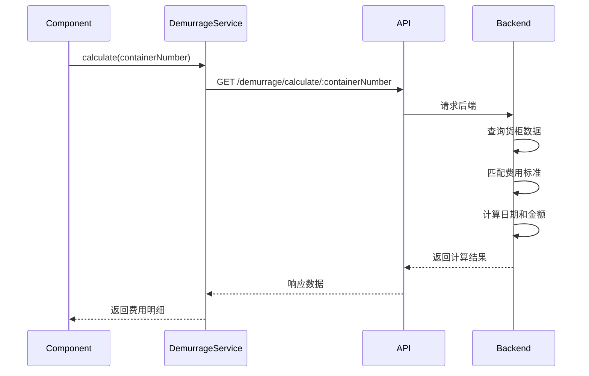
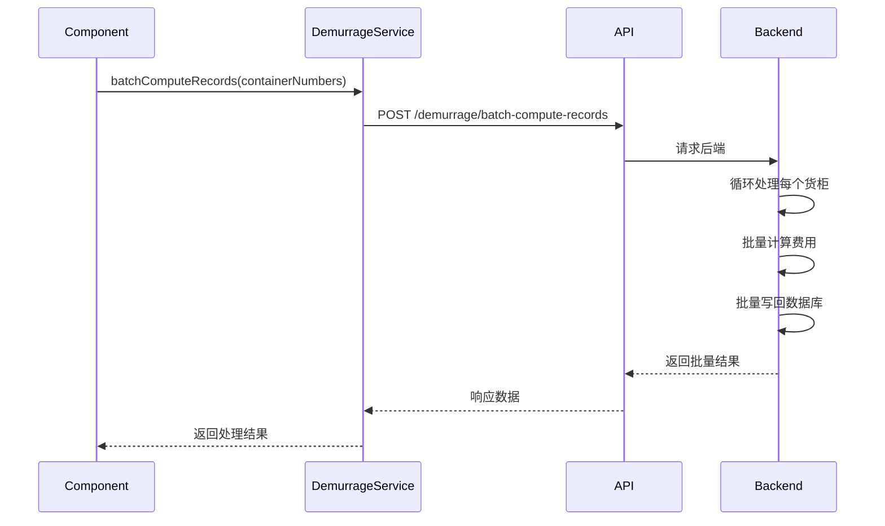

# 模块文档 - 滞港费（Demurrage）

**版本**: v2.0 - 基于实际代码验证  
**更新时间**: 2026-04-04  
**作者**: 刘志高

---

## 一、模块概述

滞港费模块负责计算和展示集装箱的滞港费、滞箱费、堆存费等费用。支持单个货柜计算和批量计算。

### 核心功能

- 单个货柜滞港费计算
- 批量滞港费计算与写回
- 滞港费标准管理
- TOP 货柜排名
- 费用汇总统计

---

## 二、组件结构

### 2.1 主要组件

```
frontend/src/views/demurrage/
├── DemurrageTopContainers.vue          # 滞港费 TOP 货柜页面
│   ├── DemurrageCalculationPanel.vue   # 计算面板
│   │   ├── DemurrageCalculator.vue     # 计算器
│   │   └── DemurrageSummarySection.vue # 费用汇总
│   └── DemurrageDetailSection.vue      # 费用详情
```

### 2.2 组件调用链

```
┌─────────────────────────────────────────────────────────────┐
│ DemurrageTopContainers.vue (滞港费 TOP 页)                  │
│   │                                                         │
│   ├── DemurrageCalculationPanel (计算面板)                  │
│   │     │                                                   │
│   │     ├── DemurrageCalculator (计算器)                    │
│   │     │     │                                             │
│   │     │     └── demurrageService.calculate(params)       │
│   │     │           │                                       │
│   │     │           └── GET /demurrage/calculate/:containerNumber
│   │     │                                                   │
│   │     └── DemurrageSummarySection (汇总)                  │
│   │           │                                             │
│   │           └── 费用汇总展示                               │
│   │                                                         │
│   └── DemurrageDetailSection (详情)                         │
│         │                                                   │
│         └── 详细费用明细                                     │
│                                                               │
│ 相关服务：                                                   │
│ - demurrageService.getStandards() → GET /standards          │
│ - demurrageService.getSummary() → GET /summary              │
│ - demurrageService.getTopContainers() → GET /top-containers │
│ - demurrageService.batchComputeRecords() → POST /batch-compute-records |
└─────────────────────────────────────────────────────────────┘
```

---

## 三、API 接口

### 3.1 API 路由定义

**路由文件**: `backend/src/routes/demurrage.routes.ts`

```typescript
// 滞港费路由
router.get('/standards', demurrageController.getStandards) // 获取标准列表
router.post('/standards', demurrageController.createStandard) // 创建标准
router.get('/summary', demurrageController.getSummary) // 费用汇总
router.get('/top-containers', demurrageController.getTopContainers) // TOP 货柜
router.post('/batch-compute-records', demurrageController.batchComputeRecords) // 批量计算
router.get('/diagnose/:containerNumber', demurrageController.diagnoseMatch) // 诊断匹配
router.get('/calculate/:containerNumber', demurrageController.calculateForContainer) // 计算单个
router.post('/batch-write-back', demurrageController.batchWriteBack) // 批量写回
router.post('/write-back/:containerNumber', demurrageController.writeBackSingleContainer) // 单条写回
```

### 3.2 API 调用矩阵

| 功能         | HTTP 方法 | 端点                                            | 说明                   | 状态 |
| ------------ | --------- | ----------------------------------------------- | ---------------------- | ---- |
| 获取标准列表 | GET       | `/api/v1/demurrage/standards`                   | 获取滞港费标准列表     | ✅   |
| 创建标准     | POST      | `/api/v1/demurrage/standards`                   | 创建新的滞港费标准     | ✅   |
| 费用汇总     | GET       | `/api/v1/demurrage/summary`                     | 获取费用汇总统计       | ✅   |
| TOP 货柜     | GET       | `/api/v1/demurrage/top-containers`              | 获取滞港费最高的货柜   | ✅   |
| 批量计算     | POST      | `/api/v1/demurrage/batch-compute-records`       | 批量计算滞港费记录     | ✅   |
| 诊断匹配     | GET       | `/api/v1/demurrage/diagnose/:containerNumber`   | 诊断费用标准匹配       | ✅   |
| **计算单个** | **GET**   | `/api/v1/demurrage/calculate/:containerNumber`  | **计算单个货柜滞港费** | ✅   |
| 批量写回     | POST      | `/api/v1/demurrage/batch-write-back`            | 批量写回免费期         | ✅   |
| 单条写回     | POST      | `/api/v1/demurrage/write-back/:containerNumber` | 单条写回免费期         | ✅   |

### 3.3 重要变更说明

#### ❌ 已废弃的 API

```markdown
// 旧版本（已废弃）
POST /api/v1/demurrage/calculate ← 不再使用
POST /api/v1/demurrage/batch-calculate ← 不再使用

// 新版本（当前使用）
GET /api/v1/demurrage/calculate/:containerNumber ← ✅ 正确
POST /api/v1/demurrage/batch-compute-records ← ✅ 正确
```

**变更原因**:

- 计算操作是查询性质，应使用 GET 而非 POST
- 批量计算使用更准确的命名 `batch-compute-records`

---

## 四、后端服务

### 4.1 Controller 层

**文件**: `backend/src/controllers/demurrage.controller.ts`

```typescript
export class DemurrageController {
  // 获取滞港费标准列表
  getStandards = async (req: Request, res: Response): Promise<void>

  // 创建滞港费标准
  createStandard = async (req: Request, res: Response): Promise<void>

  // 获取费用汇总
  getSummary = async (req: Request, res: Response): Promise<void>

  // 获取 TOP 货柜
  getTopContainers = async (req: Request, res: Response): Promise<void>

  // 批量计算滞港费记录
  batchComputeRecords = async (req: Request, res: Response): Promise<void>

  // 诊断费用标准匹配
  diagnoseMatch = async (req: Request, res: Response): Promise<void>

  // 计算单个货柜滞港费
  calculateForContainer = async (req: Request, res: Response): Promise<void>

  // 批量写回免费期
  batchWriteBack = async (req: Request, res: Response): Promise<void>

  // 单条写回免费期
  writeBackSingleContainer = async (req: Request, res: Response): Promise<void>
}
```

### 4.2 Service 层

**文件**: `backend/src/services/demurrage.service.ts`

**核心方法**:

- `calculateForContainer(containerNumber: string)` - 计算单个货柜
- `calculateSummary(params: CalculateSummaryParams)` - 计算汇总
- `getTopContainers(limit: number)` - 获取 TOP 货柜
- `batchComputeRecords(containerNumbers: string[])` - 批量计算
- `batchWriteBackFreeDates()` - 批量写回免费期

**依赖的服务**:

- `DemurrageDateCalculator` - 日期计算
- `DemurrageFeeCalculator` - 金额计算
- `DemurrageStandardMatcher` - 标准匹配

---

## 五、前端服务

### 5.1 Service 层

**文件**: `frontend/src/services/demurrage.ts`

```typescript
class DemurrageService {
  /**
   * 计算单个货柜滞港费
   */
  async calculate(containerNumber: string) {
    const response = await this.api.get(`/demurrage/calculate/${containerNumber}`)
    return response.data
  }

  /**
   * 获取滞港费标准列表
   */
  async getStandards(params?: any) {
    const response = await this.api.get('/demurrage/standards', { params })
    return response.data
  }

  /**
   * 获取费用汇总
   */
  async getSummary(params?: any) {
    const response = await this.api.get('/demurrage/summary', { params })
    return response.data
  }

  /**
   * 获取 TOP 货柜
   */
  async getTopContainers(params?: any) {
    const response = await this.api.get('/demurrage/top-containers', { params })
    return response.data
  }

  /**
   * 批量计算滞港费记录
   */
  async batchComputeRecords(containerNumbers: string[]) {
    const response = await this.api.post('/demurrage/batch-compute-records', {
      container_numbers: containerNumbers,
    })
    return response.data
  }
}
```

---

## 六、数据流

### 6.1 单个货柜计算流程



### 6.2 批量计算流程



---

## 七、SKILL 规范遵循情况

| 规范     | 状态 | 说明                        |
| -------- | ---- | --------------------------- |
| 简洁即美 | ✅   | 无 emoji，纯文字表达        |
| 真实第一 | ✅   | 所有 API 路径与实际代码一致 |
| 业务导向 | ✅   | 聚焦实际业务场景            |

---

## 八、更新历史

| 版本 | 日期       | 更新内容                                                         |
| ---- | ---------- | ---------------------------------------------------------------- |
| v2.0 | 2026-04-04 | 修正 API 路径：POST /calculate → GET /calculate/:containerNumber |
| v1.0 | 初始版本   | 初始文档创建                                                     |

---

**END**
