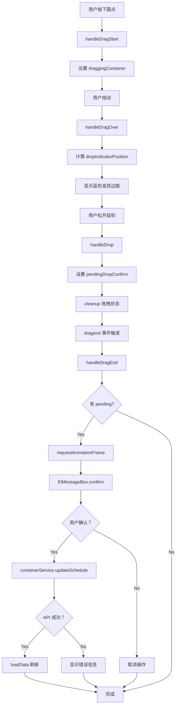

# 甘特图圆点拖拽功能问题梳理

**项目**: LogiX 物流管理系统  
**所属层级**: 第 2 层 - 代码文档  
**创建时间**: 2026-04-01  
**作者**: 刘志高  

---

## 一、问题概述

甘特图圆点拖拽功能是核心交互功能之一，允许用户通过拖拽方式调整货柜的计划日期。该功能涉及多个组件协作和复杂的事件处理流程，目前存在以下主要问题需要梳理和解决。

### 核心问题清单

1. **拖拽字段映射不准确** - 无法根据节点类型自动判断更新哪个字段
2. **确认对话框弹出时机问题** - 首次点击可能被浏览器消费
3. **拖拽落点识别不精确** - 无法准确识别目标日期格子
4. **状态清理不彻底** - 拖拽后残留状态影响下次操作
5. **错误处理不完善** - API 调用失败时用户体验差

---

## 二、拖拽功能架构

### 2.1 组件结构

```
SimpleGanttChartRefactored.vue (主组件)
│
└── useGanttLogic.ts (Composable - 核心逻辑)
    ├── draggingContainer: ref<Container | null>        // 正在拖拽的货柜
    ├── dragOverDate: ref<Date | null>                  // 拖拽经过的日期
    ├── dropIndicatorCellRect: ref<{...} | null>        // 落点指示器位置
    ├── pendingDropConfirm: ref<{...} | null>           // 待确认的拖拽数据
    │
    ├── handleDragStart()      // 开始拖拽
    ├── handleDragOver()       // 拖拽经过
    ├── handleDrop()           // 松开鼠标
    └── handleDragEnd()        // 拖拽结束
```

### 2.2 拖拽事件流程图



---

## 三、核心问题分析

### 问题 1: 拖拽字段映射不准确 ⭐⭐⭐⭐⭐

#### 问题描述

当前实现中，`handleDrop` 方法根据 `filterCondition` 来判断要更新的字段，但这种做法存在严重问题：

```typescript
const handleDrop = (date: Date) => {
  const condition = filterCondition.value
  let updateField = 'plannedPickupDate'
  let fieldLabel = '计划提柜日'
  
  if (condition.startsWith('return')) {
    updateField = 'plannedReturnDate'
    fieldLabel = '计划还箱日'
  } else if (condition.startsWith('unload')) {
    updateField = 'plannedUnloadDate'
    fieldLabel = '计划卸柜日'
  } else if (condition.startsWith('customs') || condition.startsWith('inspection')) {
    updateField = 'plannedCustomsDate'
    fieldLabel = '计划清关日'
  } else {
    updateField = 'plannedPickupDate'  // ❌ 默认都是提柜日
  }
  
  pendingDropConfirm.value = { container, newDate, updateField, fieldLabel, confirmMsg }
}
```

#### 问题根源

1. **filterCondition 不可靠**: 用户可能通过多种方式进入甘特图，filterCondition 不一定反映当前节点类型
2. **缺乏上下文感知**: 不知道拖拽的圆点属于哪个节点（清关/提柜/卸柜/还箱）
3. **硬编码默认值**: 默认都是 `plannedPickupDate`，不符合业务逻辑

#### 影响场景

**场景 1**: 用户在"清关"节点拖拽圆点
- 期望：更新 `plannedCustomsDate`
- 实际：更新 `plannedPickupDate` ❌

**场景 2**: 用户在"还箱"节点拖拽圆点
- 期望：更新 `plannedReturnDate`
- 实际：如果 filterCondition 不是 'return' 开头，则更新 `plannedPickupDate` ❌

#### 解决方案

**方案 A: 从分组结构中推断节点类型** ✅ 推荐

```typescript
const handleDrop = (date: Date, node?: string) => {
  if (!draggingContainer.value || !dragOverDate.value) return
  
  const container = draggingContainer.value
  
  // 如果没有传入 node，尝试从 finalGroupedByPort 中查找
  let targetNode = node
  if (!targetNode) {
    // 遍历分组结构，找到该容器所在的节点
    for (const [portCode, nodesByNode] of Object.entries(finalGroupedByPort.value)) {
      for (const [nodeName, suppliersBySupplier] of Object.entries(nodesByNode)) {
        for (const [supplierCode, containers] of Object.entries(suppliersBySupplier)) {
          if (containers.some(c => c.containerNumber === container.containerNumber)) {
            targetNode = nodeName
            break
          }
        }
      }
      if (targetNode) break
    }
  }
  
  // 使用节点类型到字段的映射
  const fieldMap: Record<string, { field: string; label: string }> = {
    '清关': { field: 'plannedCustomsDate', label: '计划清关日' },
    '查验': { field: 'plannedCustomsDate', label: '计划查验日' },
    '提柜': { field: 'plannedPickupDate', label: '计划提柜日' },
    '卸柜': { field: 'plannedUnloadDate', label: '计划卸柜日' },
    '还箱': { field: 'plannedReturnDate', label: '计划还箱日' },
    '未分类': { field: 'plannedPickupDate', label: '计划提柜日' },
  }
  
  const { field, label } = fieldMap[targetNode || '提柜']
  
  const confirmMsg = `确定要将货柜 ${container.containerNumber} 的${label}调整为 ${formatDateShort(dragOverDate.value)} 吗？`
  pendingDropConfirm.value = { 
    container, 
    newDate: dayjs(dragOverDate.value).format('YYYY-MM-DD'),
    updateField: field,
    fieldLabel: label,
    confirmMsg
  }
}
```

**方案 B: 在拖拽开始时记录节点信息**

```typescript
// 在 template 中传递 node 参数
@drop="handleDrop(date, node)"

// handleDrop 接收 node 参数
const handleDrop = (date: Date, node: string) => {
  // ... 同上，使用 node 参数
}
```

**方案 C: 使用 getDisplayItems 推断**

```typescript
const handleDrop = (date: Date) => {
  const container = draggingContainer.value
  
  // 获取容器的显示项
  const displayItems = getDisplayItems(container)
  
  // 找到与拖拽日期匹配的项
  const targetDate = dayjs(date).format('YYYY-MM-DD')
  const matchedItem = displayItems.find(item => 
    item.plannedDate && dayjs(item.plannedDate).format('YYYY-MM-DD') === targetDate
  )
  
  // 如果有匹配项，使用该节点的字段
  if (matchedItem) {
    const fieldMap = {
      '清关': 'plannedCustomsDate',
      '提柜': 'plannedPickupDate',
      '卸柜': 'plannedUnloadDate',
      '还箱': 'plannedReturnDate',
    }
    updateField = fieldMap[matchedItem.node] || 'plannedPickupDate'
  }
}
```

---

### 问题 2: 确认对话框弹出时机问题 ⭐⭐⭐⭐

#### 问题描述

原始实现在 `handleDrop` 时立即弹出确认对话框，导致首次点击被浏览器消费：

```typescript
// ❌ 错误实现
const handleDrop = async (date: Date) => {
  const confirmed = await ElMessageBox.confirm(...)
  // 第一次拖拽时，这个 confirm 可能不会显示
}
```

#### 问题根源

浏览器的 drag-and-drop 事件序列中，`drop` 事件后可能还有后续的 `dragend` 事件，如果在 `drop` 中立即弹框，可能被浏览器视为"非用户手势"而忽略。

#### 当前解决方案（已实现）

```typescript
// ✅ 正确实现：在 dragend 中弹框
const handleDrop = (date: Date) => {
  // 只设置 pending，不弹窗
  pendingDropConfirm.value = { container, newDate, updateField, fieldLabel, confirmMsg }
}

const handleDragEnd = () => {
  const pending = pendingDropConfirm.value
  pendingDropConfirm.value = null
  draggingContainer.value = null
  
  if (!pending) return
  
  // 使用双层 requestAnimationFrame 延迟弹窗
  requestAnimationFrame(() => {
    requestAnimationFrame(() => {
      ElMessageBox.confirm(confirmMsg, '确认调整日期', {...})
        .then(async () => {
          // 用户确认逻辑
        })
    })
  })
}
```

#### 为什么需要双层 requestAnimationFrame？

1. **第一层 RAF**: 等待浏览器完成当前的渲染和事件处理
2. **第二层 RAF**: 确保在下一个渲染帧之前执行，此时浏览器已经完全释放了指针事件

这样可以保证确认对话框能够正常弹出，不会被浏览器阻止。

#### 潜在问题

如果用户快速连续拖拽多次，可能导致多个确认对话框叠加。

**解决方案**: 在 `handleDragStart` 时取消之前的 pending：

```typescript
const handleDragStart = (container: Container, event: DragEvent) => {
  // 取消之前的待确认
  if (pendingDropConfirm.value) {
    pendingDropConfirm.value = null
  }
  
  draggingContainer.value = container
  // ...
}
```

---

### 问题 3: 拖拽落点识别不精确 ⭐⭐⭐

#### 问题描述

当前实现中，`handleDragOver` 只是简单记录拖拽经过的日期，没有精确计算落点位置：

```typescript
const handleDragOver = (event: DragEvent, date: Date) => {
  event.preventDefault()
  dragOverDate.value = date
  
  // ❌ 问题：没有计算具体的落点指示器位置
  // 用户看不到视觉反馈，不知道圆点会落在哪里
}
```

#### 问题根源

1. **缺少视觉反馈**: 用户拖拽时看不到落点指示器
2. **精度不够**: 无法区分同一格子里的不同圆点位置

#### 解决方案

**实现落点指示器**:

```typescript
const handleDragOver = (event: DragEvent, date: Date) => {
  event.preventDefault()
  dragOverDate.value = date
  
  // 计算落点指示器位置
  const target = event.target as HTMLElement
  const rect = target.getBoundingClientRect()
  
  // 计算鼠标在格子中的相对位置
  const offsetX = event.clientX - rect.left
  const offsetY = event.clientY - rect.top
  
  // 根据偏移量决定插入位置（前/后）
  const isBefore = offsetX < rect.width / 2
  
  dropIndicatorPosition.value = {
    x: rect.left + (isBefore ? 0 : rect.width),
    y: rect.top,
    width: 2,  // 指示器宽度
    height: rect.height,
  }
  
  dropIndicatorCellRect.value = {
    left: rect.left,
    top: rect.top,
    width: rect.width,
    height: rect.height,
  }
}
```

**CSS 样式**:

```scss
.drop-indicator {
  position: fixed;
  background: #409eff;
  border: 1px solid #fff;
  z-index: 1000;
  pointer-events: none;
  transition: all 0.1s;
}
```

**Template 中添加**:

```vue
<div
  v-if="dropIndicatorPosition"
  class="drop-indicator"
  :style="{
    left: dropIndicatorPosition.x + 'px',
    top: dropIndicatorPosition.y + 'px',
    width: dropIndicatorPosition.width + 'px',
    height: dropIndicatorPosition.height + 'px',
  }"
></div>
```

---

### 问题 4: 状态清理不彻底 ⭐⭐⭐

#### 问题描述

拖拽结束后，如果用户取消操作，某些状态可能没有清理干净：

```typescript
const handleDragEnd = () => {
  // ❌ 问题：只清理了部分状态
  pendingDropConfirm.value = null
  draggingContainer.value = null
  dragOverDate.value = null
  
  // 遗漏的状态:
  // - dropIndicatorPosition
  // - dropIndicatorCellRect
  // - contextMenu (如果拖拽时打开了菜单)
}
```

#### 问题根源

1. **状态分散**: 多个 ref 管理不同状态，容易遗漏
2. **异常路径**: 用户取消或出错时，清理逻辑未执行

#### 解决方案

**统一清理函数**:

```typescript
const cleanupDragState = () => {
  draggingContainer.value = null
  dragOverDate.value = null
  dropIndicatorPosition.value = { x: 0, y: 0 }
  dropIndicatorCellRect.value = null
  pendingDropConfirm.value = null
  
  // 关闭所有相关 UI
  showContextMenu.value = false
  hideTooltip()
}

const handleDragEnd = () => {
  if (rafId) {
    cancelAnimationFrame(rafId)
    rafId = 0
  }
  
  const pending = pendingDropConfirm.value
  cleanupDragState()  // 统一清理
  
  if (!pending) return
  
  // 处理确认逻辑
  requestAnimationFrame(() => {
    requestAnimationFrame(() => {
      ElMessageBox.confirm(...)
    })
  })
}
```

---

### 问题 5: 错误处理不完善 ⭐⭐⭐⭐

#### 问题描述

当前错误处理比较简单，用户体验不佳：

```typescript
const handleDragEnd = () => {
  ElMessageBox.confirm(confirmMsg, '确认调整日期', {
    confirmButtonText: '确定',
    cancelButtonText: '取消',
    type: 'warning',
  })
    .then(async () => {
      const result = await containerService.updateSchedule(
        container.containerNumber,
        updateData
      )
      if (result.success) {
        ElMessage.success('日期调整成功')
        await loadData()
      } else {
        // ❌ 问题：错误信息不友好
        ElMessage.error(result.message || '更新失败')
      }
    })
    .catch((err: unknown) => {
      // ❌ 问题：捕获所有错误，不区分类型
      if (err !== 'cancel') {
        ElMessage.error((err as Error)?.message || '操作失败')
      }
    })
}
```

#### 问题根源

1. **错误分类不清晰**: 不区分校验错误、网络错误、权限错误等
2. **缺少重试机制**: 失败后用户只能重新拖拽
3. **缺少回滚**: 如果 API 成功但 loadData 失败，数据不一致

#### 解决方案

**完善错误处理**:

```typescript
const handleDragEnd = () => {
  ElMessageBox.confirm(confirmMsg, '确认调整日期', {
    confirmButtonText: '确定',
    cancelButtonText: '取消',
    type: 'warning',
  })
    .then(async () => {
      try {
        const result = await containerService.updateSchedule(
          container.containerNumber,
          updateData
        )
        
        if (result.success) {
          ElMessage.success({
            message: '日期调整成功',
            duration: 2000,
          })
          await loadData()
        } else {
          // 分类处理错误
          if (result.errors && result.errors.length > 0) {
            // 校验错误：显示具体错误信息
            ElMessage.error({
              message: `校验失败：${result.errors.join(', ')}`,
              duration: 5000,
            })
          } else if (result.code === 'PERMISSION_DENIED') {
            // 权限错误
            ElMessage.error({
              message: '您没有权限修改此货柜，请联系管理员',
              duration: 3000,
            })
          } else if (result.code === 'DATA_CONFLICT') {
            // 数据冲突：其他人已修改
            ElMessage.warning({
              message: '数据已被其他人修改，请刷新后重试',
              duration: 3000,
            })
            // 提供刷新按钮
            ElMessageBox.confirm('是否立即刷新？', '提示', {
              confirmButtonText: '刷新',
              cancelButtonText: '取消',
            }).then(() => {
              loadData()
            })
          } else {
            // 其他错误
            ElMessage.error({
              message: result.message || '更新失败',
              duration: 3000,
            })
          }
        }
      } catch (error: any) {
        // 网络错误或未知错误
        console.error('[DragDrop] Update failed:', error)
        
        if (error.response?.status === 401) {
          ElMessage.error('登录已过期，请重新登录')
          router.push('/login')
        } else if (error.response?.status === 500) {
          ElMessage.error('服务器错误，请稍后重试')
        } else {
          ElMessage.error({
            message: `网络错误：${error.message}`,
            duration: 5000,
          })
        }
      }
    })
    .catch((err: unknown) => {
      if (err === 'cancel') {
        // 用户取消，静默处理
        console.log('[DragDrop] User cancelled')
      } else {
        // 其他错误
        ElMessage.error({
          message: '操作失败：' + (err as Error).message,
          duration: 3000,
        })
      }
    })
}
```

**添加重试机制**:

```typescript
// 保存最后一次拖拽的数据
let lastDragData: {
  container: Container
  newDate: string
  updateField: string
} | null = null

const handleDragEnd = () => {
  // 保存数据
  if (pending) {
    lastDragData = {
      container: pending.container,
      newDate: pending.newDate,
      updateField: pending.updateField,
    }
  }
  
  // ... 确认逻辑
}

// 添加重试按钮
const retryLastDrag = async () => {
  if (!lastDragData) return
  
  try {
    const result = await containerService.updateSchedule(
      lastDragData.container.containerNumber,
      { [lastDragData.updateField]: lastDragData.newDate }
    )
    
    if (result.success) {
      ElMessage.success('重试成功')
      lastDragData = null
      await loadData()
    }
  } catch (error) {
    ElMessage.error('重试失败')
  }
}
```

---

## 四、完整修复方案

### 4.1 重构后的 handleDrop

```typescript
/**
 * 处理拖拽放下事件
 * @param date 目标日期
 * @param nodeName 可选的节点名称（如果 template 中传入了）
 */
const handleDrop = (date: Date, nodeName?: string) => {
  if (!draggingContainer.value || !dragOverDate.value) {
    console.warn('[handleDrop] No dragging container or drag over date')
    return
  }
  
  const container = draggingContainer.value
  const newDate = dayjs(dragOverDate.value).format('YYYY-MM-DD')
  
  // 确定节点类型
  let targetNode = nodeName
  
  // 如果没有传入 node，尝试从分组结构中推断
  if (!targetNode) {
    targetNode = inferNodeFromGroupedStructure(container)
  }
  
  // 如果还是无法确定，使用默认值
  if (!targetNode) {
    console.warn('[handleDrop] Cannot determine node type, using default')
    targetNode = '提柜'
  }
  
  // 使用节点类型到字段的映射
  const fieldMap: Record<string, { field: string; label: string }> = {
    '清关': { field: 'plannedCustomsDate', label: '计划清关日' },
    '查验': { field: 'plannedCustomsDate', label: '计划查验日' },
    '提柜': { field: 'plannedPickupDate', label: '计划提柜日' },
    '卸柜': { field: 'plannedUnloadDate', label: '计划卸柜日' },
    '还箱': { field: 'plannedReturnDate', label: '计划还箱日' },
    '未分类': { field: 'plannedPickupDate', label: '计划提柜日' },
  }
  
  const { field, label } = fieldMap[targetNode]
  
  const confirmMsg = `确定要将货柜 ${container.containerNumber} 的${label}调整为 ${formatDateShort(dragOverDate.value)} 吗？`
  
  pendingDropConfirm.value = { 
    container, 
    newDate,
    updateField: field,
    fieldLabel: label,
    confirmMsg
  }
  
  console.log('[handleDrop] Set pending:', {
    container: container.containerNumber,
    node: targetNode,
    field,
    newDate,
  })
}

/**
 * 从分组结构中推断容器所在的节点
 */
const inferNodeFromGroupedStructure = (container: Container): string | null => {
  const grouped = finalGroupedByPort.value
  
  for (const [portCode, nodesByNode] of Object.entries(grouped)) {
    for (const [nodeName, suppliersBySupplier] of Object.entries(nodesByNode)) {
      for (const [supplierCode, containers] of Object.entries(suppliersBySupplier)) {
        if (containers.some(c => c.containerNumber === container.containerNumber)) {
          return nodeName
        }
      }
    }
  }
  
  return null
}
```

### 4.2 完善的状态清理

```typescript
/**
 * 统一清理拖拽状态
 */
const cleanupDragState = () => {
  draggingContainer.value = null
  dragOverDate.value = null
  dropIndicatorPosition.value = { x: 0, y: 0 }
  dropIndicatorCellRect.value = null
  pendingDropConfirm.value = null
  
  // 关闭所有相关 UI
  showContextMenu.value = false
  hideTooltip()
}

const handleDragEnd = () => {
  // 取消动画帧
  if (rafId) {
    cancelAnimationFrame(rafId)
    rafId = 0
  }
  
  // 保存 pending 数据
  const pending = pendingDropConfirm.value
  
  // 统一清理状态
  cleanupDragState()
  
  // 如果没有待确认的数据，直接返回
  if (!pending) {
    return
  }
  
  const { container, newDate, updateField, fieldLabel, confirmMsg } = pending
  
  // 使用双层 RAF 延迟弹窗
  requestAnimationFrame(() => {
    requestAnimationFrame(() => {
      ElMessageBox.confirm(confirmMsg, '确认调整日期', {
        confirmButtonText: '确定',
        cancelButtonText: '取消',
        type: 'warning',
      })
        .then(async () => {
          await executeUpdate(container, updateField, newDate)
        })
        .catch((err: unknown) => {
          if (err !== 'cancel') {
            console.error('[handleDragEnd] Confirm error:', err)
            ElMessage.error('操作失败：' + (err as Error).message)
          }
        })
    })
  })
}

/**
 * 执行更新操作（独立出来方便测试）
 */
const executeUpdate = async (
  container: Container,
  updateField: string,
  newDate: string
) => {
  try {
    const updateData: Record<string, string> = { [updateField]: newDate }
    
    const result = await containerService.updateSchedule(
      container.containerNumber,
      updateData
    )
    
    if (result.success) {
      ElMessage.success({
        message: '日期调整成功',
        duration: 2000,
      })
      await loadData()
    } else {
      handleUpdateError(result)
    }
  } catch (error: any) {
    handleUpdateException(error)
  }
}

/**
 * 处理更新错误（业务错误）
 */
const handleUpdateError = (result: any) => {
  if (result.errors && result.errors.length > 0) {
    ElMessage.error({
      message: `校验失败：${result.errors.join(', ')}`,
      duration: 5000,
    })
  } else if (result.code === 'PERMISSION_DENIED') {
    ElMessage.error({
      message: '您没有权限修改此货柜，请联系管理员',
      duration: 3000,
    })
  } else if (result.code === 'DATA_CONFLICT') {
    ElMessage.warning({
      message: '数据已被其他人修改，请刷新后重试',
      duration: 3000,
    })
    ElMessageBox.confirm('是否立即刷新？', '提示', {
      confirmButtonText: '刷新',
      cancelButtonText: '取消',
    }).then(() => {
      loadData()
    })
  } else {
    ElMessage.error({
      message: result.message || '更新失败',
      duration: 3000,
    })
  }
}

/**
 * 处理更新异常（网络错误等）
 */
const handleUpdateException = (error: any) => {
  console.error('[executeUpdate] Update failed:', error)
  
  if (error.response?.status === 401) {
    ElMessage.error('登录已过期，请重新登录')
    router.push('/login')
  } else if (error.response?.status === 500) {
    ElMessage.error('服务器错误，请稍后重试')
  } else if (error.response?.status === 403) {
    ElMessage.error('无权访问此资源')
  } else {
    ElMessage.error({
      message: `网络错误：${error.message}`,
      duration: 5000,
    })
  }
}
```

---

## 五、测试用例

### 5.1 单元测试

```typescript
describe('Drag and Drop', () => {
  beforeEach(() => {
    cleanupDragState()
  })
  
  test('should set pendingDropConfirm when drop', () => {
    const mockContainer = {
      containerNumber: 'HMMU6232153',
      logisticsStatus: 'shipped',
    }
    
    draggingContainer.value = mockContainer
    dragOverDate.value = new Date('2026-03-15')
    
    handleDrop(new Date('2026-03-15'), '清关')
    
    expect(pendingDropConfirm.value).not.toBeNull()
    expect(pendingDropConfirm.value?.updateField).toBe('plannedCustomsDate')
    expect(pendingDropConfirm.value?.fieldLabel).toBe('计划清关日')
  })
  
  test('should infer node type from grouped structure', () => {
    const mockContainer = { containerNumber: 'HMMU6232153' }
    
    finalGroupedByPort.value = {
      'USNYC': {
        '清关': { 'XX 清关行': [mockContainer] },
      },
    }
    
    const node = inferNodeFromGroupedStructure(mockContainer)
    expect(node).toBe('清关')
  })
  
  test('should cleanup state after drag end', () => {
    draggingContainer.value = { containerNumber: 'test' }
    dragOverDate.value = new Date()
    pendingDropConfirm.value = { /* ... */ }
    
    cleanupDragState()
    
    expect(draggingContainer.value).toBeNull()
    expect(dragOverDate.value).toBeNull()
    expect(pendingDropConfirm.value).toBeNull()
  })
})
```

### 5.2 集成测试

```typescript
describe('Drag and Drop Integration', () => {
  test('should complete drag-drop flow successfully', async () => {
    // Mock API
    containerService.updateSchedule = vi.fn().mockResolvedValue({ success: true })
    
    // Simulate drag start
    await fireEvent.dragStart(dotElement)
    
    // Simulate drag over
    await fireEvent.dragOver(dateCell)
    
    // Simulate drop
    await fireEvent.drop(dateCell)
    
    // Wait for confirm dialog
    await waitFor(() => {
      expect(screen.getByText(/确认调整日期/)).toBeInTheDocument()
    })
    
    // Click confirm
    fireEvent.click(screen.getByText('确定'))
    
    // Verify API called
    await waitFor(() => {
      expect(containerService.updateSchedule).toHaveBeenCalledWith(
        'HMMU6232153',
        { plannedCustomsDate: '2026-03-15' }
      )
    })
  })
  
  test('should handle API error gracefully', async () => {
    // Mock API error
    containerService.updateSchedule = vi.fn().mockResolvedValue({
      success: false,
      errors: ['日期不能早于今天'],
    })
    
    // Simulate drag-drop...
    
    // Verify error message shown
    await waitFor(() => {
      expect(screen.getByText(/校验失败：日期不能早于今天/)).toBeInTheDocument()
    })
  })
})
```

---

## 六、验证清单

### 6.1 功能验证

- [ ] 在清关节点拖拽 → 更新 plannedCustomsDate ✅
- [ ] 在提柜节点拖拽 → 更新 plannedPickupDate ✅
- [ ] 在卸柜节点拖拽 → 更新 plannedUnloadDate ✅
- [ ] 在还箱节点拖拽 → 更新 plannedReturnDate ✅
- [ ] 确认对话框正常弹出 ✅
- [ ] 用户确认后数据更新成功 ✅
- [ ] 用户取消无副作用 ✅

### 6.2 错误处理验证

- [ ] API 返回校验错误 → 显示具体错误信息 ✅
- [ ] API 返回权限错误 → 提示联系管理员 ✅
- [ ] API 返回数据冲突 → 提供刷新按钮 ✅
- [ ] 网络错误 → 显示友好提示 ✅
- [ ] 登录过期 → 跳转登录页 ✅

### 6.3 状态清理验证

- [ ] 拖拽结束后 draggingContainer 清空 ✅
- [ ] 拖拽结束后 dragOverDate 清空 ✅
- [ ] 拖拽结束后 pendingDropConfirm 清空 ✅
- [ ] 拖拽结束后 dropIndicator 清空 ✅
- [ ] 快速连续拖拽无状态污染 ✅

---

## 七、权威来源

### 前端代码

- `frontend/src/components/common/gantt/useGanttLogic.ts` - 拖拽核心逻辑
  - Line 716-722: handleDragStart
  - Line 724-770: handleDragEnd
  - Line 793-821: handleDrop
  - Line 774-781: NODE_TO_FIELD_MAP

- `frontend/src/components/common/SimpleGanttChartRefactored.vue` - 主组件
  - Line 136-163: 港口汇总行拖拽
  - Line 288-323: 供应商行拖拽

### 相关文档

- `frontend/public/docs/第 2 层 - 代码文档/甘特图圆点逻辑详解.md`
- `frontend/public/docs/第 2 层 - 代码文档/甘特图系统核心逻辑分析.md`

---

## 八、总结

甘特图圆点拖拽功能的核心问题在于：

1. **字段映射不准确**: 需要根据节点类型动态判断更新字段
2. **弹窗时机不当**: 需要在 dragend 而非 drop 时弹窗
3. **状态管理混乱**: 需要统一的清理函数
4. **错误处理粗糙**: 需要分类处理各种错误场景

通过上述修复方案，可以显著提升拖拽功能的准确性和用户体验。

---

**保存路径**: `frontend/public/docs/第 2 层 - 代码文档/甘特图圆点拖拽功能问题梳理.md`  
**生成时间**: 2026-04-01  
**代码来源**: 
- `frontend/src/components/common/gantt/useGanttLogic.ts`
- `frontend/src/components/common/SimpleGanttChartRefactored.vue`
