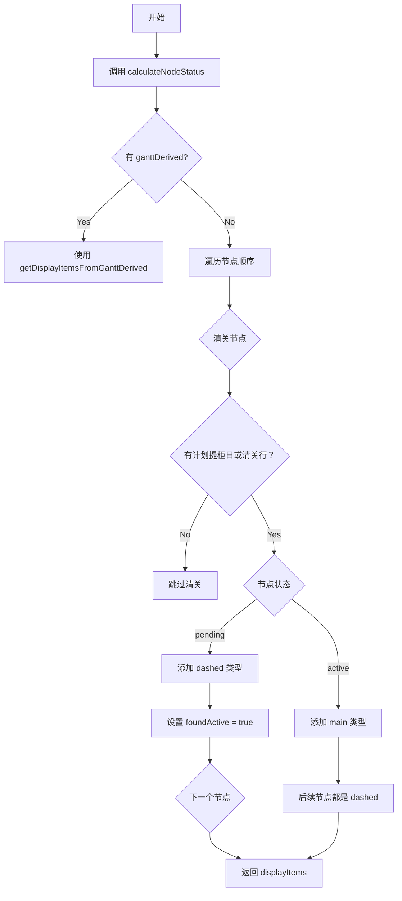

# 甘特图圆点逻辑详解

**项目**: LogiX 物流管理系统  
**所属层级**: 第 2 层 - 代码文档  
**创建时间**: 2026-04-01  
**作者**: 刘志高

---

## 一、文档概述

本文档详细解析 LogiX 甘特图中圆点（Container Dot）的完整业务逻辑，包括圆点的显示规则、样式计算、状态判断、主虚任务区分、交互事件等核心技术实现。用于帮助开发者深入理解圆点的工作机制，避免开发错误。

### 核心价值

1. **可视化标识**: 每个圆点代表一个货柜在特定日期的节点状态
2. **状态区分**: 通过颜色和边框样式区分主任务/虚任务/已完成
3. **智能预警**: 自动标红超期和风险货柜（脉冲动画）
4. **交互入口**: 点击打开详情、拖拽改期、右键菜单

---

## 二、圆点渲染流程

### 2.1 三级分组渲染结构

```
目的港（一级）
├── 港口汇总行（Port Summary Row）
│   └── 显示该目的港所有货柜的圆点（折叠时）
│
└── 展开后显示五节点（二级）
    ├── 清关节点行
    │   └── 供应商行（三级）
    │       └── 清关圆点
    │
    ├── 查验节点行
    │   └── 供应商行（三级）
    │       └── 查验圆点
    │
    ├── 提柜节点行
    │   └── 供应商行（三级）
    │       └── 提柜圆点
    │
    ├── 卸柜节点行
    │   └── 供应商行（三级）
    │       └── 卸柜圆点
    │
    └── 还箱节点行
        └── 供应商行（三级）
            └── 还箱圆点
```

### 2.2 圆点渲染位置

**两个渲染场景**:

#### 场景 1: 港口汇总行（折叠时）

```vue
<!-- 文件：SimpleGanttChartRefactored.vue:139-163 -->
<div class="dots-container">
  <div
    v-for="container in getContainersByDateAndPort(date, port)"
    :key="container.containerNumber"
    class="container-dot"
    :class="{
      clickable: true,
      'is-dragging': draggingContainer?.containerNumber === container.containerNumber,
      'has-warning': hasAlert(container),
      'main-task': getNodeDisplayType(container, '清关') === 'main',
      'dashed-task': getNodeDisplayType(container, '清关') === 'dashed',
      'completed-task': isNodeFinished(container, '清关'),
    }"
    :style="{ backgroundColor: getStatusColor(container.logisticsStatus) }"
    draggable="true"
    @click="handleDotClick(container)"
    @dragstart="handleDragStart(container, $event)"
  ></div>
</div>
```

**特点**:

- 显示该日期下该目的港的所有货柜
- 圆点样式统一使用「清关」节点的状态
- 折叠时只显示未分类的圆点

#### 场景 2: 供应商行（展开时）

```vue
<!-- 文件：SimpleGanttChartRefactored.vue:291-323 -->
<div class="dots-container">
  <div
    v-for="container in getContainersByDateAndSupplier(date, containersBySupplier, node)"
    :key="container.containerNumber"
    class="container-dot"
    :class="{
      clickable: true,
      'is-dragging': draggingContainer?.containerNumber === container.containerNumber,
      'has-warning': hasAlert(container),
      'main-task': isMainTask(container, date),
      'dashed-task': isDashedTask(container, date),
    }"
    :style="{
      backgroundColor: isMainTask(container, date)
        ? getStatusColor(container.logisticsStatus)
        : 'transparent',
      border: getContainerBorderStyle(container),
    }"
    @click="handleDotClick(container)"
    draggable="true"
  ></div>
</div>
```

**特点**:

- 只显示属于该供应商的货柜
- 圆点样式根据当前节点计算
- 虚任务背景透明，只显示边框

---

## 三、核心计算逻辑

### 3.1 calculateNodeStatus - 计算货柜节点状态

**作用**: 根据货柜数据计算五个节点（清关、查验、提柜、卸柜、还箱）的状态

**输入**: `container: any`

**输出**: `ContainerNodeStatus`

```typescript
interface ContainerNodeStatus {
  containerNumber: string
  portCode: string
  nodes: {
    清关：NodeStatus
    查验：NodeStatus
    提柜：NodeStatus
    卸柜：NodeStatus
    还箱：NodeStatus
  }
}

interface NodeStatus {
  status: 'pending' | 'active' | 'completed' | 'skipped'
  plannedDate?: Date
  actualDate?: Date
  supplier: string
}
```

**计算规则**:

#### 1. 清关节点

```typescript
// 供应商来源：customsBrokerCode > customsBroker
const customsSupplier = destPortOp?.customsBrokerCode || destPortOp?.customsBroker

if (customsSupplier) {
  nodes.清关.supplier = customsSupplier

  // 日期优先级：actualCustomsDate > plannedCustomsDate > ataDestPort > etaDestPort
  if (destPortOp.actualCustomsDate) {
    nodes.清关.actualDate = new Date(destPortOp.actualCustomsDate)
    nodes.清关.plannedDate = destPortOp.plannedCustomsDate
      ? new Date(destPortOp.plannedCustomsDate)
      : undefined
    nodes.清关.status = 'completed' // 已完成
  } else if (destPortOp.plannedCustomsDate) {
    nodes.清关.plannedDate = new Date(destPortOp.plannedCustomsDate)
    nodes.清关.status = 'active' // 进行中
  } else if (destPortOp.ataDestPort) {
    nodes.清关.plannedDate = new Date(destPortOp.ataDestPort)
    nodes.清关.status = 'active'
  } else if (destPortOp.etaDestPort) {
    nodes.清关.plannedDate = new Date(destPortOp.etaDestPort)
    nodes.清关.status = 'active'
  }
}
```

**状态判断**:

- ✅ completed: 有 actualCustomsDate
- 🟡 active: 有计划日期但无实际日期
- ⚪ pending: 无供应商或无日期

#### 2. 查验节点

```typescript
// 只有需要查验时才处理
if (needsInspection && customsSupplier) {
  nodes.查验.supplier = customsSupplier
  nodes.查验.plannedDate = destPortOp?.plannedCustomsDate
    ? new Date(destPortOp.plannedCustomsDate)
    : undefined
  nodes.查验.actualDate = destPortOp?.actualCustomsDate
    ? new Date(destPortOp.actualCustomsDate)
    : undefined

  // 状态依赖清关节点
  if (nodes.清关.status === 'completed' && nodes.查验.status === 'pending') {
    nodes.查验.status = 'active'
  } else if (destPortOp?.actualCustomsDate && needsInspection) {
    nodes.查验.status = 'completed'
  }
}
```

**触发条件**:

- ✅ inspectionRequired = true
- ✅ 清关已完成

#### 3. 提柜节点

```typescript
// 供应商来源：truckingCompanyId > carrierCompany
const pickupSupplier = pickupTransport?.truckingCompanyId || pickupTransport?.carrierCompany

if (pickupSupplier) {
  nodes.提柜.supplier = pickupSupplier

  // 日期优先级：deliveryDate > plannedDeliveryDate > pickupDate > plannedPickupDate
  if (pickupTransport.deliveryDate) {
    nodes.提柜.actualDate = new Date(pickupTransport.deliveryDate)
    nodes.提柜.plannedDate = pickupTransport.plannedDeliveryDate
      ? new Date(pickupTransport.plannedDeliveryDate)
      : undefined
  } else if (pickupTransport.plannedDeliveryDate) {
    nodes.提柜.plannedDate = new Date(pickupTransport.plannedDeliveryDate)
  } else if (pickupTransport.pickupDate) {
    nodes.提柜.actualDate = new Date(pickupTransport.pickupDate)
    nodes.提柜.plannedDate = pickupTransport.plannedPickupDate
      ? new Date(pickupTransport.plannedPickupDate)
      : undefined
  } else if (pickupTransport.plannedPickupDate) {
    nodes.提柜.plannedDate = new Date(pickupTransport.plannedPickupDate)
  }

  // 检查是否可以进入提柜节点（清关 + 查验完成后）
  let canEnterPickup = nodes.清关.status === 'completed'
  if (needsInspection) {
    canEnterPickup = canEnterPickup && nodes.查验.status === 'completed'
  }

  // 提柜完成判断：使用 deliveryDate（送仓日）
  if (canEnterPickup && !pickupTransport.deliveryDate) {
    nodes.提柜.status = 'active'
  } else if (pickupTransport.deliveryDate) {
    nodes.提柜.status = 'completed'
  }
}
```

**关键逻辑**:

- 前置条件：清关完成 + 查验完成（如有）
- 完成标志：deliveryDate（送仓日）而非 pickupDate（提柜日）

#### 4. 卸柜节点

```typescript
// 供应商来源：warehouseId > actualWarehouse > plannedWarehouse
const unloadSupplier =
  unloadOp?.warehouseId || unloadOp?.actualWarehouse || unloadOp?.plannedWarehouse

if (unloadSupplier) {
  nodes.卸柜.supplier = unloadSupplier

  // 日期优先级：unloadDate > plannedUnloadDate
  if (unloadOp.unloadDate) {
    nodes.卸柜.actualDate = new Date(unloadOp.unloadDate)
    nodes.卸柜.plannedDate = unloadOp.plannedUnloadDate
      ? new Date(unloadOp.plannedUnloadDate)
      : undefined
  } else if (unloadOp.plannedUnloadDate) {
    nodes.卸柜.plannedDate = new Date(unloadOp.plannedUnloadDate)
  }

  // 前置条件：提柜完成
  if (nodes.提柜.status === 'completed' && !unloadOp?.unloadDate) {
    nodes.卸柜.status = 'active'
  } else if (unloadOp?.unloadDate) {
    nodes.卸柜.status = 'completed'
  }
}
```

#### 5. 还箱节点

```typescript
// 供应商来源：returnTerminalCode > warehouseId
const returnSupplier = emptyReturn?.returnTerminalCode || unloadSupplier

if (returnSupplier) {
  nodes.还箱.supplier = returnSupplier

  // 日期优先级：returnTime > lastReturnDate
  if (emptyReturn?.returnTime) {
    nodes.还箱.actualDate = new Date(emptyReturn.returnTime)
    nodes.还箱.plannedDate = emptyReturn.lastReturnDate
      ? new Date(emptyReturn.lastReturnDate)
      : undefined
  } else if (emptyReturn?.lastReturnDate) {
    nodes.还箱.plannedDate = new Date(emptyReturn.lastReturnDate)
  }

  // 前置条件：卸柜完成
  if (nodes.卸柜.status === 'completed' && !emptyReturn?.returnTime) {
    nodes.还箱.status = 'active'
  } else if (emptyReturn?.returnTime) {
    nodes.还箱.status = 'completed'
  }
}
```

### 3.2 getDisplayItems - 获取显示项

**作用**: 根据节点状态生成甘特图显示项（主任务/虚任务）

**输入**: `container: any`

**输出**: `GanttDisplayItem[]`

```typescript
interface GanttDisplayItem {
  type: 'main' | 'dashed' // 主任务 / 虚线任务
  port: string
  node: string
  supplier: string
  containerNumber: string
  container: any
  plannedDate?: Date
  actualDate?: Date
  isCurrent: boolean
}
```

**计算流程**:



**核心逻辑**:

```typescript
let foundActive = false // 标记是否已找到活跃节点

nodeOrder.forEach(nodeName => {
  const node = nodeStatus.nodes[nodeName as keyof typeof nodeStatus.nodes]

  // 清关特殊处理：需要有计划提柜日或清关行才显示
  if (nodeName === '清关') {
    const hasPlannedPickup = container.truckingTransports?.[0]?.plannedPickupDate
    const hasCustomsBroker =
      node.supplier && node.supplier !== '未指定' && node.supplier !== '未指定清关公司'
    if (!hasPlannedPickup && !hasCustomsBroker) {
      return // 跳过清关
    }
  }

  if (node.supplier && node.supplier !== '未指定') {
    if (node.status === 'active') {
      // 活跃节点 -> main 类型（实线圆点）
      displayItems.push({
        type: 'main',
        port: nodeStatus.portCode,
        node: nodeName,
        supplier: node.supplier,
        containerNumber: nodeStatus.containerNumber,
        container,
        plannedDate: node.plannedDate,
        actualDate: node.actualDate,
        isCurrent: true,
      })
      foundActive = true // 标记已找到活跃节点
    } else if (!foundActive && node.status === 'pending') {
      // 待处理节点且前面没有活跃节点 -> dashed 类型（虚线圆点）
      displayItems.push({
        type: 'dashed',
        port: nodeStatus.portCode,
        node: nodeName,
        supplier: node.supplier,
        containerNumber: nodeStatus.containerNumber,
        container,
        plannedDate: node.plannedDate,
        actualDate: node.actualDate,
        isCurrent: false,
      })
    }
  }
})
```

**关键规则**:

1. **第一个活跃节点**: type = 'main'（实线边框，实心填充）
2. **之前的待处理节点**: type = 'dashed'（虚线边框，透明背景）
3. **之后的节点**: 不显示（因为 foundActive = true）

**示例**:

```typescript
// 场景 1: 清关已完成，提柜进行中
calculateNodeStatus(container)
// 清关：status='completed', actualDate='2026-03-01'
// 提柜：status='active', plannedDate='2026-03-05'
// 卸柜：status='pending', plannedDate='2026-03-06'
// 还箱：status='pending', plannedDate='2026-03-07'

getDisplayItems(container)
// 结果: [
//   { type: 'main', node: '提柜', ... }  // 当前活跃节点
// ]

// 场景 2: 清关进行中，后续都未开始
calculateNodeStatus(container)
// 清关：status='active', plannedDate='2026-03-01'
// 提柜：status='pending', plannedDate='2026-03-05'
// 卸柜：status='pending', plannedDate='2026-03-06'
// 还箱：status='pending', plannedDate='2026-03-07'

getDisplayItems(container)
// 结果: [
//   { type: 'main', node: '清关', ... },   // 当前活跃
//   { type: 'dashed', node: '提柜', ... }, // 未来计划
//   { type: 'dashed', node: '卸柜', ... }, // 未来计划
//   { type: 'dashed', node: '还箱', ... }  // 未来计划
// ]
```

### 3.3 isMainTask / isDashedTask - 判断主虚任务

**作用**: 判断货柜在当前日期格子是否为主任务或虚任务

#### isMainTask

```typescript
/**
 * 判断货柜在当前节点是否为主任务（实线圆点）
 * @param container 货柜
 * @param date 当前单元格日期
 */
const isMainTask = (container: any, date: Date): boolean => {
  const displayItems = getDisplayItems(container)
  const targetDate = new Date(date)
  targetDate.setHours(0, 0, 0, 0)

  for (const item of displayItems) {
    if (item.type === 'main' && item.plannedDate) {
      const itemDate = new Date(item.plannedDate)
      itemDate.setHours(0, 0, 0, 0)
      if (dayjs(itemDate).isSame(targetDate, 'day')) {
        return true // 日期匹配，是主任务
      }
    }
  }
  return false // 没有找到匹配的主任务
}
```

**判断逻辑**:

1. 获取所有显示项
2. 遍历查找 type='main' 的项
3. 比较 plannedDate 与当前日期是否相同
4. 相同返回 true，否则返回 false

#### isDashedTask

```typescript
/**
 * 判断货柜在当前节点是否为虚线任务（计划中）
 * @param container 货柜
 * @param date 当前单元格日期
 */
const isDashedTask = (container: any, date: Date): boolean => {
  const displayItems = getDisplayItems(container)
  const targetDate = new Date(date)
  targetDate.setHours(0, 0, 0, 0)

  for (const item of displayItems) {
    if (item.type === 'dashed' && item.plannedDate) {
      const itemDate = new Date(item.plannedDate)
      itemDate.setHours(0, 0, 0, 0)
      if (dayjs(itemDate).isSame(targetDate, 'day')) {
        return true // 日期匹配，是虚任务
      }
    }
  }
  return false // 没有找到匹配的虚任务
}
```

### 3.4 getContainerBorderStyle - 获取边框样式

```typescript
const getContainerBorderStyle = (container: any): string => {
  const displayItems = getDisplayItems(container)

  // 找到当前的 main 任务
  const mainItem = displayItems.find(item => item.type === 'main')
  if (mainItem) {
    // 返回 main 任务对应节点的状态颜色
    return `2px solid ${getStatusColor(container.logisticsStatus)}`
  }

  // 如果没有 main 任务，使用默认边框
  return '2px dashed #909399' // 灰色虚线
}
```

---

## 四、圆点样式计算

### 4.1 CSS 类名动态绑定

```vue
<div
  class="container-dot"
  :class="{
    clickable: true, // 可点击
    'is-dragging': draggingContainer?.containerNumber === container.containerNumber,
    'has-warning': hasAlert(container), // 有预警
    'main-task': isMainTask(container, date), // 主任务
    'dashed-task': isDashedTask(container, date), // 虚任务
    'completed-task': isNodeFinished(container, '清关'), // 已完成
  }"
  :style="{
    backgroundColor: isMainTask(container, date)
      ? getStatusColor(container.logisticsStatus)
      : 'transparent', // 虚任务背景透明
    border: getContainerBorderStyle(container),
  }"
>
</div>
```

### 4.2 样式组合规则

| 场景       | CSS 类名       | 背景色                 | 边框                    | 效果       |
| ---------- | -------------- | ---------------------- | ----------------------- | ---------- |
| **主任务** | main-task      | 状态颜色               | 2px 实线（状态颜色）    | 实心圆点   |
| **虚任务** | dashed-task    | transparent            | 2px 虚线（状态颜色）    | 空心圆圈   |
| **已完成** | completed-task | 状态颜色（50% 透明度） | 无边框                  | 半透明圆点 |
| **预警中** | has-warning    | 状态颜色               | 2px 红色边框 + 脉冲动画 | 红色闪烁   |
| **拖拽中** | is-dragging    | 状态颜色（80% 透明度） | 2px 实线                | 跟随鼠标   |

### 4.3 CSS 样式定义

```scss
.container-dot {
  width: 12px;
  height: 12px;
  border-radius: 50%;
  display: inline-block;
  margin-right: 4px;
  transition: all 0.2s;

  // 可点击
  &.clickable {
    cursor: pointer;

    &:hover {
      transform: scale(1.2);
    }
  }

  // 主任务（实线圆点）
  &.main-task {
    border: 2px solid currentColor;
    opacity: 1;
  }

  // 虚任务（虚线圆点）
  &.dashed-task {
    border: 2px dashed currentColor;
    opacity: 0.7;
  }

  // 已完成
  &.completed-task {
    opacity: 0.5;
  }

  // 预警中
  &.has-warning {
    box-shadow: 0 0 6px rgba(255, 0, 0, 0.6);
    animation: pulse 1.5s infinite;
  }

  // 拖拽中
  &.is-dragging {
    opacity: 0.8;
    cursor: grabbing;
  }
}

// 脉冲动画
@keyframes pulse {
  0% {
    box-shadow: 0 0 6px rgba(255, 0, 0, 0.6);
  }
  50% {
    box-shadow: 0 0 12px rgba(255, 0, 0, 0.9);
  }
  100% {
    box-shadow: 0 0 6px rgba(255, 0, 0, 0.6);
  }
}
```

---

## 五、圆点颜色映射

### 5.1 状态颜色表

```typescript
const statusColors: Record<string, string> = {
  not_shipped: '#909399', // 灰色 - 未出运
  shipped: '#409eff', // 蓝色 - 已出运
  in_transit: '#409eff', // 蓝色 - 运输中
  at_port: '#e6a23c', // 橙色 - 已到港
  picked_up: '#67c23a', // 绿色 - 已提柜
  unloaded: '#67c23a', // 绿色 - 已卸柜
  returned_empty: '#67c23a', // 绿色 - 已还箱
}
```

### 5.2 获取状态颜色方法

```typescript
const getStatusColor = (status?: string): string => {
  if (!status) return '#909399' // 默认灰色
  return statusColors[status.toLowerCase()] || '#909399'
}
```

**降级规则**:

1. 优先使用 logistics_status 对应的颜色
2. 如果 status 为空，使用灰色
3. 如果 status 不在映射表中，使用灰色

---

## 六、智能预警系统

### 6.1 预警检测逻辑

```typescript
/**
 * 判断容器是否有预警
 */
const hasAlert = (container: Container): boolean => {
  return getContainerAlerts(container).length > 0
}

/**
 * 获取容器的所有预警信息
 */
const getContainerAlerts = (container: Container): AlertRule[] => {
  const alerts = alertRules.filter(rule => rule.condition(container))

  // 调试代码
  if (alerts.length > 0) {
    console.log('[Alert] 货柜有预警:', {
      containerNumber: container.containerNumber,
      logisticsStatus: container.logisticsStatus,
      alerts: alerts.map(a => ({ name: a.name, level: a.level, message: a.message })),
    })
  }

  return alerts
}
```

### 6.2 预警规则定义

```typescript
interface AlertRule {
  id: string // 规则 ID
  name: string // 规则名称
  condition: (container: Container) => boolean // 触发条件
  level: 'info' | 'warning' | 'danger' // 预警级别
  message: string // 预警文案
}
```

**规则 1: 即将超期**

```typescript
{
  id: 'approaching_deadline',
  name: '即将超期',
  condition: container => {
    const lastFreeDate = getLastFreeDateFromContainer(container)
    if (!lastFreeDate) return false

    const daysUntilDeadline = dayjs(lastFreeDate).diff(dayjs(), 'day')
    return daysUntilDeadline >= 0 && daysUntilDeadline <= 3
  },
  level: 'warning',
  message: '距离最晚提柜不足 3 天'
}
```

**触发条件**:

- ✅ last_free_date 存在
- ✅ 0 <= 剩余天数 <= 3

**规则 2: 逾期未提**

```typescript
{
  id: 'overdue_pickup',
  name: '逾期未提',
  condition: container => {
    const lastFreeDate = getLastFreeDateFromContainer(container)
    if (!lastFreeDate) return false

    return (
      dayjs().isAfter(dayjs(lastFreeDate)) &&
      container.logisticsStatus?.toLowerCase() !== 'picked_up' &&
      container.logisticsStatus?.toLowerCase() !== 'unloaded' &&
      container.logisticsStatus?.toLowerCase() !== 'returned_empty'
    )
  },
  level: 'danger',
  message: '已经超过最晚提柜日期'
}
```

**触发条件**:

- ✅ last_free_date 存在
- ✅ 当前日期 > last_free_date
- ✅ 状态不是 picked_up/unloaded/returned_empty

### 6.3 预警视觉效果

| 预警级别 | 颜色 | 视觉效果            | CSS 实现                                          |
| -------- | ---- | ------------------- | ------------------------------------------------- |
| warning  | 橙色 | 橙色边框 + 轻度脉冲 | `box-shadow: 0 0 6px rgba(230, 162, 60, 0.6)`     |
| danger   | 红色 | 红色边框 + 强度脉冲 | `box-shadow: 0 0 6px rgba(255, 0, 0, 0.6)` + 动画 |

---

## 七、圆点交互事件

### 7.1 事件总览

| 事件        | 触发时机 | 处理方法        | 功能           |
| ----------- | -------- | --------------- | -------------- |
| click       | 点击圆点 | handleDotClick  | 打开侧边栏详情 |
| contextmenu | 右键点击 | openContextMenu | 显示右键菜单   |
| dragstart   | 开始拖拽 | handleDragStart | 设置拖拽数据   |
| dragover    | 拖拽经过 | handleDragOver  | 显示落点指示器 |
| drop        | 松开鼠标 | handleDrop      | 设置待确认数据 |
| dragend     | 拖拽结束 | handleDragEnd   | 弹出确认对话框 |
| mouseenter  | 鼠标悬停 | showTooltip     | 显示悬浮提示   |
| mouseleave  | 鼠标离开 | hideTooltip     | 隐藏悬浮提示   |

### 7.2 handleDotClick - 点击事件

```typescript
const handleDotClick = (container: Container) => {
  selectedContainer.value = container
  showDetailSidebar.value = true
  hideTooltip()
}
```

**功能**:

1. 设置选中的货柜
2. 打开侧边栏详情面板
3. 隐藏 tooltip

### 7.3 handleDragStart - 开始拖拽

```typescript
const handleDragStart = (container: Container, event: DragEvent) => {
  draggingContainer.value = container

  // 设置拖拽数据
  if (event.dataTransfer) {
    event.dataTransfer.effectAllowed = 'move'
    event.dataTransfer.setData(
      'text/plain',
      JSON.stringify({
        containerNumber: container.containerNumber,
        logisticsStatus: container.logisticsStatus,
      })
    )
  }
}
```

**功能**:

1. 设置正在拖拽的货柜
2. 配置拖拽允许类型为 'move'
3. 设置拖拽数据（柜号 + 状态）

### 7.4 handleDragOver - 拖拽经过

```typescript
const handleDragOver = (event: DragEvent, date: Date) => {
  event.preventDefault()
  dragOverDate.value = date

  // 计算落点指示器位置
  const target = event.target as HTMLElement
  const rect = target.getBoundingClientRect()

  dropIndicatorPosition.value = {
    x: rect.left,
    y: rect.top,
    width: rect.width,
    height: rect.height,
  }

  dropIndicatorCellRect.value = {
    left: rect.left,
    top: rect.top,
    width: rect.width,
    height: rect.height,
  }
}
```

**功能**:

1. 阻止默认行为（允许 drop）
2. 记录拖拽经过的日期
3. 计算并显示落点指示器（高亮边框）

### 7.5 handleDrop - 松开鼠标

```typescript
const handleDrop = (newDate: Date) => {
  if (!draggingContainer.value) return

  const container = draggingContainer.value

  // 确定要更新的字段
  const { updateField, fieldLabel, confirmMsg } = determineUpdateField(container, newDate)

  // 格式化日期
  const formattedDate = formatDate(newDate)

  // 设置待确认的拖拽落点（不在这里弹确认框！）
  pendingDropConfirm.value = {
    container,
    newDate: formattedDate,
    updateField,
    fieldLabel,
    confirmMsg,
  }

  // 清理拖拽状态
  draggingContainer.value = null
  dragOverDate.value = null
  dropIndicatorPosition.value = { x: 0, y: 0 }
  dropIndicatorCellRect.value = null
}
```

**关键点**:

- ❌ 不在这里弹确认对话框
- ✅ 设置 pendingDropConfirm 等待 dragend 事件

### 7.6 handleDragEnd - 拖拽结束

```typescript
const handleDragEnd = async () => {
  // 检查是否有待确认的拖拽
  if (!pendingDropConfirm.value) {
    draggingContainer.value = null
    return
  }

  const { container, newDate, updateField, fieldLabel, confirmMsg } = pendingDropConfirm.value

  try {
    // 弹出确认对话框
    await ElMessageBox.confirm(confirmMsg, '确认修改', {
      confirmButtonText: '确定',
      cancelButtonText: '取消',
      type: 'warning',
    })

    // 用户确认，调用 API 更新
    const updatePayload = {
      [updateField]: newDate,
    }

    const result = await containerService.updateSchedule(container.id, updatePayload)

    if (result.success) {
      ElMessage.success('修改成功')
      await loadData() // 重新加载数据
    } else {
      ElMessage.error('修改失败：' + (result.message || '未知错误'))
    }
  } catch (error) {
    // 用户取消或 API 错误
    if ((error as any).message !== 'cancel') {
      ElMessage.error('修改失败：' + (error as Error).message)
    }
  } finally {
    // 清理状态
    pendingDropConfirm.value = null
    draggingContainer.value = null
  }
}
```

**为什么在 dragend 弹确认框？**

原因：避免首次点击被消费

```typescript
// ❌ 错误做法：在 drop 时弹确认框
const handleDrop = async (date: Date) => {
  const confirmed = await ElMessageBox.confirm(...)  // 首次点击会被浏览器消费
  // 导致确认框不显示
}

// ✅ 正确做法：在 dragend 时弹确认框
const handleDragEnd = async () => {
  await ElMessageBox.confirm(...)  // 此时事件已处理完，可以正常弹窗
}
```

---

## 八、场景模拟

### 场景 1: 正常显示 - 清关进行中

**参数**:

- 柜号：HMMU6232153
- 清关行：XX 清关行
- 计划清关日：2026-03-01
- 状态：shipped

**计算过程**:

```typescript
// 1. calculateNodeStatus
nodes.清关 = {
  status: 'active',
  supplier: 'XX 清关行',
  plannedDate: new Date('2026-03-01'),
  actualDate: undefined
}
nodes.提柜 = { status: 'pending', ... }
nodes.卸柜 = { status: 'pending', ... }
nodes.还箱 = { status: 'pending', ... }

// 2. getDisplayItems
displayItems = [
  {
    type: 'main',          // 第一个活跃节点
    node: '清关',
    supplier: 'XX 清关行',
    plannedDate: '2026-03-01',
    isCurrent: true
  },
  {
    type: 'dashed',        // 后续待处理节点
    node: '提柜',
    plannedDate: '2026-03-05',
    isCurrent: false
  },
  {
    type: 'dashed',
    node: '卸柜',
    plannedDate: '2026-03-06',
    isCurrent: false
  },
  {
    type: 'dashed',
    node: '还箱',
    plannedDate: '2026-03-07',
    isCurrent: false
  }
]

// 3. 渲染圆点（2026-03-01 清关列）
isMainTask(container, '2026-03-01') = true
isDashedTask(container, '2026-03-01') = false

// 圆点样式:
// - class: main-task
// - background: #409eff (shipped 状态颜色)
// - border: 2px solid #409eff
// 效果：蓝色实心圆点
```

**视觉效果**:

- ✅ 清关列显示蓝色实心圆点（2026-03-01）
- ✅ 提柜列显示蓝色虚线圆圈（2026-03-05）
- ✅ 卸柜列显示蓝色虚线圆圈（2026-03-06）
- ✅ 还箱列显示蓝色虚线圆圈（2026-03-07）

### 场景 2: 清关完成 - 提柜进行中

**参数**:

- 柜号：HMMU6232154
- 清关行：XX 清关行
- 实际清关日：2026-03-01
- 计划提柜日：2026-03-05
- 车队：YY 车队
- 状态：at_port

**计算过程**:

```typescript
// 1. calculateNodeStatus
nodes.清关 = {
  status: 'completed',
  supplier: 'XX 清关行',
  actualDate: new Date('2026-03-01')
}
nodes.提柜 = {
  status: 'active',
  supplier: 'YY 车队',
  plannedDate: new Date('2026-03-05')
}
nodes.卸柜 = { status: 'pending', ... }
nodes.还箱 = { status: 'pending', ... }

// 2. getDisplayItems
displayItems = [
  {
    type: 'main',          // 当前只有提柜是活跃的
    node: '提柜',
    supplier: 'YY 车队',
    plannedDate: '2026-03-05',
    isCurrent: true
  }
]
// 注意：清关已完成，不再显示圆点

// 3. 渲染圆点（2026-03-05 提柜列）
isMainTask(container, '2026-03-05') = true

// 圆点样式:
// - class: main-task
// - background: #e6a23c (at_port 状态颜色)
// - border: 2px solid #e6a23c
// 效果：橙色实心圆点
```

**视觉效果**:

- ✅ 清关列不显示圆点（已完成）
- ✅ 提柜列显示橙色实心圆点（2026-03-05）
- ✅ 卸柜列显示橙色虚线圆圈（2026-03-06）
- ✅ 还箱列显示橙色虚线圆圈（2026-03-07）

### 场景 3: 智能预警 - 即将超期

**参数**:

- 柜号：HMMU6232155
- last_free_date: 2026-03-12
- 当前日期：2026-03-10
- 状态：at_port

**预警检测**:

```typescript
// 1. 检测即将超期规则
const lastFreeDate = new Date('2026-03-12')
const today = new Date('2026-03-10')
const daysUntilDeadline = dayjs(lastFreeDate).diff(dayjs(today), 'day')
// daysUntilDeadline = 2

// 2. 判断是否触发
const shouldTrigger = daysUntilDeadline >= 0 && daysUntilDeadline <= 3
// 2 >= 0 && 2 <= 3 -> true

// 3. 生成预警
alert = {
  id: 'approaching_deadline',
  name: '即将超期',
  level: 'warning',
  message: '距离最晚提柜不足 3 天',
}

// 4. hasAlert(container) = true
```

**视觉效果**:

- ✅ 圆点显示橙色边框
- ✅ 圆点有脉冲动画（box-shadow 变化）
- ✅ Tooltip 显示预警信息："距离最晚提柜不足 3 天"

### 场景 4: 拖拽改期

**参数**:

- 柜号：HMMU6232156
- 当前状态：shipped
- 原计划清关日：2026-03-01
- 新计划清关日：2026-03-05（拖拽目标）

**拖拽流程**:

```typescript
// Step 1: 用户按下圆点
handleDragStart(container, event)
// draggingContainer = HMMU6232156

// Step 2: 用户拖动到 2026-03-05 的格子
handleDragOver(event, date: '2026-03-05')
// dragOverDate = 2026-03-05
// dropIndicatorPosition = {x: 100, y: 200, width: 40, height: 30}
// 显示蓝色高亮边框

// Step 3: 用户松开鼠标
handleDrop(date: '2026-03-05')
// pendingDropConfirm = {
//   container: HMMU6232156,
//   newDate: '2026-03-05',
//   updateField: 'plannedCustomsDate',
//   fieldLabel: '计划清关日期',
//   confirmMsg: '将 HMMU6232156 的计划清关日期修改为 2026-03-05？'
// }
// draggingContainer = null

// Step 4: dragend 事件触发
handleDragEnd()
// 弹出确认对话框

// Step 5: 用户点击"确定"
await ElMessageBox.confirm(...)
// 用户确认

// Step 6: 调用 API
await containerService.updateSchedule('HMMU6232156', {
  plannedCustomsDate: '2026-03-05'
})

// Step 7: 刷新数据
await loadData()
// 圆点移动到 2026-03-05
```

**结果**:

- ✅ 数据库更新：`planned_customs_date = '2026-03-05'`
- ✅ 甘特图刷新，圆点从 3 月 1 日移动到 3 月 5 日
- ✅ 显示成功提示："修改成功"

---

## 九、常见问题与排查

### 问题 1: 圆点不显示

**现象**: 数据已加载，但时间轴上看不到圆点

**可能原因**:

1. ❌ 日期范围不对（货柜日期不在显示范围内）
2. ❌ 分组逻辑错误（节点/供应商计算失败）
3. ❌ CSS 样式问题（opacity: 0 或 display: none）
4. ❌ getDisplayItems 返回空数组

**排查步骤**:

```typescript
// 1. 检查 containers 数据
console.log('Containers:', containers.value.length)

// 2. 检查分组结果
console.log('Grouped:', finalGroupedByPort.value)

// 3. 检查单个货柜的节点状态
const nodeStatus = calculateNodeStatus(containers.value[0])
console.log('Node status:', nodeStatus)

// 4. 检查显示项
const displayItems = getDisplayItems(containers.value[0])
console.log('Display items:', displayItems)

// 5. 检查日期范围
console.log('Date range:', displayRange.value, dateRange.value)

// 6. 检查 isMainTask/isDashedTask
const testDate = new Date('2026-03-01')
console.log('isMainTask:', isMainTask(containers.value[0], testDate))
console.log('isDashedTask:', isDashedTask(containers.value[0], testDate))
```

**解决方案**:

```typescript
// 如果是日期范围问题，调整 displayRange
displayRange.value = [new Date('2026-03-01'), new Date('2026-03-30')]
dateRange.value = generateDateRange(displayRange.value[0], displayRange.value[1])

// 如果是分组逻辑问题，检查 getNodeAndSupplier
const nodes = getNodeAndSupplier(container)
console.log('Nodes:', nodes)

// 如果是显示项问题，检查 calculateNodeStatus
const status = calculateNodeStatus(container)
console.log('Status:', status)
```

### 问题 2: 圆点颜色不对

**现象**: 圆点颜色与物流状态不匹配

**可能原因**:

1. ❌ logistics_status 值不对
2. ❌ statusColors 映射缺失
3. ❌ getStatusColor 方法调用错误

**排查步骤**:

```typescript
// 1. 检查 logistics_status
console.log('Logistics status:', container.logisticsStatus)

// 2. 检查状态颜色映射
console.log('Status colors:', statusColors)

// 3. 测试 getColor 方法
console.log('Color for "shipped":', getStatusColor('shipped'))
console.log('Color for "at_port":', getStatusColor('at_port'))
console.log('Color for undefined:', getStatusColor(undefined))
```

**解决方案**:

```typescript
// 补充缺失的状态映射
statusColors['new_status'] = '#FF0000'

// 或者修复 getStatusColor 方法
const getStatusColor = (status?: string): string => {
  if (!status) return '#909399'
  return statusColors[status.toLowerCase()] || '#909399'
}
```

### 问题 3: 预警不触发

**现象**: 已超期的货柜没有显示预警

**可能原因**:

1. ❌ last_free_date 未维护
2. ❌ 预警规则条件写错
3. ❌ hasAlert 方法未调用

**排查步骤**:

```typescript
// 1. 检查 last_free_date
console.log('Last free date:', container.portOperations?.[0]?.lastFreeDate)

// 2. 手动触发预警检测
const alerts = getContainerAlerts(container)
console.log('Alerts:', alerts)

// 3. 检查预警规则
alertRules.forEach(rule => {
  const triggered = rule.condition(container)
  console.log(`Rule ${rule.name}:`, triggered)
})

// 4. 检查 hasAlert 方法
console.log('hasAlert:', hasAlert(container))
```

**解决方案**:

```typescript
// 修复 last_free_date 获取方法
const getLastFreeDateFromContainer = (container: Container): Date | null => {
  if (container.portOperations && container.portOperations.length > 0) {
    const destPortOp = container.portOperations.find((op: any) => op.portType === 'destination')
    if (destPortOp?.lastFreeDate) {
      return destPortOp.lastFreeDate
    }
  }
  return null
}

// 或者调整预警规则条件
alertRules[0].condition = container => {
  const lastFreeDate = getLastFreeDateFromContainer(container)
  if (!lastFreeDate) return false

  const daysUntilDeadline = dayjs(lastFreeDate).diff(dayjs(), 'day')
  return daysUntilDeadline >= 0 && daysUntilDeadline <= 3 // 调整阈值
}
```

### 问题 4: 拖拽后圆点不移动

**现象**: 拖拽成功，API 也调用了，但圆点位置没变

**可能原因**:

1. ❌ API 返回 success=true 但实际未更新数据库
2. ❌ 刷新数据时用了旧参数
3. ❌ 前端缓存未清除

**解决方案**:

```typescript
// 确保刷新前更新 displayRange
const handleDragEnd = async () => {
  // ... 确认对话框 ...

  await containerService.updateSchedule(container.id, updatePayload)

  // 方案 1: 重新加载数据
  await loadData()

  // 方案 2: 手动更新 containers
  const index = containers.value.findIndex(c => c.id === container.id)
  if (index !== -1) {
    containers.value[index] = {
      ...containers.value[index],
      [updateField]: newDate,
    }
  }
}
```

---

## 十、最佳实践

### 10.1 性能优化

**虚拟滚动**:

```typescript
// 只渲染可见区域的圆点
const visibleContainers = computed(() => {
  const start = Math.floor(scrollTop.value / ROW_HEIGHT)
  const end = start + VISIBLE_ROW_COUNT
  return filteredContainers.value.slice(start, end)
})
```

**计算属性缓存**:

```typescript
// 使用 computed 缓存分组结果
const finalGroupedByPort = computed(() => {
  return groupByPortNodeSupplier(filteredContainers.value)
})

// 而不是在 template 中直接调用函数
// ❌ 错误写法：v-for="(nodes, port) in groupByPortNodeSupplier(containers)"
```

**防抖处理**:

```typescript
// 搜索输入防抖
const searchInput = ref('')
const debouncedSearch = debounce((value: string) => {
  filterCondition.value = value
  loadData()
}, 300)

watch(searchInput, newValue => {
  debouncedSearch(newValue)
})
```

### 10.2 代码规范

**使用 Composable**:

```vue
<!-- ✅ 正确：使用 composable 抽离逻辑 -->
<script setup lang="ts">
import { useGanttLogic } from '@/components/common/gantt/useGanttLogic'

const {
  containers,
  loading,
  finalGroupedByPort,
  calculateNodeStatus,
  getDisplayItems,
  isMainTask,
  isDashedTask,
} = useGanttLogic()
</script>

<!-- ✅ 正确：使用 computed 缓存 -->
<template>
  <div v-for="(nodes, port) in finalGroupedByPort" :key="port">
    <!-- ... -->
  </div>
</template>
```

**统一错误处理**:

```typescript
const handleError = (error: any, context: string) => {
  console.error(`[Gantt][${context}]`, error)

  if (error.response?.status === 401) {
    ElMessage.error('登录已过期，请重新登录')
    router.push('/login')
  } else if (error.response?.status === 403) {
    ElMessage.error('无权访问')
  } else if (error.response?.status === 500) {
    ElMessage.error('服务器错误')
  } else {
    ElMessage.error(error.message || '操作失败')
  }
}

// 使用
try {
  await loadData()
} catch (error) {
  handleError(error, 'loadData')
}
```

---

## 十一、权威来源

### 前端代码

- `frontend/src/components/common/SimpleGanttChartRefactored.vue` - 甘特图主组件 (3882 行)
  - Line 136-200: 港口汇总行圆点渲染
  - Line 291-323: 供应商行圆点渲染
  - Line 2225-2373: calculateNodeStatus 方法
  - Line 2523-2581: getDisplayItems 方法
  - Line 2613-2650: isMainTask/isDashedTask 方法

- `frontend/src/components/common/gantt/useGanttLogic.ts` - 核心业务逻辑 (1102 行)
  - Line 96-199: 智能预警系统
  - Line 588-643: Tooltip 显示逻辑

### 相关文档

- `frontend/public/docs/第 2 层 - 业务逻辑/09-甘特图系统专题/01-甘特图系统架构完整指南.md`
- `frontend/public/docs/第 2 层 - 业务逻辑/09-甘特图系统专题/03-甘特图前端组件使用指南.md`
- `frontend/public/docs/第 2 层 - 代码文档/甘特图系统核心逻辑分析.md`

---

## 十二、总结

甘特图圆点逻辑是 LogiX 系统的核心技术之一，具有以下特点：

### 核心技术亮点

1. **状态机算法**: calculateNodeStatus 实现五节点状态流转（pending/active/completed）
2. **主虚任务区分**: getDisplayItems 根据状态和日期判断主任务/虚任务
3. **智能预警**: 基于 last_free_date 的双级预警机制（即将超期/逾期未提）
4. **拖拽交互**: 完整的拖拽改期流程（dragstart/dragover/drop/dragend）
5. **性能优化**: computed 缓存、虚拟滚动、防抖处理

### 业务价值

1. **可视化监控**: 一眼看清所有货柜的分布和状态
2. **风险识别**: 自动标红超期和风险货柜
3. **快速调整**: 拖拽即可修改计划日期
4. **资源优化**: 通过供应商分组发现资源瓶颈

### 开发建议

1. **先理解业务**: 搞清楚五节点流程和状态流转再动手
2. **善用文档**: 遇到问题先查架构指南和 API 实战
3. **小步快跑**: 先实现基本功能，再逐步增强（预警、拖拽等）
4. **测试先行**: 复杂逻辑（如 calculateNodeStatus）先写单元测试

---

**保存路径**: `frontend/public/docs/第 2 层 - 代码文档/甘特图圆点逻辑详解.md`  
**生成时间**: 2026-04-01  
**代码来源**:

- `frontend/src/components/common/SimpleGanttChartRefactored.vue`
- `frontend/src/components/common/gantt/useGanttLogic.ts`
