# 甘特图系统核心逻辑分析

**项目**: LogiX 物流管理系统  
**所属层级**: 第 2 层 - 代码文档  
**创建时间**: 2026-04-01  
**作者**: 刘志高  

---

## 一、文档概述

本文档全面分析 LogiX 甘特图系统的核心业务逻辑，覆盖前端组件架构、数据流处理、智能预警算法、三级分组逻辑、拖拽改期机制等关键技术实现。用于帮助开发者快速理解甘特图系统的工作原理，避免开发错误。

### 核心价值

1. **可视化追踪**: 直观展示货柜从清关到还箱的完整流程（五节点）
2. **智能预警**: 自动识别超期、即将超期等风险货柜（红/橙预警）
3. **交互操作**: 支持拖拽改期、右键菜单、详情查看
4. **多维度分组**: 按港口 → 节点 → 供应商三级分组展示
5. **性能优化**: 虚拟滚动、懒加载、计算属性缓存

---

## 二、系统架构

### 2.1 组件层次结构

```
SimpleGanttChartRefactored.vue (主组件)
│
├── GanttHeader (顶部信息栏)
│   ├── GanttSearchBar (搜索栏)
│   ├── DateRangeSelector (日期范围选择器)
│   └── 操作按钮（导出、刷新、重建快照）
│
├── GanttStatisticsPanel (统计面板)
│   └── 关键指标卡片（总柜数、预警数、超期数等）
│
├── 视图模式切换
│   ├── Independent View (独立表格) ← 默认
│   │   └── 三级分组（港口 → 节点 → 供应商）
│   │
│   └── Modal View (弹窗详情)
│       └── 点击圆点打开侧边栏详情
│
├── GanttTimelineHeader (时间轴头部)
│   └── 日期格子（周末高亮、今天标记）
│
├── GanttDataRows (数据行)
│   ├── PortSummaryRow (港口汇总行)
│   │   └── 显示目的港名称 + 货柜数量
│   │
│   └── NodeGroupRows (节点分组行)
│       ├── CustomsRow (清关)
│       ├── InspectionRow (查验)
│       ├── PickupRow (提柜)
│       ├── UnloadRow (卸柜)
│       └── ReturnRow (还箱)
│           └── 每行显示供应商名称 + 圆点
│
├── Tooltip (悬浮提示)
│   └── 货柜详情 + 预警信息
│
├── ContextMenu (右键菜单)
│   └── 修改日期、复制柜号、删除等
│
└── EditDateDialog (日期编辑对话框)
    └── 计划/实际日期修改
```

### 2.2 核心 Composable - useGanttLogic

**路径**: `frontend/src/components/common/gantt/useGanttLogic.ts`

**职责**: 抽离甘特图核心业务逻辑，实现关注点分离

**核心状态管理**:

```typescript
// 1. 数据状态
const containers = ref<Container[]>([])      // 所有货柜数据
const loading = ref(false)                   // 加载状态
const error = ref<string | null>(null)       // 错误信息

// 2. 过滤条件
const filterCondition = ref('')              // 搜索关键词
const filterLabel = ref('')                  // 当前过滤标签

// 3. 日期范围
const rangeType = ref(0)                     // 0=动态范围，7/15/30/9999=固定天数
const displayRange = ref<[Date, Date]>()     // 显示范围
const dateRange = ref<Date[]>([])            // 日期数组（用于渲染）
const customDateRange = ref<[Date, Date] | null>()

// 4. 展开/折叠状态
const collapsedGroups = ref<Set<string>>()   // 折叠的组 key

// 5. Tooltip
const tooltipVisible = ref(false)
const tooltipPosition = ref({ x: 0, y: 0 })
const tooltipContainer = ref<Container | null>()

// 6. 右键菜单
const showContextMenu = ref(false)
const contextMenuPosition = ref({ x: 0, y: 0 })
const selectedContainer = ref<Container | null>()

// 7. 拖拽状态
const draggingContainer = ref<Container | null>()
const dragOverDate = ref<Date | null>()
const dropIndicatorPosition = ref<number>()

// 8. 预警规则
const statusColors = {                       // 状态颜色映射
  not_shipped: '#909399',    // 灰色
  shipped: '#409eff',        // 蓝色
  in_transit: '#409eff',     // 蓝色
  at_port: '#e6a23c',        // 橙色
  picked_up: '#67c23a',      // 绿色
  unloaded: '#67c23a',       // 绿色
  returned_empty: '#67c23a'  // 绿色
}
```

### 2.3 数据结构定义

#### Container 类型（简化版）

```typescript
interface Container {
  // 基本信息
  containerNumber: string           // 柜号
  billOfLadingNumber: string        // 提单号
  logisticsStatus: string           // 物流状态
  
  // 日期字段
  actualShipDate?: Date             // 实际出运日
  etaDestPort?: Date                // 预计到达目的港
  ataDestPort?: Date                // 实际到达目的港
  
  // 清关
  plannedCustomsDate?: Date         // 计划清关日
  actualCustomsDate?: Date          // 实际清关日
  customsBrokerCode?: string        // 清关行代码
  customsBroker?: string            // 清关行名称
  
  // 提柜
  plannedPickupDate?: Date          // 计划提柜日
  actualPickupDate?: Date           // 实际提柜日
  truckingCompanyId?: string        // 车队 ID
  carrierCompany?: string           // 车队名称
  
  // 卸柜
  plannedUnloadDate?: Date          // 计划卸柜日
  actualUnloadDate?: Date           // 实际卸柜日
  warehouseId?: string              // 仓库 ID
  actualWarehouse?: string          // 实际仓库
  
  // 还箱
  plannedReturnDate?: Date          // 计划还箱日
  actualReturnDate?: Date           // 实际还箱日
  returnTerminalName?: string       // 还箱场站名称
  
  // 关联数据
  portOperations?: PortOperation[]  // 港口操作记录
  truckingTransports?: Trucking[]   // 运输记录
  warehouseOperations?: Warehouse[] // 仓库操作
  emptyReturns?: EmptyReturn[]      // 还箱记录
}
```

#### 三级分组数据结构

```typescript
// finalGroupedByPort: 目的港 -> 节点 -> 供应商 -> 货柜列表
type GroupedData = Record<
  string,                    // 目的港代码 (如 'USNYC')
  Record<
    string,                  // 节点名称 (如 '清关', '提柜')
    Record<
      string,                // 供应商名称 (如 'XX 清关行')
      Container[]            // 货柜数组
    >
  >
>

// 示例数据
{
  'USNYC': {
    '清关': {
      'XX 清关行': [container1, container2],
      '未指定清关公司': [container3]
    },
    '提柜': {
      'YY 车队': [container1],
      'ZZ 运输': [container2, container3]
    },
    '卸柜': {
      'FBW_CA': [container1, container2],
      'CA-S003': [container3]
    },
    '还箱': {
      '洛杉矶仓库': [container1]
    }
  }
}
```

---

## 三、核心计算逻辑

### 3.1 三级分组逻辑

#### getNodeAndSupplier 方法

**作用**: 根据货柜数据计算其所属的节点和供应商

**输入**: `container: Container`

**输出**: `Array<{ node: string; supplier: string }>`

**计算规则**:

```typescript
function getNodeAndSupplier(container: Container): Array<{
  node: string
  supplier: string
}> {
  const result: Array<{ node: string; supplier: string }> = []

  // ========== 1. 清关节点 ==========
  if (container.customsBroker || container.plannedCustomsDate) {
    result.push({
      node: '清关',
      supplier: container.customsBroker || '未指定清关公司'
    })
  }

  // ========== 2. 查验节点 ==========
  if (container.portOperations?.some(op => op.inspectionRequired)) {
    result.push({
      node: '查验',
      supplier: container.customsBroker || '未指定清关公司'
    })
  }

  // ========== 3. 提柜节点 ==========
  const pickupTransport = container.truckingTransports?.find(
    t => t.truckingType !== 'pickup'
  )
  if (pickupTransport || container.plannedPickupDate) {
    result.push({
      node: '提柜',
      supplier: pickupTransport?.carrierCompany || 
                container.carrierCompany || 
                '未指定车队'
    })
  }

  // ========== 4. 卸柜节点 ==========
  if (container.actualWarehouse || container.plannedUnloadDate) {
    result.push({
      node: '卸柜',
      supplier: container.actualWarehouse || 
                container.plannedWarehouse || 
                '未指定仓库'
    })
  }

  // ========== 5. 还箱节点 ==========
  if (container.returnTerminalName || container.plannedReturnDate) {
    result.push({
      node: '还箱',
      supplier: container.returnTerminalName || '未指定堆场'
    })
  }

  // ========== 6. 未分类兜底 ==========
  if (result.length === 0) {
    result.push({
      node: '未分类',
      supplier: '无'
    })
  }

  return result
}
```

**节点与供应商映射表**:

| 节点 | 供应商来源 | 优先级 |
|------|------------|--------|
| 清关 | customsBroker / customsBrokerCode | 仅当有清关行或有计划提柜日时才显示 |
| 提柜 | carrierCompany / truckingCompanyId | 取第一条，truckingType 为 PRE_SHIPMENT/POST_SHIPMENT 非 'pickup' |
| 卸柜 | actualWarehouse / plannedWarehouse | 回退到 plannedWarehouse |
| 还箱 | returnTerminalName → warehouseName | 回退到仓库名称 |
| 查验 | 同清关 | 有 inspectionRequired 时 |
| 未分类 | 无上述映射时兜底 | 最后 |

### 3.2 智能预警系统

#### 预警规则定义

```typescript
interface AlertRule {
  id: string           // 规则 ID
  name: string         // 规则名称
  condition: (container: Container) => boolean  // 触发条件
  level: 'info' | 'warning' | 'danger'  // 预警级别
  message: string      // 预警文案
}
```

#### 核心预警规则

**规则 1: 即将超期**

```typescript
{
  id: 'approaching_deadline',
  name: '即将超期',
  condition: container => {
    const lastFreeDate = getLastFreeDateFromContainer(container)
    if (!lastFreeDate) return false
    
    const daysUntilDeadline = dayjs(lastFreeDate).diff(dayjs(), 'day')
    return daysUntilDeadline >= 0 && daysUntilDeadline <= 3
  },
  level: 'warning',
  message: '距离最晚提柜不足 3 天'
}
```

**触发条件**:
- ✅ last_free_date 存在
- ✅ 当前日期 <= last_free_date
- ✅ 距离 last_free_date <= 3 天

**预警级别**: warning (橙色)

**规则 2: 逾期未提**

```typescript
{
  id: 'overdue_pickup',
  name: '逾期未提',
  condition: container => {
    const lastFreeDate = getLastFreeDateFromContainer(container)
    if (!lastFreeDate) return false
    
    return (
      dayjs().isAfter(dayjs(lastFreeDate)) &&
      container.logisticsStatus?.toLowerCase() !== 'picked_up' &&
      container.logisticsStatus?.toLowerCase() !== 'unloaded' &&
      container.logisticsStatus?.toLowerCase() !== 'returned_empty'
    )
  },
  level: 'danger',
  message: '已经超过最晚提柜日期'
}
```

**触发条件**:
- ✅ last_free_date 存在
- ✅ 当前日期 > last_free_date
- ✅ 状态不是 "picked_up" / "unloaded" / "returned_empty"

**预警级别**: danger (红色)

#### 辅助方法：获取 last_free_date

```typescript
const getLastFreeDateFromContainer = (container: Container): Date | null => {
  // 优先从 portOperations 获取
  if (container.portOperations && container.portOperations.length > 0) {
    const destPortOp = container.portOperations.find(
      (op: any) => op.portType === 'destination'
    )
    if (destPortOp?.lastFreeDate) {
      return destPortOp.lastFreeDate
    }
  }
  return null
}
```

**数据来源**: `process_port_operations.last_free_date`

#### 预警检测方法

```typescript
// 获取容器的所有预警信息
const getContainerAlerts = (container: Container): AlertRule[] => {
  const alerts = alertRules.filter(rule => rule.condition(container))
  return alerts
}

// 判断容器是否有预警
const hasAlert = (container: Container): boolean => {
  return getContainerAlerts(container).length > 0
}

// 获取容器的最高预警级别
const getAlertLevel = (container: Container): 'info' | 'warning' | 'danger' | null => {
  const alerts = getContainerAlerts(container)
  if (alerts.length === 0) return null
  
  // 返回最高级别的预警
  if (alerts.some(a => a.level === 'danger')) return 'danger'
  if (alerts.some(a => a.level === 'warning')) return 'warning'
  return 'info'
}
```

### 3.3 圆点显示逻辑

#### 圆点样式计算

```typescript
// 计算节点的显示类型（主任务/虚任务）
const getNodeDisplayType = (
  container: Container,
  nodeName: string
): 'main' | 'dashed' => {
  const nodes = getNodeAndSupplier(container)
  const nodeNames = nodes.map(n => n.node)
  
  // 第一个节点是主任务（实线边框）
  if (nodeName === nodeNames[0]) {
    return 'main'
  }
  
  // 后续节点是虚任务（虚线边框）
  return 'dashed'
}

// 判断节点是否已完成
const isNodeFinished = (
  container: Container,
  nodeName: string
): boolean => {
  switch (nodeName) {
    case '清关':
      return !!container.actualCustomsDate
    case '提柜':
      return !!container.actualPickupDate
    case '卸柜':
      return !!container.actualUnloadDate
    case '还箱':
      return !!container.actualReturnDate
    case '查验':
      return !!container.portOperations?.some(op => op.inspectionCompleted)
    default:
      return false
  }
}
```

#### 圆点 CSS 类名

```vue
<div
  class="container-dot"
  :class="{
    clickable: true,
    'is-dragging': draggingContainer?.containerNumber === container.containerNumber,
    'has-warning': hasAlert(container),
    'main-task': getNodeDisplayType(container, '清关') === 'main',
    'dashed-task': getNodeDisplayType(container, '清关') === 'dashed',
    'completed-task': isNodeFinished(container, '清关'),
  }"
  :style="{ backgroundColor: getStatusColor(container.logisticsStatus) }"
  draggable="true"
  @click="handleDotClick(container)"
  @dragstart="handleDragStart(container, $event)"
>
</div>
```

**CSS 样式说明**:

```scss
.container-dot {
  width: 12px;
  height: 12px;
  border-radius: 50%;
  display: inline-block;
  margin-right: 4px;
  
  &.clickable {
    cursor: pointer;
  }
  
  &.has-warning {
    box-shadow: 0 0 6px rgba(255, 0, 0, 0.6);
    animation: pulse 1.5s infinite;
  }
  
  &.main-task {
    border: 2px solid currentColor;
  }
  
  &.dashed-task {
    border: 2px dashed currentColor;
    opacity: 0.7;
  }
  
  &.completed-task {
    opacity: 0.5;
  }
}
```

### 3.4 拖拽改期逻辑

#### 拖拽事件处理流程

```mermaid
graph LR
  A[用户按下圆点] --> B[handleDragStart]
  B --> C[设置 draggingContainer]
  C --> D[用户拖动]
  D --> E[handleDragOver]
  E --> F[计算 dropIndicatorPosition]
  F --> G[用户松开]
  G --> H[handleDrop]
  H --> I[设置 pendingDropConfirm]
  I --> J[dargend 后弹确认框]
  J --> K[用户确认]
  K --> L[调用 API 更新日期]
  L --> M[刷新数据]
```



#### handleDragStart

```typescript
const handleDragStart = (container: Container, event: DragEvent) => {
  draggingContainer.value = container
  
  // 设置拖拽数据
  if (event.dataTransfer) {
    event.dataTransfer.effectAllowed = 'move'
    event.dataTransfer.setData(
      'text/plain',
      JSON.stringify({
        containerNumber: container.containerNumber,
        logisticsStatus: container.logisticsStatus,
      })
    )
  }
}
```

#### handleDragOver

```typescript
const handleDragOver = (event: DragEvent, date: Date) => {
  event.preventDefault()
  dragOverDate.value = date
  
  // 计算落点指示器位置
  const target = event.target as HTMLElement
  const rect = target.getBoundingClientRect()
  
  dropIndicatorPosition.value = {
    x: rect.left,
    y: rect.top,
    width: rect.width,
    height: rect.height,
  }
  
  dropIndicatorCellRect.value = {
    left: rect.left,
    top: rect.top,
    width: rect.width,
    height: rect.height,
  }
}
```

#### handleDrop

```typescript
const handleDrop = (newDate: Date) => {
  if (!draggingContainer.value) return
  
  const container = draggingContainer.value
  
  // 确定要更新的字段
  const { updateField, fieldLabel, confirmMsg } = determineUpdateField(
    container,
    newDate
  )
  
  // 格式化日期
  const formattedDate = formatDate(newDate)
  
  // 设置待确认的拖拽落点（不在这里弹确认框！）
  pendingDropConfirm.value = {
    container,
    newDate: formattedDate,
    updateField,
    fieldLabel,
    confirmMsg,
  }
  
  // 清理拖拽状态
  draggingContainer.value = null
  dragOverDate.value = null
  dropIndicatorPosition.value = { x: 0, y: 0 }
  dropIndicatorCellRect.value = null
}
```

#### determineUpdateField - 确定更新哪个字段

```typescript
const determineUpdateField = (
  container: Container,
  newDate: Date
): {
  updateField: string
  fieldLabel: string
  confirmMsg: string
} => {
  // 根据当前状态判断要更新的字段
  const status = container.logisticsStatus?.toLowerCase()
  
  switch (status) {
    case 'not_shipped':
    case 'shipped':
    case 'in_transit':
      return {
        updateField: 'plannedCustomsDate',
        fieldLabel: '计划清关日期',
        confirmMsg: `将 ${container.containerNumber} 的计划清关日期修改为 ${formatDate(newDate)}？`,
      }
    
    case 'at_port':
      return {
        updateField: 'plannedPickupDate',
        fieldLabel: '计划提柜日期',
        confirmMsg: `将 ${container.containerNumber} 的计划提柜日期修改为 ${formatDate(newDate)}？`,
      }
    
    case 'picked_up':
      return {
        updateField: 'plannedUnloadDate',
        fieldLabel: '计划卸柜日期',
        confirmMsg: `将 ${container.containerNumber} 的计划卸柜日期修改为 ${formatDate(newDate)}？`,
      }
    
    case 'unloaded':
      return {
        updateField: 'plannedReturnDate',
        fieldLabel: '计划还箱日期',
        confirmMsg: `将 ${container.containerNumber} 的计划还箱日期修改为 ${formatDate(newDate)}？`,
      }
    
    default:
      // 默认更新计划清关日期
      return {
        updateField: 'plannedCustomsDate',
        fieldLabel: '计划清关日期',
        confirmMsg: `将 ${container.containerNumber} 的计划清关日期修改为 ${formatDate(newDate)}？`,
      }
  }
}
```

#### handleDragEnd - 弹出确认对话框

```typescript
const handleDragEnd = async () => {
  // 检查是否有待确认的拖拽
  if (!pendingDropConfirm.value) {
    draggingContainer.value = null
    return
  }
  
  const { container, newDate, updateField, fieldLabel, confirmMsg } = 
    pendingDropConfirm.value
  
  try {
    // 弹出确认对话框
    await ElMessageBox.confirm(confirmMsg, '确认修改', {
      confirmButtonText: '确定',
      cancelButtonText: '取消',
      type: 'warning',
    })
    
    // 用户确认，调用 API 更新
    const updatePayload = {
      [updateField]: newDate,
    }
    
    const result = await containerService.updateSchedule(
      container.id,
      updatePayload
    )
    
    if (result.success) {
      ElMessage.success('修改成功')
      
      // 重新加载数据
      await loadData()
    } else {
      ElMessage.error('修改失败：' + (result.message || '未知错误'))
    }
  } catch (error) {
    // 用户取消或 API 错误
    if ((error as any).message !== 'cancel') {
      ElMessage.error('修改失败：' + (error as Error).message)
    }
  } finally {
    // 清理状态
    pendingDropConfirm.value = null
    draggingContainer.value = null
  }
}
```

### 3.5 日期范围计算

#### 动态范围 vs 固定范围

```typescript
// 计算显示范围
const calculateDisplayRange = (): [Date, Date] => {
  if (rangeType.value === 0) {
    // 动态范围：从今天开始，显示 30 天
    const start = new Date()
    const end = dayjs(start).add(30, 'day').toDate()
    return [start, end]
  } else if (rangeType.value === 9999) {
    // 自定义范围
    if (customDateRange.value) {
      return customDateRange.value
    }
    // 默认自定义范围为最近 30 天
    const start = new Date()
    const end = dayjs(start).add(30, 'day').toDate()
    return [start, end]
  } else {
    // 固定范围：7/15/30 天
    const start = new Date()
    const end = dayjs(start).add(rangeType.value, 'day').toDate()
    return [start, end]
  }
}

// 生成日期数组（用于渲染时间轴）
const generateDateRange = (start: Date, end: Date): Date[] => {
  const dates: Date[] = []
  let current = new Date(start)
  
  while (current <= end) {
    dates.push(new Date(current))
    current = dayjs(current).add(1, 'day').toDate()
  }
  
  return dates
}
```

#### 周末检测

```typescript
const isWeekend = (date: Date): boolean => {
  const day = date.getDay()
  return day === 0 || day === 6  // 周日或周六
}

const isToday = (date: Date): boolean => {
  const today = new Date()
  return (
    date.getDate() === today.getDate() &&
    date.getMonth() === today.getMonth() &&
    date.getFullYear() === today.getFullYear()
  )
}
```

### 3.6 数据加载与同步

#### loadData 方法

```typescript
const loadData = async () => {
  loading.value = true
  error.value = null
  
  try {
    // 1. 构建查询参数
    const params: any = {
      startDate: formatDate(displayRange.value[0]),
      endDate: formatDate(displayRange.value[1]),
    }
    
    // 2. 添加过滤条件
    if (filterCondition.value) {
      params.search = filterCondition.value
    }
    
    // 3. 调用 API
    const response = await containerService.getContainersByFilter(params)
    
    if (response.success) {
      containers.value = response.items
      
      // 4. 初始化折叠状态
      initializeCollapsedGroups()
      
      // 5. 清除 tooltip 和菜单
      hideTooltip()
      showContextMenu.value = false
    } else {
      error.value = response.message || '加载失败'
      ElMessage.error(error.value)
    }
  } catch (err: any) {
    error.value = err.message || '网络错误'
    ElMessage.error(error.value)
  } finally {
    loading.value = false
  }
}
```

#### rebuildGanttSnapshot 方法

```typescript
const handleRebuildGanttSnapshot = async () => {
  try {
    rebuildSnapshotLoading.value = true
    
    // 询问用户是否确认
    await ElMessageBox.confirm(
      '此操作将重新计算所有货柜的 gantt_derived 字段及物流状态，可能需要较长时间。确认继续？',
      '重建甘特图快照',
      {
        confirmButtonText: '确定',
        cancelButtonText: '取消',
        type: 'warning',
      }
    )
    
    // 调用后端 API
    const result = await containerService.rebuildGanttDerivedSnapshot({
      maxContainers: 1000, // 限制处理数量，防止超时
    })
    
    if (result.success) {
      ElMessage.success(
        `重建完成！已处理 ${result.processed} 个货柜，更新 ${result.updatedCount} 个`
      )
      
      // 重新加载数据
      await loadData()
    } else {
      ElMessage.error('重建失败：' + (result.message || '未知错误'))
    }
  } catch (error: any) {
    if (error.message !== 'cancel') {
      ElMessage.error('重建失败：' + error.message)
    }
  } finally {
    rebuildSnapshotLoading.value = false
  }
}
```

---

## 四、场景模拟

### 场景 1: 正常显示甘特图

**参数**:
- 日期范围：2026-03-01 至 2026-03-30 (30 天)
- 货柜数量：150 个
- 目的港：USNYC (100 个), USLAX (50 个)

**前置条件**:
- ✅ 数据库中有 150 个货柜记录
- ✅ 所有货柜都有 logistics_status
- ✅ 部分货柜有 last_free_date

**执行步骤**:

```typescript
// 1. 用户打开甘特图页面
router.push('/gantt-chart')

// 2. 组件初始化
onMounted(async () => {
  rangeType.value = 0  // 动态范围
  await loadData()
})

// 3. 计算显示范围
displayRange = calculateDisplayRange()
// 结果：[2026-03-01, 2026-03-30]

// 4. 生成日期数组
dateRange = generateDateRange(displayRange[0], displayRange[1])
// 结果：[Mar 1, Mar 2, ..., Mar 30] (30 个日期)

// 5. 调用 API
response = await containerService.getContainersByFilter({
  startDate: '2026-03-01',
  endDate: '2026-03-30'
})

// 6. 数据分组
finalGroupedByPort = groupByPortNodeSupplier(containers)
// 结果：
// {
//   'USNYC': {
//     '清关': { 'XX 清关行': [c1, c2], ... },
//     '提柜': { 'YY 车队': [c1], ... },
//     ...
//   },
//   'USLAX': { ... }
// }
```

**结果**:
- ✅ 显示 2 个目的港分组
- ✅ 每个目的港下显示 5 个节点分组
- ✅ 每个节点下显示供应商和圆点
- ✅ 圆点颜色根据 logistics_status 渲染
- ✅ 有预警的圆点显示红色脉冲动画

---

### 场景 2: 拖拽改期 - 计划清关日期

**参数**:
- 货柜号：HMMU6232153
- 当前状态：not_shipped
- 当前计划清关日期：2026-03-15
- 新日期：2026-03-18

**前置条件**:
- ✅ 货柜处于 not_shipped 状态
- ✅ 用户有修改权限

**执行步骤**:

```typescript
// 1. 用户按下圆点
handleDragStart(container, event)
// draggingContainer = HMMU6232153

// 2. 用户拖动到 2026-03-18 的日期格子
handleDragOver(event, date: 2026-03-18)
// dragOverDate = 2026-03-18
// dropIndicatorPosition = {x: 100, y: 200, width: 40, height: 30}

// 3. 用户松开鼠标
handleDrop(date: 2026-03-18)
// pendingDropConfirm = {
//   container: HMMU6232153,
//   newDate: '2026-03-18',
//   updateField: 'plannedCustomsDate',
//   fieldLabel: '计划清关日期',
//   confirmMsg: '将 HMMU6232153 的计划清关日期修改为 2026-03-18？'
// }
// draggingContainer = null

// 4. dragend 事件触发
handleDragEnd()
// 弹出确认对话框

// 5. 用户点击"确定"
await ElMessageBox.confirm(...)
// 用户确认

// 6. 调用 API
await containerService.updateSchedule('HMMU6232153', {
  plannedCustomsDate: '2026-03-18'
})

// 7. 刷新数据
await loadData()
```

**结果**:
- ✅ 数据库更新：`planned_customs_date = '2026-03-18'`
- ✅ 甘特图刷新，圆点移动到 3 月 18 日
- ✅ 显示成功提示："修改成功"

---

### 场景 3: 智能预警 - 即将超期

**参数**:
- 货柜号：HMMU6232154
- 当前日期：2026-03-10
- last_free_date: 2026-03-12
- logistics_status: at_port

**前置条件**:
- ✅ last_free_date 已维护
- ✅ 距离 last_free_date 还有 2 天
- ✅ 货柜尚未提柜

**预警检测**:

```typescript
// 1. 检查即将超期规则
const approachingDeadline = alertRules.find(r => r.id === 'approaching_deadline')

// 2. 执行条件判断
const lastFreeDate = new Date('2026-03-12')
const today = new Date('2026-03-10')
const daysUntilDeadline = dayjs(lastFreeDate).diff(dayjs(today), 'day')
// daysUntilDeadline = 2

// 3. 判断是否触发
const shouldTrigger = daysUntilDeadline >= 0 && daysUntilDeadline <= 3
// 2 >= 0 && 2 <= 3 -> true

// 4. 生成预警
const alert: AlertRule = {
  id: 'approaching_deadline',
  name: '即将超期',
  level: 'warning',
  message: '距离最晚提柜不足 3 天'
}
```

**结果**:
- ✅ 圆点显示橙色边框
- ✅ 圆点有脉冲动画
- ✅ Tooltip 显示预警信息："距离最晚提柜不足 3 天"

---

### 场景 4: 智能预警 - 逾期未提

**参数**:
- 货柜号：HMMU6232155
- 当前日期：2026-03-15
- last_free_date: 2026-03-10
- logistics_status: at_port

**前置条件**:
- ✅ last_free_date 已维护
- ✅ 已超过 last_free_date 5 天
- ✅ 货柜尚未提柜

**预警检测**:

```typescript
// 1. 检查逾期未提规则
const overduePickup = alertRules.find(r => r.id === 'overdue_pickup')

// 2. 执行条件判断
const lastFreeDate = new Date('2026-03-10')
const today = new Date('2026-03-15')
const isOverdue = dayjs(today).isAfter(dayjs(lastFreeDate))
// true

const isNotPickedUp = !['picked_up', 'unloaded', 'returned_empty'].includes(
  container.logisticsStatus.toLowerCase()
)
// true (status = 'at_port')

// 3. 判断是否触发
const shouldTrigger = isOverdue && isNotPickedUp
// true && true -> true

// 4. 生成预警
const alert: AlertRule = {
  id: 'overdue_pickup',
  name: '逾期未提',
  level: 'danger',
  message: '已经超过最晚提柜日期'
}
```

**结果**:
- ✅ 圆点显示红色边框
- ✅ 圆点有强烈脉冲动画
- ✅ Tooltip 显示预警信息："已经超过最晚提柜日期"
- ✅ 统计面板显示：超期货柜数 +1

---

### 场景 5: 三级分组 - 多节点多供应商

**参数**:
- 货柜号：HMMU6232156
- 目的港：USNYC
- 清关行：XX 清关行
- 车队：YY 车队
- 仓库：FBW_CA
- 还箱场：洛杉矶仓库

**分组过程**:

```typescript
// 1. 计算节点和供应商
const nodes = getNodeAndSupplier(container)
// 结果：
// [
//   { node: '清关', supplier: 'XX 清关行' },
//   { node: '提柜', supplier: 'YY 车队' },
//   { node: '卸柜', supplier: 'FBW_CA' },
//   { node: '还箱', supplier: '洛杉矶仓库' }
// ]

// 2. 分组到数据结构中
finalGroupedByPort = {
  'USNYC': {
    '清关': {
      'XX 清关行': [HMMU6232156]
    },
    '提柜': {
      'YY 车队': [HMMU6232156]
    },
    '卸柜': {
      'FBW_CA': [HMMU6232156]
    },
    '还箱': {
      '洛杉矶仓库': [HMMU6232156]
    }
  }
}

// 3. 渲染 DOM
// USNYC 港口行
//   ├─ 清关节点行
//   │   └─ XX 清关行供应商行
//   │       └─ 圆点 (HMMU6232156)
//   ├─ 提柜节点行
//   │   └─ YY 车队供应商行
//   │       └─ 圆点 (HMMU6232156)
//   ├─ 卸柜节点行
//   │   └─ FBW_CA 供应商行
//   │       └─ 圆点 (HMMU6232156)
//   └─ 还箱节点行
//       └─ 洛杉矶仓库供应商行
//           └─ 圆点 (HMMU6232156)
```

**结果**:
- ✅ 同一个货柜在 4 个节点各显示一个圆点
- ✅ 每个圆点位于对应的供应商行下
- ✅ 第一个节点（清关）的圆点是实线边框
- ✅ 后续节点的圆点是虚线边框

---

## 五、对比表格

### 5.1 视图模式对比

| 特性 | Independent View (独立表格) | Modal View (弹窗详情) |
|------|---------------------------|---------------------|
| **分组方式** | 三级分组（港口→节点→供应商） | 无分组，平铺展示 |
| **空间占用** | 全屏表格 | 紧凑列表 |
| **详情展示** | 点击圆点打开侧边栏 | 点击圆点打开弹窗 |
| **适用场景** | 日常监控、批量操作 | 快速浏览、移动端 |
| **性能** | 数据量大时较慢 | 相对较快 |

### 5.2 日期范围对比

| 范围类型 | 天数 | 起始日 | 适用场景 |
|---------|------|--------|----------|
| 动态 | 30 天 | 今天 | 日常监控 |
| 7 天 | 7 天 | 今天 | 短期规划 |
| 15 天 | 15 天 | 今天 | 中期监控 |
| 30 天 | 30 天 | 今天 | 月度规划 |
| 自定义 | 用户指定 | 用户指定 | 特定时间段分析 |

### 5.3 预警级别对比

| 预警级别 | 颜色 | 触发条件 | 视觉效果 |
|---------|------|----------|----------|
| info | 蓝色 | 信息提示 | 无边框 |
| warning | 橙色 | 即将超期 (<=3 天) | 橙色边框 + 轻度脉冲 |
| danger | 红色 | 逾期未提 (>last_free_date) | 红色边框 + 强度脉冲 |

---

## 六、性能优化

### 6.1 虚拟滚动

**问题**: 数据量大时（>500 个货柜），DOM 节点过多导致卡顿

**解决方案**:

```typescript
// 只渲染可见区域的行
const visibleRows = computed(() => {
  const startIndex = scrollTop.value / rowHeight
  const endIndex = startIndex + visibleRowCount
  
  return allRows.slice(startIndex, endIndex)
})
```

### 6.2 计算属性缓存

```typescript
// 使用 computed 缓存分组结果
const finalGroupedByPort = computed(() => {
  return groupByPortNodeSupplier(filteredContainers.value)
})

// 而不是在 template 中直接调用函数
// ❌ 错误写法：v-for="(nodes, port) in groupByPortNodeSupplier(containers)"
```

### 6.3 防抖处理

```typescript
// 搜索输入防抖
const searchInput = ref('')
const debouncedSearch = debounce((value: string) => {
  filterCondition.value = value
  loadData()
}, 300)

watch(searchInput, (newValue) => {
  debouncedSearch(newValue)
})
```

---

## 七、常见错误与排查

### 错误 1: 圆点不显示

**现象**: 数据已加载，但时间轴上看不到圆点

**可能原因**:

1. ❌ 日期范围不对（货柜日期不在显示范围内）
2. ❌ 分组逻辑错误（节点/供应商计算失败）
3. ❌ CSS 样式问题（opacity: 0）

**排查步骤**:

```typescript
// 1. 检查 containers 数据
console.log('Containers:', containers.value.length)

// 2. 检查分组结果
console.log('Grouped:', finalGroupedByPort.value)

// 3. 检查日期范围
console.log('Date range:', displayRange.value, dateRange.value)

// 4. 检查单个货柜的节点
const nodes = getNodeAndSupplier(containers.value[0])
console.log('Nodes:', nodes)
```

### 错误 2: 拖拽后圆点不移动

**现象**: 拖拽成功，API 也调用了，但圆点位置没变

**可能原因**:

1. ❌ API 返回 success=true 但实际未更新数据库
2. ❌ 刷新数据时用了旧参数
3. ❌ 前端缓存未清除

**解决方案**:

```typescript
// 确保刷新前更新 displayRange
await loadData()  // 重新查询最新数据

// 或者手动更新 containers
const index = containers.value.findIndex(c => c.id === container.id)
if (index !== -1) {
  containers.value[index] = updatedContainer
}
```

### 错误 3: 预警检测失效

**现象**: 已超期的货柜没有显示预警

**可能原因**:

1. ❌ last_free_date 未维护
2. ❌ 预警规则条件写错
3. ❌ hasAlert 方法未调用

**排查步骤**:

```typescript
// 1. 检查 last_free_date
console.log('Last free date:', container.portOperations?.[0]?.lastFreeDate)

// 2. 手动触发预警检测
const alerts = getContainerAlerts(container)
console.log('Alerts:', alerts)

// 3. 检查预警规则
alertRules.forEach(rule => {
  const triggered = rule.condition(container)
  console.log(`Rule ${rule.name}:`, triggered)
})
```

---

## 八、最佳实践

### 8.1 组件使用建议

**推荐做法**:

```vue
<!-- ✅ 正确：使用 composable 抽离逻辑 -->
<script setup lang="ts">
import { useGanttLogic } from '@/components/common/gantt/useGanttLogic'

const {
  containers,
  loading,
  finalGroupedByPort,
  loadData,
  handleDotClick,
} = useGanttLogic()
</script>

<!-- ✅ 正确：使用 computed 缓存 -->
<template>
  <div v-for="(nodes, port) in finalGroupedByPort" :key="port">
    <!-- ... -->
  </div>
</template>
```

**不推荐做法**:

```vue
<!-- ❌ 错误：在 template 中直接调用函数 -->
<template>
  <div v-for="(nodes, port) in groupByPortNodeSupplier(containers)" :key="port">
    <!-- 每次渲染都会重新计算 -->
  </div>
</template>

<!-- ❌ 错误：逻辑全部写在组件内 -->
<script setup lang="ts">
// 几百行代码全部塞在这里
const groupByPortNodeSupplier = (...) => { ... }
</script>
```

### 8.2 性能优化技巧

**大数据量时的优化**:

```typescript
// 1. 分页加载
const loadPage = async (page: number, pageSize: number) => {
  const response = await containerService.getContainers({
    page,
    pageSize,
    startDate,
    endDate,
  })
  containers.value.push(...response.items)
}

// 2. 虚拟滚动
const visibleContainers = computed(() => {
  const start = Math.floor(scrollTop.value / ROW_HEIGHT)
  const end = start + VISIBLE_ROW_COUNT
  return filteredContainers.value.slice(start, end)
})

// 3. 懒加载节点
const expandNode = async (port: string, node: string) => {
  if (!expandedNodes.value.has(`${port}-${node}`)) {
    // 展开时才加载该节点的数据
    await loadNodeData(port, node)
    expandedNodes.value.add(`${port}-${node}`)
  }
}
```

### 8.3 错误处理

**统一的错误处理**:

```typescript
const handleError = (error: any, context: string) => {
  console.error(`[Gantt][${context}]`, error)
  
  if (error.response?.status === 401) {
    ElMessage.error('登录已过期，请重新登录')
    router.push('/login')
  } else if (error.response?.status === 403) {
    ElMessage.error('无权访问')
  } else if (error.response?.status === 500) {
    ElMessage.error('服务器错误')
  } else {
    ElMessage.error(error.message || '操作失败')
  }
}

// 使用
try {
  await loadData()
} catch (error) {
  handleError(error, 'loadData')
}
```

---

## 九、权威来源

### 前端代码

- `frontend/src/components/common/SimpleGanttChartRefactored.vue` - 甘特图主组件 (3882 行)
- `frontend/src/components/common/gantt/useGanttLogic.ts` - 核心业务逻辑 (1102 行)
- `frontend/src/components/common/gantt/` - 子组件目录
  - `GanttHeader.vue` - 顶部信息栏
  - `GanttStatisticsPanel.vue` - 统计面板
  - `GanttLegend.vue` - 图例
  - `GanttSearchBar.vue` - 搜索栏

### 后端代码

- `backend/src/services/containerStatus.service.ts` - 货柜状态服务
  - `rebuildGanttDerivedSnapshot()` - 重建甘特图快照
- `backend/src/controllers/container.controller.ts` - 货柜控制器
  - `rebuildGanttDerivedSnapshot` - API 端点
- `backend/src/routes/container.routes.ts` - 货柜路由
  - `POST /containers/rebuild-gantt-derived` - 重建快照路由

### 数据库表

- `biz_containers` - 货柜主表
- `process_port_operations` - 港口操作表 (包含 last_free_date)
- `process_trucking_transport` - 运输表
- `process_warehouse_operations` - 仓库操作表
- `process_empty_return` - 还箱表

### 相关文档

- `frontend/public/docs/第 2 层 - 业务逻辑/09-甘特图系统专题/01-甘特图系统架构完整指南.md`
- `frontend/public/docs/第 2 层 - 业务逻辑/09-甘特图系统专题/02-甘特图 API 实战.md`
- `frontend/public/docs/第 2 层 - 业务逻辑/09-甘特图系统专题/03-甘特图前端组件使用指南.md`

---

## 十、总结

甘特图系统是 LogiX 物流系统的核心可视化组件，技术实现上具有以下特点：

### 核心技术亮点

1. **Composable 架构**: 使用 `useGanttLogic` 抽离业务逻辑，组件只负责 UI 渲染
2. **三级分组算法**: 港口 → 节点 → 供应商的嵌套分组，清晰展示资源分布
3. **智能预警**: 基于 last_free_date 的双级预警（即将超期/逾期未提）
4. **拖拽交互**: 完整的拖拽改期流程，包含确认对话框和错误处理
5. **性能优化**: 计算属性缓存、虚拟滚动、防抖处理

### 业务价值

1. **可视化监控**: 一眼看清所有货柜的分布和状态
2. **风险识别**: 自动标红超期和风险货柜
3. **快速调整**: 拖拽即可修改计划日期
4. **资源优化**: 通过供应商分组发现资源瓶颈

### 开发建议

1. **先理解业务**: 搞清楚五节点流程和三级分组逻辑再动手
2. **善用文档**: 遇到问题先查架构指南和 API 实战
3. **小步快跑**: 先实现基本功能，再逐步增强（预警、拖拽等）
4. **测试先行**: 复杂逻辑（如分组算法）先写单元测试

---

**保存路径**: `frontend/public/docs/第 2 层 - 代码文档/甘特图系统核心逻辑分析.md`  
**生成时间**: 2026-04-01  
**代码来源**: 
- `frontend/src/components/common/SimpleGanttChartRefactored.vue`
- `frontend/src/components/common/gantt/useGanttLogic.ts`
- `backend/src/services/containerStatus.service.ts`
