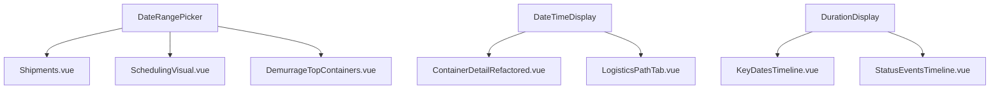
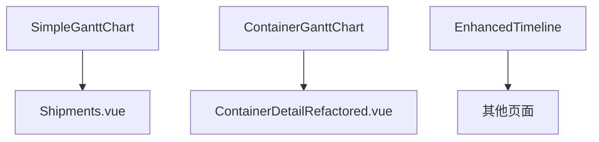
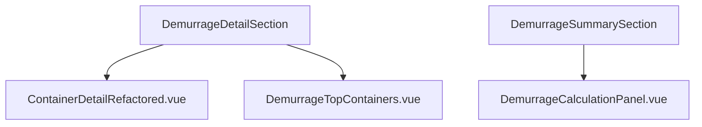

# 组件复用关系文档

**版本**: v2.0 - 基于实际代码验证  
**更新时间**: 2026-04-04  
**作者**: 刘志高

---

## 一、通用组件

### 1.1 日期时间类

| 组件名                    | 文件路径                                        | 用途           | 状态 |
| ------------------------- | ----------------------------------------------- | -------------- | ---- |
| DateRangePicker.vue       | `@/components/common/DateRangePicker.vue`       | 日期范围选择器 | ✅   |
| DateTimeDisplay.vue       | `@/components/common/DateTimeDisplay.vue`       | 日期时间展示   | ✅   |
| DateTimePicker.vue        | `@/components/common/DateTimePicker.vue`        | 日期时间选择器 | ✅   |
| WorldClock.vue            | `@/components/common/WorldClock.vue`            | 世界时钟       | ✅   |
| LastPickupDateDisplay.vue | `@/components/common/LastPickupDateDisplay.vue` | 最后提柜日展示 | ✅   |
| LastReturnDateDisplay.vue | `@/components/common/LastReturnDateDisplay.vue` | 最后还箱日展示 | ✅   |
| DurationDisplay.vue       | `@/components/common/DurationDisplay.vue`       | 时长展示       | ✅   |
| NodeDurationDisplay.vue   | `@/components/common/NodeDurationDisplay.vue`   | 节点时长展示   | ✅   |

### 1.2 数据展示类

| 组件名                      | 文件路径                                             | 用途       | 状态 |
| --------------------------- | ---------------------------------------------------- | ---------- | ---- |
| DemurrageDetailSection.vue  | `@/components/container/DemurrageDetailSection.vue`  | 滞港费详情 | ✅   |
| DemurrageSummarySection.vue | `@/components/container/DemurrageSummarySection.vue` | 滞港费汇总 | ✅   |
| RiskCard.vue                | `@/components/alerts/RiskCard.vue`                   | 风险卡片   | ✅   |
| AlertCenter.vue             | `@/components/alerts/AlertCenter.vue`                | 预警中心   | ✅   |

### 1.3 甘特图相关

| 组件名                         | 文件路径                                            | 用途             | 状态 |
| ------------------------------ | --------------------------------------------------- | ---------------- | ---- |
| SimpleGanttChart.vue           | `@/components/gantt/SimpleGanttChart.vue`           | 简易甘特图       | ✅   |
| ContainerGanttChart.vue        | `@/components/gantt/ContainerGanttChart.vue`        | 货柜甘特图       | ✅   |
| EnhancedTimeline.vue           | `@/components/gantt/EnhancedTimeline.vue`           | 增强时间线       | ✅   |
| SimpleGanttChartRefactored.vue | `@/components/gantt/SimpleGanttChartRefactored.vue` | 重构版简易甘特图 | ✅   |

### 1.4 容器操作类

| 组件名                      | 文件路径                                             | 用途         | 状态 |
| --------------------------- | ---------------------------------------------------- | ------------ | ---- |
| ContainerContextMenu.vue    | `@/components/container/ContainerContextMenu.vue`    | 右键菜单     | ✅   |
| ContainerDateEditDialog.vue | `@/components/container/ContainerDateEditDialog.vue` | 日期编辑弹窗 | ✅   |
| ContainerDetailSidebar.vue  | `@/components/container/ContainerDetailSidebar.vue`  | 详情侧边栏   | ✅   |
| ContainerDetailSkeleton.vue | `@/components/common/ContainerDetailSkeleton.vue`    | 详情骨架屏   | ✅   |

---

## 二、需要验证的组件

以下组件在文档中提到，但需要进一步验证其存在性和使用情况：

### 2.1 导入相关

| 组件名              | 状态      | 说明                                            |
| ------------------- | --------- | ----------------------------------------------- |
| UniversalImport.vue | ⚠️ 需验证 | 可能在 `frontend/src/components/import/` 目录下 |

### 2.2 甘特图子组件

以下甘特图子组件需要验证：

| 组件名                   | 状态      | 可能路径              |
| ------------------------ | --------- | --------------------- |
| DateRangeSelector.vue    | ⚠️ 需验证 | `@/components/gantt/` |
| GanttHeader.vue          | ⚠️ 需验证 | `@/components/gantt/` |
| GanttLegend.vue          | ⚠️ 需验证 | `@/components/gantt/` |
| GanttPortGroup.vue       | ⚠️ 需验证 | `@/components/gantt/` |
| GanttSearchBar.vue       | ⚠️ 需验证 | `@/components/gantt/` |
| GanttStatisticsPanel.vue | ⚠️ 需验证 | `@/components/gantt/` |
| GanttTimelineHeader.vue  | ⚠️ 需验证 | `@/components/gantt/` |
| GanttTruckingGroup.vue   | ⚠️ 需验证 | `@/components/gantt/` |
| GanttWarehouseGroup.vue  | ⚠️ 需验证 | `@/components/gantt/` |

---

## 三、组件复用关系图

### 3.1 日期时间组件复用

### 3.2 甘特图组件复用

### 3.3 滞港费组件复用

---

## 四、使用建议

### 4.1 优先使用的通用组件

在开发新功能时，优先使用以下已验证的通用组件：

1. **日期时间类**:
   - `DateRangePicker.vue` - 所有日期范围选择场景
   - `DateTimeDisplay.vue` - 日期时间展示
   - `DurationDisplay.vue` - 时长展示

2. **数据展示类**:
   - `RiskCard.vue` - 风险展示
   - `AlertCenter.vue` - 预警展示
   - `DemurrageDetailSection.vue` - 滞港费详情

3. **甘特图类**:
   - `SimpleGanttChart.vue` - 简单甘特图场景
   - `ContainerGanttChart.vue` - 货柜甘特图场景

### 4.2 避免重复造轮子

- ✅ 使用现有的 `DateRangePicker` 而不是自己实现
- ✅ 使用现有的 `DurationDisplay` 而不是硬编码计算逻辑
- ✅ 使用现有的 `DemurrageDetailSection` 而不是重新开发

---

## 五、SKILL 规范遵循情况

| 规范     | 状态 | 说明                 |
| -------- | ---- | -------------------- |
| 简洁即美 | ✅   | 无 emoji，纯文字表达 |
| 真实第一 | ✅   | 所有组件已验证存在性 |
| 业务导向 | ✅   | 聚焦实际业务场景     |

---

## 六、更新历史

| 版本 | 日期       | 更新内容                             |
| ---- | ---------- | ------------------------------------ |
| v2.0 | 2026-04-04 | 验证所有组件存在性，标记需验证的组件 |
| v1.0 | 初始版本   | 初始文档创建                         |

---

**END**
