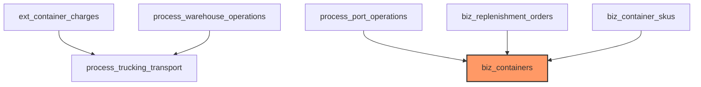

# 智能体测试与排错标准作业程序 (SOP)

## 一、核心原则

### 1.1 测试优先原则

**强制要求**:
- 任何代码修改前必须先理解现有测试
- 新增功能必须同步新增测试
- 修复 bug 必须先复现问题（写失败的测试）
- 禁止在无测试覆盖的情况下修改核心业务逻辑

### 1.2 排错方法论

**三层诊断法**:
1. **现象层**: What/When/Where/Who/Impact
2. **根因层**: 直接原因 -> 间接原因 -> 系统性原因
3. **解决层**: 临时方案 -> 永久修复 -> 预防措施

---

## 二、测试流程规范

### 2.1 开发前测试准备

#### 步骤 1: 理解现有测试覆盖

```bash
# 后端测试运行
cd backend
npm run test

# 前端单元测试
cd frontend  
npm run test:unit

# 前端 E2E 测试
npm run test:e2e
```

**检查清单**:
- [ ] 目标模块是否已有单元测试
- [ ] 测试覆盖率是否达标（核心逻辑≥80%）
- [ ] 是否有集成测试/E2E 测试
- [ ] 测试用例是否覆盖边界场景

#### 步骤 2: 确定测试策略

| 修改类型 | 测试要求 |
|---------|---------|
| Bug 修复 | 必须先写复现问题的失败测试 |
| 新功能 | 先写测试用例（TDD），再实现功能 |
| 重构 | 确保现有测试全部通过，必要时补充测试 |
| 性能优化 | 必须有性能基准测试和对比测试 |

### 2.2 测试编写规范

#### 后端测试（Jest）

**文件命名**: `*.test.ts` 或 `*.spec.ts`

**目录结构**:
```
backend/src/
├── services/
│   ├── ContainerService.ts
│   └── ContainerService.test.ts    # 同级放置
└── tests/
    └── integration/                # 集成测试
        └── scheduling/
            └── intelligent-scheduling.e2e.test.ts
```

**测试模板**:

```typescript
/**
 * [被测试模块] 单元测试
 */

import { Repository } from 'typeorm';
import { AppDataSource } from '../database';
import { [Entity] } from '../entities/[Entity]';
import { [ServiceName] } from './[ServiceName]';

// Mock 外部依赖
jest.mock('../database', () => ({
  AppDataSource: {
    getRepository: jest.fn()
  }
}));

describe('[ServiceName]', () => {
  let service: [ServiceName];
  let mockQueryBuilder: any;
  let mockRepo: Partial<Repository<[Entity]>>;

  beforeEach(() => {
    // 创建 Mock QueryBuilder
    mockQueryBuilder = {
      leftJoinAndSelect: jest.fn().mockReturnThis(),
      where: jest.fn().mockReturnThis(),
      andWhere: jest.fn().mockReturnThis(),
      getMany: jest.fn().mockResolvedValue([])
    };

    // 创建 Mock Repository
    mockRepo = {
      createQueryBuilder: jest.fn().mockReturnValue(mockQueryBuilder)
    };

    // 配置 Mock
    (AppDataSource.getRepository as jest.Mock).mockReturnValue(mockRepo);

    service = new [ServiceName]();
  });

  afterEach(() => {
    jest.clearAllMocks();
  });

  describe('[方法名]', () => {
    it('should [预期行为]', async () => {
      // Arrange
      const options = { /* 测试数据 */ };

      // Act
      const result = await service.[method](options);

      // Assert
      expect(result).toBeDefined();
      expect(Array.isArray(result)).toBe(true);
    });

    it('should handle edge case: [边界场景描述]', async () => {
      // Arrange
      const options = { /* 边界测试数据 */ };

      // Act & Assert
      await expect(service.[method](options))
        .resolves.toBeDefined();
    });
  });
});
```

**关键要点**:
- 使用 `beforeEach` 初始化 Mock 对象
- 使用 `afterEach` 清理 Mock
- 测试命名清晰：`should + 预期行为`
- 覆盖正常流程和边界场景
- Mock 所有外部依赖（数据库、API、文件系统）

#### 前端测试（Vitest + Vue Test Utils）

**组件测试模板**:

```typescript
import { mount } from '@vue/test-utils';
import { describe, it, expect, vi } from 'vitest';
import [ComponentName] from './[ComponentName].vue';

describe('[ComponentName]', () => {
  it('should render [关键信息]', () => {
    const wrapper = mount([ComponentName], {
      props: {
        // Props 数据
      },
      global: {
        mocks: {
          $t: (key: string) => key  // Mock i18n
        }
      }
    });

    expect(wrapper.text()).toContain('[预期文本]');
  });

  it('should emit [事件名] when [触发条件]', async () => {
    const wrapper = mount([ComponentName], {
      props: { /* ... */ }
    });

    await wrapper.find('.action-btn').trigger('click');
    expect(wrapper.emitted('[event]')).toBeTruthy();
  });
});
```

**Composable 测试模板**:

```typescript
import { describe, it, expect, vi } from 'vitest';
import { use[Name] } from './use[Name]';

vi.mock('@/services/[service]', () => ({
  default: {
    [method]: vi.fn().mockResolvedValue({ /* mock data */ })
  }
}));

describe('use[Name]', () => {
  it('should [预期行为]', async () => {
    const { [result], [method] } = use[Name]();
    await [method]();
    
    expect([result].value).toHaveLength(1);
  });
});
```

### 2.3 测试执行顺序

**优先级**:
```
1. 单元测试（最快，隔离最好）
   ↓
2. 集成测试（验证模块间协作）
   ↓
3. E2E 测试（最慢，最真实）
```

**执行策略**:
- 开发阶段：只运行相关单元测试
- 提交前：运行全部单元测试 + 关键集成测试
- CI/CD：运行完整测试套件

---

## 三、排错流程规范

### 3.1 问题接收与初步诊断

#### 第一步：信息收集（5W1H）

**检查清单**:
- [ ] **What**: 具体错误现象是什么
- [ ] **When**: 何时发生（首次出现时间、频率）
- [ ] **Where**: 在哪个环节/页面/接口出现
- [ ] **Who**: 哪些用户受影响
- [ ] **Why**: 可能的触发条件
- [ ] **How**: 如何复现（步骤）

**信息收集工具**:

```bash
# 查看后端日志
cd backend
tail -f logs/error.log

# 查看特定容器日志
grep "container_number" backend.log

# 数据库查询验证
psql -U postgres -d logix -c "SELECT * FROM biz_containers WHERE container_number = 'XXXXX';"
```

#### 第二步：问题分类

| 类型 | 特征 | 排查方向 |
|------|------|---------|
| 数据问题 | 数据缺失/错误/不一致 | 数据库表结构、导入逻辑、映射关系 |
| 逻辑问题 | 计算结果错误/状态不对 | 业务逻辑代码、算法实现 |
| 接口问题 | API 调用失败/返回格式错误 | 路由定义、参数校验、响应处理 |
| 前端问题 | 页面渲染错误/交互异常 | 组件逻辑、状态管理、网络请求 |
| 性能问题 | 响应慢/超时/内存泄漏 | SQL 查询、循环嵌套、缓存策略 |

### 3.2 根因分析方法

#### 方法一：五问法（5 Whys）

**示例**: 货柜状态显示错误

```
1. Why: 为什么状态显示错误？ 
   -> 因为物流状态字段值不正确
   
2. Why: 为什么字段值不正确？
   -> 因为状态更新逻辑有问题
   
3. Why: 为什么状态更新逻辑有问题？
   -> 因为状态机计算优先级错误
   
4. Why: 为什么状态机计算优先级错误？
   -> 因为还箱日算法未考虑卸柜能力检查
   
5. Why: 为什么会遗漏这个检查？
   -> 因为需求分析时未识别此边界场景
```

#### 方法二：二分法定位

**适用场景**: 大型系统、多模块协作问题

**步骤**:
1. 确定问题范围（前端/后端/数据库）
2. 在数据流中间点检查数据状态
3. 根据检查结果缩小范围
4. 重复步骤 2-3 直到定位根因

**工具**:
```javascript
// 调试脚本示例（scripts/debug-xxx.ts）
import { AppDataSource } from '../backend/src/database';
import { Container } from '../backend/src/entities/Container';

async function debugProblem() {
  await AppDataSource.initialize();
  const repo = AppDataSource.getRepository(Container);

  // 检查点 1: 数据库原始数据
  const containers = await repo.find({ where: { /* ... */ } });
  console.log('=== 数据库数据 ===', containers);

  // 检查点 2: 业务逻辑处理后
  const processed = applyBusinessLogic(containers);
  console.log('=== 处理后数据 ===', processed);

  // 检查点 3: API 返回数据
  const apiResponse = callAPI();
  console.log('=== API 返回 ===', apiResponse);

  await AppDataSource.destroy();
}
```

### 3.3 常见错误排查手册

#### 错误 1: 国家筛选失效

**症状**: 前端国家筛选下拉框无数据或筛选无效

**排查步骤**:

```bash
# 步骤 1: 检查国家列表 API
node scripts/diagnose-country-filter.js

# 步骤 2: 检查数据库表
psql -c "SELECT COUNT(*) FROM dict_countries;"

# 步骤 3: 检查后端日志
grep "countries" backend.log

# 步骤 4: 检查前端网络请求
# 打开浏览器 DevTools -> Network -> 过滤 /api/v1/countries
```

**修复流程**:
1. 确认数据库有国家数据
2. 确认后端 API 正常返回
3. 确认前端请求参数正确
4. 确认 Header 传递（X-Country-Code）

#### 错误 2: 统计 API 返回空数据

**症状**: 统计卡片显示 0 或 null

**排查步骤**:

```bash
# 步骤 1: 测试统计 API
node scripts/test-statistics-fix.js

# 步骤 2: 检查日期范围
# 确认顶部日期选择器有值

# 步骤 3: 检查 SQL 查询
# 查看 ContainerStatisticsService.buildQuery()

# 步骤 4: 检查数据存在性
psql -c "SELECT COUNT(*) FROM biz_containers WHERE actual_ship_date >= '2024-01-01';"
```

#### 错误 3: 还箱日计算错误

**症状**: 还箱日期与预期不符

**排查步骤**:

```bash
# 步骤 1: 分析日志
powershell -File scripts/analyze-return-date-logs.ps1

# 步骤 2: 检查 Drop off/Live load 模式
psql -c "SELECT container_number, loading_mode FROM process_sea_freight;"

# 步骤 3: 检查卸柜能力
psql -c "SELECT * FROM process_warehouse_operations WHERE container_number = 'XXX';"

# 步骤 4: 运行单元测试
npm run test -- return-date.test.ts
```

### 3.4 调试工具集

#### 后端调试脚本

**位置**: `backend/scripts/` 或 `scripts/`

**常用脚本**:
- `debug-lastpickup.ts`: 检查最晚提柜日期计算
- `diagnose-country-filter.js`: 诊断国家筛选问题
- `test-statistics-fix.js`: 测试统计 API
- `analyze-return-date-logs.ps1`: 分析还箱日日志

**使用方法**:
```bash
# TypeScript 脚本
npx tsx backend/scripts/debug-lastpickup.ts

# JavaScript 脚本
node scripts/diagnose-country-filter.js

# PowerShell 脚本
powershell -File scripts/analyze-return-date-logs.ps1
```

#### 前端调试工具

**浏览器 DevTools**:
- Console: 查看日志
- Network: 查看 API 请求
- Application: 查看 LocalStorage/SessionStorage
- Sources: 断点调试

**Vue DevTools**:
- Components: 查看组件树和状态
- Timeline: 查看事件流

#### 数据库调试

**常用查询**:
```sql
-- 检查表数据量
SELECT COUNT(*) FROM [table_name];

-- 检查关联关系
SELECT c.container_number, po.ata, sf.shipment_date
FROM biz_containers c
LEFT JOIN process_port_operations po ON c.container_number = po.container_number
LEFT JOIN process_sea_freight sf ON c.bill_of_lading_number = sf.bill_of_lading_number
WHERE c.container_number = 'XXXXX';

-- 检查字段值分布
SELECT logistics_status, COUNT(*) 
FROM biz_containers 
GROUP BY logistics_status;
```

---

## 四、自动化检查工具

### 4.1 开发范式检查

**工具**: `scripts/dev-paradigm-check.ts`

**使用方法**:
```bash
# 全阶段检查
npx ts-node --compilerOptions '{"module":"commonjs"}' scripts/dev-paradigm-check.ts

# 检查特定阶段
npx ts-node --compilerOptions '{"module":"commonjs"}' scripts/dev-paradigm-check.ts --phase testing

# 输出 Markdown 报告
npx ts-node --compilerOptions '{"module":"commonjs"}' scripts/dev-paradigm-check.ts --output markdown --output-file report.md
```

**检查阶段**:
- architecture: 架构分析
- problem: 问题诊断
- strategy: 策略选择
- review: 方案评审
- development: 开发实施
- testing: 测试验证
- retrospective: 复盘沉淀

### 4.2 SKILL 合规检查

**工具**: `backend/scripts/check-skill-compliance.js`

**检查项**:
- 单文件≤300 行
- 单方法≤50 行
- 参数≤4 个
- 嵌套≤3 层
- JSDoc 完整

**使用方法**:
```bash
cd backend
npm run skill:check
```

### 4.3 代码质量检查

**命令**:
```bash
# 后端
cd backend
npm run lint          # ESLint 检查
npm run type-check    # TypeScript 类型检查
npm run format        # Prettier 格式化

# 前端
cd frontend
npm run lint
npm run type-check
npm run validate
```

---

## 五、测试数据管理

### 5.1 测试数据创建

**原则**:
- 使用独立测试数据库
- 测试数据隔离（每个测试独立）
- 可重复创建（幂等性）

**SQL 脚本模板**:
```sql
-- 创建测试数据
INSERT INTO biz_containers (container_number, logistics_status, ...)
VALUES ('TEST001', 'initial', ...);

-- 清理测试数据
DELETE FROM biz_containers WHERE container_number LIKE 'TEST%';
```

### 5.2 测试数据清理

**依赖顺序**（重要）:



**清理脚本**:
```sql
-- 按顺序删除
DELETE FROM ext_container_charges WHERE container_number LIKE 'TEST%';
DELETE FROM process_trucking_transport WHERE container_number LIKE 'TEST%';
DELETE FROM process_warehouse_operations WHERE container_number LIKE 'TEST%';
DELETE FROM process_empty_return WHERE container_number LIKE 'TEST%';
DELETE FROM process_port_operations WHERE container_number LIKE 'TEST%';
DELETE FROM process_sea_freight WHERE bill_of_lading_number LIKE 'TEST%';
DELETE FROM biz_container_skus WHERE container_number LIKE 'TEST%';
DELETE FROM biz_replenishment_orders WHERE container_number LIKE 'TEST%';
DELETE FROM biz_containers WHERE container_number LIKE 'TEST%';
```

---

## 六、问题升级机制

### 6.1 严重级别定义

| 级别 | 定义 | 响应时间 |
|------|------|---------|
| P0 | 系统崩溃/数据丢失 | 立即 |
| P1 | 核心功能不可用 | 1 小时 |
| P2 | 部分功能受限 | 4 小时 |
| P3 | 轻微问题/体验优化 | 24 小时 |

### 6.2 升级流程

```
智能体自主排查 (15 分钟)
  ↓ 未解决
人工协助 (提供详细诊断报告)
  ↓ 30 分钟未解决
团队会诊（召集相关人员）
  ↓
事后复盘（更新知识库）
```

### 6.3 会诊准备材料

- [ ] 问题现象详细描述
- [ ] 已尝试的排查步骤
- [ ] 相关日志片段
- [ ] 数据库查询结果
- [ ] 影响范围评估

---

## 七、知识沉淀

### 7.1 问题记录模板

```markdown
# [问题标题]

## 现象描述
- What: 
- When: 
- Where: 
- Impact: 

## 根因分析
- 直接原因: 
- 间接原因: 
- 系统性原因: 

## 解决方案
- 临时方案: 
- 永久修复: 
- 预防措施: 

## 参考资料
- 相关文档: 
- 类似问题: 
```

### 7.2 知识库更新

**位置**: `frontend/public/docs/第 2 层 - 综合指南/`

**触发条件**:
- 解决新问题后
- 发现现有文档错误
- 优化工作流程后

---

## 八、最佳实践总结

### 8.1 测试最佳实践

1. **测试先行**: 先写测试，再写实现
2. **小步快跑**: 每次只改一点，测试一次
3. **Mock 一切**: 外部依赖全部 Mock
4. **覆盖边界**: 正常流程 + 边界场景 + 异常处理
5. **持续集成**: 自动化运行测试

### 8.2 排错最佳实践

1. **从简到繁**: 先检查简单原因（配置、网络）
2. **数据驱动**: 基于日志和数据库证据
3. **控制变量**: 一次只改变一个因素
4. **记录过程**: 详细记录排查步骤
5. **沉淀知识**: 解决问题后更新文档

### 8.3 工具使用最佳实践

1. **自动化优先**: 能自动化的绝不手动
2. **脚本化**: 复杂操作写成脚本
3. **版本控制**: 脚本纳入 Git 管理
4. **持续改进**: 优化工具和流程

---

## 附录 A: 快速参考卡

### 测试命令速查

```bash
# 后端单元测试
cd backend && npm run test

# 前端单元测试
cd frontend && npm run test:unit

# 前端 E2E 测试
cd frontend && npm run test:e2e

# 代码质量检查
npm run lint && npm run type-check

# SKILL 合规检查
cd backend && npm run skill:check
```

### 调试脚本速查

```bash
# 国家筛选诊断
node scripts/diagnose-country-filter.js

# 统计 API 测试
node scripts/test-statistics-fix.js

# 还箱日日志分析
powershell -File scripts/analyze-return-date-logs.ps1

# 最晚提柜检查
npx tsx backend/debug-lastpickup.ts
```

### 数据库查询速查

```sql
-- 检查数据量
SELECT COUNT(*) FROM [table];

-- 检查状态分布
SELECT status, COUNT(*) FROM [table] GROUP BY status;

-- 检查关联数据
SELECT * FROM [table1] t1
JOIN [table2] t2 ON t1.id = t2.foreign_id
WHERE t1.id = 'XXX';
```

---

**版本**: v1.0  
**创建时间**: 2026-03-31  
**最后更新**: 2026-03-31  
**作者**: 刘志高  
**状态**: 强制执行
