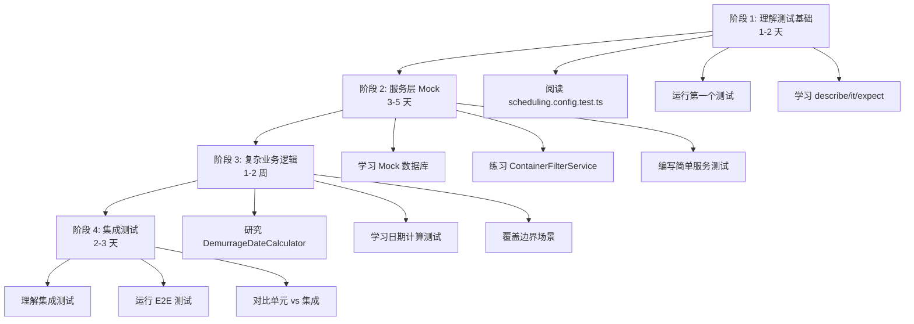
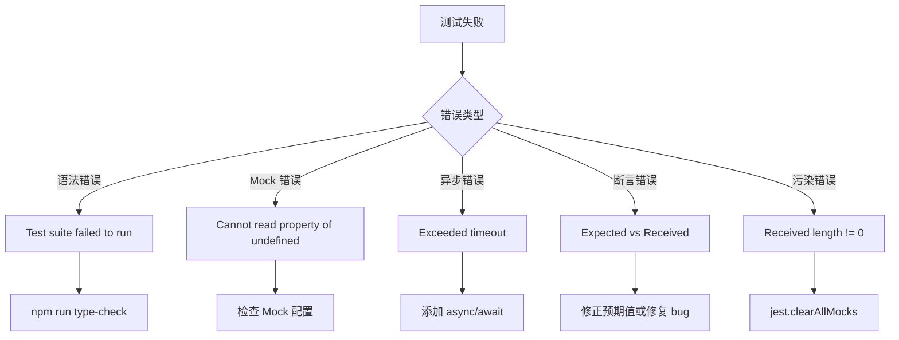

# 测试入门常见问题解答

## Q1: npm run test 运行的前提是什么？

### 必要条件清单

#### 1. Node.js 环境

```bash
# ✅ 检查 Node.js 版本（必须 >= 18.0.0）
node --version
# 输出示例：v18.16.0

# ✅ 检查 npm 版本
npm --version
# 输出示例：9.5.1
```

**如果不满足**:
- 下载地址：https://nodejs.org/
- 推荐使用 nvm 管理 Node 版本

#### 2. 依赖已安装

```bash
# ✅ 进入后端目录
cd backend

# ✅ 安装依赖
npm install

# ✅ 验证 node_modules 存在
ls node_modules | head -10
```

**常见错误**:
```
❌ Error: Cannot find module 'jest'
✅ 解决：npm install
```

#### 3. TypeScript 配置正确

```bash
# ✅ 运行类型检查
npm run type-check

# ✅ 如果有错误，先修复
# 编辑器中会显示红色波浪线
```

**常见错误**:
```
❌ error TS2551: Property 'xxx' does not exist on type 'yyy'
✅ 解决：修复 TypeScript 类型错误
```

#### 4. 环境变量配置（可选）

**单元测试不需要真实数据库**（因为使用了 Mock）

但建议创建 `.env` 文件:
```bash
cd backend
cp .env.example .env
```

**最小配置**:
```env
NODE_ENV=test
DB_HOST=localhost
DB_PORT=5432
DB_USERNAME=postgres
DB_PASSWORD=postgres
DB_DATABASE=logix_test
```

#### 5. Jest 配置文件存在

确认 `backend/jest.config.js` 存在:
```javascript
module.exports = {
  preset: 'ts-jest',
  testEnvironment: 'node',
  setupFilesAfterEnv: ['<rootDir>/src/test/setup.ts'],
  // ...
};
```

---

## Q2: 当前项目的测试模块有哪些？

### 测试文件分布

```
backend/
├── src/
│   ├── config/
│   │   └── scheduling.config.test.ts              # 配置测试
│   │
│   ├── services/                                   # 服务层测试（核心）
│   │   ├── ContainerFilterService.test.ts
│   │   ├── CostEstimationService.test.ts
│   │   ├── CustomsBrokerSelectionService.test.ts
│   │   ├── DemurrageDateCalculator.test.ts        # ⭐ 完整示例（286 行）
│   │   ├── DemurrageFeeCalculator.test.ts
│   │   ├── OccupancyCalculator.test.ts
│   │   ├── SchedulingSorter.test.ts
│   │   ├── TruckingSelectorService.test.ts
│   │   ├── WarehouseSelectorService.test.ts
│   │   ├── intelligentScheduling.service.test.ts
│   │   └── ... (共 18 个测试文件)
│   │
│   ├── tests/                                      # 专项测试
│   │   ├── cost-optimizer-calculation.test.ts
│   │   ├── cost-optimizer-category.test.ts
│   │   ├── cost-optimizer-date-constraints.test.ts
│   │   └── ...
│   │
│   └── test/
│       └── setup.ts                                # 全局测试配置
│
└── tests/
    └── integration/
        └── scheduling/
            └── intelligent-scheduling.e2e.test.ts  # E2E 集成测试
```

### 测试类型分类

| 类型 | 数量 | 位置 | 说明 |
|------|------|------|------|
| 单元测试 | 24 | `src/services/*.test.ts` | 服务层逻辑测试 |
| 专项测试 | 3 | `src/tests/` | 成本优化等专项功能 |
| 集成测试 | 1 | `tests/integration/` | 端到端流程测试 |
| 配置测试 | 1 | `src/config/` | 配置项测试 |

---

## Q3: 如何由浅入深学习测试编写？

### 学习路径图



### 详细学习步骤

#### 第 1 步：最简单的测试（1 小时）

**文件**: `backend/src/config/scheduling.config.test.ts`

```typescript
import { SchedulingConfig } from './scheduling.config';

describe('SchedulingConfig', () => {
  it('should have correct default values', () => {
    const config = new SchedulingConfig();
    expect(config.maxAttempts).toBeDefined();
    expect(config.timeout).toBeGreaterThan(0);
  });
});
```

**学习任务**:
1. 读懂每个关键字的作用
2. 运行这个测试
3. 修改预期值观察失败

#### 第 2 步：学习 Mock（2-3 小时）

**文件**: `backend/src/services/ContainerFilterService.test.ts`

关键Mock配置:
```typescript
// Mock 数据库
jest.mock('../database', () => ({
  AppDataSource: {
    getRepository: jest.fn()
  }
}));

// 创建 Mock QueryBuilder
mockQueryBuilder = {
  leftJoinAndSelect: jest.fn().mockReturnThis(),
  where: jest.fn().mockReturnThis(),
  getMany: jest.fn().mockResolvedValue([])
};
```

**学习任务**:
1. 理解为什么需要 Mock
2. 练习配置不同的 Mock 返回值
3. 验证 Mock 调用参数

#### 第 3 步：复杂业务逻辑（3-5 天）

**文件**: `backend/src/services/DemurrageDateCalculator.test.ts`

这是最好的学习材料，包含：
- 日期计算测试（addDays, daysBetween）
- 周末识别测试（isWeekend）
- 工作日计算测试（addWorkingDays）
- 边界场景覆盖

**示例**:
```typescript
it('应该跳过周末添加工作日', () => {
  // 从周一开始添加 5 个工作日
  const monday = new Date('2026-03-09');
  const result = calculator.addWorkingDays(monday, 5);
  
  // Mon(1), Tue(2), Wed(3), Thu(4), Fri(5) -> 2026-03-13
  expect(result.toISOString()).toBe('2026-03-13T00:00:00.000Z');
});
```

**学习任务**:
1. 逐行阅读 286 行测试代码
2. 理解每个测试用例的设计思路
3. 尝试添加新的测试用例

#### 第 4 步：实战练习（2-3 天）

**任务**: 为 `CostEstimationService` 编写完整测试

```typescript
import { CostEstimationService } from './CostEstimationService';

jest.mock('../database', () => ({
  AppDataSource: {
    getRepository: jest.fn()
  }
}));

describe('CostEstimationService', () => {
  let service: CostEstimationService;

  beforeEach(() => {
    service = new CostEstimationService();
  });

  describe('calculateTotal', () => {
    it('should sum all costs', async () => {
      const costs = [
        { amount: 100, type: 'freight' },
        { amount: 50, type: 'handling' }
      ];
      
      const total = await service.calculateTotal(costs);
      expect(total).toBe(150);
    });

    it('should handle empty list', async () => {
      const total = await service.calculateTotal([]);
      expect(total).toBe(0);
    });

    it('should handle negative costs', async () => {
      const costs = [{ amount: -10, type: 'discount' }];
      const total = await service.calculateTotal(costs);
      expect(total).toBe(-10);
    });
  });
});
```

---

## Q4: 如何识别和调试测试错误？

### 错误识别流程图



### 6 种常见错误及解决方法

#### 错误 1: 语法错误

**症状**:
```bash
FAIL  src/services/MyService.test.ts
  ● Test suite failed to run

    SyntaxError: Unexpected token (10:4)
```

**诊断步骤**:
```bash
# 1. 运行类型检查
npm run type-check

# 2. 查看具体错误
# 编辑器显示红色波浪线

# 3. 常见原因
# - 缺少分号
# - 括号不匹配
# - import 路径错误
```

**修复示例**:
```typescript
// ❌ 错误
import { Service } from '../Service'  // 缺少分号

const result = service.doSomething(  // 缺少右括号

// ✅ 正确
import { Service } from '../Service';

const result = service.doSomething();
```

#### 错误 2: Mock 配置错误

**症状**:
```bash
TypeError: Cannot read property 'findOne' of undefined

  15 |   const container = await this.containerRepository.findOne({
  16 |     where: { id }
> 17 |   });
     |                    ^
```

**诊断**:
```typescript
// ❌ 错误：Mock 对象为空
const mockRepo = {};

// ✅ 正确：配置所有必要方法
const mockRepo = {
  findOne: jest.fn().mockResolvedValue({ id: 1 }),
  find: jest.fn().mockResolvedValue([]),
  save: jest.fn().mockResolvedValue({}),
  createQueryBuilder: jest.fn().mockReturnValue({
    where: jest.fn().mockReturnThis(),
    getOne: jest.fn().mockResolvedValue(null)
  })
};
```

#### 错误 3: 异步超时

**症状**:
```bash
thrown: "Exceeded timeout of 5000 ms for a test."
```

**诊断**:
```typescript
// ❌ 错误：缺少 await
it('should fetch data', () => {
  service.fetchData();  // Promise 未等待
});

// ✅ 正确：使用 async/await
it('should fetch data', async () => {
  const data = await service.fetchData();
  expect(data).toBeDefined();
});

// 增加超时时间
it('long running test', async () => {
  jest.setTimeout(30000);
  const data = await service.fetchLargeDataset();
  expect(data.length).toBeGreaterThan(1000);
});
```

#### 错误 4: 断言失败

**症状**:
```bash
expect(received).toBe(expected)

Expected: 5
Received: 4

  10 |     const result = calculator.add(2, 2);
> 11 |     expect(result).toBe(5);
     |                    ^
```

**诊断步骤**:
```typescript
// 1. 添加调试输出
console.log('Result:', result);
console.log('Expected: 5');

// 2. 判断是测试错误还是代码错误
if (result === 4) {
  // 代码正确，测试断言错误
  expect(result).toBe(4);  // 修正断言
} else {
  // 代码有 bug
  throw new Error('Calculator bug!');
}
```

#### 错误 5: 测试污染

**症状**:
```bash
FAIL  Service2.test.ts
  ● Service2 › should work

    Expected length: 0
    Received length: 3
```

**原因**: Service1 的测试修改了全局状态

**解决**:
```typescript
// 在 setup.ts 中自动清理
beforeEach(() => {
  jest.clearAllMocks();
});

afterEach(() => {
  jest.resetAllMocks();
});
```

#### 错误 6: 环境变量缺失

**症状**:
```bash
Error: Missing required environment variable: API_KEY
```

**解决**:
```typescript
// 在测试开头设置
process.env.API_KEY = 'test-key';

// 或在 setup.ts 统一配置
// backend/src/test/setup.ts
process.env.NODE_ENV = 'test';
process.env.API_KEY = 'test-key';
// ...
```

---

## 调试工具箱

### 工具 1: console.log

```typescript
it('debug test', () => {
  const input = { a: 1, b: 2 };
  const result = service.calculate(input);
  
  console.log('=== DEBUG INFO ===');
  console.log('Input:', input);
  console.log('Result:', result);
  console.log('Expected: 3');
  console.log('==================');
  
  expect(result).toBe(3);
});
```

### 工具 2: VS Code 断点调试

**launch.json 配置**:
```json
{
  "name": "Jest Current Test",
  "type": "node",
  "request": "launch",
  "program": "${workspaceFolder}/backend/node_modules/jest/bin/jest.js",
  "args": ["--runInBand", "${relativeFile}"],
  "cwd": "${workspaceFolder}/backend"
}
```

**使用方法**:
1. 在测试文件中打断点
2. 按 F5 启动调试
3. 查看变量值

### 工具 3: 隔离失败测试

```bash
# 只运行失败的测试
npm run test -- --bail

# 运行特定文件
npm run test -- MyService.test.ts

# 运行特定用例
npm run test -- -t "should calculate correctly"

# 增加超时
npm run test -- --testTimeout=10000
```

### 工具 4: 覆盖率分析

```bash
# 生成覆盖率报告
npm run test -- --coverage

# 查看 HTML 报告
open coverage/index.html

# 找出未覆盖的代码行
# 红色：未执行
# 绿色：已执行
# 黄色：部分执行
```

---

## 快速参考表

### 测试命令速查

| 命令 | 用途 |
|------|------|
| `npm run test` | 运行所有测试 |
| `npm run test -- filename.test.ts` | 运行单个文件 |
| `npm run test -- -t "用例名"` | 运行特定用例 |
| `npm run test -- --coverage` | 生成覆盖率报告 |
| `npm run test -- --bail` | 遇到失败立即停止 |
| `npm run test -- --verbose` | 显示详细输出 |
| `npm run type-check` | TypeScript 类型检查 |

### 常见断言方法

| 断言 | 用途 | 示例 |
|------|------|------|
| `toBeDefined()` | 检查已定义 | `expect(result).toBeDefined()` |
| `toBe()` | 严格相等 | `expect(2+2).toBe(4)` |
| `toEqual()` | 对象相等 | `expect(obj).toEqual({a:1})` |
| `toBeTruthy()` | 真值 | `expect(value).toBeTruthy()` |
| `toBeFalsy()` | 假值 | `expect(null).toBeFalsy()` |
| `toBeGreaterThan()` | 大于 | `expect(5).toBeGreaterThan(3)` |
| `toHaveLength()` | 数组长度 | `expect(arr).toHaveLength(3)` |
| `toContain()` | 包含元素 | `expect(arr).toContain(1)` |
| `toThrow()` | 抛出异常 | `expect(fn).toThrow()` |

### Mock 方法

| 方法 | 用途 | 示例 |
|------|------|------|
| `jest.fn()` | 创建 Mock 函数 | `const mockFn = jest.fn()` |
| `mockResolvedValue()` | Mock 异步返回 | `mockFn.mockResolvedValue({data})` |
| `mockReturnValue()` | Mock 同步返回 | `mockFn.mockReturnValue(42)` |
| `mockRejectedValue()` | Mock 抛出错误 | `mockFn.mockRejectedValue(new Error())` |
| `mockImplementation()` | 自定义实现 | `mockFn.mockImplementation(x => x*2)` |
| `mockReturnThis()` | 链式调用 | `builder.where().andWhere()` |

---

## 推荐学习顺序

### 第 1 周：基础入门

```
Day 1: 阅读本文档 + 运行示例测试
Day 2: 学习 scheduling.config.test.ts
Day 3: 学习 ContainerFilterService.test.ts
Day 4: 练习编写简单 Mock
Day 5: 复习 + 答疑
```

### 第 2 周：进阶提升

```
Day 1-3: 精读 DemurrageDateCalculator.test.ts
Day 4: 为 CostEstimationService 编写测试
Day 5: 学习边界场景处理
```

### 第 3 周：实战演练

```
Day 1-2: 为新服务编写完整测试
Day 3: 学习集成测试
Day 4: 运行全部测试并分析覆盖率
Day 5: 总结 + 分享
```

---

**版本**: v1.0  
**创建时间**: 2026-03-31  
**适用人群**: 测试新手、新入职开发者、AI 助手
