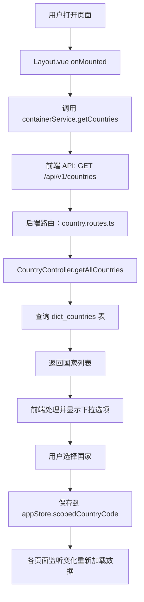

# 全局国家过滤条件获取流程详解

**创建日期**: 2026-03-21  
**最后更新**: 2026-03-21  

---

## 📋 概述

系统顶部导航栏提供了一个**全局国家选择器**，用户选择后会过滤所有相关数据只显示该国家的数据。

---

## 🎯 完整数据流



---

## 📊 详细实现步骤

### 步骤 1: 前端加载国家列表

**文件**: `frontend/src/components/layout/Layout.vue`

```typescript
// 第 46-77 行
const countryOptions = ref<Array<{ value: string; label: string }>>([])

onMounted(async () => {
  try {
    console.log('[国家筛选] 开始加载国家列表...')
    
    // 调用容器服务的 getCountries 方法
    const res = await containerService.getCountries()
    console.log('[国家筛选] API 响应:', res)
    
    if (res?.success && Array.isArray(res.data)) {
      console.log('[国家筛选] 成功获取国家数据，数量:', res.data.length)
      
      // 映射为国家选项
      const fromApi = res.data.map((c: { code: string; nameCn: string; nameEn: string }) => ({
        value: c.code,
        label: c.nameCn || c.nameEn || c.code
      }))
      
      countryOptions.value = [
        { value: '', label: t('common.allCountries') || '全部国家' },
        ...fromApi
      ]
      
      // GB 别名 UK，后端会规范化 UK->GB
      if (fromApi.some((o: { value: string }) => o.value === 'GB')) {
        countryOptions.value.push({ value: 'UK', label: '英国 (UK)' })
      }
      
      console.log('[国家筛选] 国家选项设置完成，总数:', countryOptions.value.length)
    } else {
      console.error('[国家筛选] API 返回数据格式不正确:', res)
      countryOptions.value = [{ value: '', label: t('common.allCountries') || '全部国家' }]
    }
  } catch (error) {
    console.error('[国家筛选] 加载国家列表失败:', error)
    countryOptions.value = [{ value: '', label: t('common.allCountries') || '全部国家' }]
  }
})
```

**关键点**:
- ✅ 在组件挂载时自动加载
- ✅ 支持国际化（中文优先，英文备选）
- ✅ 添加"全部国家"选项
- ✅ 特殊处理 UK/GB 别名

---

### 步骤 2: 前端服务层

**文件**: `frontend/src/services/container.ts`

```typescript
// 第 356-359 行
/**
 * 获取国别字典列表（用于全局国家选择器等）
 * Get country list from dict_countries
 */
async getCountries(): Promise<{ 
  success: boolean; 
  data: Array<{ code: string; nameCn: string; nameEn: string }> 
}> {
  const response = await this.api.get('/countries');
  return response.data;
}
```

**关键点**:
- ✅ 使用封装的 API 客户端
- ✅ 返回强类型定义
- ✅ 自动处理 baseURL 和认证

---

### 步骤 3: 后端路由

**文件**: `backend/src/routes/country.routes.ts`

```typescript
// 第 1-27 行
import { Router } from 'express';
import { CountryController } from '../controllers/country.controller';

const router = Router();
const countryController = new CountryController();

// 获取所有国家
router.get('/', countryController.getAllCountries);

// 根据代码获取国家
router.get('/:code', countryController.getCountryByCode);

// 创建国家
router.post('/', countryController.createCountry);

// 更新国家
router.put('/:code', countryController.updateCountry);

// 删除国家
router.delete('/:code', countryController.deleteCountry);

export default router;
```

**关键点**:
- ✅ RESTful 路由设计
- ✅ 支持 CRUD 操作
- ✅ 控制器注入

---

### 步骤 4: 后端控制器

**文件**: `backend/src/controllers/country.controller.ts`

```typescript
// 第 23-43 行
/**
 * 获取所有国家列表
 * Get all countries
 */
getAllCountries = async (req: Request, res: Response): Promise<void> => {
  try {
    // 查询启用的国家，按排序和代码升序
    const countries = await this.countryRepository.find({
      order: { sortOrder: 'ASC', code: 'ASC' },
      where: { isActive: true }
    });

    res.json({
      success: true,
      data: countries
    });

    logger.info(`Retrieved ${countries.length} countries`);
  } catch (error) {
    logger.error('Failed to get countries', error);
    res.status(500).json({
      success: false,
      message: '获取国家列表失败'
    });
  }
};
```

**关键点**:
- ✅ 只返回启用的国家 (`isActive: true`)
- ✅ 按排序号和代码升序排列
- ✅ 统一的响应格式
- ✅ 完整的错误处理和日志

---

### 步骤 5: 数据库实体

**文件**: `backend/src/entities/Country.ts`

```typescript
@Entity('dict_countries')
export class Country {
  @PrimaryColumn({ type: 'varchar', length: 10, name: 'code' })
  code!: string; // ISO 国家代码 (US, CA, GB, CN 等)

  @Column({ type: 'varchar', length: 50, name: 'name_cn' })
  nameCn!: string; // 中文名称 (美国，加拿大，英国，中国)

  @Column({ type: 'varchar', length: 50, name: 'name_en' })
  nameEn!: string; // 英文名称 (United States, Canada, United Kingdom, China)

  @Column({ type: 'varchar', length: 10, nullable: true, name: 'region' })
  region!: string; // 区域 (NA-北美，EU-欧洲，ASIA-亚洲等)

  @Column({ type: 'varchar', length: 20, nullable: true, name: 'continent' })
  continent!: string; // 洲 (Asia, Europe, North America 等)

  @Column({ type: 'varchar', length: 10, nullable: true, name: 'currency' })
  currency!: string; // 货币代码 (USD, CAD, GBP, CNY 等)

  @Column({ type: 'varchar', length: 20, nullable: true, name: 'phone_code' })
  phoneCode!: string; // 电话区号 (+1, +44, +86 等)

  @Column({ type: 'int', default: 0, name: 'sort_order' })
  sortOrder!: number; // 排序

  @Column({ type: 'boolean', default: true, name: 'is_active' })
  isActive!: boolean; // 是否启用

  @CreateDateColumn({ name: 'created_at' })
  createdAt!: Date;

  @UpdateDateColumn({ name: 'updated_at' })
  updatedAt!: Date;
}
```

**关键点**:
- ✅ 使用 ISO 国家代码作为主键
- ✅ 支持中英文双语
- ✅ 包含丰富的附加信息（货币、电话区号等）
- ✅ 支持启用/禁用状态

---

### 步骤 6: 数据存储与初始化

**文件**: `backend/scripts/seed-dictionaries.ts`

```typescript
// 第 38-60 行
console.log('🌍 Seeding countries...');
const countries = [
  { 
    code: 'US', 
    nameCn: '美国', 
    nameEn: 'United States', 
    region: 'NA', 
    continent: 'North America', 
    currency: 'USD', 
    phoneCode: '+1', 
    sortOrder: 1 
  },
  { 
    code: 'CA', 
    nameCn: '加拿大', 
    nameEn: 'Canada', 
    region: 'NA', 
    continent: 'North America', 
    currency: 'CAD', 
    phoneCode: '+1', 
    sortOrder: 2 
  },
  { 
    code: 'GB', 
    nameCn: '英国', 
    nameEn: 'United Kingdom', 
    region: 'EU', 
    continent: 'Europe', 
    currency: 'GBP', 
    phoneCode: '+44', 
    sortOrder: 3 
  },
  { 
    code: 'FR', 
    nameCn: '法国', 
    nameEn: 'France', 
    region: 'EU', 
    continent: 'Europe', 
    currency: 'EUR', 
    phoneCode: '+33', 
    sortOrder: 4 
  },
  { 
    code: 'DE', 
    nameCn: '德国', 
    nameEn: 'Germany', 
    region: 'EU', 
    continent: 'Europe', 
    currency: 'EUR', 
    phoneCode: '+49', 
    sortOrder: 5 
  },
  // ... 更多国家
];
```

**关键点**:
- ✅ 预置常用国家数据
- ✅ 包含完整的元数据
- ✅ 按业务重要性排序

---

## 🔧 国家过滤的应用

### 应用 1: 货柜列表过滤

**文件**: `backend/src/services/statistics/common/DateFilterBuilder.ts`

```typescript
// 第 45-50 行
const rawCountry =
  (params.countryCode !== undefined && params.countryCode !== null
    ? String(params.countryCode).trim()
    : getScopedCountryCode()) || '';
const code = normalizeCountryCode(rawCountry);
const hasCountry = !!code;
```

**工作原理**:
1. 从参数或全局 Store 获取国家代码
2. 规范化国家代码（如 UK → GB）
3. 如果有国家代码，添加 EXISTS 子查询过滤

---

### 应用 2: 智能排产过滤

**文件**: `frontend/src/views/scheduling/SchedulingVisual.vue`

```typescript
// 第 1527-1531 行
appStore.$subscribe((mutation, state) => {
  if (mutation.type === 'setScopedCountryCode') {
    watchCountryChange()
  }
})
```

**工作原理**:
1. 订阅 AppStore 的变化
2. 当 `scopedCountryCode` 改变时触发
3. 重新加载占用数据、场地信息等

---

### 应用 3: 仓库 - 车队映射过滤

**文件**: `frontend/src/views/system/WarehouseTruckingMapping.vue`

```typescript
// 第 534-543 行
<el-form-item label="国家" required>
  <el-select v-model="formData.country" placeholder="请选择" style="width: 100%" filterable>
    <el-option
      v-for="item in countryOptions"
      :key="item.code"
      :label="item.name"
      :value="item.code"
    />
  </el-select>
</el-form-item>
```

**工作原理**:
1. 使用相同的 `countryOptions` 数据源
2. 在新增/编辑时选择国家
3. 根据国家过滤仓库和车队选项

---

## 📖 关键配置说明

### 1. 国家代码规范化

**问题**: UK 和 GB 表示同一个国家

**解决方案**:
```typescript
// Layout.vue 第 64-67 行
// GB 别名 UK，后端会规范化 UK->GB
if (fromApi.some((o: { value: string }) => o.value === 'GB')) {
  countryOptions.value.push({ value: 'UK', label: '英国 (UK)' })
}
```

**后端规范化**:
```typescript
function normalizeCountryCode(code: string): string {
  if (code.toUpperCase() === 'UK') return 'GB';
  return code;
}
```

---

### 2. 空值处理

**默认行为**: 未选择时显示"全部国家"

```typescript
// Layout.vue 第 61 行
{ value: '', label: t('common.allCountries') || '全部国家' }
```

**存储逻辑**:
```typescript
// Layout.vue 第 79-82 行
const scopedCountryValue = computed({
  get: () => appStore.scopedCountryCode ?? '',
  set: (v: string) => appStore.setScopedCountryCode(v || null)
})
```

---

### 3. 缓存机制

**LocalStorage 持久化**:
```typescript
// AppStore 中保存
setScopedCountryCode(code: string | null) {
  this.scopedCountryCode = code;
  localStorage.setItem('scopedCountryCode', code || '');
}
```

**页面刷新后恢复**:
```typescript
// 初始化时从 localStorage 读取
const saved = localStorage.getItem('scopedCountryCode');
if (saved) {
  this.scopedCountryCode = saved;
}
```

---

## 🐛 常见问题诊断

### 问题 1: 国家列表为空

**可能原因**:
1. `dict_countries` 表数据为空
2. API 调用失败
3. 网络问题

**诊断步骤**:
```bash
# 1. 检查数据库
psql -c "SELECT COUNT(*) FROM dict_countries WHERE is_active = true;"

# 2. 测试 API
curl http://localhost:3001/api/v1/countries

# 3. 查看浏览器控制台
# 打开 DevTools > Console > 查看 [国家筛选] 相关日志
```

**解决方案**:
```sql
-- 执行初始化脚本
\i backend/02_init_dict_tables_final.sql
```

---

### 问题 2: 选择国家后数据无变化

**可能原因**:
1. 数据表缺少 `country` 字段
2. 查询未添加国家过滤条件
3. 数据中的 `country` 值不规范

**诊断步骤**:
```bash
# 运行诊断脚本
node backend/scripts/check-country-tables.ts
```

**检查清单**:
- [ ] 确认相关表包含 `country` 字段
- [ ] 确认 `country` 值在 `dict_countries` 中存在
- [ ] 确认查询使用了 `DateFilterBuilder.addCountryFilters()`

---

### 问题 3: UK/GB 识别问题

**现象**: 选择"英国 (UK)"后无法过滤数据

**原因**: 数据库中存的是 `GB`，但选择器值是`UK`

**解决方案**:
```typescript
// 确保后端规范化
function normalizeCountryCode(code: string): string {
  return code.toUpperCase() === 'UK' ? 'GB' : code;
}
```

---

## 📊 性能优化建议

### 1. 减少重复请求

**现状**: 每个页面都调用 `getCountries()`

**优化**: 
- ✅ 改为在 App 初始化时加载一次
- ✅ 保存到全局 Store
- ✅ 其他页面直接使用

---

### 2. 缓存策略

**建议**:
```typescript
// 使用 Vue Query 或 SWR 等库
const { data: countries } = useQuery(['countries'], () => 
  containerService.getCountries(),
  {
    staleTime: 1000 * 60 * 60, // 1 小时过期
    cacheTime: 1000 * 60 * 60 * 24 // 缓存 24 小时
  }
);
```

---

### 3. 懒加载

**场景**: 只在需要时加载

```typescript
// 不在 onMounted 时立即加载
// 改为首次打开下拉框时加载
const loadCountriesOnce = async () => {
  if (countryOptions.value.length === 0) {
    const res = await containerService.getCountries();
    // ... 处理
  }
};
```

---

## ✅ 最佳实践总结

### 前端

1. ✅ **统一数据源**: 所有国家选项来自同一 API
2. ✅ **错误处理**: 捕获异常并提供降级方案
3. ✅ **国际化**: 支持中英文双语
4. ✅ **用户体验**: 提供"全部国家"选项
5. ✅ **状态持久化**: 使用 localStorage 保存选择

### 后端

1. ✅ **RESTful 设计**: 遵循标准 HTTP 方法
2. ✅ **数据验证**: 确保国家代码规范
3. ✅ **日志记录**: 完整的操作日志
4. ✅ **错误处理**: 统一的错误响应格式
5. ✅ **性能优化**: 只返回启用的数据

### 数据库

1. ✅ **数据完整性**: 使用 ISO 标准代码
2. ✅ **扩展性**: 预留丰富元数据字段
3. ✅ **可维护性**: 支持启用/禁用状态
4. ✅ **一致性**: 统一使用两位字母代码

---

## 🔗 相关文件索引

### 前端文件
- `frontend/src/components/layout/Layout.vue` - 国家选择器 UI
- `frontend/src/services/container.ts` - API 服务层
- `frontend/src/stores/app.ts` - 全局状态管理

### 后端文件
- `backend/src/routes/country.routes.ts` - 路由定义
- `backend/src/controllers/country.controller.ts` - 控制器
- `backend/src/entities/Country.ts` - 实体定义
- `backend/src/services/statistics/common/DateFilterBuilder.ts` - 过滤逻辑

### 数据文件
- `backend/scripts/seed-dictionaries.ts` - 数据初始化
- `backend/02_init_dict_tables_final.sql` - SQL 脚本

### 测试文件
- `scripts/diagnose-country-filter.js` - 诊断脚本
- `test-country-api.html` - API 测试页面

---

**文档状态**: ✅ 已完成  
**适用版本**: v1.0+  
**最后更新**: 2026-03-21  

**维护者**: Logix Team
