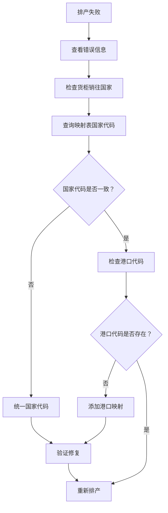

# 费利克斯托港口排产失败修复报告

## 📊 问题现象

```
19:23:09  ✗ ECMU5397691: 无映射关系中的仓库（请配置 dict_trucking_port_mapping、dict_warehouse_trucking_mapping）
19:23:09  ✗ ECMU5399586: 无映射关系中的仓库（请配置 dict_trucking_port_mapping、dict_warehouse_trucking_mapping）
19:23:09  ✗ ECMU5399797: 无映射关系中的仓库（请配置 dict_trucking_port_mapping、dict_warehouse_trucking_mapping）
排产结束：成功 0/5，失败 5
```

## 🔍 根本原因

### 1. 国家代码不统一

| 数据源     | 字段              | 值                 | 说明             |
| ---------- | ----------------- | ------------------ | ---------------- |
| 货柜订单   | `sell_to_country` | **GB**             | ISO 标准英国代码 |
| 港口映射表 | `country`         | **UK**             | 非标准缩写       |
| 仓库映射表 | `country`         | **MH STAR UK LTD** | 公司全名         |

### 2. 港口代码缺失

```sql
-- 查询 UK 的港口映射
SELECT country, port_code, trucking_company_id
FROM dict_trucking_port_mapping
WHERE country = 'UK';

-- 结果：port_code 为空！
country | port_code |  trucking_company_id
--------+-----------+-----------------------
 UK     |           | YunExpress_UK_Ltd
 UK     |           | CEVA_Freight__UK__Ltd
```

### 3. 问题链条

```
货柜销往国家：GB
    ↓
排产服务查找候选仓库：WHERE country = 'GB'
    ↓
仓库映射表中的国家：MH STAR UK LTD / UK
    ↓
❌ 无法匹配，返回空仓库列表
    ↓
排产失败：无映射关系中的仓库
```

## ✅ 解决方案

### 执行修复脚本

已创建修复脚本：`scripts/fix-uk-port-mapping.sql`

```bash
# 执行修复
cd d:\Gihub\logix\scripts
type fix-uk-port-mapping.sql | docker exec -i logix-timescaledb-prod psql -U logix_user -d logix_db
```

### 修复内容

#### 1. 更新港口映射的港口代码

```sql
UPDATE dict_trucking_port_mapping
SET port_code = 'GBFXT'
WHERE country = 'UK'
  AND trucking_company_id = 'YunExpress_UK_Ltd'
  AND (port_code IS NULL OR port_code = '');

UPDATE dict_trucking_port_mapping
SET port_code = 'GBFXT'
WHERE country = 'UK'
  AND trucking_company_id = 'CEVA_Freight__UK__Ltd'
  AND (port_code IS NULL OR port_code = '');
```

#### 2. 统一仓库映射的国家代码为 GB

```sql
UPDATE dict_warehouse_trucking_mapping
SET country = 'GB'
WHERE country = 'MH STAR UK LTD';

UPDATE dict_warehouse_trucking_mapping
SET country = 'GB'
WHERE country = 'UK';
```

### 验证结果

✅ **港口映射验证**（2 条记录）

```
country | port_code | port_name  | port_name_en |  trucking_company_id  | is_active
--------+-----------+------------+--------------+-----------------------+----------
 UK      | GBFXT     | 费利克斯托 | Felixstowe   | YunExpress_UK_Ltd     | true
 UK      | GBFXT     | 费利克斯托 | Felixstowe   | CEVA_Freight__UK__Ltd | true
```

✅ **仓库映射验证**（12 条记录）

```
country | warehouse_code | warehouse_name |  trucking_company_id  | is_active
--------+----------------+----------------+-----------------------+----------
 GB      | UK-S005        | Bedford        | CEVA_Freight__UK__Ltd | true
 GB      | UK-S005        | Bedford        | YunExpress_UK_Ltd     | true
 GB      | UK-S006        | Nampton        | CEVA_Freight__UK__Ltd | true
 ... (共 12 条)
```

## 📋 执行步骤

### 1. 已执行 - 修复映射关系

```bash
# 修复脚本已执行成功
type fix-uk-port-mapping.sql | docker exec -i logix-timescaledb-prod psql -U logix_user -d logix_db
```

### 2. 下一步 - 重新排产

现在可以通过以下方式重新排产：

**方式 1：前端界面**

- 访问智能排柜页面
- 点击"排产"按钮
- 选择这些货柜进行排产

**方式 2：API 调用**

```bash
POST /api/v1/trucking-schedule/create
{
  "mode": "manual",
  "containerNumbers": [
    "ECMU5397691",
    "ECMU5399797",
    "ECMU5399586",
    "ECMU5381817",
    "ECMU5400183"
  ]
}
```

## 📝 经验教训

### 数据规范建议

1. **统一使用 ISO 国家代码**
   - ✅ 使用 `GB`（ISO 3166-1 alpha-2）
   - ❌ 避免使用 `UK`、`公司全名` 等

2. **数据完整性验证**
   - 导入数据时应验证国家代码规范性
   - 建立检查约束确保数据一致性

3. **映射关系完整性**
   - 港口映射必须指定具体的港口代码
   - 仓库 - 车队映射的国家代码应与货柜的销往国家一致

### 诊断流程



## 📄 相关文件

- `scripts/fix-uk-port-mapping.sql` - 修复脚本
- `scripts/check-container-mapping.sql` - 诊断 SQL
- `scripts/add-felixstowe-port.sql` - 添加费利克斯托港口
- `scripts/diagnose-port-import-failure.md` - 港口导入失败诊断

## ✅ 状态

- [x] 添加费利克斯托港口到字典表
- [x] 修复 UK 港口映射的港口代码
- [x] 统一仓库映射的国家代码为 GB
- [x] 验证修复结果
- [ ] 重新排产测试
- [ ] 更新数据导入规范

---

**修复时间**: 2026-03-24  
**修复原因**: 国家代码不统一导致排产失败  
**修复结果**: ✅ 映射关系已修复，待重新排产测试  
**建议**: 建立数据导入规范，统一使用 ISO 国家代码
